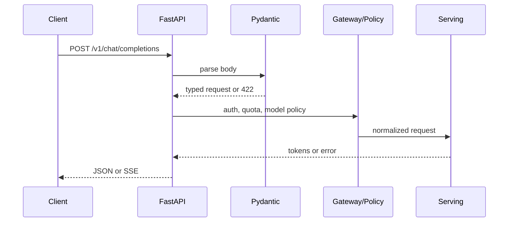

# FastAPI 构建 OpenAI 兼容的 LLM 服务

客户端按照 OpenAI 兼容协议发送请求，服务端却因为字段缺失返回 500，或者 SSE 最后一条事件没有结束标志。兼容接口不是把路径改成 /v1/chat/completions 就结束了，还要定义校验、依赖、错误、取消和流式事件的完整契约。

## 请求从 HTTP 到模型调用



FastAPI 路由只负责接住请求和组织依赖。Pydantic 负责结构校验，认证和租户范围属于确定性策略，模型只接收经过规范化的候选。把这些步骤混在一个函数里，失败时就难以区分 401、422、429、上游超时和模型错误。

## 一个可运行的最小协议层

```python
from fastapi import FastAPI, Depends, HTTPException
from pydantic import BaseModel, Field

app = FastAPI()

class Message(BaseModel):
    role: str
    content: str = Field(min_length=1)

class ChatRequest(BaseModel):
    model: str
    messages: list[Message]
    stream: bool = False

class User(BaseModel):
    tenant_id: str
    allowed_models: set[str]

async def require_user() -> User:
    # 教学用身份适配器，真实服务应从认证中间件读取主体。
    return User(tenant_id="demo", allowed_models={"demo-model"})

async def inference(request: ChatRequest, tenant_id: str) -> dict:
    return {
        "id": "chatcmpl_demo",
        "model": request.model,
        "choices": [{"message": {"role": "assistant", "content": "hello"}}],
        "usage": {"prompt_tokens": len(request.messages), "completion_tokens": 1},
        "tenant": tenant_id,
    }

@app.post("/v1/chat/completions")
async def chat(request: ChatRequest, user=Depends(require_user)):
    if request.model not in user.allowed_models:
        raise HTTPException(403, "model_not_allowed")
    return await inference(request, user.tenant_id)
```

在安装 FastAPI 和 Pydantic 的 Python 环境中运行这个文件后，输入是 `model=demo-model` 和至少一条非空消息；执行先完成字段解析，再通过教学用依赖得到主体，最后返回可预测的最小响应。正常输出包含 id、model、choices 和 usage；缺字段是 422，权限不允许是 403，不能统一改成 500。真实模型适配器、数据库计费和 SSE 生成器仍应替换教学实现，不能把这段最小代码直接当作生产服务。

## SSE 的结束和异常

流式响应要发送 data: JSON 事件，并以 data: [DONE] 结束。模型中途失败时，客户端需要知道这是错误事件还是连接断开；服务端还要取消上游生成并释放队列。不要在流已经写出部分 Token 后再试图返回普通 HTTP 错误，因为状态码已经发送。

| 状态 | 客户端看到的结果 | 服务端要记录 |
| --- | --- | --- |
| 校验失败 | HTTP 422 JSON | 字段路径和请求 ID |
| 限流 | HTTP 429 + Retry-After | 租户、窗口、剩余额度 |
| 模型超时 | HTTP 504 或流内 error | 上游 deadline 与取消 |
| 正常流结束 | 最后一条 [DONE] | usage、终态和成本 |

## Middleware、后台任务和连接回收

Middleware 适合注入 request ID、记录总耗时和处理异常，但不应把 Prompt 写入全局日志。后台任务适合轻量审计或清理，不能承载必须成功的扣费、模型生成或数据库事务。数据库、HTTP 客户端和异步生成器都要在取消和异常路径关闭。

## 先用 Fake Adapter 验证契约

```python
class FakeInference:
    async def generate(self, request):
        yield {"delta": "hello"}

# 测试应覆盖：空 messages、未授权 model、stream 结束、客户端取消
```

Fake Adapter 让测试不依赖 API Key 或 GPU，可以验证输入、事件序列和错误映射。它不能证明真实 Serving 的 Token 速度和显存行为。下一篇处理请求之外的短期状态，看看 Redis 怎样同时承担缓存、Session、限流和队列协调。

## 兼容范围要写成可测试的子集

OpenAI 兼容不应暗示每个字段、工具调用、JSON Schema 和 usage 细节都完全一致。服务可以明确声明支持的 model、message role、stream、max_tokens 和错误结构，并对不支持的字段返回稳定的 400，而不是忽略后产生难以发现的行为差异。

测试则按契约组织：一组请求验证 schema 和权限，一组验证普通 JSON 的字段，一组读取完整 SSE 事件序列，一组在客户端关闭后确认上游取消。测试里的 Fake Adapter 负责确定性事件，真实引擎的适配测试只验证边界和版本，不把昂贵模型调用塞进每次单元测试。

## 依赖注入的价值在于可替换边界

认证、数据库 session、模型客户端和策略对象通过 Depends 提供时，路由函数只表达请求流程。测试可以替换为匿名用户、事务回滚 session 或 Fake Inference，不必修改业务分支。依赖本身也要有生命周期，避免每个请求重新创建昂贵客户端。

错误处理层应把已知领域错误映射为稳定响应，把未知异常记录为带 request ID 的 500。不要在异常处理器中吞掉取消或把 Pydantic 错误改写成模糊文本，否则客户端失去根据状态采取行动的能力。
