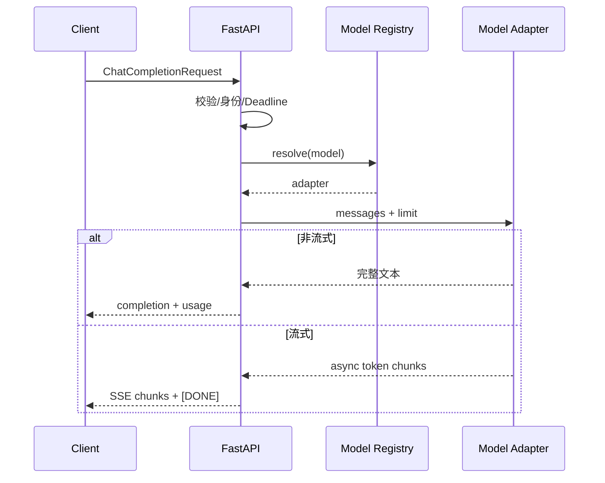

# FastAPI 构建 OpenAI 兼容的 LLM 服务

客户端把 Base URL 改到自建服务，普通对话能返回，开启 `stream=true` 后解析器却报错。原因往往不是模型，而是响应对象、SSE 分帧、终止标记或错误结构与客户端假设不同。所谓 OpenAI 兼容，必须先写清兼容哪些端点、字段和流事件。

教学实现只覆盖 Chat Completions 子集：`POST /v1/chat/completions` 接受模型、消息、输出上限和流式开关；模型注册表完成路由；普通响应返回 Choice 与 Usage；流式响应发送增量 Chunk 和 `[DONE]`。官方 OpenAI 文档当前建议新 OpenAI 项目优先评估 Responses API，这里选择 Chat Completions 是为了演示常见兼容生态，不把它称为所有供应商共同标准。

## OpenAI 兼容层的作用

OpenAI 兼容服务是一个把既定 HTTP/JSON/SSE 契约映射到本地模型适配器的 Web 服务。它位于客户端 SDK 与模型推理进程之间，负责请求校验、模型路由、响应封装、流式事件和错误语义；它不等于复制供应商全部能力，也不自动包含鉴权、计费或工具执行。

本文只承诺下表中的子集。读者先能判断客户端依赖什么，再看 FastAPI 代码怎样实现这些字段。

| 能力 | 本文实现 | 明确不覆盖 |
| --- | --- | --- |
| `POST /v1/chat/completions` | `model`、`messages`、`max_tokens`、`stream` | tools、图像、音频、多 Choice |
| 普通响应 | Choice、Finish Reason、Usage | 供应商全部扩展字段 |
| SSE | 增量 Chunk、`[DONE]`、断开检测 | Responses API 事件类型 |
| 模型选择 | 受控 Registry | 客户端直传供应商凭证 |

## 协议兼容的边界



协议层只处理 HTTP、Schema 和事件格式；模型适配器只处理供应商或推理引擎；Registry 只根据受控配置解析模型。身份、租户和预算来自服务端可信上下文，不能接受模型或客户端随意覆盖。

## 最小但完整的实现

下面代码使用内存 Demo Adapter，所以无需 API Key。运行环境需要 FastAPI 与 Uvicorn。输入消息先经过 Pydantic 校验；模型名必须存在；流式生成期间检查客户端是否断开。Token 数量仅用于教学演示，真实计费必须使用模型对应 Tokenizer 或上游返回的 Usage。

```python
import asyncio
import json
import time
import uuid
from collections.abc import AsyncIterator
from typing import Literal

from fastapi import Depends, FastAPI, HTTPException, Request
from fastapi.responses import StreamingResponse
from pydantic import BaseModel, Field

class Message(BaseModel):
    role: Literal["system", "developer", "user", "assistant"]
    content: str = Field(min_length=1, max_length=20_000)

class ChatRequest(BaseModel):
    model: str
    messages: list[Message] = Field(min_length=1, max_length=100)
    stream: bool = False
    max_tokens: int = Field(default=256, ge=1, le=2_048)

class DemoAdapter:
    async def stream(self, messages: list[Message], max_tokens: int) -> AsyncIterator[str]:
        # Demo 适配器只回显最后一条消息，真实实现应调用受控模型客户端。
        words = messages[-1].content.split()[:max_tokens]
        for word in words:
            await asyncio.sleep(0.01)
            yield f"{word} "

app = FastAPI()
registry = {"demo-chat": DemoAdapter()}

def get_adapter(payload: ChatRequest) -> DemoAdapter:
    adapter = registry.get(payload.model)
    if adapter is None:
        raise HTTPException(
            status_code=404,
            detail={"code": "model_not_found", "message": "Unknown model"},
        )
    return adapter

@app.middleware("http")
async def request_context(request: Request, call_next):
    # 请求 ID 用于关联入口、模型适配器和用量日志。
    request.state.request_id = request.headers.get("x-request-id", str(uuid.uuid4()))
    response = await call_next(request)
    response.headers["x-request-id"] = request.state.request_id
    return response

@app.post("/v1/chat/completions")
async def chat_completions(
    payload: ChatRequest,
    request: Request,
    adapter: DemoAdapter = Depends(get_adapter),
):
    completion_id = f"chatcmpl-{uuid.uuid4().hex}"
    created = int(time.time())

    if payload.stream:
        async def events() -> AsyncIterator[str]:
            index = 0
            async for token in adapter.stream(payload.messages, payload.max_tokens):
                if await request.is_disconnected():
                    # 客户端断开后停止继续读取模型输出。
                    return
                chunk = {
                    "id": completion_id,
                    "object": "chat.completion.chunk",
                    "created": created,
                    "model": payload.model,
                    "choices": [{"index": 0, "delta": {"content": token}, "finish_reason": None}],
                }
                yield f"data: {json.dumps(chunk, ensure_ascii=False)}\n\n"
                index += 1
            yield "data: [DONE]\n\n"

        return StreamingResponse(events(), media_type="text/event-stream")

    pieces = [token async for token in adapter.stream(payload.messages, payload.max_tokens)]
    text = "".join(pieces).rstrip()
    prompt_tokens = sum(len(message.content.split()) for message in payload.messages)
    completion_tokens = len(text.split())
    return {
        "id": completion_id,
        "object": "chat.completion",
        "created": created,
        "model": payload.model,
        "choices": [{
            "index": 0,
            "message": {"role": "assistant", "content": text},
            "finish_reason": "stop",
        }],
        "usage": {
            "prompt_tokens": prompt_tokens,
            "completion_tokens": completion_tokens,
            "total_tokens": prompt_tokens + completion_tokens,
        },
    }
```

FastAPI 先解析 JSON，再由 Pydantic 检查消息数量、内容长度和 `max_tokens`。依赖函数读取 `payload.model` 并返回 Adapter；不存在的模型在进入推理前失败。Middleware 为所有响应添加请求 ID。非流式分支消费完整异步迭代器后组装对象；流式分支每次产生一个合法 SSE 事件，并在连接断开时结束生成器。

示例故意没有实现 tools、图像、音频、logprobs、多个 Choice、`stream_options`、存储和供应商全部参数。生产兼容层应维护明确能力矩阵，对不支持字段返回稳定错误，不能静默忽略后让客户端以为语义已生效。

## SSE 的状态不只有“连接中”

流式生命周期至少包含接受、首事件、增量、完成、错误和客户端取消。HTTP Header 发出后再发生错误，通常不能改成新的 HTTP 状态码，应发送约定错误事件并结束流。客户端要同时处理网络断开、错误事件和完成标记。

官方 Chat Completions 流使用增量 Chunk；OpenAI Responses API 则使用带 `type` 的语义事件。网关可以同时支持两套端点，但不能把两种流格式混在一个响应里。兼容文档应给出真实样例和版本边界。

## Token、用量和成本必须分层

输入 Token 由最终发送给模型的消息、工具定义和多模态内容决定；输出 Token 由模型实际生成决定。示例的空格计数不适用于真实计费。自托管模型应调用匹配 Revision 的 Tokenizer，托管模型优先采用供应商 Usage，并记录估算与最终值的差异。

Usage 是计量事实，成本是按租户、模型和价格版本换算的业务结果。流式请求可能在结束时才得到最终 Usage；客户端中断时仍可能已经消耗 Token。用量记录要与请求终态和供应商 request ID 关联，不能只在成功响应后写入。

## Middleware、依赖与 Background Task 的边界

Middleware 适合请求 ID、耗时和通用安全 Header，不适合实现模型路由与业务计费。依赖注入适合认证主体、租户 Scope、Registry 和数据库 Session，并确保资源在请求结束时释放。

FastAPI BackgroundTasks 在响应发送后仍由同一应用进程执行，适合短小、可丢失后重试的附属工作，不适合长时间文档解析或关键计费。重要任务应写入持久状态，再交给独立队列和 Worker。

## 错误、取消和重试

请求校验错误、未知模型、配额不足、上游拒绝、上游超时、客户端取消和内部错误需要不同 code。HTTP 状态负责传输语义，错误体提供稳定机器码、可读消息和请求 ID。日志保留内部原因，但不向客户端泄露密钥、原始供应商响应或堆栈。

客户端断开后，应用应取消 Adapter；Adapter 再把取消传给 HTTP 客户端或 vLLM。上游已接受但结果未知时，自动重试可能重复生成和计费，必须结合幂等能力、剩余 Deadline 与错误类型判断。

## 验收一条兼容接口

至少验证合法普通请求、合法流式请求、未知模型、空消息、超长输入、模型超时、客户端中断和并发上限。普通响应要检查对象、Choice、Finish Reason 与 Usage；流式响应要检查事件边界、增量顺序、完成标记和中断后资源释放。

真正的兼容不是让某个 SDK 偶然跑通，而是公开支持矩阵、错误语义和版本策略，并用契约测试防止升级 FastAPI、模型引擎或适配器时悄悄改变响应。

运行示例应固定 Python、FastAPI、Pydantic 与 Uvicorn 的版本范围，并在仓库中提供 `requirements.txt` 或 `pyproject.toml`、`uvicorn app:app --reload` 启动命令和两条 `curl`：一条检查普通 JSON 的 `usage`，另一条使用 `-N` 检查 SSE 的事件边界与 `[DONE]`。没有这三项，代码只能阅读，不能称为可验证的兼容服务。
