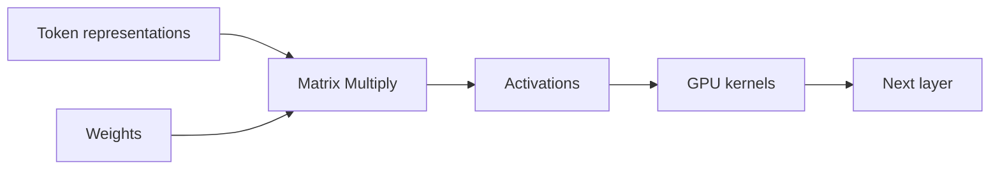

# GPU 基础：是什么、怎么工作，以及 AI 为什么使用它

矩阵乘法在 CPU 上可以完成，为什么大模型通常要交给 GPU？答案不是 GPU“更快”这么简单，而是模型把大量相同形状的乘加操作组织成可吞吐的并行工作。理解这个取舍，才能知道何时 GPU 利用率低并不代表系统坏了。

## 从一个矩阵乘看工作形状

给定 A[m, k] 和 B[k, n]，输出 C[m, n] 的每个元素都要做 k 次乘加。输出元素之间相对独立，适合把工作切成许多小块并行计算。Transformer 的线性层、注意力投影和批量 Token 计算都可以转化为类似的矩阵运算，但输入长度和 Batch 变化会改变形状。

## CPU 延迟和 GPU 吞吐的差别

| 场景 | 更关心的指标 | 为什么 |
| --- | --- | --- |
| 单个短请求 | 端到端延迟 | 启动、调度和内存访问占比高 |
| 多请求 Prefill | Token/s、矩阵利用率 | 同一 Kernel 有更多并行工作 |
| Decode 单 Token | 内存带宽、KV 访问 | 计算量小但频繁读写权重/KV |
| 离线批处理 | 总吞吐和单位成本 | 可以用更大 Batch 填满设备 |

因此“GPU 利用率 90%”也可能伴随不好的 TTFT，“利用率 30%”也可能是短请求的合理结果。指标要和请求阶段、形状和 SLO 一起解释。

## 数据搬运经常比算术更早成为瓶颈

CPU 到 GPU 的拷贝、显存到缓存的访问和不同精度之间的转换都要花时间。Pinned memory、异步拷贝和算子融合可以减少等待，但它们需要硬件、框架和内存布局共同支持。没有真实设备时，只能说明机制，不能写出具体带宽或加速倍数。

## GPU 适合什么，不适合什么

::: tip
**判断方法**

把工作拆成并行度、算术强度、数据传输和批处理机会四项。大量同形状矩阵运算通常适合 GPU；分支多、数据依赖强、批次极小或频繁搬运的工作，可能更适合 CPU 或混合路径。下一篇把一个 Kernel 映射到 Thread、Block、Warp 和 SM。
:::

## 推理的两个阶段消耗的硬件资源不同

长 Prompt 的 Prefill 通常有更多矩阵计算，较容易通过 Batch 利用 GPU 算力；逐 Token Decode 每一步计算较小，却反复读取权重和 KV，往往更接近内存带宽限制。这也是同一张卡在两个阶段呈现不同利用率和延迟的原因。

因此优化前先按阶段采样。若 TTFT 高且队列不长，可能是 Prefill 或输入搬运；若 TPOT 抖动，可能是 Decode、KV、批处理或代理。没有区分阶段的“GPU 利用率”很难指导行动。

## 吞吐模型需要把排队放进去

GPU 内核再快，用户仍会经历网关、队列、Tokenize、数据传输和代理。系统吞吐受最慢阶段限制，过多并发还会反过来拉长每个请求的等待。把设备指标单独优化而忽略排队，常会得到“总 Token/s 更高，用户更慢”的结果。

容量判断因此要同时记录设备工作量和端到端体验。先定义要保护的是交互 TTFT、长生成 TPOT 还是离线总吞吐，再决定 Batch、并发和排队策略。
