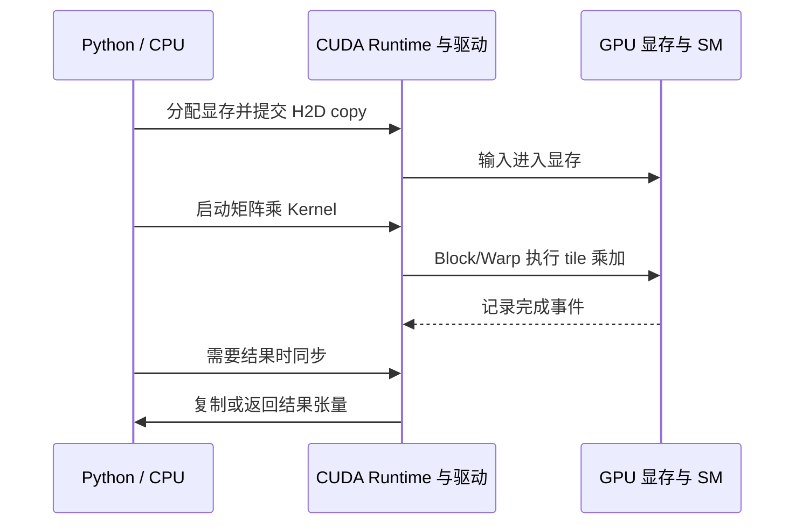

# GPU 是什么？为什么 AI 模型适合在 GPU 上计算

电脑里已经有 CPU，为什么训练和运行大模型还要 GPU？答案不能只写“GPU 核心更多”。CPU 和 GPU 都执行指令、读取内存和做算术，但它们把芯片面积、调度能力与存储带宽分配给了不同目标。CPU 擅长低延迟地处理复杂控制，GPU 擅长让大量相似数据同时经过同一组运算。

神经网络的大部分工作能表达为大规模矩阵乘、向量运算和归约。这些运算包含许多结构相同、彼此相对独立的乘加，可以一次交给大量 GPU 线程。模型仍需要 CPU 解析请求、调度 Kernel、准备 Token 和处理网络。GPU 是协同设备，不是把整台服务器替换掉。

::: info GPU 的准确含义

GPU 是 Graphics Processing Unit，图形处理器。它最初面向图形中大量像素和顶点的并行计算，后来发展出通用计算接口与面向矩阵乘的专用单元。

GPU 用许多执行单元同时处理大量相似工作，以高吞吐为目标。它需要合适的并行任务和数据布局，单条复杂、分支很多或规模很小的任务不一定比 CPU 快。

:::

## CPU 是什么，它怎样执行普通程序

CPU 是 Central Processing Unit，中央处理器。操作系统、Python 解释器、数据库、Nginx 和 Serving Scheduler 都由 CPU 执行。程序的机器指令从内存取出，CPU 解码后进行算术、分支、加载和存储，再更新寄存器与程序计数器。

现代 CPU 有多个复杂核心。每个核心包含乱序执行、分支预测、较大的多级 Cache 和向量指令，努力让一条或少量指令流以低延迟前进。遇到条件分支时，预测器猜接下来路径；遇到内存等待时，核心尝试执行其他无依赖指令。

CPU 核心数相对有限，但单核能力强，适合串行依赖、复杂控制与不可预测分支。解析 HTTP、调度请求、操作数据库索引和执行操作系统内核都需要快速响应不同事件。大容量系统内存也更容易由 CPU 直接访问。

CPU 也能并行。多核可以运行多个进程或线程，SIMD 指令一次处理一组数，AMX 等矩阵扩展还能加速 AI。把“CPU 只会串行”写进教程是错误的。区别在于 GPU 为更大规模吞吐投入更多执行资源，并采用不同调度方式。

CPU 性能受频率、核心、Cache、内存带宽、指令集和程序局部性影响。一个模型在 CPU 上能运行，不表示有足够在线吞吐；一个小模型或低并发边缘场景也可能没必要部署 GPU。先测工作负载。

以 HTTP 服务为例，CPU 要读取 socket，解析请求体，检查身份，调用分词器，再把生成的 Token 编码成 SSE。每一步都有条件分支和不同长度的字符串，线程很难保持同一条指令路径。CPU 的低延迟和大内存更适合这种控制工作。只有分词或后处理本身形成足够大的规则批次时，才值得再评估向量化或 GPU 加速。

CPU 的结果还负责管理 GPU 的生命周期。它决定何时提交请求，发现超时后取消任务，读取错误码并释放进程资源。即使 GPU 计算占服务总时间的大部分，少数 CPU 路径也会决定请求能否正确结束。
## GPU 是什么，它与显卡为什么不是完全同一个词

GPU 是芯片中的处理器；显卡或加速卡通常还包含显存、供电、散热、PCIe 接口和板级控制。笔记本集成 GPU 可能与 CPU 共享内存，数据中心 GPU 常有独立 HBM。说“这张卡 80 GB”指设备显存，不是 GPU 核心本身的定义。

GPU 包含多个更高层计算单元，NVIDIA 架构常称 Streaming Multiprocessor，内部有大量算术执行单元、寄存器、共享内存和调度器。不同厂商名称不同。CUDA Core 也不是等价于一个 CPU Core 的独立复杂核心，不能直接拿数量做倍数比较。

GPU 通过大量线程隐藏内存与指令延迟。某批线程等待数据时，SM 调度另一批已就绪线程。它不需要像 CPU 一样给每个线程配复杂乱序硬件，芯片可以把更多面积用于算术单元和数据通路。

现代 AI GPU 还有 Tensor Core 或等价矩阵单元，能对 FP16、BF16、TF32、INT8、FP8 等特定块矩阵执行高吞吐乘加。支持格式、形状和累加精度按架构变化。代码必须调用匹配库或 Kernel 才能利用。

GPU 由 CPU Host 提交工作。应用通过驱动与 Runtime 分配显存、复制数据、启动 Kernel。Kernel 异步执行时 CPU 可以继续其他工作，最终用事件或同步读取结果。驱动错误、设备重置和进程 Context 都属于运行边界。

例如矩阵乘把输出矩阵的每个元素交给一个或一组线程，线程读取输入矩阵的行和列，完成多次乘加后写回结果。GPU 的优势来自许多元素可以采用相同指令并行计算，不是因为它能把任意 Python 代码都变快。若任务只有几十个元素，Host 到 Device 的复制和 Kernel 启动时间可能比计算本身更长。

因此 GPU 这个词至少包含三层意思，芯片上的执行单元、可被进程看到的设备，以及由驱动管理的执行上下文。一个容器能列出 GPU，不代表它能加载 CUDA 库；能分配显存，也不代表模型的每个算子都有可用 Kernel。排查时要把设备发现、内存分配和实际计算分开验证。它与显卡的区别也在这里，显卡是承载 GPU 的整块硬件，GPU 是其中负责执行计算的处理器。

部署文档中把这几个词分开，才能解释“有卡但不能推理”的现象。设备枚举确认硬件可见，驱动确认用户态程序能调用它，Runtime 确认 Kernel 可以提交，模型测试才确认算子和精度真的可用。
## CPU 与 GPU 的差异怎样从设计目标产生

CPU 优先减少单任务延迟并处理多样指令，GPU 优先提高大量规则任务的总吞吐。CPU 使用更大的 Cache 和控制逻辑，GPU 使用更多并行执行单元。这个对比是倾向，不是二选一标签，具体芯片都在吸收对方能力。

复杂分支是一个例子。CPU 的不同核心可以独立沿不同路径，分支预测减少等待。GPU 线程按组执行，当同组线程选择不同分支时，硬件可能分批执行各路径，未走该路径的线程暂时屏蔽，这叫分支发散，利用率下降。

内存体系也不同。CPU Cache 优化一般程序局部性，主存容量大；数据中心 GPU 的 HBM 容量较小但带宽很高，适合反复流过大量权重与张量。CPU 与 GPU 之间的 PCIe 通常比 GPU 本地显存慢，频繁小复制会抵消计算收益。

调度粒度不同。操作系统调度 CPU 线程，切换可运行各种代码；GPU Kernel 一次声明大量轻量线程，硬件按 Warp/Wavefront 调度。GPU 线程不能像普通进程那样各自处理任意系统调用。

下表用于总结边界，正文中的机制不能由表替代。

| 维度 | CPU 常见取向 | GPU 常见取向 |
| --- | --- | --- |
| 目标 | 单任务低延迟、通用控制 | 大量相似任务高吞吐 |
| 核心 | 数量较少、控制复杂 | 执行单元多、线程轻量 |
| 分支 | 强分支预测与乱序执行 | 同组分支发散会降低利用 |
| 内存 | 大主存与多级 Cache | 较小高带宽显存与共享内存 |
| 任务提交 | OS 线程直接执行 | Host 启动 Kernel 到 Device |
| AI 角色 | Tokenize、调度、网络、部分算子 | 大矩阵、Attention、批量向量运算 |

一台 AI 服务器需要两者配合。CPU 不足会让 GPU 等待调度和数据，GPU 不足会让计算排队。容量规划不能只按 GPU 张数。
## 并行计算是什么，它与并发有什么区别

并行计算把一个问题拆成能同时执行的工作单元，并在多个核心、执行单元或设备上运行。若四个数字相互独立地乘二，可以分给四个执行单元同一时刻计算。依赖前一步结果的递归链则难以完全并行。

并发表示多个任务在同一时间段推进，不要求同一时刻执行。Python 事件循环在一个 CPU 线程交错处理 I/O 是并发；GPU 上数千线程同时执行矩阵元素计算是并行。AI 服务常在 API 层并发、设备层并行。

数据并行让相同操作作用于不同数据。图像每个像素变换、Batch 中每条序列的线性层都可数据并行。任务并行让不同工作同时执行，如 CPU Tokenize 与 GPU 处理上一批。模型并行把一个过大的模型拆到多设备。

并行需要划分、调度、通信与合并。工作单元太小，启动和同步开销占主导；数据依赖太强，需要频繁等待；负载不均，一部分单元结束后空闲。理论可并行不等于实际加速。

Amdahl 定律说明串行部分限制整体加速。若 20% 时间无法并行，即使并行部分无限快，总加速也不超过约 5 倍。模型 Kernel 很快后，Tokenize、网络、采样和 CPU Scheduler 可能成为主要时间。

并行还会引入一致性和通信成本。两个线程同时写同一个位置会产生竞争，分块结果需要归约，跨设备计算需要传输。工程上要比较增加并行单元省下的时间与同步、复制、排队带来的时间，而不是只计算可拆分的循环次数。对于推理服务，批处理等待也属于并行化成本，低流量时宁可让单请求较快启动。

例如向量加法可以让第 i 个线程只写第 i 个位置，几乎没有跨线程依赖；排序、前缀和或自回归 Decode 则需要阶段间同步。并行计算的边界由依赖、数据规模和合并成本决定，看到“GPU 支持某个算子”仍要确认输入形状、精度和 Kernel 是否适合当前工作负载。

并发与并行还会在同一个服务里叠加。API 可以同时接收十个请求，Scheduler 把它们放进一个 Batch 后，GPU 才在同一时刻执行一部分并行工作；其中一个请求取消，Batch 仍要维护其他请求的状态。观察队列长度、Batch 形状和 Kernel 时间，才能知道延迟来自等待还是来自计算。
## GPU 上的并行线程怎样共同完成一项工作

程序把一个 GPU 函数称为 Kernel，并指定大量线程执行。每个线程取得自己的索引，处理数组中的一个或几个元素。硬件把线程组织成 Block 和 Warp，下一篇 CUDA 会详细解释层级。

线程通常执行同一指令序列，索引不同导致访问不同数据。这种 SIMT 模式很适合向量加法：线程 i 计算 `c[i] = a[i] + b[i]`。几百万元素能提供足够并行度，让多个 SM 都有工作。

线程间有时需要共享数据或归约。Block 内可以用共享内存和同步，Block 间通常需要多个 Kernel 或更广的同步机制。矩阵乘会把输入 tile 搬进片上共享内存，让多线程复用，减少反复读 HBM。

访问模式影响带宽。同一 Warp 的线程读取相邻地址，硬件能合并事务；散乱访问需要更多内存请求。算法数学相同，布局不同会有巨大性能差异。高层框架与库封装这些优化，仍要让张量 contiguous 或满足 Kernel 要求。

线程也不是独立的小进程。它们共享所属 Block 的资源和调度时刻，某个线程访问越界可能让整个 Kernel 产生错误；一个线程提前结束，其他线程仍可能在同步点等待。调试时需要同时记录索引边界、Block 配置、共享内存大小和同步位置。把“线程多”直接等同于“工作能并行”，会漏掉这些约束。

Kernel 启动也有固定开销。对十个数做加法，CPU 直接循环可能更快；对一千万个数，GPU 并行才有机会摊薄复制与启动。任务规模是适用边界。
## 矩阵是什么，它怎样表示一批数据和一组参数

矩阵是按行和列排列的数值表。一个形状 `[3, 4]` 的矩阵有 3 行、4 列。向量可以看成只有一行或一列的矩阵，更高维数组常称张量。框架用 shape 描述每个维度含义。

一批 32 个 Token 的隐藏状态可以形成 `[32, 4096]` 矩阵，每行是一个 Token 的 4096 维向量。线性层权重可能是 `[4096, 11008]`，它把每个 Token 向量投影到新的宽度。参数与数据因此都能用矩阵组织。

矩阵行列的语义由程序定义。图像可能是 `[batch, channel, height, width]`，语言模型可能是 `[batch, sequence, hidden]`。只看到三维数组，不能知道哪一维是 Token。Kernel 性能还取决于内存布局和 stride。

矩阵便于表达一组相同线性变换。逐个 Token 写 Python 循环会反复解释与调用；一次矩阵运算把循环交给优化库，库再用 CPU SIMD 或 GPU Kernel 并行。

不是所有模型工作都是矩阵乘。Softmax、归一化、激活函数、索引、采样和通信也很重要。融合 Kernel 可以把多个逐元素操作合并，减少中间张量读写。

矩阵的行列还承担了接口契约。线性层规定最后一维必须等于权重的输入维，Batch 和 Sequence 可以在前面展开，但不能随意交换。把 `[batch, sequence, hidden]` 展平为 `[batch * sequence, hidden]` 通常不改变线性层结果，改变 hidden 的位置却会让每个输出元素含义错位。阅读模型代码时，shape 注释和单元测试比变量名更可靠。

矩阵还适合表达批量状态，因为每一行或每一列可以绑定一个明确对象。把一行看成一个 Token 时，行数增加代表 Batch 或 Sequence 变长；把列看成隐藏维时，列数变化代表模型层宽改变。这个约定会一路传到权重文件、Kernel 参数和输出解码，任何一处写错都可能在后面才暴露。

因此读矩阵代码时，先问每个维度代表什么，再看数值本身。形状相同的两个数组也可能一个是权重，一个是激活，转置方向不同会改变乘法含义。
## 矩阵乘法是什么，行与列怎样得到一个输出元素

矩阵 A 形状 `[m, k]`，矩阵 B 形状 `[k, n]`，乘积 C 形状 `[m, n]`。C 的第 i 行第 j 列等于 A 第 i 行与 B 第 j 列对应元素相乘后求和。中间维 k 必须匹配。

例如 A 为 `[2, 3]`，B 为 `[3, 2]`。C 有 `[2, 2]` 四个元素。`C[0,0]` 要做三次乘法与两次加法，其他三个元素可以相对独立地计算，天然提供 m×n 个输出位置并行。

```text
A = [[1, 2, 3],       B = [[ 7,  8],
     [4, 5, 6]]            [ 9, 10],
                            [11, 12]]

C[0,0] = 1×7 + 2×9 + 3×11 = 58
C = [[ 58,  64],
     [139, 154]]
```

朴素计算需要约 `m × n × k` 次乘加。模型维度很大时，工作量足够喂满 GPU。每个输出又会读 A 行与 B 列，优化算法用分块让线程共享数据，减少 HBM 读取。

矩阵乘法不满足随意交换，`A×B` 与 `B×A` 形状和结果通常不同。框架中的转置标记会影响布局和性能。维度写反可能报 shape 错，也可能恰好能乘却语义错误。

推演时还要记录失败证据。若 A 的 shape 是 `[2, 4]`，B 的 shape 是 `[3, 2]`，中间维 4 与 3 不一致，框架应在 Kernel 提交前报 shape mismatch，GPU 不会产生合法的 C。若把 B 改成 `[4, 2]`，形状检查通过，但误把词表维当成隐藏维，结果仍可能在数值上正常，只有对照权重定义或后续输出才能发现语义错误。调试记录至少保留输入 shape、dtype、stride、权重版本和检查点，而不是只贴异常文本。
## 神经网络为什么反复使用矩阵乘与乘加

线性层对输入 x 计算 `y = xW + b`。Batch 和 Token 合成矩阵 X 后，一次 `XW` 同时处理许多位置。Transformer 的 Query、Key、Value 投影、注意力分数和前馈网络都包含大矩阵乘。

注意力的 `QK^T` 计算不同位置间分数，再把概率乘 V 汇总。Prefill 序列长，矩阵较大；Decode 每次位置少，Batch 多时才能扩大矩阵。模型结构与 Serving 调度共同决定 GPU 利用。

卷积也能转换成适合 GPU 的并行运算，Embedding 查表则更偏内存访问。优化库针对常见 shape、dtype 和硬件选择 Kernel。PyTorch、JAX 和推理引擎不会为每个乘法启动一个普通线程，而是调用这些库。

训练执行前向、反向和参数更新，矩阵更多并要保存激活。推理只前向，Decode 反复读取权重。低精度 Tensor Core、量化和 Batch 能提高每秒处理数据，但不改变模型的数学依赖。

模型所谓 7B 表示约七十亿参数，不等于每个 Token 只做七十亿次简单操作，架构、激活和注意力还参与。FLOPs 公式是估算，真实性能受内存与 Kernel。
## Tensor Core 是什么，它为什么能加速特定矩阵块

Tensor Core 是 NVIDIA GPU 中面向小块矩阵乘加的专用执行单元，其他厂商有等价矩阵加速能力。它在一次指令中对多个低精度元素执行乘法并累加，比普通标量单元逐项处理有更高吞吐。

支持格式随 GPU 架构变化，包括 FP16、BF16、TF32、INT8、FP8 等。输入、累加与输出精度可能不同。模型配置为 BF16 后，只有算子 shape、对齐和库路径满足条件才会使用相应 Tensor Core。

Tensor Core 不负责网络、分词、分支和任意 Python。它也不自动压缩模型，数据仍需进入显存与寄存器。性能来源是大量规则矩阵工作和高效数据复用。

小矩阵、奇怪维度或不支持算子可能回退到 CUDA Core 或其他 Kernel。Profiler 能看到主要 Kernel 与 Tensor Core 利用，`nvidia-smi` 的 GPU utilization 不能告诉具体单元是否高效。

低精度吞吐高还要验证质量。上一篇介绍了 FP16、BF16 与量化。硬件峰值表是在特定格式和稀疏条件下的上限，不是任意模型实测。
## 显存带宽为什么和计算单元同样重要

GPU 计算前要把权重和激活从 HBM 读到片上 Cache、共享内存或寄存器。若算术单元等待数据，理论 FLOPs 再高也用不上。显存带宽表示单位时间可传输的字节，是 Decode 等工作负载的重要限制。

Arithmetic Intensity 是每读取字节做多少计算。大 Prefill 矩阵中同一权重能被多个 Token 复用，计算强度较高；单请求 Decode 每步只处理一个位置，却要读大量权重，容易带宽受限。增大 Batch 让更多序列共享一次权重读取，提高强度。

片上存储快但容量小。优秀 Kernel 把数据分块，加载一次后反复使用。寄存器或共享内存用太多会降低同时驻留线程，Occupancy 与复用需要折中。库开发者处理细节，平台仍用 Profiling 识别带宽瓶颈。

HBM 容量决定能否放权重与 Cache，带宽决定每秒能搬多少。两张卡各 80 GB 不自动成为一块 160 GB 连续显存；张量并行还要跨卡通信。NVLink 或 PCIe 带宽远低于片上访问，分片策略影响速度。

监控 Memory Utilization 百分比也要分容量占用与带宽利用。`memory.used` 高可能只是权重常驻，完全正常；Memory Throughput 高说明数据通路繁忙。两者不是一个指标。
## Host 到 Device 的数据传输为什么可能抵消加速

独立 GPU 有自己的显存。CPU 主存中的输入要通过 PCIe 或其他互联复制到 Device，结果再复制回 Host。一次大复制能利用带宽，数千次小复制会被调用和同步开销拖累。

Pinned Memory 让 Host 页不会被换出，支持更高效异步 DMA；占用过多会影响系统。CUDA Stream 允许复制与计算重叠，前提是数据和依赖安排正确。一次无意同步会让 CPU 等 GPU，流水线失去重叠。

模型权重通常常驻 GPU，不为每个请求重新复制。Token ID 输入很小，输出也小，主要数据留在 Device。若某算子不支持 GPU 而频繁把大激活拉回 CPU，性能会骤降。Profiler 中 Device-to-Host copy 是重要证据。

Unified Memory 能提供统一地址和按需迁移，易用性提高，缺页和迁移仍有成本。超出显存把权重“放统一内存”不等于无损扩容。LLM 低延迟服务通常明确规划权重与 Cache 所在设备。

远端 GPU 与网络加速又多一层传输。API 把文本发给独立 Serving 比搬张量轻，服务边界通常留在文本/Token。跨节点传每层激活用于流水线并行，需要高带宽低延迟网络。
## 什么工作不适合直接交给 GPU

规模很小的任务可能被 Kernel 启动和复制吞没。解析一个几十字节 JSON、比较一个权限字段、读取数据库索引由 CPU 更自然。为“统一在 GPU”搬过去不会更快。

分支高度不一致、指针追踪和随机内存访问难以合并。图遍历、复杂解释器和操作系统调用不一定适合 GPU。算法可以重构为批量形式时才可能受益，不能只把原 CPU 循环编译成 Kernel。

串行依赖强的工作并行上限低。自回归单序列 Decode 要等上一个 Token，GPU 用多请求 Batch 弥补，不能让同一序列无限并行。Amdahl 的串行部分仍在。

数据放不进显存或频繁变化时，传输与分片复杂。CPU 大内存可以运行更大的量化模型，速度较慢但成本可接受。边缘、低 QPS 或隐私设备选择 CPU 也合理。

不支持的算子回退 CPU，会产生同步与复制。部署前检查模型计算图和引擎支持，运行时监控 Kernel 与拷贝。GPU 利用率低不是强行增加 Batch 的唯一信号，可能负载本来就小。
## 任务形状怎样影响 CPU、GPU 和批处理选择

选择设备时，先描述任务的形状，再看硬件名称。输入是一条很短的序列，输出只需要一次分类分数，Kernel 启动和 Host 到 Device 复制可能占掉大部分时间；输入包含很多 Token，或者同一层要同时处理许多序列，矩阵维度变大，GPU 的并行单元才有足够工作可做。两者调用的是同一套算子，运行特征却不同。

自回归生成还要区分 Prefill 和 Decode。Prefill 一次读入整段 Prompt，矩阵乘的 m 维较大，计算单元更容易忙起来。Decode 每次只追加一个位置，单条请求的矩阵很窄，权重读取反而可能占主导。把很多请求合成 Batch 可以增加 m，代价是等待、显存和取消处理变得更复杂。Batch 太大时，短请求会排在长请求后面，端到端延迟反而变差。

CPU 适合控制流、协议解析、权限检查和小批量变换，GPU 适合规则且规模大的张量计算。实际服务通常把两者放在同一条链上：CPU 接收请求并完成分词，GPU 运行模型，CPU 再编码结果和记账。把所有步骤搬到 GPU 会增加内存拷贝和同步点，保留清楚的边界更容易定位问题。

这个判断有明确的适用边界。模型支持的算子、数据布局、设备互联、请求分布和延迟目标都会改变取舍。没有目标 GPU 时，可以根据 shape、dtype、显存公式和算子列表做静态筛选；只有在目标设备上运行预热、固定样本和压力测试，才能决定具体 Batch、Stream 或并行参数。
## GPU 利用率、功耗和温度分别能说明什么

`nvidia-smi` 的 GPU utilization 通常表示采样窗口内有 Kernel 执行的时间比例，不等于算术单元达到峰值，也不等于每个请求快。轻量 Kernel 连续运行可以显示 100%，Tensor Core 或内存带宽仍未饱和。

Memory Used 表示分配/占用容量，权重常驻使它长期高。Memory Utilization 或吞吐指标表示控制器忙碌程度，工具字段需按设备文档解释。名称相近不能混用。

功耗接近上限可能说明设备繁忙，也可能受频率、Kernel 和电源策略影响。温度过高会降频，性能随时间下降。数据中心还要看风道、散热和节点总功耗，单卡 Benchmark 与机柜运行不同。

SM Occupancy、Tensor Core utilization、DRAM throughput 和 Kernel 时间需要 Nsight 等 Profiler。Profiler 有开销，候选环境采样，不在高敏生产全量记录。指标与 TTFT、TPOT 和吞吐对齐才有业务意义。

高利用不应成为目标本身。排队暴涨、用户取消时仍保持 100%，说明 GPU 在做已经过期的工作。Goodput 与 SLO 内完成量更重要。
## 一次矩阵乘怎样从 Python 走到 GPU 再返回

应用在 CPU 创建或读取输入，框架分配 GPU 张量并复制数据。Python 调用矩阵乘 API，框架根据 dtype、shape 与布局选择库算法，通过 CUDA Runtime 把 Kernel 放入 Stream。调用通常异步返回，CPU 可以准备后续工作。

GPU SM 调度线程块，矩阵单元处理 tile，数据在 HBM、共享内存和寄存器间移动。Kernel 完成后事件标记。只有 CPU 要读取结果或显式同步时，Host 等待 Device，再把必要小结果复制回来。



图中 Python 发出调用与 GPU 真正结束不是同一时刻。用 CPU 计时若不在结束处同步，会只测到提交时间。框架 Benchmark 应使用 GPU Event 或显式同步，并先 Warmup。

失败可能发生在分配显存、Kernel 启动或异步执行。CUDA 错误常在下一次同步才被报告，日志位置晚于根因。诊断保留前一个 Kernel、shape、dtype 和 Stream，不能只看抛异常那行 Python。
## 一个线性层为什么适合 GPU 的计算推演

输入有 2,048 个 Token，每个隐藏向量 4,096 维，要乘 `[4096, 11008]` 权重。输出含约 2,048×11,008，即约 2,254 万个元素。每个元素做 4,096 次乘加，总工作量巨大且输出元素结构一致。

GPU 把输出矩阵切成 tile，许多 Block 同时处理不同区域。Block 内线程协作加载输入和权重片段，复用后累加输出。低精度矩阵单元每条指令完成一小块乘加，最后写回显存。

CPU 也能用 BLAS 与向量指令高效计算，但可用并行单元和内存带宽通常更少。对这样的大矩阵，GPU 启动与传输开销占比小，吞吐优势容易显现。输入若只有一个很小向量，差距会缩小。

Transformer 一层还有注意力、归一化与激活，几十层重复。Serving 把多请求组成 Batch，提高 Decode 的矩阵维度。GPU 适合 AI 模型，不是因为理解语言，而是因为模型把语言处理转成了大量规则张量运算。

验证目标不是得到固定倍数。使用同一 dtype、shape、库和预热，在 CPU 与 GPU 分别计时，记录传输是否包含、结果误差与硬件。没有目标设备时只保留上述计算推演，不编造加速比。
