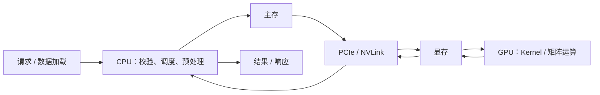

# GPU 基础：是什么、怎么工作，以及 AI 为什么使用它

GPU（Graphics Processing Unit，图形处理器）是一种包含大量并行执行单元、专用存储层级和调度逻辑的处理器。它最初服务于图形渲染，后来也被用于通用计算。GPU 不是“更快的 CPU”，也不是插上就会自动加速的黑盒；程序必须把适合并行的工作和数据交给它执行。

在 AI 系统里，GPU 通常位于模型推理或训练这条链路的计算阶段。CPU 读取请求、准备批次和调度任务，把输入从主存传到 GPU 显存；GPU 执行矩阵乘、卷积或向量运算，再把结果交回 CPU 或继续留在显存中。数据怎样移动，和计算本身一样影响最终耗时。



## GPU 在训练和推理中做什么

训练时，GPU 反复执行前向计算、损失计算、反向传播和参数更新；推理时，GPU 根据已经固定的模型参数计算输出。两种场景都可能调用 GPU，但批量大小、显存占用、延迟目标和容错方式不同。Tokenize、HTTP、数据库查询和大多数业务规则通常仍由 CPU 负责。

先用一个不依赖 GPU 的形状模拟把数据关系说清楚：

```python
# 这个模拟只统计矩阵形状和搬运字节，不声称测得任何 GPU 性能。
from dataclasses import dataclass

@dataclass(frozen=True)
class MatmulPlan:
    rows: int
    inner: int
    cols: int
    bytes_per_value: int = 2  # 例如 FP16；实际模型还要考虑激活和工作区。

    @property
    def output_shape(self) -> tuple[int, int]:
        return self.rows, self.cols

    @property
    def input_bytes(self) -> int:
        return (self.rows * self.inner + self.inner * self.cols) * self.bytes_per_value

    @property
    def output_bytes(self) -> int:
        return self.rows * self.cols * self.bytes_per_value

plan = MatmulPlan(rows=8, inner=16, cols=4)
print(plan.output_shape)  # (8, 4)
print(plan.input_bytes, plan.output_bytes)
```

`MatmulPlan` 能验证形状和数据规模，但不能比较 CPU 与 GPU 的速度。真实基准还要固定硬件、驱动、精度、框架版本、同步方式和输入分布；没有 NVIDIA GPU 时，先用这个模拟理解“搬运了多少数据、产生什么形状”，不要把示意数字写成性能结论。

## CPU 与 GPU 优化目标不同

CPU 使用较少但复杂的核心、较大的缓存和强分支预测，擅长低延迟控制流、操作系统、数据库事务和不规则任务。GPU 使用大量执行单元和高带宽显存，愿意用更多并行线程隐藏访存与指令延迟。

“少量强核心”和“大量简单核心”只是第一层描述。现代 CPU 也有 SIMD，GPU 核心也有缓存、调度与专用矩阵单元。真正差异是资源怎样为控制复杂度、单线程延迟和批量吞吐分配。

## 矩阵乘为什么容易并行

矩阵乘中，每个输出元素来自输入行与列的点积。许多输出元素可以并行计算，计算还能按 Tile 分块，把重复使用的数据放入更快的片上存储。神经网络的线性层和 Attention 中会出现大量这类运算。

GPU 通过成组线程执行相同 Kernel，并使用 Tensor Core 等单元加速特定数据类型的矩阵运算。批量、序列长度和矩阵维度决定是否有足够并行工作填满设备。

## SIMT 与 SIMD 怎样区分

SIMD 是一条指令操作多个数据 Lane；GPU 常用 SIMT 编程模型，让程序看起来有许多独立线程，硬件再把线程组成 Warp 共同执行。它们都利用数据并行，但抽象层与调度方式不同。

同一 Warp 内线程走不同分支时，硬件可能分阶段执行各分支，降低有效并行度。连续、合并的内存访问也通常比散乱访问更容易利用带宽。因此，把代码放到 GPU 并不能自动获得高利用率。

## 计算、带宽和搬运三种瓶颈

| 瓶颈 | 特征 | 可能的改进 |
| --- | --- | --- |
| 计算受限 | 数学单元接近饱和，数据复用好 | 更合适精度、Kernel、更多计算单元 |
| 内存带宽受限 | 大量读写，单位字节计算少 | 分块、复用、融合、减少中间结果 |
| 数据搬运受限 | Host/Device 或多卡传输占比高 | 批量、Pinned Memory、异步复制、拓扑优化 |

算术强度描述每搬运一定字节完成多少计算。强度低时，增加理论算力未必提升速度；高强度矩阵运算更容易利用 GPU。Roofline 一类模型用峰值算力与内存带宽共同解释上限，但真实结果仍取决于 Kernel 与形状。

## 为什么 Batch 会改变结果

Kernel Launch、框架调度和数据复制都有固定成本。单个很小任务无法填满设备，Batch 把相似工作合并，增加并行度并摊薄固定成本。Serving 中的 Continuous Batching 正是在不同请求之间动态组织工作。

Batch 变大也会增加排队、显存和单步时间。在线系统不能只追求最大吞吐，要同时满足 TTFT、TPOT、Deadline 与公平性。离线 Embedding 可以容忍更大 Batch，实时聊天通常需要更谨慎的调度。

## GPU 不适合哪些工作

控制分支复杂、任务很小、数据高度串行、频繁在 Host 与 Device 往返、内存容量不足或没有合适 Kernel 的任务，可能留在 CPU 更合理。Tokenize、HTTP、数据库查询和多数业务规则通常由 CPU 负责，矩阵计算和模型执行交给 GPU。

因此 AI 节点仍需要足够 CPU、主存、磁盘和网络。CPU 准备数据太慢、对象存储下载不足或 PCIe 搬运拥塞，都可能让昂贵 GPU 等待。

## 怎样判断是否值得使用 GPU

先写出输入大小、可并行单元、数据复用、精度、搬运路径和延迟目标，再找目标框架是否有成熟 GPU Kernel。用同一输入与正确性标准比较 CPU 和 GPU，分别记录准备、复制、执行与同步时间。

当前环境没有 NVIDIA GPU，无法提供性能实验。机制判断要说明工作为什么有并行度、限制更接近计算还是带宽、Batch 如何影响吞吐、数据放在哪里，以及何时 CPU 仍是更好的执行者。
