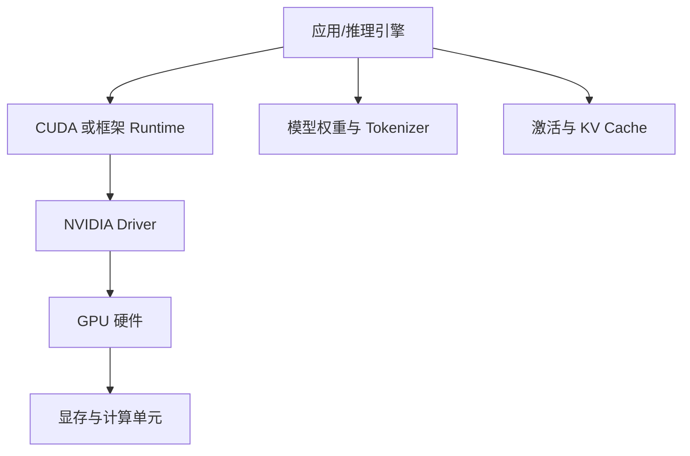

# GPU、CUDA、Driver、显存与 `nvidia-smi`

模型服务启动时提示“CUDA 不可用”，或者小模型能加载、长上下文一请求就 OOM。先不要把所有问题都归结为“显存不够”。GPU 工作负载至少经过驱动、CUDA Runtime、框架、模型权重、激活和 KV Cache 这几层。

本文是官方资料指导的操作指南。没有 NVIDIA GPU 的机器也能完成命令解读和配置检查，但不能把本地 CPU 结果冒充 GPU 性能实验。

## 先画出 GPU 软件栈



驱动在宿主机，容器通常带用户态 CUDA 库并通过 NVIDIA Container Toolkit 使用宿主驱动。CUDA Toolkit 版本、框架编译版本和驱动支持范围要按官方兼容矩阵核对，不能只看 `nvcc --version`。

## 第一步：读懂 nvidia-smi 的基线

在配备 NVIDIA GPU 且安装驱动的主机执行：

```bash
nvidia-smi
nvidia-smi --query-gpu=index,name,driver_version,pstate,
  memory.total,memory.used,memory.free,utilization.gpu,
  utilization.memory,temperature.gpu,power.draw --format=csv
```

第二条换行时要使用 shell 续行符，或在终端写成一行。字段含义：

- `name`：硬件型号，决定显存容量和计算能力。
- `driver_version`：宿主驱动版本，不等于框架版本。
- `memory.total/used/free`：显存视角的容量与当前占用。
- `utilization.gpu`：采样窗口内计算引擎忙碌比例，不是吞吐率。
- `utilization.memory`：内存控制器活动，不代表显存已经用满。
- `temperature`、`power`：热与功耗线索，不能直接推导性能。

没有 GPU 时，命令会返回“couldn't communicate with the NVIDIA driver”。这只能说明当前环境不可用，不足以判断模型代码本身有问题。

查看进程：

```bash
nvidia-smi pmon -c 1
nvidia-smi --query-compute-apps=pid,process_name,used_memory --format=csv
```

第一条命令采样一次 GPU 进程活动，第二条查询计算进程的 PID、名称和显存占用并输出 CSV。执行后先把 PID 与容器或服务版本关联，再按同一服务汇总多个进程；否则只看到单个 PID，无法判断一个多进程推理服务的总显存和调度竞争。没有进程输出表示采样时没有可见计算进程，也可能是权限或容器设备隔离，需要结合宿主视角复查。

## 第二步：区分三种“CUDA 版本”

1. `nvidia-smi` 中的 CUDA Version 表示驱动支持的最高 CUDA API 兼容版本线索。
2. `nvcc --version` 表示本机安装的 CUDA 编译器 Toolkit 版本。
3. Python 框架包可能自带 CUDA 用户态库，版本由该包构建信息决定。

推理容器可能没有 `nvcc` 仍能运行，因为它只需要 Runtime。反过来，本机有 `nvcc` 也不代表容器能访问 GPU。

启动一个官方支持的最小 CUDA 容器时，应核对：宿主驱动、NVIDIA Container Toolkit、镜像架构、框架 CUDA 构建版本和目标 GPU 计算能力。没有固定硬件与镜像版本，就不要给出“这套参数一定能跑”的结论。

## 第三步：用最小程序验证框架可见性

以 PyTorch 为例，先在目标虚拟环境查看：

```bash
python - <<'PY'
import torch
print("torch", torch.__version__)
print("cuda_available", torch.cuda.is_available())
if torch.cuda.is_available():
    print("device", torch.cuda.get_device_name(0))
    print("capability", torch.cuda.get_device_capability(0))
PY
```

Shell 先启动 Python，再导入 PyTorch，打印框架版本和布尔能力；只有 `cuda_available` 为 true 才继续读取设备名与计算能力。这个最小检查只回答框架是否能调用 GPU，不做模型吞吐测试。若 `nvidia-smi` 正常但 `is_available()` 为 false，查看容器设备挂载、框架构建版本和驱动兼容；若能看到 GPU 但加载模型失败，再进入显存和制品检查。命令退出码为 0 只表示脚本执行完成，不能替代实际模型加载验证。

## 第四步：显存到底被什么占用

粗略模型：

```text
显存 ≈ 权重 + 运行时工作区 + 激活 + KV Cache + 框架碎片/缓存
```

**权重**与参数数量、精度相关。7B 参数用 FP16 仅按权重理论值约 14GB，实际还要加配置、临时缓冲和运行时开销，不能把 14GB 当成启动保证。

**激活**与当前批次、序列长度、网络层计算有关，训练时还要保存反向传播状态；推理通常少很多，但长输入仍会放大。

**KV Cache**保存已处理 Token 的 Key/Value，避免每个 Decode Token 重算上下文。并发和上下文越长，KV Cache 越大，是长请求运行中 OOM 的常见来源。

**框架缓存/碎片**可能让 `nvidia-smi` 显示占用比当前张量更大。要结合框架内存统计和进程行为，不能只用一个采样值。

## 第五步：用实验区分加载 OOM 与运行 OOM

记录固定条件：模型制品版本、精度、GPU 型号、`max_model_len`、并发、输入长度和输出上限。

1. 只启动模型，不发送请求。仍 OOM，优先查权重、精度、Tensor Parallel 和设备可见性。
2. 发送短输入、短输出。短请求成功说明基础加载至少可行。
3. 逐步增加输入长度。长输入失败，重点看 Prefill 和 KV Cache。
4. 固定长度增加并发。并发一上升就失败，重点看每请求 KV Cache 和调度上限。
5. 记录每一步显存和日志，不同时修改多个参数。

这是容量定位实验，不是性能基准。没有目标硬件，不能提供跨机器比较的吞吐数字。

## 第六步：资源隔离与容器限制

容器需要 NVIDIA Container Toolkit 提供 GPU 设备与库。运行时通常使用 `--gpus` 指定设备；在 Kubernetes 则由 Device Plugin 和 Pod resource request 管理。

多个进程共享一张卡时，MIG、时间片或框架内存分配策略会影响隔离。把显存上限配置得过于接近总容量，容易让驱动、监控和临时缓冲无处可用。服务要设置应用级并发和最大序列长度，不能只依赖 cgroup。

GPU 利用率为 0 可能是队列空，也可能是 CPU Tokenize、数据加载、同步或等待网络。显存很高也不代表计算充分，必须同时看请求阶段、队列、TTFT/TPOT 和进程日志。

## 故障排查表

| 现象 | 先查 | 不要直接得出的结论 |
| --- | --- | --- |
| `nvidia-smi` 失败 | 驱动、设备、权限、容器挂载 | 不是模型代码一定错误 |
| 框架看不到 GPU | 包构建、Runtime、Toolkit | 不是先重装整个系统 |
| 启动即 OOM | 权重精度、模型大小、并行策略 | 不是加大并发 |
| 长输入 OOM | KV Cache、序列上限、显存碎片 | 不是权重损坏 |
| GPU 利用率低 | CPU、队列、同步、输入形态 | 不是 GPU 性能差 |
| 温度/功耗异常 | 散热、功耗限制、节点策略 | 不是调高并发解决 |

## 预检 Runbook

1. 记录 GPU 型号、驱动、镜像、框架和模型制品摘要。
2. 运行 `nvidia-smi` 与框架最小可见性检查。
3. 核对宿主驱动和 Runtime 的官方兼容矩阵。
4. 只加载模型，记录初始显存。
5. 以固定输入逐步增加长度和并发，记录 OOM 边界。
6. 为在线、批处理和评测设置独立准入与并发。
7. 将显存、队列、TTFT、TPOT、错误和模型版本关联观测。
8. 没有目标硬件时，把结论标成官方指导或待实测，不写成项目成果。

下一章会把 GPU 之外的模型制品讲清楚：权重、Tokenizer、配置、精度、量化和校验和必须一起管理，才能让“同一个模型”可重复。
