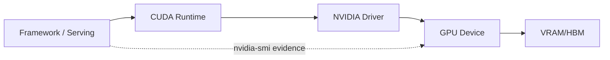

# GPU Driver、CUDA Runtime、HBM/VRAM 与显存诊断

模型第一次请求成功，第二次长上下文请求却 OOM。nvidia-smi 显示还有显存，应用仍然分配失败。显存不是一个可以随意取用的数字，权重、KV Cache、激活、工作区、CUDA Context 和碎片共同决定当前请求能否被接纳。

## Driver、Runtime 和设备之间的关系



Driver 负责与设备交互，CUDA Runtime 和框架提供编程接口，Serving 引擎管理模型和请求内存。版本兼容失败可能在初始化时暴露，也可能在某个 Kernel 或通信路径才出现。nvidia-smi 是设备视角的快照，不等于框架分配器的完整账本。

## 显存账本怎么写

可以把显存需求写成：权重 + 运行时常驻 + 当前 Batch 的激活/工作区 + 每条序列的 KV Cache + 碎片与安全余量。权重通常随模型和精度固定，KV Cache 随输入、输出、层数、头数和并发变化。长上下文和更大 Batch 会同时推高后两项。

| 账本项 | 何时增长 | 排查证据 |
| --- | --- | --- |
| 权重 | 模型加载或切换 | Serving 加载日志、框架统计 |
| KV Cache | 接纳新序列、生成 Token | 请求长度、Block 使用 |
| 工作区/临时张量 | 特定 Kernel、Prefill 峰值 | 引擎 debug、CUDA error |
| Context/缓存 | 进程初始化、编译、通信 | nvidia-smi 与进程信息 |
| 碎片/余量 | 反复分配释放、并发变化 | 分配器统计和失败位置 |

## nvidia-smi 能回答什么

```bash
nvidia-smi
nvidia-smi --query-gpu=name,memory.total,memory.used,memory.free,temperature.gpu --format=csv
nvidia-smi pmon -c 1
```

这些命令可以确认设备、总量、粗略使用和进程活动。它们不能告诉你某个请求需要多少 KV，也不能证明多卡拓扑或 MIG 配置正确。生产诊断还要结合框架内存统计、请求形状和 OOM 日志。

## 多卡不是简单相加

Tensor Parallel 可能把权重和计算切到多张卡，需要通信和拓扑支持；Pipeline Parallel 把层分段，带来阶段气泡；数据并行复制模型，显存不一定减少。是否需要多卡，要由模型制品、精度、上下文、并发和通信成本共同推演，不能只看“总显存够不够”。

::: warning
**未实测**

没有目标 GPU、驱动、CUDA、引擎版本和请求分布时，只能给出账本和验证方法，不能填写 OOM 阈值或吞吐数字。下一篇进入 Kubernetes，观察 GPU 能力怎样被声明和放入 Pod。
:::

## OOM 之后先保留请求形状

OOM 日志最有价值的信息是失败发生在加载、Prefill 还是 Decode，以及当时有多少活跃序列、每条序列多长、使用了哪一个 Revision 和精度。没有请求形状，只剩下一张 nvidia-smi 截图，无法判断是权重过大、并发过高还是碎片/工作区峰值。

恢复动作也要分层：先停止接纳新长请求，排空或取消可安全终止的序列，再根据账本调整 max length、并发或模型池。直接重启能释放显存，却会掩盖准入和容量设计缺陷。

## 显存分配器的“已保留”不等于“正在使用”

很多框架会保留一部分显存供后续复用，避免频繁向 Driver 分配。于是框架看到的 allocated、reserved 与 nvidia-smi 的进程使用量可能不同。三者差异不必然是泄漏，但在长时间运行后持续单向增长就需要回到请求、缓存和释放路径检查。

处理碎片时优先减少不规则峰值和无界并发，例如限制序列长度、分开长短请求、及时取消。盲目清空缓存可能暂时改变数字，却会干扰正在运行的请求或掩盖真正的准入错误。
