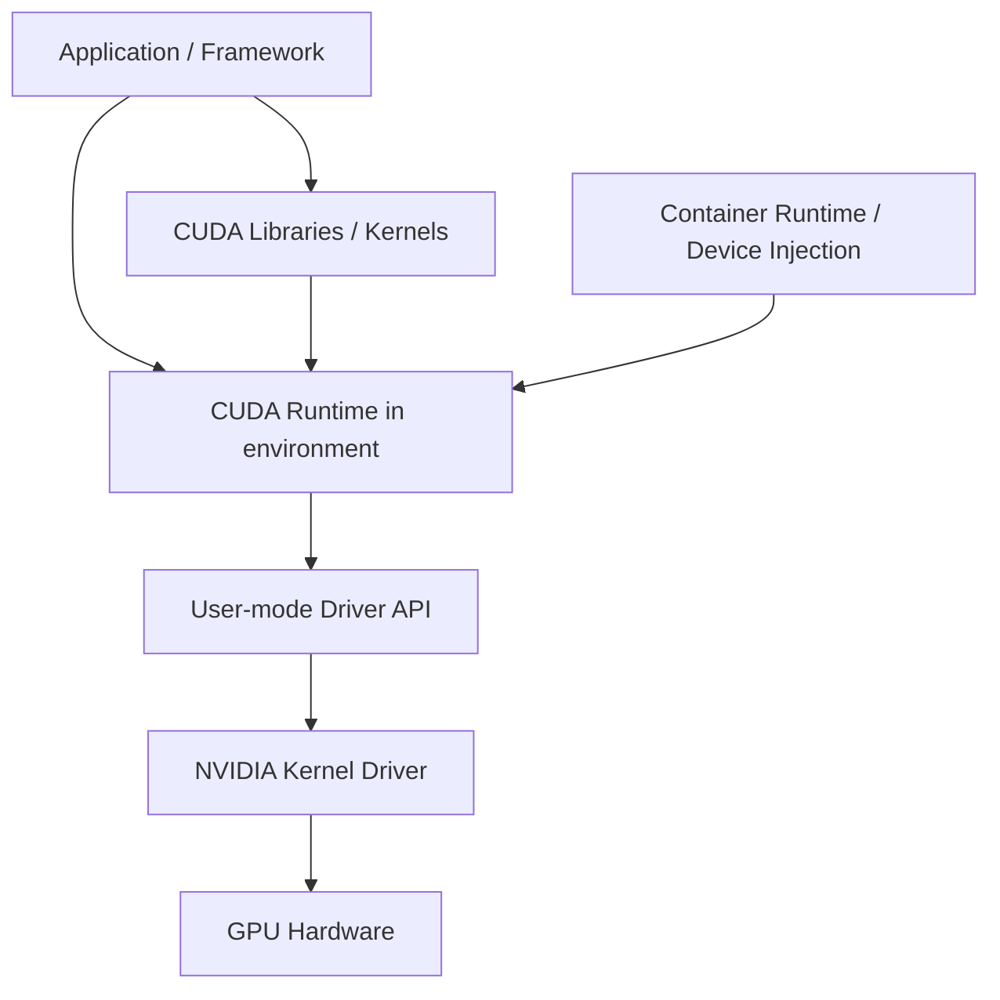

# GPU Driver、CUDA Runtime 与显存：先分层，再处理 OOM

模型日志提示 `CUDA unavailable`，这不是显存不足；模型能加载、长上下文一到就 OOM，也不意味着驱动不兼容。第一类故障发生在设备与软件栈可用性，第二类发生在运行容量。把它们都归为“GPU 有问题”会让排查从错误层开始。

本篇建立软件栈与显存账本。由于当前机器是 Apple Silicon，没有 NVIDIA GPU，命令字段仅按 NVIDIA 官方文档解释，不提供本地 GPU 输出和性能结论。

## GPU 软件栈

宿主机 Driver 让操作系统控制 GPU，并声明可兼容的 CUDA Runtime 范围；应用环境携带 Runtime、框架与库。容器通常共享宿主机内核驱动，不能用镜像里的 Runtime 替代宿主 Driver。框架、量化 Kernel 和 GPU Compute Capability 也要兼容。

## `nvidia-smi` 能证明什么

`nvidia-smi` 通过 NVIDIA Management Library 读取设备、Driver、温度、功耗、利用率、显存和进程等信息。命令成功说明管理栈能看到设备，不证明 PyTorch/vLLM 的 Runtime 与 Kernel 一定兼容，也不证明模型能放入显存。

关键字段包括 GPU 型号与 UUID、Driver Version、Memory-Usage、GPU-Util、温度/功耗、进程 PID 与显存。页面显示的 CUDA Version 通常表示 Driver 支持的最高 CUDA 能力，不等于当前 Python 环境实际安装的 Runtime 版本。

## HBM、VRAM 与主存

VRAM 泛指 GPU 可用设备内存，高端加速器常使用 HBM 提供高带宽。它与 CPU 主存是不同地址空间，数据通过 PCIe、NVLink 等路径传输。统一内存或框架抽象可以隐藏部分复制，但物理带宽和容量边界仍存在。

Pinned Host Memory 便于更高效或异步传输，却占用不可随意分页的主存，不能无界使用。多卡之间的数据是否直接传输、是否绕经 Host，取决于拓扑、Peer Access 和通信库。

## 推理显存账本

| 组成 | 随什么变化 | 生命周期 |
| --- | --- | --- |
| 模型权重 | 参数量、dtype、量化 | 模型实例常驻 |
| 固定工作区 | 引擎、Kernel、CUDA Graph | 引擎常驻或按配置 |
| 激活/临时 Tensor | Batch、Prefill 长度、算子 | 每轮计算 |
| KV Cache | 层数、KV 维度、dtype、序列与 Token | 请求活动期间 |
| 通信 Buffer | Tensor/Pipeline Parallel、Collective | 并行执行期间 |
| 框架与碎片 | 分配器、缓存策略、对象生命周期 | 动态 |

权重理论大小只是第一项。长上下文在 Prefill 产生更大临时状态，更多活动序列增加 KV Cache。引擎预留显存还会让 `nvidia-smi` 显示已用，但其中部分是分配器或 Cache 预算，不等于当前请求都在使用。

## 为什么需要多 GPU

单卡放不下模型权重和运行状态时，可以使用 Tensor Parallel 把层内计算与参数切分，Pipeline Parallel 把不同层放在不同设备，或选择更小/量化模型。多卡增加总容量，也增加通信、同步和故障面。

两张 GPU 各有 24GB，不等于任何程序都能获得连续 48GB。没有模型并行，单个 Tensor 仍要放在一张卡；有并行也会产生重复参数、通信 Buffer 和拓扑成本。首先要知道哪一项显存超限，再选择并行方式。

## 五类 OOM 分开处理

1. 权重加载 OOM：减少模型、提高量化、增加正确的模型并行或换更大显存设备。
2. Prefill OOM：限制输入/Batch Token，调整 Chunked Prefill 或执行预算。
3. KV Cache OOM：限制活动序列、上下文和输出，增加实例或调整 Cache 预算。
4. 临时峰值/工作区 OOM：核对 Kernel、CUDA Graph、并行配置和框架版本。
5. 碎片或泄漏：观察分配器状态、请求结束后的回收和可复现增长。

反复重启只会清空当前分配，不能解决稳定复现的容量错误。降低显存利用率参数也不是通用修复，它可能减少引擎可用于 KV Cache 的空间。

## 一张可复查的预检表

记录 GPU 型号、UUID、显存、Compute Capability、Driver、容器 Runtime、框架与 vLLM 版本、模型 Revision、Tokenizer、dtype、量化、最大上下文、并行度和预期活动序列。启动后再记录权重加载结果、空闲显存、Cache 配置、短请求与边界请求终态。

没有硬件时可以检查配置关系和估算公式，但不能把 CPU、Apple GPU 或他人公开基准当作目标 NVIDIA 环境的验证。最终容量数据必须由目标模型、硬件、引擎版本和请求分布共同产生。
