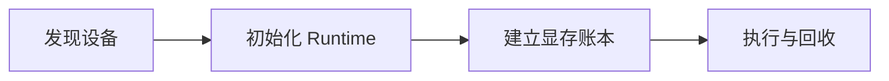

# GPU Driver、CUDA Runtime、HBM/VRAM 与显存诊断

容器里 `nvidia-smi` 能看到 GPU，Python 却提示 CUDA unavailable；修好兼容问题后模型又在加载完成时 OOM。前一个问题是驱动、容器设备和 Runtime 链路，后一个问题是显存容量。把它们都称为“CUDA 问题”会让排查从升级版本和调小 batch 之间来回摇摆。


<InfraFigure src="/images/ai-infra/gpu-cuda-vram-nvidia-smi/hero.png" alt="驱动、CUDA Runtime 与 GPU 显存中的权重、KV Cache 和工作区层次插画"
  icon="memory" caption="驱动负责控制设备，Runtime 提供执行接口，显存则被多种长期和峰值分配共同占用。" />


## Driver、CUDA Runtime 与显存各自负责什么

先把术语放回系统位置。只记名字，遇到故障时仍然不知道应该去哪个进程或存储找证据。

| 概念 | 在这条链路中的含义 |
| --- | --- |
| NVIDIA Driver | 宿主机内核模块和用户态库组成的设备控制层，向上提供 CUDA Driver API 能力。 |
| CUDA Runtime | 应用或框架使用的运行库，版本需与驱动支持能力兼容；Toolkit 还包含编译器和开发工具。 |
| VRAM/HBM | GPU 直接访问的设备内存。HBM 是常见高带宽实现，VRAM 是部署语境中的泛称。 |
| OOM | 某次设备分配无法满足，不只取决于当前已用总量，还受连续块、缓存器和峰值临时分配影响。 |

::: tip 判断原则
定义一个组件时，同时说清它不负责什么。能回答输入从哪里来、状态存在哪里、输出交给谁，才算理解。
:::

## 从设备发现到一次显存分配失败



箭头表示状态的先后依赖，不表示所有步骤都在同一进程或同一台机器完成。下面沿链路逐段展开。

### 1. 发现设备：OS/Container Runtime 持有当前状态

驱动识别 GPU，并把设备节点与库暴露给进程。

可以从这些位置确认结果：`nvidia-smi`、device files、container runtime。若完全没有证据，先判断请求是否到达本阶段；若记录冲突，则对齐 request_id、实例和时间窗口。

### 初始化 Runtime发生时，先看 Framework/CUDA

加载兼容库、创建 context 并选择 device。

这里不靠猜测，优先读取 driver/runtime version、初始化错误。

### 从 建立显存账本 留下的证据回到 Serving

依次分配权重、KV Cache、激活、workspace 和通信缓冲。

决定下一步前需要看到 allocated/reserved、模型配置。

### 4. Allocator 怎样完成执行与回收

请求产生峰值分配，结束或取消后回收可复用块。

这一动作的可观察结果是 peak memory、fragmentation、process list。处理动作应晚于取证，否则重启或重试可能覆盖最早的失败现场。

## nvidia-smi 能回答什么，不能回答什么

这些命令只有在安装 NVIDIA 驱动的主机或正确注入设备的容器中才有意义。本环境未执行真实 GPU 验证，示例用于解释字段。

```bash
nvidia-smi
nvidia-smi --query-gpu=index,name,driver_version,memory.total,memory.used,utilization.gpu --format=csv
nvidia-smi pmon -s um -c 1
python3 -c "import torch; print(torch.version.cuda); print(torch.cuda.is_available())"
```

`nvidia-smi` 的 CUDA Version 通常表示驱动可支持的最高 CUDA 能力，不等于当前 Python 包内 Runtime 版本。memory.used 是设备级快照，难以直接拆成权重、KV Cache 和 allocator reserved；框架指标和 Serving 配置要一起看。utilization.gpu 是采样窗口活动比例，不等价于模型吞吐。

## 看起来相似，故障边界却不同

| 表面现象 | 实际可能发生的事 | 下一步证据 |
| --- | --- | --- |
| nvidia-smi 正常 | 应用 Runtime、库搜索路径或容器设备仍可能错误 | 在同一进程环境检查框架版本和初始化 |
| 显存未满仍 OOM | 峰值、碎片、其他进程或大连续分配可能失败 | 看峰值和进程列表，复现具体请求 |
| 多卡总显存够 | 单个模型状态未按支持策略分片，显存不能自动相加 | 确认 tensor/data parallel 状态分布 |
| 清缓存后恢复 | 缓存释放改变现场但未解释请求为何达到峰值 | 记录请求长度、并发与各组成 |

::: warning 容易误判
一条成功命令只能证明它覆盖的那一层。重启后的短暂恢复也不是根因已经消失，改变状态前先保存最早证据。
:::


## 这套判断方法的边界

显存估算必须写明模型 revision、dtype、层数、上下文、并发和引擎。多卡还引入 PCIe/NVLink/NCCL 通信，不是把容量数字简单相加。本章没有真实 GPU 诊断结果。

单机 GPU 链路清楚后，下一阶段进入 Kubernetes：先理解控制面的调谐模型，再看 GPU 资源怎样进入 Pod。
