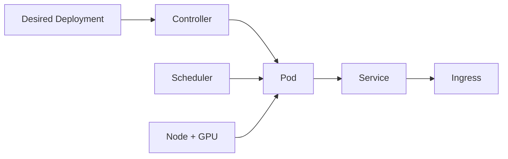

# 为什么 AI 平台需要 Kubernetes：控制面与核心对象

Pod 状态是 Running，Service 也有 ClusterIP，但请求仍然进不去。Kubernetes 只是在持续把实际状态拉回期望状态，它不会理解模型是否加载完成，也不会替你决定一个 GPU 工作负载应该怎样排队。

## 控制面怎样看待一个 AI 服务



Deployment 描述副本和模板，Scheduler 选择节点，Pod 是容器的运行边界，Service 提供稳定发现，Ingress 处理入口。控制器关注标签、数量、探针和资源声明，不知道你的 Prompt 是否有引用，也不知道模型回答质量。

## 期望状态和实际状态的差距

| 对象 | 期望 | 实际证据 |
| --- | --- | --- |
| Deployment | replicas=2、镜像摘要固定 | availableReplicas、事件、ReplicaSet |
| Pod | 容器运行且探针通过 | phase、conditions、containerStatuses |
| Service | selector 指向就绪 Pod | Endpoints/EndpointSlice |
| Ingress | 路径和 TLS 规则生效 | controller 日志、curl 和证书 |

Pod Running 只说明容器进程没有退出。没有 Ready 条件的 Pod 不应进入 Service endpoints；selector 写错时 Service 会存在但没有后端。排查按对象关系向下走，比只看 Pod 名称更快。

## AI 工作负载的边界

模型制品可以来自对象存储或 PVC，模型服务负责加载和推理，平台控制面负责版本和切流。不要把大模型权重打进频繁变化的应用镜像，也不要把 GPU 资源声明写成业务层的隐式假设。配置、Secret、模型 Revision 和公开能力应分开管理。

## 最小只读诊断

```bash
kubectl get deploy,pod,svc,endpoints -n ai
kubectl describe pod <pod> -n ai
kubectl get events -n ai --sort-by=.lastTimestamp
```

命令用于观察调度、探针、挂载、端点和事件。示例没有连接真实集群，输出不能作为部署成功证据。下一篇把 GPU、模型卷和启动/就绪探针放进同一份 AI Service 部署推演。

## Service 流量取决于 Endpoint，而不是 Pod 名字

Service 用 selector 匹配 Pod label，再由控制器维护 EndpointSlice。只有满足就绪条件的 Pod 才应成为后端。若 Service 有 ClusterIP 但 Endpoint 为空，问题通常在 label、namespace、readiness 或端口命名，而不是 Ingress。

调试时从 Ingress 路由到 Service，再从 Service selector 到 EndpointSlice，最后回到 Pod conditions。每一步都能在 Kubernetes API 中看到对象事实，这比进入容器里反复 curl 更容易发现配置错位。

## 控制器会重建，不会理解业务恢复

Deployment 看到 Pod 消失会创建新 Pod，ReplicaSet 会努力满足副本数。这种调谐不代表任务能够从中断处恢复，也不保证新 Pod 已经有模型制品和数据库状态。无状态 API 和有状态 Worker 应设计不同的重启语义。

将业务状态放到数据库、队列或对象存储后，Pod 重建才成为可控事件。控制器负责重新运行进程，应用负责判断是否领取旧任务、是否重放事件、是否把自己标记 Ready。
