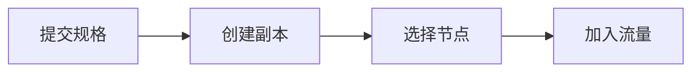

# 为什么 AI 平台需要 Kubernetes：控制面与核心对象

Pod 显示 Running，Service 却没有 Endpoint。应用团队认为集群网络坏了，真正原因是 readiness probe 仍失败，因此 EndpointSlice 控制器没有把 Pod 放入可接流量集合。Kubernetes 的状态不是一个“正常/异常”开关，而是多个控制器围绕期望状态产生的对象关系。


<InfraFigure src="/images/ai-infra/kubernetes-ai-platform-basics/hero.png" alt="Kubernetes 控制面持续调谐 Deployment、Pod、Service 与 Ingress 的插画"
  icon="cluster" caption="Kubernetes 保存期望状态并持续调谐对象，但不理解模型是否回答正确。" />


## 一个模型服务声明怎样变成可达 Endpoint



先看完整路径，再进入局部配置。这样即使组件名字变化，也能知道失败发生在交接之前还是之后。

### 提交规格发生时，先看 API Server

验证 Deployment、Service 和配置并持久化对象版本。

这里不靠猜测，优先读取 resourceVersion、admission result。

### 从 创建副本 留下的证据回到 Deployment/ReplicaSet Controller

比较期望副本并创建 Pod。

决定下一步前需要看到 conditions、events、ReplicaSet。

### 3. Scheduler/Kubelet 怎样完成选择节点

为 Pending Pod 选择节点并启动容器。

这一动作的可观察结果是 scheduling events、container status。处理动作应晚于取证，否则重启或重试可能覆盖最早的失败现场。

### 4. 加入流量：Readiness/EndpointSlice 持有当前状态

探针成功后把 Pod IP 纳入 Service 后端。

可以从这些位置确认结果：Ready condition、EndpointSlice、Ingress log。若完全没有证据，先判断请求是否到达本阶段；若记录冲突，则对齐 request_id、实例和时间窗口。

## Kubernetes 为什么需要控制面和声明式对象

这里先暂停操作，把容易混用的概念拆开。定义的价值在于划清责任，而不是增加名词数量。

| 概念 | 在这条链路中的含义 |
| --- | --- |
| Desired State | 写入 API Server 的对象规格，例如需要三个副本；控制器不断让实际状态接近期望。 |
| Pod | Kubernetes 最小调度单元，共享网络 namespace 和卷的一组容器，不是长期稳定主机。 |
| Deployment | 管理无状态 Pod 副本和滚动更新的控制器对象，不直接提供网络地址。 |
| Service | 按 selector 选择 Ready Pod，并提供稳定虚拟地址；它不负责启动 Pod。 |
| Ingress | 描述集群外 HTTP 路由意图，必须有具体 Ingress Controller 才会生效。 |

::: tip 判断原则
不要从产品名推断能力。把可观察输入、持久状态、失败终态和下游交接点写出来。
:::

## 别让表面现象替你下结论

| 表面现象 | 实际可能发生的事 | 下一步证据 |
| --- | --- | --- |
| Pod Pending | 调度条件、资源、污点或卷未满足，不是容器启动失败 | 看 scheduling events |
| Pod Running | 模型可能仍在加载且 readiness=false | 看 conditions 与探针 |
| Service 存在 | selector 不匹配或后端不 Ready 时没有可用 Endpoint | 检查 EndpointSlice |
| Ingress 规则正确 | Controller、IngressClass、证书或上游仍可能失败 | 定位具体 Controller 数据面 |

::: warning 先保留现场
如果先重启、扩容或删除对象，最早失败可能被覆盖。先确认对象身份、版本和时间线，再决定处理动作。
:::

## 从对象关系定位 Running 但不可达

命令是只读集群诊断，需配置目标 kubeconfig。输入 namespace、Deployment 和 Service 名；输出应按对象关系阅读，而不是只看最后一条日志。

```bash
kubectl -n ai get deploy,rs,pod,svc,endpointslice -o wide
kubectl -n ai describe pod model-api-xxxxx
kubectl -n ai get pod model-api-xxxxx -o jsonpath="{.status.conditions}"
kubectl -n ai get endpointslice -l kubernetes.io/service-name=model-api -o yaml
kubectl -n ai logs model-api-xxxxx --all-containers --tail=100
```

Pod Running 表示至少主容器处于运行状态，不保证 Ready。Service 有 ClusterIP 但 EndpointSlice 为空时，应核对 selector 与 Pod labels，再看 readiness。`describe` 中 Event 有保留窗口，日志也可能来自已重启容器；需要时读取 `--previous`。


## 把结论限制在证据范围内

Kubernetes 调度声明的 CPU、内存和扩展资源，不理解 TTFT、模型质量或知识版本。ConfigMap/Secret 不是模型制品仓库，Pod 也不是持久存储边界。

核心对象关系建立后，下一篇把 NVIDIA Device Plugin、GPU Operator、模型卷和探针放入同一个 Deployment 推演。
