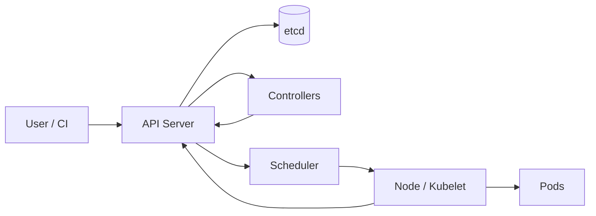

# 为什么 AI 平台需要 Kubernetes：控制面与核心对象

Kubernetes 是一个通过 API 对象和控制器持续逼近期望状态的容器编排平台。它位于应用容器与基础设施之间：负责调度 Pod、维持副本、提供服务发现和滚动发布，但不负责模型推理、知识版本、业务幂等或回答质量。AI 平台使用它，是因为模型服务同样需要被调度、探活、迁移和逐步发布，只是资源和启动边界更特殊。

Kubernetes 管“实例应当怎样运行”，AI Runtime 管“这一轮请求应当怎样完成”，模型与 RAG 系统管“答案使用什么版本和证据”。控制面、对象和部署链都围绕这三层职责展开。

模型服务进程退出后需要重建，节点维护时实例要迁移，新版本要逐步替换旧版本，多个团队还要共享计算资源。这些是声明、调谐、发现和发布问题，Kubernetes 能提供统一控制面。但它不会自动理解模型是否适合某张 GPU，也不会替你设计 Batch、KV Cache 或质量回归。

理解 Kubernetes 要从期望状态开始。用户提交对象声明“希望存在什么”，控制器持续观察实际状态并采取动作，直到两者接近。一次 `apply` 不是执行完所有步骤的脚本。

## 控制面如何形成调谐循环

API Server 是资源入口，etcd 保存集群状态，Controller 根据对象状态创建或更新子资源，Scheduler 为未绑定 Pod 选择节点，Kubelet 在节点上通过容器 Runtime 实现 Pod。组件通过 API 对象协作，不是由一个中心脚本顺序调用。

## 核心对象各自拥有哪段状态

Pod 是可调度和运行的基本单元，可以包含共享网络与卷的多个容器。Pod 不是稳定实例，重建后名称、IP 和本地状态可能变化。Deployment 管理无状态副本和滚动更新；StatefulSet 提供稳定序号和存储关联，但也不替代数据库一致性。

Service 为一组 Ready Pod 提供稳定发现与虚拟入口；Ingress 或 Gateway API 将外部 HTTP 流量路由到 Service。ConfigMap 保存普通配置，Secret 对象保存敏感数据但是否静态加密和如何注入仍需集群策略。

## AI 工作负载有什么特殊之处

模型镜像和权重很大，启动可能需要下载、校验、映射与预热；GPU 设备不是普通可压缩 CPU；多卡推理要求拓扑与并行配置；请求成本受上下文和输出长度影响；质量不能由 Liveness 证明。

因此 AI Pod 通常需要更长 Startup Probe、严格资源请求、模型制品策略、专用节点、调度约束、Drain 和外部容量指标。普通 Web HPA 只看 CPU，未必能反映队列、KV Cache 与 Token 压力。

## 从 Pod 到公网的一条链

Deployment 创建 ReplicaSet，ReplicaSet 维持 Pod 数；Scheduler 根据资源与约束选择节点；Kubelet 启动容器并执行探针；Readiness 成功后，Service Endpoint 才包含实例；Ingress 再把公网请求转给 Service。

排障要沿这条控制关系：对象是否被接受，Pod 是否调度，镜像与卷是否准备，容器是否启动，探针为什么失败，Endpoint 是否存在，入口是否选到 upstream。只看最终 503 会跳过太多证据。

## 配置、资源和发布边界

CPU/内存 Request 影响调度，Limit 影响运行边界。GPU 通常通过扩展资源按整数请求，具体共享或切分依赖设备插件和硬件能力。配置变化是否触发新 Pod 需要明确版本策略，模型 Revision 也应进入不可变发布标识。

滚动更新适合实例可并存且契约兼容的版本。模型加载很慢或资源没有双倍余量时，需要候选 Deployment、分批流量或先缩放其他容量。数据库迁移和模型行为 Eval 不能由 Deployment 自动替代。

## Kubernetes 不负责什么

它能重启崩溃容器，却不知道重复执行会不会二次计费；能把 Pod 放到有 GPU 的节点，却不知道模型是否放得下显存；能扩副本，却不知道流量下降后何时能安全释放模型 Cache；能保存 Secret 对象，却不保证应用不会把 Secret 写进日志。

平台层要在 Kubernetes 之上补充模型 Registry、Gateway、Runtime、RAG Release、准入、用量、Eval 和发布 Runbook。正确边界是让 Kubernetes 管理通用期望状态，让 AI Platform 管理模型和业务语义。

## 没有集群时怎样学习

当前环境没有 Kubernetes Context，也没有创建资源。机制验证可以从对象关系和状态推演开始：给出一个 Pod Pending、Readiness 失败或 Service 无 Endpoint 的现象，沿 API 对象找到下一条证据；给出一次模型更新，说明旧新版本怎样并存、何时接流量、失败怎样回退。
