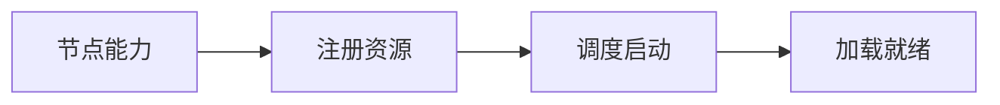

# Kubernetes 部署 AI 服务：GPU Operator、模型卷与探针

Deployment 声明了 `nvidia.com/gpu: 1`，Pod 一直 Pending；节点明明有 GPU，`nvidia-smi` 在宿主机也正常。检查发现 Device Plugin 没有向 kubelet 注册扩展资源。硬件存在、驱动工作和 Kubernetes 可调度是三个不同状态。


## 一份强调冷启动边界的解释性 Deployment

YAML 只解释资源和探针语义，未在真实集群执行。镜像 digest、PVC、端口、命令和探针路径必须按实际引擎替换。

```yaml
spec:
  template:
    spec:
      containers:
        - name: serving
          image: registry/model-serving@sha256:REPLACE_ME
          resources:
            limits:
              nvidia.com/gpu: 1
          startupProbe:
            httpGet: { path: /startup, port: 8000 }
            periodSeconds: 10
            failureThreshold: 90
          readinessProbe:
            httpGet: { path: /ready, port: 8000 }
          volumeMounts:
            - { name: model, mountPath: /models, readOnly: true }
```

startup 最长窗口约 15 分钟只是示意，应来自真实模型加载分布；过短会重启风暴，过长会延迟发现确定性失败。readiness 应检查目标 revision 和 scheduler 接收状态，liveness 只判断进程是否失去恢复能力。模型卷只读能减少运行期篡改，但仍需校验摘要。

## GPU 怎样从节点硬件进入 Pod

理解下面这些词时，要同时回答输入、状态和输出分别在哪里。它们不是可以互换的产品标签。

| 概念 | 在这条链路中的含义 |
| --- | --- |
| GPU Operator | 用于管理驱动、Container Toolkit、Device Plugin 等 GPU 软件栈的 Operator；是否管理驱动取决于部署模式。 |
| Device Plugin | 向 kubelet 注册扩展资源并在 Pod 分配时返回设备与注入信息。 |
| Extended Resource | 如 `nvidia.com/gpu` 的整数资源，调度器按请求/限制分配，默认不表达显存大小。 |
| Startup Probe | 给模型冷启动独立时间窗口，成功后才启用 liveness/readiness，防止加载过程被误杀。 |

::: tip 判断原则
遇到新术语，先问它改变了哪份状态；如果没有状态所有者，这个名词暂时不能指导排障。
:::

## 模型 Pod 从 Pending 到 Ready 的完整路径



图里每个节点都要产生可观察结果；没有结果时，上一节点是否真正交付就是第一项检查。

### 节点能力：Driver/Toolkit

宿主机驱动识别设备，容器 Runtime 能注入设备与库。

决定下一步前需要看到 node driver、runtime class。

### 注册资源：Device Plugin/Kubelet

把可分配 GPU 作为扩展资源写入 Node capacity。

这一动作的可观察结果是 `kubectl describe node` allocatable。处理动作应晚于取证，否则重启或重试可能覆盖最早的失败现场。

### 调度启动：Scheduler/Kubelet

Pod 请求 GPU 和模型卷，满足节点条件后创建容器。

可以从这些位置确认结果：events、volume mount、device env。若完全没有证据，先判断请求是否到达本阶段；若记录冲突，则对齐 request_id、实例和时间窗口。

### 加载就绪：Serving/Probe

加载指定 revision、预热并通过 startup/readiness 后接流量。

这里不靠猜测，优先读取 probe status、model revision、EndpointSlice。

## Pod 就绪不等于服务可用

| 表面现象 | 实际可能发生的事 | 下一步证据 |
| --- | --- | --- |
| 节点有 GPU | Device Plugin 未注册或资源已分配 | 看 Node allocatable 与已分配资源 |
| 容器看到 GPU | 驱动/Runtime 与框架版本仍可能不兼容 | 在同一容器检查 Runtime 初始化 |
| 启动探针失败 | 模型仍加载或确定性配置错误需要区分 | 对齐加载进度与错误日志 |
| 滚动更新卡住 | 新旧副本同时需要 GPU，集群没有额外容量 | 为候选预留容量或采用受控切换 |

::: warning 结论的边界
示例输出用于建立判断路径，不应被当成目标环境的真实结果。版本、硬件和请求形状变化后要重新验证。
:::


## 哪些结论还需要真实环境验证

资源名只表达设备数量，不自动保证型号、显存或拓扑。GPU Operator 组件版本需按目标 Kubernetes、驱动和 GPU 官方兼容矩阵核对。本章配置未在真实集群验证。

单个 Pod 能获得 GPU 后，平台还要决定它应该落在哪台节点、能否共享、何时排队和按什么信号扩缩容。下一篇进入 GPU 调度。
