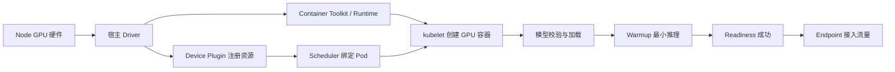

# GPU 怎样进入 Kubernetes Pod？从节点驱动到模型就绪

Pod 的 YAML 写了 `nvidia.com/gpu: 1`，并不会凭空创建一张 GPU。设备先要安装在 Node 上，宿主驱动要识别它，容器 Runtime 要能把设备和驱动库注入容器，Device Plugin 要向 kubelet 注册扩展资源，Scheduler 才能找到可用 Node。容器启动后还要读取模型、加载显存、Warmup 并通过 Readiness，外部请求才应该到达。

这条链上的每一步都有不同所有者和失败证据。Node 上 `nvidia-smi` 正常只覆盖硬件与驱动；Pod Pending 发生在调度之前；容器内 CUDA unavailable 属于设备注入或 Runtime；模型 OOM 属于运行容量。本文不在没有集群和目标 GPU 的环境里声称部署成功，只给出可静态检查的清单和需要在候选集群补齐的证据。

::: info GPU 进入 Pod 的准确含义

Kubernetes 通过设备插件和容器运行时，把宿主机上的 GPU 作为扩展资源分配给 Pod。Pod 请求资源后，Scheduler 选择有可分配设备的 Node，kubelet 在创建容器时取得设备分配结果，Runtime 把设备节点、环境和驱动能力注入容器。

这个过程分配的是对物理设备或设备实例的访问权，不是复制硬件。模型镜像、CUDA 用户态库和应用仍要与宿主驱动兼容，Kubernetes 也不会自动下载模型或判断推理结果正确。

:::

## Node 上的 GPU、驱动和设备文件分别是什么

GPU 是安装在 Node 上的硬件。Linux 通过 PCIe 枚举设备，NVIDIA 内核驱动创建和管理设备节点，用户态管理库读取状态。`lspci` 能看到硬件，不代表驱动已经绑定；`nvidia-smi` 能查询驱动，才说明宿主基础链路大体可用。

驱动负责 GPU Context、内存和命令提交，容器通常复用宿主内核驱动。容器镜像不应自行加载一个不同的内核模块。镜像里的 CUDA Runtime 和库通过宿主驱动调用硬件，版本要满足官方兼容范围。

设备文件和驱动库需要进入容器 Namespace。普通容器默认看不到 GPU，避免任何进程随意访问。NVIDIA Container Toolkit 与 Runtime 配置根据设备选择，把需要的节点、库和环境挂进容器。配置缺失时，宿主正常而容器无法初始化 CUDA。

Node 还要有足够电源、散热、IOMMU 与正确固件。GPU 掉线、ECC 错误或驱动重置可能让 Node 仍 Ready，但设备不可用。节点健康监控要把硬件状态转换为标签、事件或隔离动作，不能只依赖 kubelet 心跳。

这个层级的验证在宿主完成：设备数量、型号、驱动版本、错误状态和最小 CUDA 运算。生产上不要随意升级驱动后重启节点，应该先 Drain 工作负载并在同型号候选 Node 验证。

设备注入可以沿一条具体路径理解：Device Plugin 向 kubelet 报告 `nvidia.com/gpu`，Scheduler 把 Pod 绑定到有可用设备的 Node，kubelet 请求 Runtime 创建容器，Toolkit 将设备文件和兼容库注入，容器内的 CUDA Runtime 再通过宿主驱动提交 Kernel。任何一层缺失，宿主上“有 GPU”都不能推出 Pod 内的 `torch.cuda.is_available()` 为真。

这个概念与 GPU 调度的区别是，调度只决定 Pod 去哪台 Node，设备注入决定容器能看到什么文件、库和 UUID。比如 Pod 已经处于 Running，但模型加载时报 CUDA 初始化错误，证据应回到 Runtime、驱动和库版本；若 Pod 一直 Pending，则先检查资源名、配额和 Node 条件。模型 Ready 还要在这些基础上验证权重和最小推理。

::: tip 容器内最小预检

把设备枚举、驱动版本、CUDA Runtime、显存分配和一次小矩阵运算分别记录。没有目标 GPU 时可以做 YAML、资源名和版本矩阵的静态检查，但不填写实际算力或显存结论。

:::

## Container Toolkit 和 Runtime 怎样把设备注入容器

Kubernetes 通过 CRI 调用 containerd 或 CRI-O。GPU Container Toolkit 为运行时提供设备发现与注入能力，可以通过 RuntimeClass、CDI 或实现支持的方式选择设备。它不会参与 Scheduler 的资源计算，只处理已经分配给容器的设备进入运行环境。

注入内容通常包括 `/dev/nvidia*` 设备、驱动用户态库和环境。`NVIDIA_VISIBLE_DEVICES` 或 CDI 设备标识决定容器可见集合，`CUDA_VISIBLE_DEVICES` 还能改变应用看到的逻辑编号。容器内的 GPU 0 不一定是宿主物理索引 0，日志应保留 UUID 或分配标识。

镜像可以包含 CUDA Toolkit、PyTorch 和 Serving 引擎，不应假设宿主有完全相同用户态文件。驱动与镜像 Runtime 的兼容由版本矩阵决定。把宿主 `/usr/local/cuda` 整目录随意挂入容器，会破坏镜像可复现性。

Runtime 配置错误常见证据是容器创建失败、OCI Hook 错误、设备文件缺失或动态库加载失败。此时 Pod 可能进入 `CreateContainerError`，也可能容器启动后框架报告 CUDA unavailable。要同时读取 kubelet、Runtime 和应用日志。

最小验证是在同一 RuntimeClass 与镜像下运行只读设备查询和小张量计算。只运行 `nvidia-smi` 仍没经过目标框架 Kernel；只导入 PyTorch 也未触发 Device。候选测试应依次覆盖枚举、分配、运算和释放。

## Device Plugin 怎样向 kubelet 注册扩展资源

Device Plugin 是在 Node 上运行的组件，向 kubelet 注册资源名、设备列表和分配方法。NVIDIA 插件常公开 `nvidia.com/gpu`。kubelet 把可分配数量写入 Node Capacity 与 Allocatable，Scheduler 才能把 Pod 的资源请求与 Node 匹配。

插件通常以 DaemonSet 运行，每个 GPU Node 一个 Pod。它通过宿主目录与 kubelet 通信，监控设备健康，并在 Allocate 请求时返回需要注入容器的信息。插件本身不安装驱动，也不编译 CUDA；前置条件不满足时，它可能不注册任何资源。

扩展资源通常只能整数请求，且 request 与 limit 相等。`nvidia.com/gpu: 1` 表示请求一个由插件管理的资源单位。这个单位可能是一整张 GPU，也可能在 MIG 或共享配置下代表另一个设备实例，必须结合集群配置解释。

Node 有物理 GPU 但 Allocatable 为零时，检查插件 Pod、日志、kubelet Plugin Registration 和节点标签。若 Allocatable 正常而 Pod Pending，继续看资源是否已被其他 Pod 请求、Affinity 或 Taint 是否阻止调度。

设备插件 API 的边界是设备发现与分配。它不跟踪模型使用了多少显存，也不按 Token 自动扩缩。运行层的容量由应用和监控负责，调度层只认公开的资源单位与标签。

## GPU Operator 是什么，它管理哪些节点组件

GPU Operator 是 NVIDIA 提供的 Kubernetes Operator，用自定义资源和控制器管理驱动、Container Toolkit、Device Plugin、Node Feature Discovery、监控等 GPU 软件栈。它适合希望统一安装和升级节点组件的集群，但不是 Kubernetes 使用 GPU 的唯一方式。

Operator 模式把期望版本写进 ClusterPolicy 等对象，控制器创建 DaemonSet 并观察状态。集群如果已有驱动或由云镜像管理，需要配置禁用相应组件，避免两个来源同时修改节点。升级前要读目标 Operator 和驱动版本的兼容说明。

Node Feature Discovery 可以给节点添加硬件标签，Device Plugin 提供扩展资源，DCGM Exporter 输出设备指标。它们各自负责发现、分配和观测。Operator 显示 Ready 也不证明某个模型镜像兼容，需要 Pod 级最小运算和加载测试。

使用 Operator 会扩大控制器权限和节点级 DaemonSet 范围，安装要经过安全审查。驱动容器可能需要特权访问，升级可能重启节点组件。生产变更应按节点池滚动，保留可回滚版本，不在所有 GPU Node 同时尝试。

静态阶段能校验 Helm Values 与 CRD Schema，真实验证必须查看 ClusterPolicy Condition、各 DaemonSet Ready、Node Allocatable 和测试 Pod。任何一项失败都不能跳到模型层猜测。

## Scheduler 怎样为请求 GPU 的 Pod 选择 Node

PodSpec 在 `resources.limits` 中声明扩展资源。API Server 接受对象后，Scheduler 查找 Allocatable 足够且其他约束满足的 Node。绑定结果写入 Pod 的 `spec.nodeName`，之后由该 Node 的 kubelet 执行设备分配与容器创建。

Scheduler 默认按资源单位计算，不知道模型需要多少显存、哪种计算能力或 NVLink 拓扑。平台用节点标签、Affinity、资源名或自定义调度器补充。标签必须来自可信控制器或受限节点身份，不能让普通工作负载自行伪造。

GPU Pod Pending 时，`kubectl describe pod` 事件可能显示 `Insufficient nvidia.com/gpu`、未容忍 Taint、Affinity 不匹配或 PVC 拓扑冲突。没有事件也要查看 Scheduler 状态和 Admission。等待 Cluster Autoscaler 新建 GPU Node 时，Pod 保持 Pending 是正常状态。

资源已绑定后，Scheduler 不再监控显存。进程启动后 OOM 不会触发自动换到更大 GPU，除非应用失败导致上层控制器重建，而调度约束又允许其他 Node。选择正确型号应在调度前表达。

多 GPU Pod 请求 2 张设备，插件会给同一 Node 上的两个单位。它不保证设备之间有高速互联。张量并行还要检查拓扑标签或专用调度策略，下一篇会展开。

## 模型制品怎样进入 Pod

GPU 进入容器只解决计算设备，模型权重还要从镜像、PVC、对象存储或节点缓存进入。把几十 GB 权重打进镜像会让镜像拉取和版本发布很重；启动时从对象存储下载易于独立版本，却要处理带宽、并发、断点、校验和缓存。

Init Container 可以下载并校验模型，主容器只读取已经完成的目录。它的失败会阻止主容器启动，重试由 Pod 生命周期管理。若每个副本同时下载相同模型，会对对象存储和网络产生尖峰，节点级缓存或受控预热可以减少重复。

PVC 提供共享或持久存储，访问模式和拓扑要与 Node 匹配。只读挂载减少模型被应用改写的风险。模型目录应包含 Manifest，记录模型 ID、Revision、文件 Hash、Tokenizer 和配置，主容器启动时再次校验。

HostPath 或节点缓存速度快，但把 Pod 绑定到已有缓存的 Node。缓存命中应作为性能优化，缺失时仍能从可信源重建。缓存清理只删除无引用版本，不能用模糊目录匹配清空整个节点模型库。

Secret 负责下载凭证，不直接保存大权重。凭证短期化并限制对象前缀，日志不打印 URL 查询参数。下载失败、Hash 不符和空间不足要留下不同退出码和事件。

## Startup、Readiness 和 Liveness 怎样覆盖模型加载

容器进程启动后，Serving 引擎可能仍在读取权重、建立 CUDA Context、分配 KV Cache、编译 Kernel 和 Warmup。Startup Probe 在这一阶段轮询，时间窗要覆盖合理冷启动。Startup 失败超过阈值，kubelet 重启容器，日志应说明停在哪一步。

Readiness 只有在固定模型 Revision 加载、最小推理通过、依赖可用且实例接收新请求时返回成功。单纯端口监听太早。Readiness 失败会把 Pod 从 Endpoint 移出，适合加载和 Drain；它不应该因为一个普通用户请求失败就永久关闭实例。

Liveness 判断内部是否不可恢复。GPU Worker 消失、Engine 事件循环停止或 Context 损坏可能需要重建；对象存储短暂不可用但模型已加载，不应触发所有副本重启。Liveness 路径不能执行昂贵生成，也不能依赖不相关外部系统。

探针参数包括 initial delay、period、timeout 和 failure threshold。Startup Probe 存在时可以把慢启动与持续健康分开。超时过短会在节点繁忙时误杀，过长则延迟发现卡死。实际加载时间分布要进入配置依据。

模型 Ready 后还要从 Service 入口发合成请求。Probe 只覆盖 Pod 内状态，不能证明 Endpoint、代理和协议。合成请求使用无敏感固定 Prompt，记录模型版本与 finish reason。

## GPU 模型 Pod 的资源和共享内存怎样声明

Pod 请求 GPU 的同时要声明 CPU、内存和临时存储。CPU 负责分词、网络和调度，主存承担权重下载与加载暂存，临时存储保存模型或编译缓存。只给 GPU 不给其他资源，可能出现 GPU 空闲而 Pod 被 CPU Throttling 或 OOM Kill。

多进程推理、NCCL 和某些框架需要较大的 `/dev/shm`。容器默认共享内存可能很小，可以挂载 `emptyDir` 且 `medium: Memory` 到 `/dev/shm`。这部分会计入 Pod 内存，大小要纳入 Request 和 Limit，不能无限设置。

GPU 扩展资源写在 Limit 中，普通 CPU 与内存同时写 Request/Limit。示例使用一张卡不表示模型一定装得下，显存容量和型号由 Node 约束补充。镜像用 digest，避免同一 Tag 在不同 Node 拉到不同内容。

安全上下文应移除不需要的 Linux Capability、使用只读根文件系统并限制特权。GPU Runtime 不要求业务容器本身是 privileged。模型目录只读，临时目录单独可写，减少进程修改制品的机会。

资源声明通过静态 Schema 后，还要在候选 Node 观察 CPU、内存、显存、共享内存与磁盘峰值。Request 依据运行分布调整，而不是复制另一个模型的值。

## 一份解释性 Deployment 怎样写

下面 YAML 只展示关键字段。镜像 digest、StorageClass、PVC、资源、RuntimeClass 和健康路径都需要按目标环境替换，当前未在真实 GPU 集群执行。

```yaml
apiVersion: apps/v1
kind: Deployment
metadata:
  name: llm-serving
spec:
  replicas: 1
  selector:
    matchLabels:
      app: llm-serving
  template:
    metadata:
      labels:
        app: llm-serving
    spec:
      runtimeClassName: nvidia
      containers:
        - name: engine
          image: registry.example/llm-serving@sha256:replace-me
          args: ["--model", "/models/current"]
          resources:
            requests:
              cpu: "4"
              memory: 16Gi
            limits:
              cpu: "8"
              memory: 24Gi
              nvidia.com/gpu: "1"
          volumeMounts:
            - name: model
              mountPath: /models
              readOnly: true
            - name: shm
              mountPath: /dev/shm
          startupProbe:
            httpGet: { path: /startup, port: 8000 }
            periodSeconds: 10
            failureThreshold: 60
          readinessProbe:
            httpGet: { path: /ready, port: 8000 }
            periodSeconds: 5
      volumes:
        - name: model
          persistentVolumeClaim:
            claimName: llm-model
        - name: shm
          emptyDir:
            medium: Memory
            sizeLimit: 8Gi
```

YAML 把 GPU、CPU、主存、模型卷和共享内存分别声明。Startup 最多允许约十分钟才判定失败，实际值要来自冷启动测量。Readiness 只在引擎可接流量时成功。它还缺 Service、NetworkPolicy、ServiceAccount 与 PodDisruptionBudget，不能直接当生产清单。

静态检查包括 YAML 解析、Kubernetes Schema、镜像 digest 格式、资源数量和探针路径合同。目标集群检查还要经过 Admission、RuntimeClass、PVC 绑定和 GPU 调度。只有真实最小推理能证明镜像、模型与设备兼容。

## 镜像、驱动、CUDA 和模型格式怎样形成兼容矩阵

GPU 容器能否运行由多个版本共同决定。宿主驱动支持一组 CUDA 用户态能力，镜像包含特定 PyTorch、Serving 引擎和 Kernel，GPU 本身有 Compute Capability，模型还声明 dtype、量化与架构。任何一项超出支持范围，都可能在不同阶段失败。

镜像 Tag 不足以表达制品身份。发布记录使用 digest，并保存基础镜像、CUDA Runtime、框架和引擎版本。模型使用 Revision 与文件 Hash。Node 保存 GPU 型号、驱动和 RuntimeClass。把这些字段组成部署身份，才知道某次成功能否复现。

兼容失败有不同现象。Driver 太旧可能在 Runtime 初始化时报错；镜像没有目标架构 Kernel 可能到实际算子才失败；量化格式不支持可能在权重加载或第一轮推理失败；Tokenizer 不匹配则 CUDA 全程正常，输出却乱码或停止异常。

候选验证先运行最小张量运算，再加载目标模型，最后跑协议与固定样本。一个小 CUDA 样例通过只能证明基础 Runtime 路径，不能替模型 Kernel。模型加载成功也不能证明工具调用、SSE 和长上下文行为。

升级任何一项都重新执行矩阵。驱动滚动升级按 Node 池，镜像升级按候选 Deployment，模型升级保留独立 Revision。一次只改变可解释的变量，失败时才能找到版本边界。没有覆盖的 GPU 型号标为未验证，不能从同系列另一张卡直接推断。

## GPU 服务滚动发布为什么需要额外容量

普通 CPU Deployment 可以用 Surge 新建一个 Pod，再删除旧 Pod。独占 GPU 集群若所有设备都被旧副本占满，新 Pod 会 Pending，更新无法推进。将 `maxUnavailable` 设为 1 可以先释放旧 GPU，但这段时间副本减少，容量与可用性要接受影响。

大模型冷启动还会拉长新旧并存。新 Pod 占 GPU 加载权重，旧 Pod 继续接流量，节点网络、对象存储和 CPU 主存同时承压。所有副本一起下载可能拖慢整个集群。分批预热缓存和限制下载并发比单纯调大探针更有效。

候选 Deployment 是另一种办法。新版本用独立名称和受控 GPU 启动，只接测试租户，通过模型、协议和容量验证后，由 Gateway 切少量流量。旧 Deployment 保留，回滚只改路由。这个模式需要额外设备，但发布状态更清楚。

原生 RollingUpdate 也能使用，只是 Readiness 必须准确，且 `minReadySeconds` 与进度期限覆盖 Warmup。Pod Ready 后立即承接大量流量，Cache 还冷，首批延迟可能很高。流量预热和逐步增加权重要由 Gateway 或渐进发布控制器实现。

发布完成后清理旧 ReplicaSet、模型缓存和镜像要保留回滚点。不能因为资源紧张就先删唯一旧版本。清理前建立 Pod、镜像 digest、模型 Revision 和 PVC 引用清单，只删除确认无引用的候选产物。

## GPU Pod 的权限和网络边界怎样设置

业务容器获得 GPU 设备，不等于需要宿主特权。默认禁止 privileged、Host PID、Host Network 和任意 HostPath，移除 Linux Capability，使用非 root 用户和只读根文件系统。GPU 注入由 Runtime 完成，应用只访问被分配设备。

ServiceAccount 使用最小权限。单纯 Serving 通常不需要读取 Kubernetes API。模型下载身份只允许读指定对象前缀，数据库和 Gateway 凭证分别管理。Secret 通过短期令牌或 CSI 投影进入，日志和进程参数不打印秘密。

NetworkPolicy 只允许 Gateway 调用模型端口，允许监控抓取明确指标端点，按需允许对象存储和 DNS 出站。Pod 不直接暴露 NodePort 或公网 LoadBalancer，避免绕过鉴权、限流和审计。集群网络策略仍不替代应用层内部身份。

模型目录只读，下载与校验由受限 Init Container 或专用缓存服务完成。动态 Adapter 路径不能由外部请求传成本地任意文件。引擎若支持远程代码，发布时固定 Revision 并审查，运行时不从不可信仓库下载执行。

设备共享会扩大侧信道和资源干扰边界。多租户是否可共享同一物理 GPU，要根据硬件隔离、MIG、MPS 和威胁模型决定。Kubernetes Namespace 本身不能隔离显存访问，资源插件和设备模式才决定可见范围。

## 哪些指标能说明模型 Pod 卡在哪一层

Node 层记录 GPU 健康、驱动错误、温度、功耗、显存和设备利用。Kubernetes 层记录 Pod Phase、Condition、重启、调度事件、镜像拉取、PVC 与探针。引擎层记录模型加载阶段、KV Block、waiting/running、TTFT、TPOT、取消和错误。

这些指标需要共同标签。Pod UID 与 GPU UUID 映射告诉监控某个进程使用哪张设备，镜像 digest 和模型 Revision 标记部署版本，request ID 连接 Gateway 与引擎。只按 Pod 名聚合会在重建后混合不同实例。

Pod Pending 没有 GPU 利用数据属于正常，因为容器未启动。Pod Running 且 GPU memory 为零，可能模型还没加载或设备不可见；权重基线出现但 Readiness false，继续看 Warmup 和探针；Ready 后无请求且 GPU utilization 低也正常。

告警要对应动作。设备 Xid 错误可能隔离 Node，连续 Startup 失败阻止发布，Readiness 大面积下降停止路由，单请求超长则在 Gateway 拒绝。把所有情况都配置成重启 Pod，会掩盖节点和配置根因。

指标不是唯一证据。事件有状态转移，日志给错误上下文，合成请求证明实际入口。排障记录按时间排列三个来源，避免把五分钟前旧 Pod 的日志配到当前新 Pod 的指标。

## 常见失败怎样按状态位置区分

Pod Pending 且事件为扩展资源不足，说明 Scheduler 找不到可分配单位。检查 Device Plugin、其他 Pod 请求和 Node 约束。Pod 已绑定但 `CreateContainerError`，查看 RuntimeClass、Toolkit、设备节点和容器 Runtime 日志。两个阶段都没有应用日志。

容器启动后 CUDA unavailable，宿主和分配可能正常，问题落在容器库、环境或框架构建。能创建张量但模型加载 OOM，则进入显存账本。模型加载完成而 Warmup 报不支持算子，要核对 GPU 架构、Kernel 和量化格式。

Pod Ready 却从 Service 访问失败，检查 Selector、Endpoint、端口和 NetworkPolicy。Service 正常而公网 502，检查 Ingress/Gateway 与协议。SSE 首 Token 正常但中途断开，代理超时、客户端取消和引擎错误都要用 request ID 对齐。

节点驱动错误后，重建 Pod 可能仍落回同一坏节点并重复失败。需要把 Node 标记不可调度、驱逐受影响工作负载并走硬件恢复。单个模型 Revision 错误则不应隔离整个节点，回滚 Deployment 或模型指针即可。

这组分类的目的不是背错误表，而是确认请求到达了哪一层。每一次诊断都先找到最后一个成功状态和第一个失败状态，二者之间才是调查范围。没有证据的后续阶段保持未知。

## 节点维护和设备故障时怎样恢复

计划维护从 Cordon 和 Drain 开始。Cordon 阻止新 Pod 调度到 Node，Drain 按策略驱逐可驱逐工作负载。GPU 训练 Job 和长请求可能需要检查点或优雅取消，PodDisruptionBudget 会限制同时可用副本下降。强制删除前要明确业务损失。

设备健康异常时，Device Plugin 可能把设备标为不健康，Node Allocatable 减少。已经使用该设备的进程可能收到错误，单纯重启容器未必修复。平台先停止新调度，收集驱动与设备日志，再按供应商流程重置、重载驱动或重启 Node。

Serving 副本恢复需要重新加载模型，不能把 Pod Running 当作容量立即恢复。Gateway 只给 Ready 实例流量，扩缩容和发布系统等待 Warmup。若剩余副本不足，先启用过载拒绝，避免所有请求压到少数实例再触发连锁 OOM。

Node 回到集群前运行分层验收：宿主设备查询、容器最小 CUDA、目标镜像最小张量、模型加载与合成请求。只看到 Node Ready 不足。验收失败的 Node 保持隔离，不能让业务 Pod 反复承担诊断。

非计划故障的恢复记录包括受影响 Pod、未完成请求、重试语义、设备错误、替代 Node 和恢复时间。客户端是否重试由请求幂等性决定，流式已输出部分内容时不能无条件重新计费或拼接。

## 候选集群应验证哪些成功和失败路径

成功路径至少覆盖 Pod 调度、设备注入、模型校验、权重加载、Warmup、Readiness、Service 非流式与 SSE。记录每一步耗时用于探针与发布期限，不用单次结果承诺长期性能。重启一次 Pod，确认缓存冷时仍能恢复。

失败路径先移除可调度 GPU，Pod 应 Pending 并留下资源事件；再使用错误 RuntimeClass，容器应在创建阶段失败；使用不完整模型 Revision，Startup 应失败且不进入 Endpoint；发送超长请求，应由服务准入拒绝而不是 GPU OOM。

取消测试在 SSE 已返回部分 Token 后断开，Engine 应停止后续 Decode 并回收 Cache。终止测试让 Deployment 删除 Pod，实例先离开 Endpoint，已有请求在 Grace Period 内完成或收到明确错误。两个测试都要观察设备资源，不只看 HTTP。

资源测试记录 CPU、主存、临时盘、共享内存和每卡显存峰值。多副本同时冷启动时再测对象存储和节点网络。单 Pod 成功不证明 RollingUpdate 有足够 Surge 资源，也不证明多副本不会争抢缓存。

所有测试用固定镜像 digest、模型 Hash、集群版本和节点型号。未覆盖的 MIG、共享、多卡或另一 GPU 架构列为未验证。静态 YAML、Server Dry Run 和真实集群结果分栏保存，避免审批者把三者当成同一等级。

## 从节点预检到模型 Ready 的状态图

下面的图把组件依赖按顺序放在一起。它的用途是定位哪一步还没有证据，不表示所有组件由同一个团队管理。



两条路径在 kubelet 创建容器前汇合：调度要求扩展资源存在，Runtime 要能执行设备注入。容器创建成功后才轮到模型。若 Pod Pending，查 Scheduler 与资源；若 CreateContainerError，查 Runtime；若 Running 不 Ready，查模型加载与探针。

图后的验证要读取实际对象。Node Allocatable、Device Plugin 日志、Pod 事件、容器设备、模型 Manifest、Warmup 输出和 EndpointSlice 分别对应一个节点。缺少中间证据时，不能从末端 503 直接判断 GPU 坏了。

## 一次 GPU Pod 启动失败再恢复怎样完整推演

输入是固定镜像 digest、模型 Revision、PVC 与请求一张 GPU 的 Deployment。Node 上驱动正常，但 Device Plugin DaemonSet 因配置错误没有注册 `nvidia.com/gpu`。Pod 创建后保持 Pending，Scheduler 事件显示扩展资源不足，容器日志为空，因为容器尚未创建。

修正插件并确认 Node Allocatable 出现一张 GPU 后，Scheduler 绑定 Pod。kubelet 调用 Runtime 创建容器，容器内枚举到分配设备，模型 Manifest 校验通过，权重加载并建立 KV Cache。Startup 成功，Warmup 最小请求返回固定模型 ID，Readiness 转为 true，EndpointSlice 加入 Pod IP。

再制造一个失败：把模型 PVC 指向缺少 Tokenizer 的 Revision。Pod 可以 Running，GPU 也可见，但启动日志记录文件缺失，Startup 持续失败，Endpoint 不出现。恢复正确 PVC 后，新 Pod 完成加载。两个失败分别由 Scheduler 事件和应用启动日志证明，修复位置不同。

业务验证从 Service 入口发非流式和 SSE 最小请求，记录响应模型名、首 Token、完成标记与错误。发送超过上下文上限的请求，应在准入层拒绝；取消流式请求后，running 序列和 KV Block 回落。最后删除 Pod，Deployment 补回新实例并重新通过全部状态。

终止验证让实例先 Readiness false，停止新请求，已有请求在 Grace Period 内完成或被明确取消，然后进程退出。若直接 SIGKILL 导致客户端连接无说明中断，需要调整 Drain 和超时。当前文本只定义验证步骤，真实结果必须在隔离 GPU 集群补写，不能用 YAML 静态通过代替。

## 机制复核：GPU 怎样进入 Kubernetes Pod？从节点驱动到模型就绪
基础设施文章最终要回答资源从哪里来、由谁调度、失败如何回收。把模型、GPU、网络、队列、制品和数据的生命周期画成一条链，分别记录容量单位、版本身份、健康信号和所有权。单一利用率或一次成功启动不能证明系统可用。

落地验证分成离线配置检查、隔离环境运行和候选发布回归。至少覆盖资源不足、进程重启、重复任务、网络抖动和旧版本并存，并保留命令输出、指标时间窗和回滚点。生产环境只运行已构建产物，构建和压力实验放在独立环境。

性能数字需要说明硬件、输入规模、并发模型和测量口径。观察到长尾或成本异常时，先定位排队、计算、传输、存储和重试分别占用的时间，再决定扩容、限流、批处理或降级。
