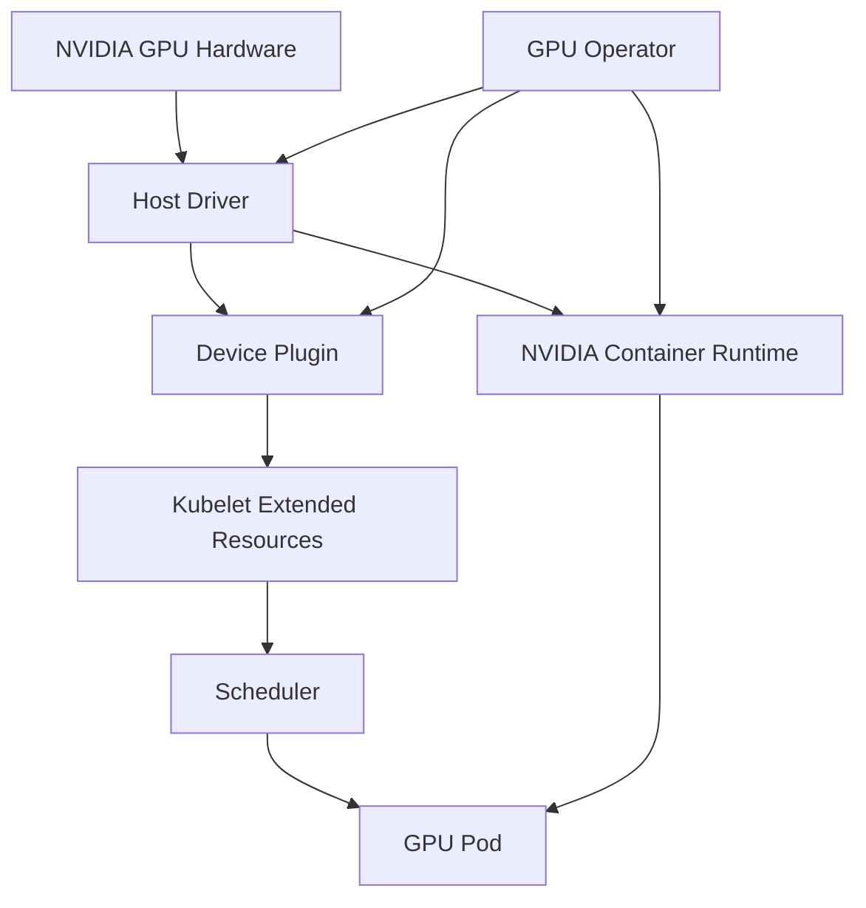

# Kubernetes 部署 AI 服务：GPU 是怎样进入 Pod 的

Pod 请求了 `nvidia.com/gpu: 1`，却一直 Pending。Deployment、镜像和模型都没有错误，真正缺失的是节点没有被 Device Plugin 注册成可分配 GPU，或现有 GPU 已被其他 Pod 占用。Kubernetes 只能调度 API Server 已知的资源。

部署 AI 服务要连接宿主驱动、容器 Runtime、设备发现、模型制品、Pod 资源和探针。任何一层未就绪，最终都可能表现为 Pod 不可用。

## GPU 能力链



Device Plugin 发现设备并向 Kubelet 注册扩展资源；Scheduler 根据 Pod Request 选择有可分配资源的节点；容器 Runtime 把对应设备和库注入容器。GPU Operator 用 Kubernetes Operator 管理驱动、Toolkit、Device Plugin、监控与相关组件，但是否由 Operator 安装宿主驱动取决于节点镜像和运维策略。

## 模型制品进入 Pod 的方式

模型可以烘焙进镜像、由 Init Container 下载到共享卷、从持久卷挂载，或由节点 Cache 提供。镜像内置最可控但体积大；启动下载灵活但把网络和仓库可用性放进启动路径；共享卷减少重复下载却要管理并发、权限和版本。

无论哪种方式，Pod 都应引用不可变 Revision 并校验文件。Readiness 不能在下载完成前成功，回滚时要能重新获得上一版本制品。节点 Cache 是优化，不应成为唯一来源。

## 一份静态解释清单

下面 YAML 展示对象关系，不代表已在当前环境应用。镜像、模型卷、资源名、路径与探针都需要根据目标集群替换，Secret 也不应直接写入文档。

```yaml
apiVersion: apps/v1
kind: Deployment
metadata:
  name: model-serving
spec:
  replicas: 1
  selector:
    matchLabels:
      app: model-serving
  template:
    metadata:
      labels:
        app: model-serving
    spec:
      nodeSelector:
        accelerator: nvidia
      containers:
        - name: server
          image: example/model-server@sha256:replace-with-digest
          args: ["--model", "/models/revision-a"]
          resources:
            requests:
              cpu: "4"
              memory: 16Gi
              nvidia.com/gpu: "1"
            limits:
              cpu: "8"
              memory: 24Gi
              nvidia.com/gpu: "1"
          volumeMounts:
            - name: models
              mountPath: /models
              readOnly: true
          startupProbe:
            httpGet:
              path: /health/startup
              port: 8000
            periodSeconds: 10
            failureThreshold: 60
          readinessProbe:
            httpGet:
              path: /health/ready
              port: 8000
            periodSeconds: 5
          livenessProbe:
            httpGet:
              path: /health/live
              port: 8000
            periodSeconds: 15
      volumes:
        - name: models
          persistentVolumeClaim:
            claimName: model-artifacts
```

Scheduler 使用 Request 做放置，GPU Request 与 Limit 通常相同。Startup Probe 给模型加载留出窗口，在成功前 Readiness 与 Liveness 不接管；Readiness 只在模型、Tokenizer 和执行器可接目标请求时成功；Liveness 检查进程是否失去恢复能力，不调用昂贵生成。

YAML 没有表达 Service、Ingress、Secret、网络策略和 PodDisruptionBudget，它们应在完整部署中补齐。`nodeSelector` 只是最简单示意，真实集群还会使用标签、污点、亲和性与拓扑约束。

## 探针怎样避免错误重启

模型加载可能持续数分钟。若 Liveness 过早开始，它会在加载完成前反复重启进程。Startup Probe 成功后才启用其他探针，可以把“还在启动”与“运行后失活”分开。

Readiness 失败应从 Service Endpoint 移除实例，但不一定重启。过载时把实例标为 NotReady 可能把流量全部推给其他实例，造成级联；更合适的做法通常是入口准入和队列控制。

## 发布需要双重验证

基础设施验证包括 Pod 调度、设备可见、模型加载、探针、Endpoint、流式取消和资源回收。模型验证包括固定 Eval、Tokenizer/Template、结构化输出、安全和容量。只有两类证据同时通过，候选才能接生产流量。

模型占用大、启动慢时，Deployment 默认滚动参数可能没有足够 GPU 同时运行新旧副本。可以使用独立候选 Deployment，先旁路验证，再按 Gateway 权重切流，并在稳定前保留旧实例。

## 故障从哪个对象查起

Pending 先看调度事件、资源和节点标签；ContainerCreating 看镜像、Volume、Runtime 和设备注入；CrashLoopBackOff 看进程退出与显存；Startup Probe 失败看模型加载；Ready 但请求失败看 Service、Gateway 与接口契约。

当前没有可用集群，本篇只对 YAML 结构和机制做静态说明。真实上线还需用目标 GPU 节点验证 Driver、Operator 版本、模型容量、Drain 和回滚。
