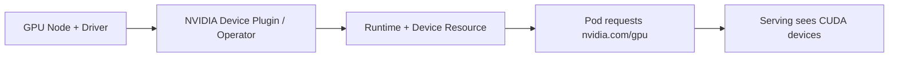

# Kubernetes 部署 AI 服务：GPU Operator、模型卷与探针

模型 Pod 一直 CrashLoopBackOff，日志只写着“loading weights”；即使把启动探针放宽，Service 仍然过早接入流量。AI 服务部署要把 GPU 能力、模型卷、加载过程和探针语义串起来，而不是套一份通用 Deployment YAML。

## GPU 能力怎样进入 Pod



Device Plugin 把节点上的设备作为可调度资源暴露，Operator 可能负责驱动、Runtime、监控和组件协调。Pod 的资源请求只是调度和设备注入入口，能否加载模型还取决于驱动、CUDA、引擎、显存和制品。

## 模型卷和容器启动顺序

```yaml
resources:
  limits:
    nvidia.com/gpu: 1
volumeMounts:
  - name: model
    mountPath: /models/current
readinessProbe:
  httpGet:
    path: /ready
    port: 8000
  periodSeconds: 5
  failureThreshold: 12
startupProbe:
  httpGet:
    path: /startup
    port: 8000
  periodSeconds: 10
  failureThreshold: 60
```

这是解释性 YAML。startupProbe 给模型加载留出时间，readinessProbe 只在实例可以安全接收请求后通过。探针路径应区分“进程活着”“正在加载”和“模型可用”，不要让每次探针触发完整生成。

## 加载失败如何分层

| 层 | 证据 | 典型处理 |
| --- | --- | --- |
| 调度 | Pod events、节点资源、taint | 修正资源请求/容忍度 |
| 设备 | 容器内 CUDA 可见性、插件日志 | 核对驱动、Runtime、设备注入 |
| 制品 | 卷路径、文件、checksum、权限 | 修复挂载或制品状态 |
| 引擎 | 权重 shape、dtype、显存、参数 | 固定兼容版本并调整配置 |
| 入口 | Ready、Endpoints、Ingress | 先阻断流量，再看代理 |

## 滚动发布对模型更敏感

旧 Pod 不能在新模型还未 Ready 时被全部终止。要根据 GPU 容量、模型加载时间和流式连接设置 maxUnavailable、maxSurge 与排空策略。两个版本同时占用 GPU 可能根本无法调度，候选验证应考虑临时节点、单独池或旁路流量。

::: warning
**未实测**

YAML 只说明字段语义，不代表在某个集群、GPU Operator 或 vLLM 版本上直接可用。下一篇继续调度层，比较整卡、共享、MIG、拓扑和自动扩缩容。
:::

## 探针必须和模型加载状态对齐

startupProbe 失败会让 kubelet 重启容器，readinessProbe 失败只会把实例从流量中摘除，livenessProbe 失败则可能杀掉仍在恢复的进程。模型加载数分钟时，错误设置 liveness 会造成永远加载不完的循环。

可以让 /startup 只确认初始化在前进，/ready 确认 tokenizer、权重、最小执行路径与队列都可用，/live 确认进程未死锁。三者不必查询同一件事，关键是让发布和告警知道各自的语义。

## 资源 request 与 limit 是调度和生存边界

Scheduler 根据 request 选择节点，容器运行时按 limit 施加约束。CPU/内存写得过低会让实例被放到看似合适的节点却在加载时被驱逐或限速；GPU 通常以设备整数请求，不能像内存那样随意超卖。

模型加载、Tokenizer 缓存和下载临时空间都要算进资源设计。为启动峰值留下合理余量，并通过真实候选观察，而不是把 OOM 交给 kubelet 重启循环处理。
