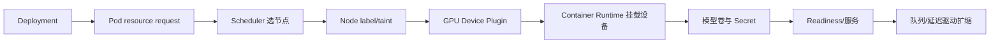

# Kubernetes GPU 调度、模型卷与自动扩缩容

Pod YAML 写了 `nvidia.com/gpu: 1`，却一直 Pending；换到另一节点后 Pod 能启动，模型又因为卷没挂载而重复下载。GPU 工作负载需要同时满足设备发现、节点能力、资源请求、模型制品、网络和扩缩容信号。

本文是基于 Kubernetes 与 NVIDIA 官方资料的操作指南。没有真实 GPU 集群时，读者可以静态校验清单、检查调度条件和画拓扑，但不能宣称 YAML 已在线运行。

## 先看一个 GPU Pod 的调度链



Scheduler 只根据 Kubernetes 资源与调度约束选择节点。模型是否放得下显存、引擎是否支持该 GPU、权重是否完整，是后续容器启动和应用健康检查要回答的问题。

## 第一步：确认集群能发现 GPU

在已授权集群执行只读检查：

```bash
kubectl get nodes -o wide
kubectl describe node <node-name>
kubectl get pods -A | grep -i device-plugin
```

`describe node` 的 `Capacity`/`Allocatable` 是否出现 `nvidia.com/gpu`，决定 Scheduler 是否知道设备；Device Plugin Pod 是否在目标节点运行，决定 kubelet 能否分配设备。真实命令中的 `<node-name>` 需要替换为当前集群节点，不要把示例值直接执行。

还要检查节点标签和污点：

```bash
kubectl get nodes --show-labels
kubectl describe node <node-name> | sed -n '/Taints:/,/Unschedulable:/p'
```

前一组命令输入是节点名和集群权限，输出是节点标签、污点和 Device Plugin 状态；GPU 节点常用标签表达型号、区域或驱动族，污点防止普通 CPU 工作负载占用。Pod 需要匹配 `nodeSelector`/affinity，并配置对应 `tolerations`。若节点有 GPU 但 Pod 仍 Pending，先看 Events 中是资源不足、污点不匹配还是插件没有发布资源，不要先改模型参数。

## 第二步：写清 GPU 请求与容器前提

最小 Deployment 形状：

```yaml
apiVersion: apps/v1
kind: Deployment
metadata:
  name: inference
spec:
  replicas: 1
  selector:
    matchLabels: { app: inference }
  template:
    metadata:
      labels: { app: inference }
    spec:
      containers:
        - name: server
          image: registry.example/inference@sha256:REPLACE_ME
          resources:
            limits:
              nvidia.com/gpu: "1"
          ports:
            - name: http
              containerPort: 8000
```

代码块是根据真实 Kubernetes 资源形状重写的最小示例：镜像用 Digest 占位，不能复制到生产；GPU limit 让 Device Plugin 分配一张卡；端口只描述容器监听，不自动对外发布。通常 GPU limit 同时作为 request，仍要查当前 Kubernetes 与插件行为。

不要把模型下载 Secret 写入 YAML。用 Secret 引用、Workload Identity 或节点级只读制品缓存。容器启动后检查模型 manifest、校验和、Tokenizer 和显存，而不是只看 Pod Running。

## 第三步：模型卷和启动顺序

模型有三种常见分发方式：镜像内置、节点本地缓存、对象存储启动下载或共享文件系统。

| 方式 | 优点 | 风险 |
| --- | --- | --- |
| 镜像内置 | 启动可重复 | 镜像巨大，发布慢 |
| 节点缓存 | 启动快 | 调度到新节点不一定有制品 |
| 启动下载 | 制品独立版本 | 冷启动长、网络/凭证失败 |
| 共享模型卷 | 多 Pod 复用 | 存储吞吐、并发读取与故障域 |

Deployment 的 readiness 必须在模型加载与健康推理检查完成后才通过，否则服务会接收请求却返回加载错误。长启动要配置 Startup Probe，避免 kubelet 在模型加载时误重启。

模型版本作为不可变目录或对象版本引用；不要让多个 Pod 同时写同一路径。缓存下载使用临时目录 + 校验成功后的原子 rename，失败清理临时文件。

## 第四步：调度与拓扑

单 GPU Pod 最简单，多 GPU 或多节点需要考虑：

- GPU 型号与显存是否满足模型制品。
- Pod 是否需要同一节点的多张 GPU。
- NUMA、PCIe、NVLink 或网络拓扑。
- 模型卷是否可在目标区域读取。
- 节点升级、驱动变更和 Pod 驱逐时是否有容量。

`topologySpreadConstraints`、pod anti-affinity 和优先级可以帮助分布副本，但也可能让调度在小集群中变成 Pending。排障时先看 `kubectl describe pod` 的 Events，区分没有 GPU、taint 不匹配、卷不可挂载还是镜像拉取失败。

## 第五步：Service 与流式请求

GPU 服务通常通过 ClusterIP Service 接入网关。SSE/流式响应要检查 Service、Ingress、代理的超时与缓冲；Kubernetes 只负责连接路由，不自动关闭上游缓冲。

readiness 失败时，Service Endpoint 应移除；应用收到 SIGTERM 后先让 readiness 失败，再停止接收新请求和模型生成，最后退出。`terminationGracePeriodSeconds` 需要覆盖排空预算，长生成请求可以被 Deadline 保护。

滚动更新 GPU Deployment 要考虑：新 Pod 冷启动下载模型期间，旧 Pod 是否保留；GPU 节点是否有同时容纳新旧版本的余量；如果没有，更新策略可能把服务降到零副本。候选验证和切流比盲目滚动更可控。

## 第六步：选择扩缩容信号

CPU 利用率不一定反映推理压力。更有意义的信号包括：在线请求数、最老队列年龄、TTFT、活动序列数、GPU 显存、GPU 利用率、错误/拒绝率和成本预算。

| 信号 | 适合回答 | 盲点 |
| --- | --- | --- |
| Queue age | 用户等待是否超标 | 空队列时无法预热 |
| Active sequences | 当前推理槽位压力 | 不表示每条长度 |
| TTFT P95 | 首响应体验 | 受输入长度分布影响 |
| GPU memory | 是否接近 OOM | 高显存不一定高计算 |
| GPU utilization | 计算是否忙 | 可能忽略排队与网络 |

HPA 原生更适合 CPU/内存或可暴露的自定义指标；KEDA 等组件可以消费队列指标。扩缩容必须设置冷却、最大副本和预算，避免模型冷启动引发抖动和成本失控。

## 第七步：静态校验与只读排障

```bash
kubectl apply --dry-run=server -f deployment.yaml
kubectl diff -f deployment.yaml
kubectl describe pod <pod-name>
kubectl logs <pod-name> -c server --since=10m
```

`--dry-run=server` 让 API Server 验证资源结构和准入，`diff` 展示将要变化的字段；两者都不代表 Pod 已成功调度。`describe` 的 Events 解释 Pending 原因，日志解释容器启动和模型加载。

GPU Pod 正常后，还要在容器内运行 `nvidia-smi` 或服务健康接口，确认进程真的使用了目标设备。不要把 `Running` 当成“模型可服务”。

## 实践任务与边界

没有 GPU 集群时，完成一份 Deployment、Service、Startup/Readiness Probe、节点标签/taint、模型卷和扩缩容指标清单，执行 server-side dry-run，逐条写出缺少的真实证据。

有隔离 GPU 集群时，再按官方 Device Plugin 与推理引擎文档启动固定 revision，记录节点、驱动、镜像、模型、启动时间、显存与健康检查。吞吐、TTFT 和成本必须来自该硬件实测。
