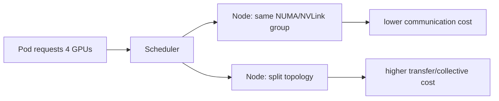

# Kubernetes GPU 调度、共享、MIG 与自动扩缩容

两个 GPU Pod 都写了 nvidia.com/gpu: 1，却被安排到拓扑不合适的节点；开启共享后吞吐抖动，MIG 又让某些模型无法启动。GPU 调度首先是资源和隔离问题，其次才是扩缩容问题。

## 设备、切片和共享是三种不同选择

| 方式 | 隔离单位 | 适合的判断 |
| --- | --- | --- |
| 整卡独占 | 一张 GPU | 模型占用大、需要稳定显存 |
| 时间/进程共享 | 同一设备的调度份额 | 负载短、可接受争用，需限流 |
| MIG | 硬件切片实例 | 需要显存/计算隔离且硬件支持 |
| 队列排队 | 逻辑访问权，不改变设备容量 | 异步任务或昂贵模型启动 |

共享不等于多了一张 GPU，MIG 也不等于任意模型都能放进每个切片。资源标签、请求、驱动和调度器的语义要逐一核对。

## 拓扑会改变多卡结果

多卡 Serving 或训练需要通信，GPU 是否在同一节点、同一互联域会影响通信路径。调度满足数量不代表满足拓扑。Topology Manager、节点标签、亲和性和 taint 只能表达约束，实际通信仍要在目标硬件上验证。

## 扩缩容看队列，不只看 GPU 百分比

GPU 利用率高可能是离线大任务，利用率低也可能是请求在队列等待或被显存准入挡住。更贴近在线体验的信号包括排队长度、最老请求年龄、TTFT 分位数、KV Block 使用和错误率。扩容策略还要考虑模型加载时间和节点供应时间，避免短峰值触发大量冷启动。

## 一张调度决策表

| 问题 | 先问什么 | 可能的策略 |
| --- | --- | --- |
| 模型放不下 | 单请求显存还是并发导致？ | 量化、分片、拆队列或多卡 |
| 延迟抖动 | 设备争用还是输入长尾？ | 独占/MIG、按长度分池 |
| Pod Pending | 资源数量还是拓扑/taint？ | 节点池、亲和性、容忍度 |
| 扩容无效 | 冷启动还是入口限流？ | 预热、队列扩容、检查上游 |

::: warning
**未实测**

调度 YAML 和信号选择需要目标集群、Operator、硬件与业务负载验证。下一阶段回到平台控制面，从 Gateway 统一身份、路由、限流、Token 和成本。
:::

## 扩容之前先确认新增副本能否变成 Ready

GPU 节点供应、驱动就绪、镜像拉取和模型加载可能比流量峰值持续更久。若 HPA 只看短时利用率，副本还没加载就又被缩回，或者大量 Pending Pod 给控制面制造噪声。模型服务需要冷启动预算、预热容量和明确的最小副本。

扩缩容后验证的不只是 replicas 数字，还要看 Pending 原因、Ready 时间、Endpoints 增长、TTFT 是否改善和成本是否符合预期。否则“已经扩容”只是控制面的动作，不是用户体验的结果。

## 队列是 GPU 共享的第一道隔离

当多租户共用有限 GPU 时，先在网关或任务平面限制每个租户的并发、Token 预算和队列年龄，再决定是否采用 MIG 或时间共享。没有上层准入，任何底层共享都会把一个长请求的压力传给其他用户。

公平策略要可解释：谁在等、因为什么资源条件等、何时会超时或被拒绝。把这些信息返回给调用方和运维看板，比只让 Pod Pending 更能帮助业务选择重试、降级或异步执行。
