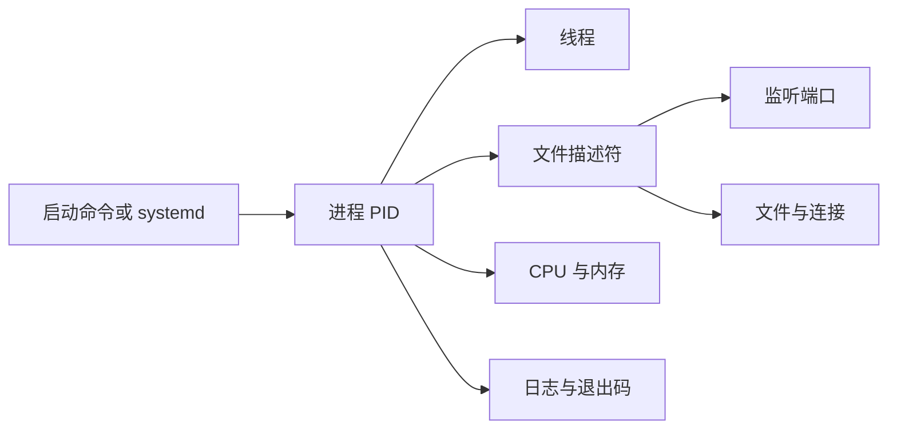

# Linux 进程、线程、端口、权限、磁盘与内存排查

服务启动命令执行后，终端没有明显报错，但浏览器访问端口失败。先别重装依赖，也别直接 `kill -9`。我们要在十分钟内回答六个问题：进程是否存在、监听哪个端口、为什么退出、能否读写文件、磁盘是否可用、内存是否正在逼近系统上限。

本章以一个名为 `knowledge-api` 的普通服务为例。你不需要真的拥有这个程序，可以换成本机任意开发服务。每个命令都会说明运行环境、关键字段、预期结果和下一步。

## 先建立 Linux 服务的最小模型

启动一个服务，本质上是让内核创建进程。进程拥有地址空间、文件描述符、用户身份和若干线程；它可能监听网络套接字，也可能打开日志、数据库连接和模型文件。



排障沿这张图走，能避免在“网络不通”时先改数据库，在“权限不足”时先加机器。

## 第一步：确认进程是否真的存在

在服务所在 Linux 主机运行：

```bash
ps -eo pid,ppid,user,stat,lstart,etime,cmd | grep '[k]nowledge-api'
```

`-e` 查看所有进程，`-o` 选择字段。重点看：

| 字段 | 含义 | 排障用途 |
| --- | --- | --- |
| `PID` | 进程编号 | 后续查端口、文件和资源 |
| `PPID` | 父进程 | 判断由 shell、systemd 还是容器拉起 |
| `USER` | 运行用户 | 核对文件和端口权限 |
| `STAT` | 进程状态 | `R` 运行、`S` 等待、`D` 不可中断等待、`Z` 僵尸 |
| `ETIME` | 已运行多久 | 判断是否在反复重启 |
| `CMD` | 完整启动命令 | 核对配置文件和参数 |

`grep '[k]nowledge-api'` 使用字符类避免把 grep 自身列出来。若没有输出，不代表 `ps` 坏了，而是当前确实没找到匹配进程。下一步查看启动器日志。

systemd 管理的服务使用：

```bash
systemctl status knowledge-api --no-pager --full
journalctl -u knowledge-api -n 100 --no-pager
```

第一条看 `Active`、主 PID、退出码和最近日志；第二条读取最近一百行服务日志。`code=exited, status=1` 表示程序主动以 1 退出，`status=203/EXEC` 常见于执行文件路径或权限问题，`status=137` 往往意味着收到 SIGKILL，但仍要结合内核日志确认是否 OOM。

容器内没有 systemd 时，应在宿主机用容器运行时查看状态和日志，不要在容器里强行启动 systemd。

## 第二步：确认进程有没有监听预期端口

假设服务应监听 TCP 8000：

```bash
ss -lntp 'sport = :8000'
```

`-l` 只看监听，`-n` 不解析服务名，`-t` 看 TCP，`-p` 显示进程。正常输出的关键部分类似：

```text
State  Local Address:Port  Process
LISTEN 0.0.0.0:8000       users:(("knowledge-api",pid=4281,fd=9))
```

`0.0.0.0:8000` 表示监听所有 IPv4 接口，`127.0.0.1:8000` 只允许本机访问，`[::]:8000` 是 IPv6 通配。端口存在但 PID 不对，说明被其他程序占用。

不知道进程监听什么时，从 PID 反查：

```bash
lsof -Pan -p 4281 -i
```

`-P` 保留数字端口，`-n` 不做 DNS，`-p` 指定进程，`-i` 只看网络文件。没有输出可能是程序尚未绑定端口，或当前用户无权查看其他用户的进程。

再从本机请求服务：

```bash
curl --fail-with-body --show-error --max-time 3 http://127.0.0.1:8000/health
```

这条命令限定三秒，非 2xx 会返回非零状态，同时保留响应正文。若本机都连接拒绝，先修进程和监听；本机成功、远程失败，再查监听地址、防火墙、代理和云安全组。

## 第三步：读日志时先抓住时间与首次错误

日志中最后一条错误常常只是前一个错误的后果。例如数据库初始化失败后，HTTP Server 没启动；最后只看到“process exited”。排查时从本次启动时间向后读，找到第一条改变控制流的错误。

```bash
journalctl -u knowledge-api --since '10 minutes ago' \
  -o short-iso --no-pager
```

`short-iso` 带精确时间，便于与数据库、代理和系统日志对齐。如果日志很多，先按级别或稳定错误码过滤，不要只搜索 `error`，因为不同程序格式不同。

内核级问题另看：

```bash
journalctl -k --since '30 minutes ago' --no-pager
```

这里可能出现 OOM Killer、磁盘 I/O、文件系统或网卡信息。没有内核证据时，不应只凭退出码 137 宣称一定 OOM。

## 第四步：检查运行用户与文件权限

服务以哪个用户运行，就用哪个用户的权限访问配置、证书、日志和数据目录。先查看目录链：

```bash
namei -l /srv/knowledge-api/config/app.yaml
```

`namei -l` 会列出路径上每一级目录。读取文件不仅需要文件的 `r`，还需要对每一级目录拥有 `x`，也就是“可以穿过目录”。只检查最后一个文件的权限容易漏掉父目录问题。

再检查身份和访问结果：

```bash
id knowledge-api
sudo -u knowledge-api test -r /srv/knowledge-api/config/app.yaml
sudo -u knowledge-api test -w /srv/knowledge-api/logs
```

`id` 显示 UID、主组和附加组。两个 `test` 没输出且退出码为 0 才表示可读、可写，可用 `echo $?` 查看上一条退出码。

不要把 `chmod -R 777` 当修复。它扩大所有用户权限，还可能破坏 Secret 和私钥边界。应确定真正的所有者、组和所需最小权限，再使用精确的 `chown`、`chmod` 或 ACL。

监听 1024 以下端口通常需要 root 或 `CAP_NET_BIND_SERVICE`。更常见做法是让应用以普通用户监听高端口，再由 Nginx 等入口代理，减少进程权限。

## 第五步：磁盘有空间，为什么仍然写不了

先看文件系统容量和 inode：

```bash
df -hT
df -ih
```

第一条的 `Use%` 是块空间，第二条的 `IUse%` 是 inode。大量小文件可能耗尽 inode，此时磁盘仍显示有 GB 空间，但新文件无法创建。

定位哪个顶级目录增长：

```bash
du -xhd1 /var | sort -h
```

`-x` 不跨文件系统，`-d1` 只看一层。不要一开始就在根目录做无边界深度扫描，它可能给繁忙磁盘增加压力。找到大目录后再逐层缩小。

已删除文件仍被进程打开时，`du` 看不到，`df` 空间却不释放：

```bash
lsof +L1
```

输出中 `NLINK` 为 0 的大文件仍由某个 PID 持有。让对应服务正常重开日志或滚动重启后，文件描述符关闭，空间才释放。不要随意清理来源不明的数据目录。

## 第六步：判断内存压力，而不是只看 free

```bash
free -h
```

重点看 `available`，不是只看 `free`。Linux 会把空闲内存用于页缓存，这部分在需要时通常可以回收。`available` 持续接近零、交换频繁或内核出现 OOM，才说明压力严重。

找资源占用进程：

```bash
ps -eo pid,user,%cpu,%mem,rss,vsz,etime,cmd --sort=-rss | head -n 15
```

`RSS` 是当前驻留物理内存，`VSZ` 是虚拟地址空间，不能把巨大 VSZ 直接等同于实际占用。对多进程 Worker，要汇总同一服务的多个 PID。

实时观察可以使用：

```bash
top -H -p 4281
```

`-H` 展示线程，`-p` 限定进程。单核打满时，总 CPU 百分比的解释还与 top 模式、CPU 核数有关。需要定位函数热点时，进入语言运行时 Profile，而不是持续盯着 top 猜代码。

检查是否发生过 OOM：

```bash
journalctl -k --grep='Out of memory\|Killed process' --no-pager
```

这条命令读取内核日志，输出中的时间、进程名、PID 和内存信息用来确认是否真的发生过 OOM，而不是仅凭退出码猜测。容器还要检查 cgroup 限制；宿主机有空闲内存，并不代表容器没有碰到自己的 `memory.max`。

## 第七步：文件描述符也会耗尽

网络连接、普通文件、管道和监听套接字都占文件描述符。先看进程限制与当前数量：

```bash
cat /proc/4281/limits | grep 'open files'
find /proc/4281/fd -maxdepth 1 -type l | wc -l
```

接近软上限时，新连接或文件打开会报 `too many open files`。继续用 `lsof -p 4281` 判断哪类描述符增长。提高上限只能暂缓问题；连接或文件没有关闭时，仍要修复泄漏。

systemd 服务的限制由单元配置控制，交互 shell 的 `ulimit` 不一定对它生效。修改后应通过 `systemctl show knowledge-api -p LimitNOFILE` 验证实际值。

## 第八步：用信号正常停止服务

```bash
kill -TERM 4281
```

默认 `kill` 发送 SIGTERM，给程序机会停止接单、排空请求、提交遥测和关闭连接。等待一段明确的优雅退出时间，再检查进程是否存在。

`kill -9` 发送 SIGKILL，程序无法捕获，也没有清理机会。它只适合进程不响应正常信号且影响已经不可接受的最后手段。使用前应保存线程栈、日志和资源证据，否则最有价值的现场会一起消失。

若服务由 systemd 管理，优先 `systemctl stop knowledge-api`，让启动器按单元配置管理超时与进程组。

## 完成一次可重复的排障演练

选择本机一个开发服务，按下面顺序记录输出。不要为了练习操作生产服务。

1. 启动服务，记录启动命令、PID、用户和启动时间。
2. 用 `ss` 找到监听端口，用 `curl` 请求健康接口。
3. 制造一个无害错误，例如把开发环境端口改成已占用端口，记录首个错误。
4. 恢复端口，验证服务重新监听。
5. 查看 `free`、`df`、连接池或文件描述符基线。
6. 发送 SIGTERM，确认服务停止接单并在预算内退出。

输出一张表，而不是只保存终端截图：

| 问题 | 命令 | 关键证据 | 结论 | 下一步 |
| --- | --- | --- | --- | --- |
| 进程存在吗 | `ps ...` | PID、ETIME | 进程存在且稳定 | 查监听 |
| 端口是谁占用 | `ss ...` | PID、地址 | 目标程序监听本机 | 发健康请求 |
| 为什么退出 | `journalctl ...` | 首次错误、退出码 | 配置路径不可读 | 查目录权限 |

## 一份可以带回工作的 Runbook

1. 记录现象、影响范围、主机、服务版本和开始时间。
2. 查进程、父进程、运行用户、启动参数和重启次数。
3. 查监听地址、端口所属 PID，再从本机发最小请求。
4. 从本次启动起点读取应用日志，并与内核日志对齐。
5. 用服务身份验证路径读写权限，不做 `777` 式修复。
6. 同时检查磁盘块、inode、已删除未关闭文件。
7. 看 `available`、RSS、cgroup 限制和 OOM 证据。
8. 检查文件描述符、连接池和 goroutine/线程是否持续增长。
9. 保存证据后再修改一个变量，修复后重跑健康与业务验证。
10. 停止服务先发 SIGTERM；只有明确理由才使用 SIGKILL。

下一章会沿一次 HTTPS 请求继续排查 DNS、TCP、TLS、HTTP 和代理。Linux 本机检查能告诉你服务是否活着，网络链路检查则告诉你用户为什么仍然访问不到。

## 参考资料

- [proc(5) — Linux manual page](https://man7.org/linux/man-pages/man5/proc.5.html)
- [systemd.service](https://www.freedesktop.org/software/systemd/man/latest/systemd.service.html)
- [systemd journal documentation](https://www.freedesktop.org/software/systemd/man/latest/journalctl.html)
- [ss(8) — Linux manual page](https://man7.org/linux/man-pages/man8/ss.8.html)
- [Linux cgroup v2 documentation](https://docs.kernel.org/admin-guide/cgroup-v2.html)
