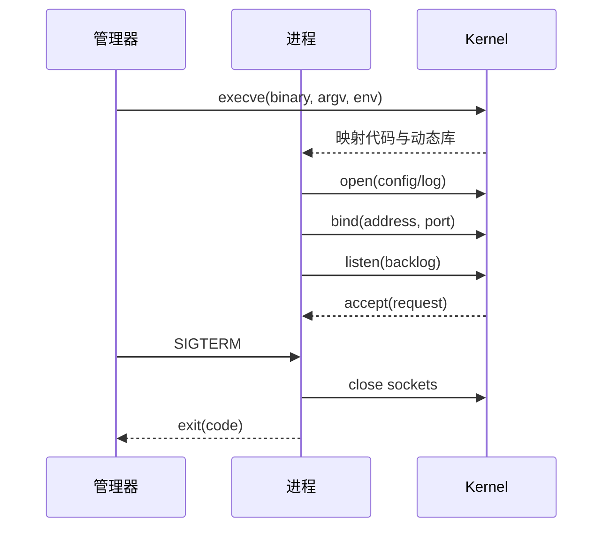

# Linux 服务运行：进程、资源、信号与证据化排障

服务日志写着“启动成功”，端口却没有监听。先别急着重启。一个 Linux 服务从执行文件被载入，到读取配置、打开日志、绑定端口，再到收到 SIGTERM，有一条可以逐段验证的生命周期。排障的重点不是记住更多命令，而是确认进程到底走到了哪一步。

## 从 execve 到 listen，中间发生了什么



execve 成功只代表内核载入了程序。配置文件可能在之后读取失败，日志目录可能不可写，bind 可能遇到地址冲突，listen 之后还可能被防火墙或代理挡住。把“进程存在”当成“服务可用”，正是很多启动故障的来源。

## 端口和权限怎样形成故障

端口冲突表示已有套接字绑定相同地址与端口。先找出 PID，再确认它是旧实例、健康实例还是来源不明的进程。不要直接结束它，因为这可能把另一个正式服务当成残留进程。

权限问题要检查执行用户、文件所有者、目录每一级的搜索权限、挂载模式和安全策略。进程能读取配置文件，不代表能写日志目录；能绑定高端口，也不代表能绑定特权端口。把服务改成 root 只会扩大攻击面并隐藏错误的所有权设计。

```bash
ss -ltnp 'sport = :8080'
ps -o pid,ppid,user,stat,cmd -p <PID>
namei -l /var/lib/ai-service/config.yaml
ls -ld /var/log/ai-service
lsof -p <PID> | head
```

第一条命令回答“谁占着端口”，第二条确认进程身份和父进程，namei 会逐级展示路径权限，lsof 则能看出配置和日志是否真的被打开。输出是诊断证据，不是修复动作。

## 资源压力会伪装成应用错误

| 现象 | 需要核对的证据 | 不要先下的结论 |
| --- | --- | --- |
| 启动后立即退出 | journal、退出码、dmesg、内存与磁盘 | 一定是代码 bug |
| 请求偶发卡住 | fd 使用量、线程数、listen 队列、上游延迟 | 一定是网络慢 |
| 日志突然停止 | 进程状态、磁盘 inode、日志轮转、OOM 记录 | 进程一定还活着 |
| SIGTERM 后迟迟不退 | 子进程、阻塞 I/O、连接排空和 deadline | 只能 kill -9 |

文件描述符耗尽时，新的连接和日志文件都可能打不开；内存压力下，内核 OOM Killer 可能在应用来得及记录前结束进程。证据要来自多个视角，单行应用日志不能覆盖内核和资源管理器的事实。

## 优雅退出不是“收到信号就结束”

服务收到 SIGTERM 后通常要停止接收新请求、标记自身不再就绪、等待正在执行的请求到达边界，再关闭数据库和网络连接。超时后才需要更强的终止信号。若 PID 1 是一个没有转发信号的 shell，容器里真正的业务子进程可能根本没收到 SIGTERM。

::: warning
**容易误判**

看到进程还在并不表示它能接收流量；看到退出也不表示它是故障，退出码、最近一次状态转换和上游重试要一起看。
:::

## 把排障写成证据链

每次记录时间、命令、关键字段和结论，例如“12:03 bind 失败，端口被旧 PID 4312 占用；4312 的父进程是 systemd，不能直接杀”。这样下一位工程师可以复核，而不是重新猜一遍。下一篇会沿着请求离开机器的路径，解释服务监听成功后为什么仍可能无法访问。

## 把系统调用错误翻译成下一步

日志里的 Permission denied、Address already in use、Too many open files 不是三个抽象错误，它们分别对应 open、bind、accept 或创建文件描述符时内核返回的 errno。应用框架会把 errno 包装成异常文本，排障时仍要回到失败的系统调用、目标路径或地址、执行用户和资源限制。

例如 bind 失败先核对地址族和监听地址，0.0.0.0:8080 与 127.0.0.1:8080 的冲突范围不同；open 日志失败要看目录每一级是否有 x 权限；EMFILE 则要区分进程的 ulimit 与系统全局 file-max。这样处理不是更“底层”，而是避免对症状做错误修复。

## 观察顺序比命令数量重要

先确认服务管理器认为它是什么状态，再确认进程是否存在，再确认监听和文件资源，最后才看业务请求。这个顺序避免把失败的服务当成网络问题，也避免在端口已经正确监听时反复改启动参数。

一次观察最好在同一时间窗口内完成。进程可能在你查看端口前退出，OOM 记录也可能被新的启动覆盖。对短暂故障，保留 journal、核心指标和退出码，比现场反复重启更有价值。
