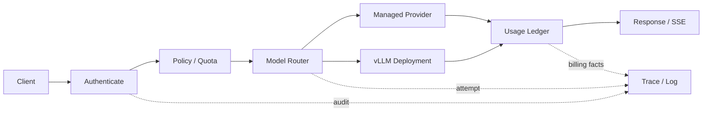

# LLM Gateway：统一入口不等于转发 JSON

业务请求模型 `analysis-large`，网关把它路由到供应商 A。A 超时后，网关自动重试供应商 B，最终返回成功，但两边都产生了用量。若系统只保存最终 200，就无法解释成本、重复生成和超时期间发生了什么。

LLM Gateway 位于业务应用与模型供应者之间。它接收稳定的内部契约，确认身份与预算，按能力和策略选择 Deployment，传播 Deadline，记录每次 Attempt，最后把供应商响应映射为统一终态。

## 网关的数据流



外部 API Key 映射为服务端主体、租户、允许模型和预算。客户端可以请求公开模型标识，却不能直接选择供应商凭证、内部 endpoint 或计费分组。路由输出的是具体 Deployment 与 Attempt 配置，并留下规则版本。

## API Key 与租户 Scope

API Key 数据库只保存不可逆哈希或受控凭证材料，明文只在创建时展示。Key 关联主体、租户、状态、到期、模型权限、速率和预算。撤销与权限变更需要使缓存及时失效。

认证回答“你是谁”，授权回答“你能调用什么”。模型访问还可能受地域、数据敏感度、供应商条款和业务环境限制。权限应在路由前完成，并贯穿缓存与用量记录。

## 模型路由使用稳定能力

业务模型名不应等同某个供应商 model string。Registry 为它声明任务、上下文、多模态、工具、结构化输出、地域、质量等级和成本档位，再绑定一个或多个 Deployment。

路由输入至少包含租户 Scope、公开模型、所需能力、数据策略、剩余 Deadline、预算和候选健康。输出包含选中 Deployment、规则版本和原因。随机负载均衡可以是最后一步，但不能替代前面的硬约束。

## 一个确定性路由核心

下面 Python 只演示路由所有权，不调用真实模型。输入是不可变请求上下文和候选 Deployment；处理先过滤硬约束，再按优先级与成本排序；输出包含选择原因。身份和预算由服务端构造，不从模型输出读取。

```python
from dataclasses import dataclass

@dataclass(frozen=True)
class RouteRequest:
    tenant_id: str
    public_model: str
    required_capabilities: frozenset[str]
    allowed_regions: frozenset[str]
    max_unit_cost: float

@dataclass(frozen=True)
class Deployment:
    name: str
    public_model: str
    capabilities: frozenset[str]
    region: str
    unit_cost: float
    priority: int
    healthy: bool

def select_deployment(
    request: RouteRequest,
    deployments: list[Deployment],
) -> Deployment:
    # 硬约束必须在排序前完成，不能用低成本覆盖权限或能力。
    candidates = [
        item
        for item in deployments
        if item.healthy
        and item.public_model == request.public_model
        and request.required_capabilities <= item.capabilities
        and item.region in request.allowed_regions
        and item.unit_cost <= request.max_unit_cost
    ]
    if not candidates:
        raise LookupError("no eligible deployment")

    # 稳定排序让相同输入得到可解释选择。
    return min(candidates, key=lambda item: (item.priority, item.unit_cost, item.name))
```

函数不会访问全局变量，输入相同就能复现决策。`required_capabilities <= capabilities` 表示候选必须覆盖全部所需能力。排序只在通过硬约束后发生。生产系统还会加入容量、熔断、权重与亲和性，但每个信号都要记录来源和更新时间。

## 限流、配额和准入

速率限制控制时间窗口内请求或 Token，配额控制一段周期总量，准入控制当前有限资源槽。三者作用不同。一个请求虽然没超过每分钟次数，仍可能因为长上下文占用大量 GPU 和输出预算。

可按请求、输入 Token、最大输出、并发和模型档位组合计权。服务端先校验最大值，再原子预留预算。结束后用最终 Usage 结算并释放并发槽；失败或取消也必须进入释放路径。

## Usage 与成本账本

记录 Request 与 Attempt 两层：Request 表示用户一次意图，Attempt 表示对某个 Deployment 的一次实际调用。每次 Attempt 保存供应商 request ID、开始、接受、首事件、终态、输入/输出 Token 和价格版本。

预估 Token 用于准入，最终 Usage 用于结算。两者差异要保留，不能覆盖。成本由 Usage、供应商、模型、缓存命中和价格版本确定；自托管模型还需要 GPU 时间、闲置与平台成本，但不能用没有测量依据的数字填账。

## 流式透传与错误映射

网关必须逐事件转发并处理背压，不能把整段输出缓存在内存。客户端断开后向下游取消，仍等待最终用量或将 Attempt 标为未知。不同供应商的完成、拒绝、工具调用和错误事件要映射到内部联合类型，再转换为对外协议。

未知模型、权限拒绝和输入超限不重试；连接前失败或明确未接受可能有限重试；已接受且结果未知时默认不盲目重试。Failover 只有在数据策略、能力、剩余 Deadline 和幂等边界都满足时才允许。

## 网关不应该承担什么

它不保存完整对话业务状态，不运行 Agent 循环，不决定 RAG 文档权限，也不替代 Serving 调度。Gateway 可以传递稳定的 Turn ID、Scope、Deadline 与模型能力，但领域状态由 Runtime 和业务服务拥有。

验收网关要覆盖撤销 Key、跨租户、未知模型、能力不匹配、限流、预算不足、流式取消、供应商拒绝、结果未知、Failover 和用量对账。只有每种终态都能解释选择、资源与费用，统一入口才真正降低了多模型复杂度。
