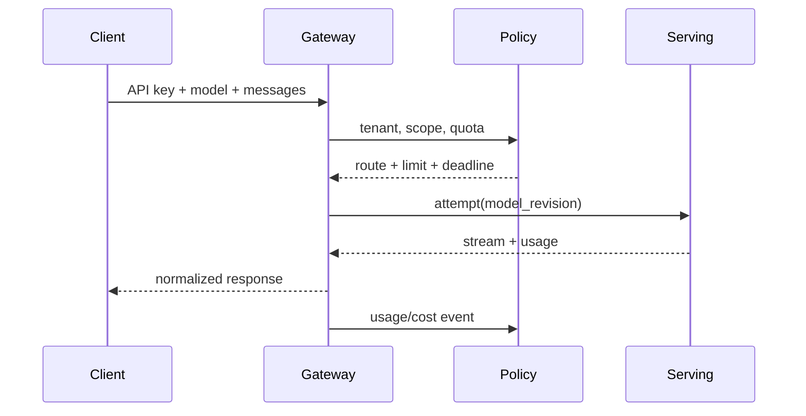

# LLM Gateway：API Key、路由、限流、Token 与成本

调用方只传入 model=gpt-like，网关却把请求重试到另一个模型，最后账单和用户看到的模型不一致。LLM Gateway 不是普通反向代理，它必须同时持有身份、路由、预算、重试和用量的确定性状态。

## 一次请求如何被网关接纳



网关先解析 Key 和租户范围，再把公开模型名解析到一个具体 Revision。每次 attempt 都要有独立 ID，重试只能在请求无副作用或明确可重放时发生。Token 统计和成本以 Serving 返回的 usage 与计价版本为准，不能只按字符数猜。

## 限流、预算和重试的顺序

| 步骤 | 状态 | 失败语义 |
| --- | --- | --- |
| 认证 | key、租户、作用域 | 401/403，不进入模型 |
| 准入 | 并发、Token 预算、模型能力 | 429 或 400，给出可行动原因 |
| 路由 | Revision、区域、健康 | 503/424，不能悄悄换能力 |
| 执行 | attempt、deadline、取消 | 504 或流内错误 |
| 结算 | input/output token、价格版本 | 可重放的 usage 事件 |

把限流放在模型调用之后会浪费 GPU，把计费放在客户端断开之后才处理会丢失证据。所有状态转换要带 request_id、attempt_id 和 policy_version。

## 错误契约要稳定

```json
{"error":{"type":"rate_limit_exceeded","code":"tenant_concurrency","message":"too many active generations","request_id":"req_123","retry_after":2}}
```

这是解释性输出，字段名应由平台统一。客户端需要知道是否可以重试、等待多久以及请求是否已产生费用。不要把上游供应商的原始错误直接暴露给调用方，也不要用一个“模型错误”掩盖认证和策略失败。

## 成本是路由输入，不只是报表

路由可以根据租户预算、模型能力、上下文长度和实时价格选择候选，但降级必须保持能力契约。长上下文请求被切换到便宜模型，可能改变质量和工具调用能力，调用方应能看到实际 model_revision。下一篇把这些 Revision 和健康状态放进多模型控制面。

## 重试要保留 Attempt 历史

连接失败、上游 503、模型超时和客户端断线的重试条件不同。网关应为每次上游尝试生成 attempt_id，记录选中的 Revision、开始/结束、错误和是否收到任何 Token。客户端的 idempotency key 则防止同一业务请求在多次提交后被重复计费。

流式请求一旦已经向客户端输出 Token，就不应静默切换到另一模型继续生成，因为上下文、风格和 usage 都会不一致。此时应结束当前流，明确错误和已生成部分的结算语义。

## 路由决策需要可解释记录

同一个公开模型名可能对应多个供应商或自托管 Revision。每次请求记录候选集合、最终选择、排除原因、policy_version 和 fallback 条件，事后才能解释为什么某个租户被路由到某个成本或区域。

这份记录不应包含完整 Prompt 或 Secret。保留模型能力、上下文档位、健康快照和预算判断就足以复盘路由。没有可解释记录的智能路由，遇到质量或计费争议时很难审计。
