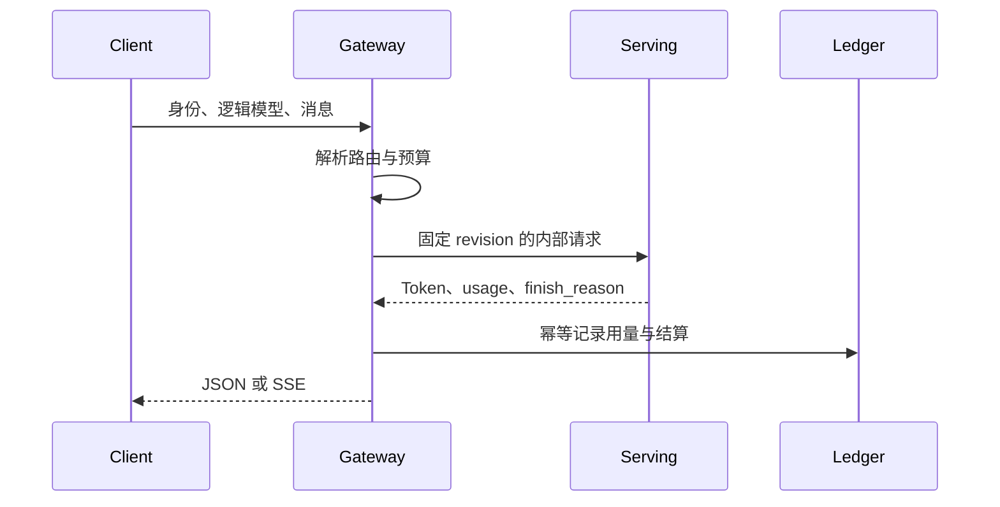

# LLM Gateway 是什么？一个模型请求怎样完成鉴权、路由和计费

模型服务解决“给定 Token 和参数，怎样生成结果”。企业应用还要解决谁能调用、能调用哪个模型、一次请求最多花多少、模型不可用时是否切换、流式断开后如何退款，以及管理员如何知道哪位租户消耗了多少。把这些逻辑直接塞进每个 vLLM 或 FastAPI 进程，规则会在多个副本之间漂移，升级模型时也难以统一。

LLM Gateway 是位于客户端与模型 Serving 之间的请求协调层。它接收外部协议，验证身份和策略，选择后端，把请求状态和用量记录下来，再把完整或流式响应返回。它不负责执行 Transformer Kernel，也不应该直接修改模型内部的 KV Cache。本文使用一个抽象 HTTP Gateway 说明职责，示例配置不代表某个厂商的完整产品。

::: info LLM Gateway 的准确含义

LLM Gateway 是面向大模型调用的入口服务，负责鉴权、请求规范化、模型路由、配额、超时、重试、流式转发、审计和计费等跨模型策略。后端可以是 vLLM、云 API、专用模型服务或备用模型。

Gateway 不等于 Nginx。Nginx 能做连接、TLS 和基础反向代理，Gateway 还要理解模型名、Token 用量、租户策略和生成状态。Gateway 也不等于模型引擎，不能替代后端的模型加载和 GPU 调度。

:::

## 客户端、Gateway 和 Serving 的边界怎样划分

客户端提交模型标识、消息、采样参数和请求 ID。Gateway 接收外部身份与租户上下文，校验请求格式、模型允许范围、Token 上限和预算，再把内部请求发给一个具体后端。Serving 接收已授权的内部请求，执行 Tokenize、调度、生成和响应编码。

外部 API Key 不应直接传给 Serving。Gateway 把外部 Key 映射为租户、项目、角色和计费账户，向后端使用内部服务身份。后端只需要确认调用来自受信 Gateway，并可用自己的最大上下文和并发限制做最后防线。

模型别名也由 Gateway 管理。客户端请求 `chat-default`，路由表把它映射到固定的模型 Revision、部署实例和协议适配器。模型文件路径、Adapter 路径和 GPU UUID 不能由客户端传入，避免把本地资源暴露成远程参数。

状态边界要提前定义。Gateway 维护外部请求状态、路由尝试、配额预留和账务幂等键；Serving 维护推理请求、排队、KV Cache 和生成完成。两边通过 request ID 和事件更新关联，不能让 Serving 直接写用户余额。

Gateway 还可能连接策略、模型目录、租户账本和可观测性系统。外部依赖失败时，Gateway 要决定拒绝、降级或使用已缓存规则。Serving 停止后，Gateway 的健康状态也要在合理时间内反映，而不是继续返回“服务在线”。

LLM Gateway 可以理解为 AI 请求的协议和责任边界。它接收外部身份和业务请求，把逻辑模型名解析成一个已登记的部署，把限流、预算、取消和用量事件传给后端。它与 Nginx 这类通用反向代理的区别是，Gateway 理解模型能力、Token 额度和账务幂等；它与 Serving 的区别是，Gateway 不拥有 GPU 上的 KV Cache，也不替模型生成文本。

例如用户请求 `chat-default`，Gateway 先读取租户策略和当前路由快照，预留输入预算，再把固定 revision 和 request ID 发给 Serving。Serving 返回部分 Token 后，Gateway 透传 SSE；客户端中断时，Gateway 发送取消并记录已产生的 usage。路由成功、生成成功和结算成功是三个不同状态，不能因为 HTTP 连接返回 200 就把费用标成已结算。

::: info Gateway 的最小输出

一次转发至少要能追溯到 tenant、request、route revision、backend attempt、usage、finish reason 和 billing state。字段由 Gateway 生成或从可信后端取得，客户端不能直接提交最终费用和模型实例身份。

:::



图里的每个箭头都有不同失败语义。路由表不可用时可以拒绝新请求，Serving 超时不应盲目重试有副作用的调用，Ledger 写入不确定时要保留 pending 状态等待对账。这个模型比“统一转发接口”更能解释 Gateway 的工程价值。

## 鉴权、授权和租户上下文怎样进入请求

鉴权回答“这个凭证是谁的”，授权回答“它能调用什么”。API Key、OAuth2、mTLS 或工作负载身份都可以作为凭证来源。Gateway 验证签名、过期、撤销和来源，再从自己的权限存储读取租户与项目。错误响应要区分缺少凭证、凭证无效和权限不足，但不泄露内部模型列表。

租户上下文至少包含 tenant ID、project ID、subject、允许模型、并发配额、Token 预算和审计标签。它进入内部请求的 Metadata 与日志，不要把完整秘密放在 Prompt 或模型消息中。后端服务只信任 Gateway 注入并受网络策略保护的上下文。

Key 轮换要支持重叠窗口。新 Key 生效后，旧 Key 在明确期限内撤销；缓存的鉴权结果要有短 TTL 和主动失效。把 Key 哈希或指纹写入日志，不记录完整值。测试使用临时凭证，结束后删除并确认缓存失效。

授权策略不能只按模型名。项目可能允许某模型但限制最大上下文、工具调用、数据区域或是否写入日志。策略改变后，正在运行的请求是否继续由业务规则决定，不能让一次配置刷新中途改变账单归属。

内部服务身份也要最小权限。Gateway 只允许调用已登记的 Serving Service，Serving 不获得写租户账本的权限。管理员读取 Prompt 内容、查看原始日志和导出账单应分开授权，敏感数据访问要有审计。

## 模型路由怎样从逻辑名选到具体实例

路由表把逻辑模型名映射到后端候选。每个候选包含 endpoint、模型 Revision、协议能力、区域、权重、最大上下文、健康状态和成本标签。路由前先过滤协议不兼容、未 Ready、超过租户区域或不支持参数的候选，再按权重、负载或优先级选择。

简单主备路由在主后端返回明确不可用时切换备用。超时、连接失败、5xx、模型拒绝和客户端取消不能一律重试。已经产生 Token 的流式请求切换会造成重复输出；非幂等工具调用也不能因为网络超时再次执行。

版本切换可以使用权重、租户白名单、请求头或实验分组。分组键要稳定，避免同一会话在不同版本之间跳动。路由日志保存逻辑模型、候选 Revision、实例 ID 和选择原因，管理员才能解释一次请求为什么去了某张 GPU。

负载路由可使用队列长度、running 序列、估计 Token 成本和实例容量。仅按 CPU 或连接数选择会把长 Prompt 集中到一个实例。Gateway 与 Serving 的指标时间窗不同，路由要容忍短暂延迟并设置过载保护。

模型能力协商很重要。一个后端可能支持 Chat Template，另一个只支持 Completions；工具调用、视觉输入、JSON Schema 和流式事件格式也可能不同。Gateway 负责规范化或拒绝，不应把不兼容请求静默转成另一种语义。

## 配额、限流和预算怎样把请求控制在可承受范围

限流限制一段时间内允许的请求或 Token。并发限制控制同时运行数量，队列长度限制等待工作，Token 预算限制输入加最大输出的成本。四种限制解决不同风险，不能只设置每分钟请求数。

令牌桶适合平滑速率，漏桶适合稳定出流，信号量适合并发。分布式 Gateway 需要共享计数或按实例分片并明确误差。Redis 之类的状态存储只记录计数和过期时间，不应把完整 Prompt 放进限流 Key。

预算要区分预估和实际。请求进来时可以按输入 Token 和 `max_tokens` 预留额度，完成后按实际 usage 结算并退回未用部分。流式中途取消按已生成 Token 结算，预留未用部分释放。后端没有可信 usage 时，必须声明计费近似和风险。

租户之间还要有公平队列。一个大租户不能把共享实例的 waiting 队列填满，导致小租户永远超时。可以按 tenant 分桶、设置最大活跃序列和每租户 Token 速率，具体策略要和产品合同一致。

限流错误应是稳定的 429 或明确预算拒绝，而不是让请求进入 GPU 后 OOM。错误包含 retry-after 或可读原因，不返回内部队列长度和设备信息。观测要记录拒绝发生在鉴权、配额、路由还是后端。

## 超时、重试和取消怎样避免副作用

一次请求至少有连接超时、排队超时、首 Token 超时、总 Deadline 和后端请求超时。Gateway 把剩余 Deadline 传给后端，后端在自己的队列和生成循环中检查。只在 HTTP 客户端设置一个 60 秒超时，无法知道请求卡在连接、排队还是 Decode。

重试需要判断请求是否安全。连接在发送请求前失败，可以重试；请求已被后端接受但响应丢失，非流式可能已经扣费和产生副作用，重试会重复执行。工具调用、写数据库和外部 API 必须使用幂等键或由 Agent Runtime 负责补偿。

客户端取消时，Gateway 收到断开事件，标记外部请求 canceled，并向后端发送 abort。后端确认停止后，Gateway 结算已生成 usage、释放预留并写终态。如果取消消息丢失，定时器需要回收悬挂状态，但要避免在后端仍执行时重复退款。

超时不等于后端停止。Gateway 连接关闭后，后端请求可能继续占 GPU。健康与容量指标要关联取消传播和 running 回落。若后端不支持取消，平台要设置小的最大生成和隔离队列，不能对用户承诺即时停止。

状态机要禁止终态反复变化。`accepted -> running -> completed`、`accepted -> rejected`、`running -> canceled` 和 `running -> failed` 是不同路径；`completed` 后收到迟到取消不能再次退款。状态存储使用版本或条件更新，避免多个 Gateway 副本同时结算。

## SSE 流式响应怎样穿过 Gateway

Serving 通过 SSE 发送一系列事件，每个事件可能包含增量 Token、usage、finish reason 或错误。Gateway 要保持 `text/event-stream`、正确的换行和 flush，不能把所有事件缓存到完整响应后再返回。代理还要配置读取超时、缓冲和连接关闭传播。

客户端看到首 Token 不代表请求完成。Gateway 要记录首 Token 时间、最后事件、完成标记、字节数和断开原因。正常完成有明确 finish reason，后端错误和客户端取消要有不同终态。连接异常时，已输出文字不能被当成可安全重试的完整答案。

流式 usage 可能只在最后事件出现，也可能由独立统计接口返回。Gateway 需要在后端断开后读取可用 usage，按保守规则结算并标记是否精确。没有 usage 时不应假装精确到 Token，可以按合同采用估算并在账单说明。

多个后端协议需要适配。OpenAI 风格 SSE、云服务事件流和自研 JSON 行协议的结束标记不同。适配器把它们转换为内部事件，不要让路由层散落格式判断。解析错误应停止转发、记录原始事件的脱敏摘要并释放后端请求。

流式测试要覆盖首 Token 慢、后端中途 5xx、客户端取消、代理 idle timeout、最后 usage 丢失和重试误用。桌面浏览器能看到文本，不代表命令行、移动网络和反向代理都保持事件顺序。

## 计费怎样从 usage 变成一笔幂等账务

计费事件至少包含业务 request ID、tenant、model revision、input tokens、output tokens、价格版本、货币、状态和时间。Gateway 先写预消费或预算锁，再在完成、取消或失败时结算。数据库唯一键保证同一个终态事件重复到达不会重复扣费。

价格版本必须随请求固定。请求执行期间修改模型价格，不应改变已经接受的账单。模型别名切换时，账单记录实际 Revision 和逻辑名。失败退款按“预留已释放、实际已用是否收费”合同处理，不能由 HTTP 状态码单独决定。

流式中途错误可能已经生成 Token。结算要使用后端记录的实际 usage 或明确的估算边界。客户端重连得到新 request ID 时，不能把两次输出自动拼成一次账单。幂等键可以来自客户端，也可以由 Gateway 在接受时生成并向下游传递。

账单写入失败时，Gateway 不应静默返回成功。可以把推理结果和计费事件写入可靠队列，状态标记为 pending_settlement，并由后台重试。队列重放要按唯一键更新。Serving 不直接操作账本，避免模型后端故障拖住余额事务。

审计需要保存策略决策、路由候选、预留、实际用量和终态变更，但 Prompt 内容默认不写。管理员查询账单时只返回允许范围内的租户和模型字段。删除用户数据不能删除财务必需的最小事件，保留期限和脱敏规则要分开。

## 观测和安全怎样覆盖 Gateway 的真实责任

Trace 从外部 request ID 开始，至少有鉴权、配额、路由、后端排队、首 Token、流式发送和结算 Span。Metric 记录请求率、429、5xx、TTFT、TPOT、总时延、Token、队列和取消。Log 记录结构化状态、模型 Revision、实例和错误类别。

Prompt、输出、Key 和内部 URL 不默认进入 Log 或 Trace。需要质量分析时，使用采样、哈希、权限隔离和短保留。Metrics 标签不要把完整 Prompt 或用户 ID 当高基数值，否则监控系统本身会产生成本和泄露。

Gateway 只允许内部网络访问 Serving，服务间使用 mTLS 或工作负载身份。请求体限制、JSON Schema、Header 清理和 SSRF 防护要在路由前完成。模型后端错误不能把文件路径、GPU UUID、堆栈和环境变量返回客户端。

管理面和数据面分开。修改模型路由、价格、租户配额和 Key 的接口需要更强授权、审批和审计，不能共用普通推理 Key。配置发布使用版本和回滚，网关副本更新时保持旧规则可恢复。

安全事件与容量事件也要区分。Key 泄露需要撤销和审计，模型超载需要限流和扩容，后端漏洞需要隔离和修复。一个统一的“服务异常”告警无法告诉值班人员该采取什么动作。

## 请求规范化怎样保护后端协议

客户端消息可能使用 Chat Completions、Responses、Embedding 或自定义 JSON。Gateway 先校验必填字段、数组结构、参数类型、最大长度和不允许的字段，再转换成内部 Request。内部 Request 固定 request ID、tenant、model revision、输入消息、采样参数、deadline 和取消句柄。

规范化不是把所有协议强行变成同一种语义。Responses 的工具调用、并行工具、图片输入和事件类型，可能无法无损转换成只支持文本 Chat 的后端。适配器要声明能力矩阵，不能删除字段后静默继续。

采样参数也有边界。`temperature`、`top_p`、`max_tokens`、停止词和 JSON Schema 由模型与引擎共同支持。Gateway 可以限制范围并记录最终生效值。客户端发送未知参数时返回清楚的 400，比后端随机忽略更容易排查。

输入 Token 估算要使用与后端相同的 Tokenizer Revision，或者明确估算误差。用字符长度替代 Token 只适合粗略拒绝，不能直接作为精确计费。图片、工具结果和隐藏系统消息也要进入成本计算，但原始内容不必写进日志。

规范化失败不应创建后端任务或预扣费用。成功规范化后才进入授权、配额和路由。内部请求在每一次重试中保持原始业务 request ID，并为每个后端尝试生成 attempt ID，方便区分一次调用和多个网络尝试。

## 区域、成本和数据边界怎样影响路由

后端候选可能位于不同区域、网络域或供应商。路由先按数据驻留、租户允许区域和模型版本过滤，再比较健康、队列、价格与延迟。距离近的后端不一定最便宜，最便宜的后端也不一定支持请求能力。

跨区域切换会改变数据处理边界。Gateway 需要知道 Prompt 是否允许离开区域，日志和 Trace 是否跨境，备用模型是否具有同等数据处理合同。把“主后端失败就去海外”写成无条件重试，会产生合规和用户承诺问题。

成本路由不能只看每百万 Token 单价。长 Prompt 的输入价、输出价、最低计费、缓存命中、网络、GPU 空闲和失败重试都会影响总成本。Gateway 使用价格版本和实际 usage 结算，路由选择只使用可解释的估计，不把未验证的节省写成事实。

多区域流量还要考虑会话粘性与缓存。相同会话固定到一个 Revision，可以提高 Prefix Cache 命中；跨区域切换后缓存未命中，TTFT 可能上升。状态不应只存在某个 Gateway 内存里，取消和账务事件需要共享可靠存储。

区域故障演练要验证 DNS、负载均衡、路由规则、凭证、模型制品和账务都能切换。只把健康 URL 换成另一个区域，不代表模型已经加载或租户有权访问。切回也要等旧区域 Drain 并确认没有重复结算。

## Gateway 配置怎样安全发布和回滚

路由、价格、租户配额和后端地址都是运行配置，不应在每个进程手工编辑。配置存储有版本、Schema、审批和审计，Gateway 启动时读取一个完整版本，运行时通过原子指针切换。半份配置不能被某些副本看到。

发布前做静态检查：模型逻辑名唯一，权重非负且有候选，价格覆盖所有可计费 Revision，超时关系合理，区域和权限引用存在。再用临时租户做成功、拒绝、主备和取消测试。配置有未知字段或删除现有模型时，发布直接失败。

灰度可以按 Gateway 副本、租户、请求头或稳定哈希分配。新配置先接合成请求和内部租户，观察 401、403、429、后端错误、Token、TTFT 和账务事件。权重从 0 到小比例逐步增加，任何回归都能把配置指针切回旧版本。

回滚只恢复路由和策略版本，不自动恢复已经产生的账单。账务事件按 request ID 继续处理，旧配置也要能识别新 Revision 的已完成请求。模型候选不可用时，回滚路由前先确认旧 Serving 仍 Ready，不能把流量切到已删除实例。

配置缓存和多副本一致性要有 TTL、版本号和失效通知。一个副本仍使用旧价格，另一个使用新价格，会造成同一时间窗口结算不一致。请求接受时把价格版本写入状态，后续只按该版本结算。

## Gateway 的合同测试怎样覆盖真实边界

合同测试先验证请求和响应 Schema，再验证状态语义。固定模型名、消息、参数和 usage，检查非流式 JSON、SSE 事件、finish reason、错误码和 Header。后端用明确标记的测试替身时，只能证明 Gateway 转发和状态机，不能证明真实模型或供应商行为。

真实候选至少覆盖一个已登记 Serving。用小 Prompt 验证模型 Revision、Tokenizer、流式结束和取消，使用临时租户与最小额度。连接后端前失败、后端排队超时、首 Token 超时、生成中断和账务写入重试分别注入，观察状态是否只终结一次。

并发测试按 Token 和租户配额生成，不只发相同短请求。检查限流响应、Retry-After、队列有界、其他租户公平性和 GPU running 回落。压测不使用生产真实 Prompt，不把未测吞吐写进容量结论。

安全测试包括无 Key、过期 Key、越权模型、任意 URL、过大请求、重复 request ID、内部 Header 伪造和日志脱敏。任何一个通过都不能让客户端访问 Serving 内部地址或读取另一个租户的账单。

测试报告保留输入、状态变化、后端调用顺序、输出、失败证据和验证断言。只截图一个 200 响应，无法证明取消传播、重复扣费或错误路由没有发生。

## 一份 Gateway 配置怎样表达路由和预算

下面的 YAML 是解释性配置，字段名称不是某个现成产品的保证。它展示逻辑模型、后端 Revision、租户规则、超时和计费价格怎样分开，真实实现应由 Schema 校验并保存版本。

```yaml
models:
  chat-default:
    candidates:
      - id: serving-a-v3
        endpoint: http://serving-a.default.svc:8000
        revision: model-2026-08-18
        weight: 100
        max_context: 8192
    protocol: openai-chat
tenants:
  demo-project:
    allowed_models: [chat-default]
    max_concurrency: 4
    tokens_per_minute: 20000
    billing_account: wallet-demo
timeouts:
  queue_ms: 3000
  first_token_ms: 10000
  total_ms: 120000
pricing:
  model-2026-08-18:
    input_per_million: 1.0
    output_per_million: 2.0
```

模型配置说明候选与实际 Revision，租户配置说明权限与 Token 配额，超时配置说明不同阶段，价格配置绑定模型 Revision。配置加载时要拒绝未知字段、负数权重和不存在的后端。修改模型权重不应半成功，使用原子版本切换。

静态验证可用 YAML Schema、重复 ID 检查和价格计算单元测试。候选环境要用临时租户发成功、拒绝、流式取消和后端故障请求，检查路由、计费和日志。示例没有真实密钥，也没有宣称已接入某个模型。

## 一个请求怎样完整经过鉴权、路由、生成和结算

输入是租户 `demo-project` 的临时 Key、逻辑模型 `chat-default`、1000 Token Prompt 和最大输出 200。Gateway 验证 Key，读取允许模型和 Token 预算，创建 request ID，按 Revision `model-2026-08-18` 选择 Ready 后端，预留最多 1200 Token 的预算。

请求进入后端 waiting 队列，Engine 完成 Prefill 和 Decode，SSE 发送增量事件。Gateway 记录首 Token、每个事件和客户端连接状态。客户端在生成 80 Token 时断开，Gateway 发送 abort，后端确认请求 canceled，usage 记录实际输入 1000、输出 80，未用预留额度释放。

如果路由前 Key 已过期，请求得到 401，不创建后端请求，也不产生账务事件。如果后端在接受前连接失败，Gateway 可以选择另一个健康候选；如果已经发送过 Token 后连接断开，不能无条件切换并拼接，应该返回不完整错误并按实际 usage 结算。

账务服务收到 `request_id + terminal_state` 唯一事件，按价格版本计算金额并提交。重复投递同一事件只更新处理时间，不重复扣费。验证查询包括外部响应、Serving 取消日志、GPU running 回落、账单行和余额变化，五者用同一 request ID 关联。

推演的最后发一个超出租户 Token 配额的请求。Gateway 在配额层返回 429 或预算拒绝，Serving 没有 waiting 记录，GPU Cache 不增长。这个失败证据证明限额发生在正确边界。当前文档未在真实 Gateway、Serving 和账务系统执行，具体状态码、usage 字段和延迟需要按实现补测。

还要验证 Gateway 自己重启。重启前已接受的请求状态不能只存在内存，恢复后要能查询后端终态、继续或标记结算；未接受的请求可以返回明确重试错误。多个副本同时收到同一个客户端重试时，request ID 和数据库条件更新仍应只产生一笔账单。

Gateway 的成功定义因此包含协议、权限、路由、资源和账务五个结果，缺任何一项都不能只用 HTTP 200 结案。

值班排查按最后成功状态推进：没有通过鉴权就看凭证，授权通过但没有后端调用就看配额，后端已接收但没有首 Token 就看队列和模型，响应完成但余额不对就看幂等结算。每一层都用 request ID 连接，不把网关日志里的一行 200 当成全部事实。

还要验证路由配置在多副本间一致。把新配置只加载到一个 Gateway，稳定哈希请求可能在旧新规则之间跳动，模型 Revision 和价格也会不一致。候选发布应查询每个副本的配置版本，原子切换后再放流；回滚时同样确认所有副本恢复，并用重复 request ID 检查账务没有因切换而产生第二笔终态。
