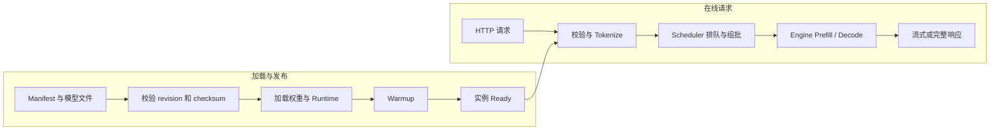

# LLM Serving 是什么？模型文件怎样变成稳定的推理 API

下载一个开源模型仓库后，磁盘上通常只有配置、Tokenizer 和若干权重文件。它们不会自己监听 8000 端口，也不会处理十个用户同时请求。要把这些静态文件变成网络服务，还需要加载模型、分配 CPU 与 GPU 内存、把文本转成 Token、调度推理，并把输出按 API 协议返回。

LLM Serving 负责这段运行过程。它不是模型训练，也不等同于一个 FastAPI 路由。推理引擎理解张量和 KV Cache，调度器决定请求什么时候进入计算，API Server 处理协议和流式响应，加载器确认制品与设备。成熟实现会把这些能力放在一个产品中，理解时仍要按状态拆开。

::: info LLM Serving 的准确含义

LLM Serving 是把已经训练好的语言模型制品加载到计算设备，并通过稳定接口执行在线或批量推理的运行系统。它管理模型生命周期、请求准入、批处理、生成状态、资源和响应。

Serving 不负责产生训练权重，也不自动拥有租户鉴权、套餐和最终计费账本。Gateway 与业务 API 可以位于它前面，训练和模型仓库位于它之前。

:::

## 模型文件为什么还不是模型服务

模型权重保存训练后得到的参数数值，配置描述层数、隐藏维度、注意力头和词表等结构，Tokenizer 文件定义文本与 Token ID 的映射。生成配置可能给出温度、停止 Token 和最大长度默认值。缺少其中一项，加载器可能无法构造与权重匹配的计算图。

这些文件是静态制品，没有运行进程、网络连接和请求队列。把权重放进容器镜像或对象存储，只解决交付位置。Serving 启动后还要读取所有 shard，选择精度和设备，把参数放入主存或显存，并准备 Kernel、内存池和缓存管理器。

同一份权重可以由不同引擎加载，性能和支持能力可能不同。某个模型包含自定义架构代码或新的量化格式，旧引擎可能不认识；引擎支持模型结构也不表示支持其所有 Adapter、工具调用模板和多模态处理。发布前要用明确版本兼容矩阵验证。

模型服务也不等于“模型对象放在 Python 全局变量”。单进程演示可以这样做，但并发请求会争用设备，进程崩溃后没有就绪与恢复，多个 Worker 还可能各加载一份权重。Serving 把设备所有权、调度与协议做成专门运行边界。

例如，一个包含 Config、Tokenizer 和四个 shard 的 7B 模型，只有在所有文件摘要通过、参数形状匹配、设备内存分配完成后，才有资格进入就绪。目录里能看到文件只说明对象存在；Serving 还要创建进程、加载权重、准备调度器、接收请求并在取消后回收缓存。这个过程解释了为什么模型文件、模型实例和模型服务不能用同一个名词代替。

它与训练框架的区别也在内存和生命周期上。Serving 通常不保存反向激活和优化器状态，重点是请求准入、Decode、KV Cache 和响应；训练要为反向传播保留更多状态，并把梯度同步到其他 Rank。选择引擎时要按目标任务、并发和恢复要求验证，不能因两者都调用同一模型类就假定行为一致。

静态文件的可信度影响整个服务。加载前验证 Manifest、revision、每个 shard 的大小与 checksum，Tokenizer 和权重使用同一版本。只记录仓库名和 `latest`，故障后无法确定实际加载了什么，也不能可靠回滚。

## 模型制品是什么，Manifest 应该记录哪些事实

模型制品是可被推理系统加载的一组版本化文件及其描述。它可以来自 Hugging Face revision、训练产物或量化流水线。制品身份通常包含逻辑模型名、不可变 revision、架构、精度、Tokenizer 版本、文件摘要、许可证和构建来源。

Manifest 列出每个必需文件的对象 Key、version ID、大小和 SHA-256。加载器按 Manifest 下载，不用 List 前缀猜当前文件。Manifest 本身需要签名或来自受控发布记录，避免攻击者同时替换文件与摘要。

模型配置中的 `torch_dtype` 或量化字段是加载提示，不一定等于设备实际执行精度。引擎启动日志与运行时指标要记录最终 dtype、量化方法、张量并行度和设备。发布记录把期望配置与实际加载结果对比。

Tokenizer 是制品一部分。相同文本在不同 Tokenizer 下会产生不同 Token 数和 ID，影响上下文、停止条件、usage 与计费。只替换权重不替换 Tokenizer，可能出现输出乱码、越界 ID 或结束不了。Chat Template 也决定消息怎样拼成模型输入。

制品发布状态与对象存在分开。staging 文件全部上传后做静态验证，隔离加载和最小推理通过才标 verified，部署候选读取 verified revision，业务流量只指向 active deployment。失败 revision 保留诊断窗口，不覆盖原 Key。

比如某个 7B 模型有完整 Config、Tokenizer 和四个权重 shard，但其中一个 shard 的摘要不匹配，Serving 应在加载阶段拒绝就绪；“目录里能看到文件”不能跳过这一步。反过来，所有文件都通过校验也不代表请求一定成功，显存、Kernel、最大上下文和调度容量要在候选实例上继续验证。模型制品描述的是输入材料，模型服务还要提供一个能被请求、观测和停止的运行边界。

这也是 Serving 与对象存储的区别。对象存储只回答“某个版本的字节在哪里”，Serving 还要回答“哪个进程拥有这些字节、当前能否接收请求、一次生成占用了多少缓存、取消后是否释放资源”。发布流程把二者用 Manifest 和 deployment revision 连接起来，但不把其中一方的状态假定为另一方的状态。

| 制品字段 | 说明 | 验证方式 |
| --- | --- | --- |
| revision | 不可变模型版本 | 对照仓库提交或发布 ID |
| architecture | 模型结构标识 | 配置与引擎支持矩阵 |
| tokenizer_revision | 文本到 Token 的映射版本 | 固定样本 Token ID 回归 |
| weight_files | 权重 shard 清单 | size、checksum 与完整性 |
| precision | 期望权重/计算格式 | 启动日志、显存与质量测试 |
| chat_template | messages 拼接规则 | Prompt 快照与输出回归 |

表中任何一项变化都可能改变响应。版本登记不能只保存一个模型名称，模型目录要能回答某个实例加载的完整组合。

## 加载器怎样把文件变成内存中的参数

Serving 启动先读取配置，构造模型结构，再打开权重 shard。加载器把文件中的张量映射到模型参数名称，检查形状与 dtype，并按设备规划复制到 CPU 或 GPU。缺少 Key、形状不一致和不支持 dtype 会在这一阶段失败。

大文件下载与读取会经历对象存储、节点网络、本地磁盘、主存和设备互联。日志只显示“loading”太宽泛，应分别记录下载字节、checksum、反序列化、CPU 内存和 H2D 复制时间。瓶颈可能在网络，也可能是本地盘或 GPU 初始化。

Safetensors 等格式允许读取张量元数据并避免 pickle 执行任意代码风险，不能由此推断模型完全可信。自定义模型代码、Tokenizer 和预处理仍可能执行代码。远程代码只在来源受控、revision 固定和隔离环境审查后允许。

多个 GPU 时，加载器按张量并行或流水线规划把参数分片。每个进程只持有部分参数，也要建立通信组。某个 rank 加载失败，整个服务不能 ready；其他 rank 已占显存，需要协调退出与清理，避免残留进程阻止重启。

加载完成不等于首次请求性能稳定。引擎可能编译 Kernel、捕获 CUDA Graph、分配内存池或运行 warmup。就绪应在最小代表性推理成功后再置为 true，warmup 输入又不能超过容量并造成启动探针超时。

## 推理引擎是什么，它与训练框架有什么区别

推理引擎执行模型前向计算并生成输出，不计算训练梯度和优化器更新。它会把 Token ID 转成张量，调用注意力、矩阵乘和采样 Kernel，管理中间状态和设备同步。训练框架还要保存激活用于反向传播、计算梯度并更新参数，内存和通信需求不同。

通用 PyTorch 可以执行推理，专用 Serving 引擎会进一步优化批处理、KV Cache、量化 Kernel、并行和内存调度。选择专用引擎不是改变模型语义的保证，相同采样参数下也可能因数值精度、Kernel 或随机数实现出现差异，需要质量回归。

引擎通常分 Tokenize、Prefill、Decode 和 Detokenize 阶段。Prefill 处理全部输入 Token，建立首轮 KV Cache；Decode 每步使用缓存生成下一个 Token。不同阶段计算与内存特征不同，后续文章会展开。这里先明确 Serving 调度的单位不只是整个请求。

引擎支持的最大上下文受模型结构、配置和显存限制。把 API `max_tokens` 调大不能突破部署上限。输入 Token 加最大输出 Token 超过边界时，应在准入阶段返回明确错误，不让请求进入队列后才 OOM。

推理引擎也可能加载 LoRA Adapter、Embedding 模型或多模态编码器。每种能力有独立内存和调度，API 模型名应映射到经过验证的部署能力。不能因为基础权重相同就让任意租户动态加载未审查 Adapter。

## 请求队列是什么，它为什么不是消息队列

Serving 请求队列保存已经到达、等待设备调度的在线推理请求。它通常在进程内存中，生命周期与 Serving 实例相同，目标是毫秒到秒级调度。进程崩溃时请求由客户端重试或 Gateway 处理，不提供后台消息队列的持久 ACK 与死信。

请求进入队列前应完成基本 schema、模型存在、上下文长度和容量准入。无效请求占队列会拖慢正常请求。租户鉴权与额度通常在 Gateway 完成，Serving 仍要验证内部调用身份和参数硬边界。

队列长度只表示等待数量，不表达每条请求成本。一个 32K 输入和一个 20 Token 输入差异很大，调度器更关心 Token 数、KV Cache 块与生成状态。容量指标需要 queued requests、queued tokens、running sequences 和缓存使用量。

队列必须有上限与等待 Deadline。无限接受会在内存堆积，并让客户端超时后仍排队。达到上限时返回过载错误，让 Gateway 按策略选择其他实例或拒绝。盲目重试另一个满实例会形成重试风暴。

取消要能从队列删除未开始请求，也能标记运行序列停止。客户端断开后，API Server 把 request_id 交给 Scheduler；删除 KV Cache 和采样状态后才释放资源。只关闭 HTTP 响应，不处理队列，计算仍会继续。

## 调度器是什么，它怎样决定谁进入下一次计算

调度器读取等待请求和正在生成序列，根据 Token 预算、缓存空间、优先级和公平规则组装下一批计算。传统静态批处理等齐一组完整请求，Continuous Batching 可以在每个迭代加入新请求、移除完成请求，提高设备利用率。

Prefill 请求一次处理许多输入 Token，Decode 请求每轮常处理一个新 Token。把大 Prefill 与大量 Decode 放在一起，可能提高吞吐，却让已有流的下一 Token 等更久。调度策略在首 Token 延迟、每 Token 延迟、总吞吐和公平之间取舍。

先来先服务容易理解，但长请求会占资源很久。按 Token 预算或优先级调度可以保护交互流量，也可能让低优先级离线任务饥饿。企业平台需要租户配额和最大等待，不让一个用户用大量长上下文占满全部 KV Cache。

抢占表示资源不足时暂停或移出某些序列，可能交换 KV Cache 到 CPU、重新计算或直接拒绝。抢占不是免费切换，数据搬运和重算会增加延迟。指标要记录 preemption 原因与次数，避免吞吐看似正常但长请求不断重算。

调度器只掌握本实例资源。多实例路由由 Gateway、负载均衡器或平台控制面决定。入口只按连接数轮询，可能把请求送到 KV Cache 已满的实例；更好的路由读取健康、队列和模型版本，同时防止高频指标造成抖动。

## API Server 怎样把 HTTP 与引擎请求连接起来

Serving API Server 监听 HTTP 或 gRPC，解析模型名、Prompt、采样参数和流式选项。它调用 Tokenizer 得到输入 ID，生成内部 request_id，提交给 Scheduler，并把引擎输出转换成 API chunk。它与业务 FastAPI 可能使用相同技术栈，职责仍不同。

OpenAI 兼容 API 让 SDK 易接入，兼容范围要明确。模型列表、Chat Template、工具调用、usage、错误和取消都可能有差异。Serving 的 API 适合内部推理协议，租户 Key、价格与业务审计通常由 Gateway 包装。

流式响应每次拿到新 Token 或文本增量就产生 SSE 事件。Detokenizer 需要处理字节级 Token 和 Unicode 边界，不能简单逐 Token `decode()` 后拼接。完成原因可能是 stop、length、eos、cancel 或 error，API 要保留区分。

非流式响应也由内部增量累计而成，客户端只在结束时收到完整文本。它仍占用 KV Cache 和调度槽，入口超时要覆盖最长生成。是否返回 logprobs、Token IDs 或中间状态会增加数据和计算，默认只开放必要字段。

API Server 与 Engine 分进程时，需要 IPC 或 RPC。Server 崩溃可能不等于 Engine 退出，Engine 也可能失去请求所有者。Supervisor 要协调生命周期，重启前清理旧 socket、共享内存和设备进程。容器状态只看 API PID 会漏掉 Engine 故障。

## 单卡、张量并行与流水线并行怎样改变 Serving 拓扑

模型权重和运行内存能装进一张 GPU 时，单卡部署最简单。一个 Engine 进程拥有设备与调度器，不需要跨卡同步。多副本可以提高吞吐和故障隔离，每个副本各有一份权重与 KV Cache，Gateway 负责路由。

模型超过单卡显存时，张量并行把同一层的矩阵沿维度切到多张 GPU。每次层计算需要集合通信交换或归约中间结果，设备间带宽与拓扑直接影响延迟。两张 GPU 显存相加能装下权重，不表示任意放置都能高效推理。

流水线并行把不同层放在不同阶段，激活在阶段间传递。在线小 Batch 时可能出现流水线气泡，某些阶段空等。它适合特定模型和硬件规模，不是张量并行不足后的无条件升级。引擎支持哪些组合要看版本。

数据并行在多个副本各放完整模型，独立处理不同请求。训练中的数据并行会同步梯度，推理副本通常不需要每步 AllReduce。平台说“用了四张卡”时，要进一步问是一个四卡张量并行实例，还是四个单卡副本，两者容量、故障域和通信完全不同。

并行进程使用 rank 标识，并通过 NCCL 等通信库建组。所有 rank 要加载同一 revision、采用一致并行参数，任一进程退出都会让整个实例失效。健康检查由协调器汇总，不让只有 rank 0 HTTP 进程存活就报告 ready。

拓扑选择要结合模型显存、KV Cache、TTFT、TPOT、请求长度和副本容错。先用单卡基线得到每请求资源，再评估多卡通信。硬件没有实际验证时，只能标解释性设计，不能给出生产吞吐结论。

## Warmup、Kernel 编译与内存池为什么属于启动过程

引擎首次运行某个形状时，可能选择算法、即时编译 Kernel、加载算子库或捕获 CUDA Graph。第一次请求因此明显慢于后续请求。把用户流量当 warmup，会让首批用户承担编译延迟，还可能在未验证路径触发错误。

Warmup 使用无敏感内容的固定 Prompt，覆盖部署支持的代表性长度、精度和并行路径。只跑一个 Token 的极小输入，未必触发长上下文所需内存与 Kernel；直接用最大上下文又可能让启动过久。候选环境根据真实长度分布选择少量样本。

内存池在启动时预留 KV Cache block、工作区和通信缓冲。预留太少限制并发，预留太多挤压权重或其他进程。引擎通常允许设置设备内存使用比例，它是规划输入，不保证不会 OOM。设备上还有驱动、Context 和不可见碎片。

编译缓存可以跨重启复用，缓存 Key 要包含 GPU 架构、驱动、CUDA、引擎、模型和形状。缓存来自不兼容版本时可能加载失败或产生错误，不能把节点目录当永远有效。发布记录应说明缓存是命中、重建还是关闭。

Warmup 成功只证明固定样本能运行。Readiness 可以据此开启，随后旁路合成请求持续检查。容量压测、长上下文和并发取消属于发布验证，不该全塞进健康探针。探针越重，越可能自己制造拥塞。

## 启动和运行错误怎样回到具体阶段

下载 404 或鉴权失败发生在制品获取，checksum 不同发生在完整性校验，参数形状不匹配发生在权重映射，不支持架构或量化发生在引擎兼容。它们都可表现为容器退出，但修复位置完全不同。启动日志要写阶段码而不只写 traceback 最后一行。

CUDA out of memory 可能在加载权重、分配 KV Cache、Warmup 或请求运行时出现。加载期 OOM 检查模型、精度和并行；运行期 OOM 还要看请求长度、并发、碎片与调度预算。直接减少 `max_tokens` 只影响一部分请求，不会缩小已加载权重。

通信初始化挂起常与 rank 数、设备可见性、网络接口、端口和拓扑有关。一个 rank 日志停在加载，另一个已经等待 collective，必须汇总所有 rank 时间线。只看 HTTP 进程会漏掉根因。超时后协调退出全部进程，留下诊断而不是无限占设备。

运行中非法设备访问或 ECC 错误可能让 CUDA Context 不再可信。继续接请求会产生更多失败，实例应 not ready 并退出重建。单次业务参数错误则只失败该请求，不重启整个模型。错误分类决定故障域。

| 阶段 | 常见证据 | 不应立刻采取的动作 |
| --- | --- | --- |
| 获取制品 | HTTP 状态、对象版本、下载字节 | 删除本地所有模型缓存 |
| 完整性校验 | expected/actual checksum | 覆盖已发布 revision |
| 权重加载 | 缺失参数、shape、dtype、CPU/GPU 内存 | 仅增加代理超时 |
| Runtime 初始化 | Kernel、Graph、通信组日志 | 把实例提前加入流量 |
| 请求调度 | queue、token budget、cache blocks | 无限提高队列上限 |
| 设备执行 | OOM、设备错误、collective timeout | 对所有错误盲目重试 |

表格要求先确认阶段。重启能清空现场和暂时恢复一部分错误，不能说明制品、配置或容量已经修正。每次失败保留 revision、Engine 版本、设备 UUID、阶段和最早错误。

## 候选实例怎样接流量并保留回滚点

新 revision 先启动独立候选实例，不替换当前服务。候选完成制品校验、加载、Warmup、合同测试和受控压力测试，指标单独标记。它使用真实网络与硬件，却不接普通用户流量，避免未就绪实例污染线上队列。

验证通过后可以按小比例或指定测试租户切流。Gateway 记录每个请求实际 deployment_id，比较错误、TTFT、TPOT、Token usage 和质量样本。只比较平均延迟会漏掉长上下文尾部问题，至少看分位数与取消。

旧实例继续保留，模型对象和本地缓存不清理。切流异常时，路由指针回到旧 deployment，不在故障期间重新下载旧权重。数据库 schema、Prompt 和 Gateway 合同若同步变化，还要确保旧 Serving 仍能接受回滚请求。

观察期结束再排空旧实例。先停止新请求，等待在途完成或按规则取消，确认 KV Cache、队列和连接归零，再停止进程。清理只删除无部署引用、非当前和非唯一回滚 revision 的缓存。对象存储权威制品按更长保留策略处理。

发布报告记录新旧 revision、引擎、精度、并行方式、配置摘要、候选验证和回滚入口。模型服务“版本号相同”不足以复现，设备架构和 Runtime 也会改变行为。

## 模型服务与 Gateway、RAG 和 Agent 的边界在哪里

Gateway 面向用户和租户，负责 API Key、模型别名、配额、路由与计费。它把 `smart-model` 映射到具体部署 revision，并选择健康实例。Serving 接收受信内部请求，执行指定模型，不应直接访问用户余额表。

RAG 在调用 Serving 前检索文档、执行权限过滤并构造 Prompt。Serving 只看到最终 Token，不知道某段证据是否授权。模型生成引用也不能证明来源真实，RAG Service 负责保存 chunk 身份和引用映射。

Agent Runtime 多轮调用模型和工具，保存 Turn、Checkpoint 和取消状态。Serving 每次完成一个推理请求，不负责 Agent 的整个任务恢复。Agent 重试模型时要使用新推理 request_id，并把上一次是否取消与计费结果记录清楚。

业务 API 还会执行内容限制、字段转换和产品默认值。Serving 可以提供最大上下文和支持采样参数，不能替业务判断用户是否可以访问某系统 Prompt。把所有 Prompt 写入 Serving 日志会跨越隐私边界。

这些组件可以部署在一个进程做演示，规模扩大后按状态拆分更清楚。边界不由容器数量定义，而由谁拥有权威状态、谁能重试和谁负责恢复定义。

## 存活、就绪和模型可用分别是什么状态

Liveness 表示 Serving 进程仍能执行基本控制逻辑。Readiness 表示实例可以接收目标流量。模型可用还要包含具体模型 revision、Tokenizer、设备与最小推理成功。一个进程能回答 `/health`，模型仍可能加载中或已经 OOM。

启动状态可以细分 downloading、verifying、loading_weights、initializing_runtime、warming、ready 与 failed。每个阶段有开始时间、进度和错误。Kubernetes startup probe 给长加载时间，readiness 在 ready 前失败，liveness 不因正常加载慢而重启。

就绪检查不能每秒执行昂贵完整生成。加载后做一次 warmup，运行中检查 Engine 心跳、Scheduler 和设备错误；周期性合成请求用较低频率在旁路执行。探针自身也要有超时，不能卡住 API 事件循环。

模型目录可返回逻辑模型、revision、最大上下文、精度和能力。对外接口不一定暴露内部对象路径、GPU UUID 和文件系统。控制面使用受保护的详细状态，客户端只看到稳定模型名与可用性。

实例从 ready 变 not ready 时，入口停止新请求，在途请求可以排空或明确失败。立刻杀进程会丢掉生成和计费收尾。设备硬错误无法继续时才快速终止，由上层重建；恢复策略要区分可排空和不可恢复故障。

下面的图把发布时的加载链与用户请求链并排放置。这样可以看出对象下载完成属于控制面准备，用户请求真正经过的是已就绪实例的数据面。



`Ready` 箭头只允许请求进入该实例，不表示每条请求都无需等待。Scheduler 仍会因 Token 预算和 KV Cache 排队，超长输入也会在准入时被拒绝。加载失败应停在左侧，不能让右侧请求靠重试探测模型是否已经准备好。

## 吞吐、TTFT、TPOT 和并发分别衡量什么

吞吐可以指每秒完成请求数或每秒生成 Token 数。不同输入与输出长度下，请求数不可直接比较，Serving 更常观察 prompt tokens/s、generation tokens/s 和总 tokens/s。离线吞吐高不保证交互延迟好。

TTFT 是 Time To First Token，从请求被接收到第一个输出 Token 可用的时间。它包含排队、Tokenize、Prefill 和调度等待。代理缓冲还会增加客户端观测 TTFT，因此 Engine 与入口要分别打点。

TPOT 是 Time Per Output Token，常用输出阶段总时间除以生成 Token 间隔数，也有实现采用平均 inter-token latency。定义必须写清。用户感受到停顿与 p95/p99 更相关，平均值会掩盖抢占和大 Prefill 影响。

并发是同时存在的请求或序列，不等于同一轮 GPU Batch 大小。部分请求排队、部分 Prefill、部分 Decode，状态不同。KV Cache 容量常比计算先限制可运行序列，最大并发应通过长度分布和显存计算，而不是固定请求数。

排队时间、取消率、拒绝率和 preemption 连接容量与体验。提高批大小让 GPU 利用率升高，可能让 TTFT 和 TPOT 变差。目标应按交互、批量和租户 SLO 分开，不能只追求 `nvidia-smi` 显示 100%。

## 模型服务配置怎样表达资源与协议边界

不同引擎参数名不同，下面 YAML 是解释性配置，不对应某个可直接执行 CLI。它展示发布系统需要登记哪些字段，实际部署要映射到目标引擎版本并做静态校验。

```yaml
model:
  logical_name: knowledge-chat
  revision: 4f2c1e7
  manifest: s3://models/knowledge-chat/4f2c1e7/manifest.json
  tokenizer_revision: 4f2c1e7
runtime:
  engine: example-serving
  precision: bf16
  tensor_parallel_size: 2
  max_model_length: 8192
scheduler:
  max_running_sequences: 32
  max_batched_tokens: 8192
  queue_limit: 128
api:
  protocol: openai-compatible
  listen: 0.0.0.0:8000
  request_deadline_seconds: 120
health:
  warmup_prompt_tokens: 32
  readiness_requires_warmup: true
```

逻辑模型名与 revision 分开，Gateway 可以保持外部名称稳定。`max_model_length` 是输入与输出共同边界，Scheduler 两个上限分别控制运行序列和每轮 Token 预算。配置没有写 API Key，内部认证应来自 Secret 或工作负载身份。

静态检查确认字段存在、数值范围和资源关系，不能证明目标 GPU 能装下模型。候选实例实际加载后记录权重显存、KV Cache 可用块、warmup 结果和引擎版本，再进入流量测试。

## 一次请求怎样从文本变成流式输出

输入是聊天 messages 与 `max_tokens=128`。API Server 使用对应 Chat Template 拼 Prompt，Tokenizer 得到 900 个输入 Token。准入检查确认 900 + 128 不超过 8192，并为 request_id 创建排队状态。Scheduler 在 Token 与 KV Cache 预算允许时选择它进入 Prefill。

Engine 执行 Prefill，建立每层 KV Cache，采样出首个 Token。Detokenizer 生成安全文本增量，API 发送第一个 SSE chunk，记录 Engine TTFT 与客户端发送时间。后续每轮 Decode 产生 Token，Scheduler 可以把其他请求加入同一批。

生成遇到 EOS 或用户 stop sequence，状态进入 finished。Engine 释放 KV Cache，API 发 finish_reason 和完成标记，Gateway 根据可信 usage 结算。客户端关闭时则进入 canceled，调度器删除序列，计费按业务规则收尾。

失败示例是模型加载完成前 readiness 被错误设置为 true。请求进入后返回 503 或卡在队列，日志显示 engine_not_ready。修复不是增加代理 timeout，而是让状态机只在 warmup 成功后 ready，入口从 Endpoint 移除加载中实例。

验证从启动开始：Manifest checksum 一致，实际 revision 与配置相同，所有 rank ready，warmup 成功，最小非流式和 SSE 都返回。再构造超长输入、队列满、客户端取消和 SIGTERM 排空，确认错误、资源与状态都结束。模型能给出一句回答只是推理 API 的第一层，稳定 Serving 必须能解释它怎样加载、等待、执行、失败和恢复。
