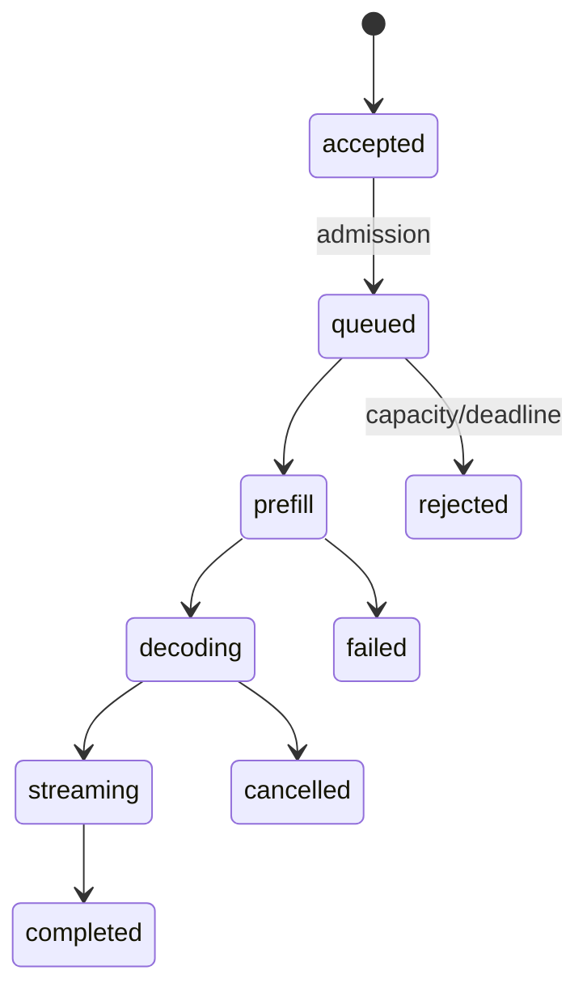

# LLM Serving：从模型文件到稳定推理 API

模型权重已经下载，服务端口也在监听，但第一个请求要等很久，第二个请求还可能被拒绝。Serving 的职责不是“把模型加载到 GPU”，而是管理准入、排队、执行、流式输出、取消、用量和健康状态。

## 一条请求经过 Serving 的哪些状态

accepted 只代表协议和策略通过；queued 表示等待执行槽；prefill 处理输入，decoding 逐步生成 Token。每个状态都要有时间戳，才能把 TTFT 拆成入口、排队、Tokenize 和 Prefill，而不是只记录总耗时。

## Serving 边界和 API 边界

| 层 | 持有的状态 | 不应决定的事情 |
| --- | --- | --- |
| Gateway | 身份、预算、公开模型名 | GPU Kernel 细节 |
| Serving Scheduler | 请求队列、Batch、KV 预算 | 租户是否有权访问文档 |
| Model Engine | 权重、采样、缓存、执行流 | 最终计费事实 |
| GPU Runtime | 设备、内存、Kernel | 业务错误语义 |

边界清楚后，模型服务可以替换引擎，网关也可以把同一公开模型路由到不同 Revision。跨层共享的信息用 request_id、model_revision 和 usage 事件连接，不能让一个全局字典成为所有状态的来源。

## 准入要先于昂贵的加载

在排队前检查最大输入长度、预计输出上限、租户预算、模型能力和截止时间。系统如果已经知道 KV Cache 放不下，就应返回可解释的 4xx 或降级，而不是让请求进入队列后再 OOM。准入规则要和实际调度预算保持一致，否则“接受成功”会制造更多长尾。

## 健康、就绪和可用不是一个词

进程活着是 liveness，HTTP 端口能回应是 readiness 的一部分，模型权重和 tokenizer 已可用、热身完成、能完成最小推理才接近 serving readiness。健康检查不能每次都加载模型，也不能只返回 200 就把加载中的实例送入流量。

## 未实测边界

::: warning
**这里不填性能数字**

不同引擎、模型、GPU、量化和请求分布会改变队列和吞吐。后文的推演用于理解状态和证据，不把理论值当成实测结果。下一篇从 Hugging Face 制品开始，走完第一次开源模型部署的核对过程。
:::

## 过载时应该怎样拒绝

服务一旦接近 KV 或队列上限，继续接受请求会让所有人的 TTFT 一起恶化。更可控的策略是在入口按预计 Token、模型能力和租户并发做 admission，返回可重试的限流错误，或者将非交互任务转到独立队列。拒绝条件必须可观测，否则调用方只会看到偶发超时。

排空时也要停止接纳新请求，但允许已进入 Decode 的序列在 deadline 内结束。直接杀掉实例会丢失流式终态和 usage；无限等待则会阻塞发布。Serving 的生命周期因此需要明确 draining、deadline 和强制终止后的补偿记录。

## 使用量事件要和终态对账

输入 Token 往往在开始前可计算或由引擎返回，输出 Token 则在 Decode 完成后才稳定。客户端取消、上游断开和引擎失败会让 usage 处于部分完成状态。平台需要定义何时记账、如何标记估算与最终值，以及重试是否创建新的 attempt。

把 usage 放在单独的可重放事件中，比在 HTTP 响应结束时写一行日志更可靠。这样即使网关重启或客户端断开，也能和 Turn、模型 Revision、价格版本及审计记录对账。
