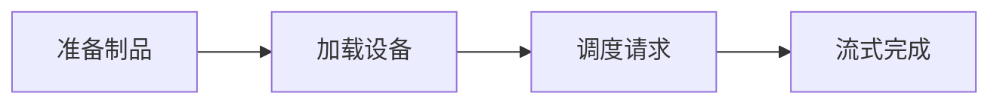

# LLM Serving：从模型文件到稳定推理 API

健康检查返回 200，第一条真实请求却等待一分钟后 OOM。原因是探针只检查 HTTP 进程存在，权重仍在加载；加载完成后，默认最大上下文又让 KV Cache 预留吃掉剩余显存。模型服务“启动了”和“能按目标请求形状稳定服务”是两个状态。

## 先准备模型下载与运行时工具

模型 Serving 文章后面的命令依赖 Python、模型仓库客户端和 GPU 运行时。模型文件应从对应项目的官方发布页或受控镜像下载，并记录 revision、摘要和许可证；不要直接复制未固定的下载地址。

<figure class="doc-shot">
  
  <figcaption>模型仓库客户端的官方入口。先确认 CLI、模型仓库、revision 和许可证，再把文件下载到可审计目录。</figcaption>
</figure>

Hugging Face CLI 的安装说明见 [官方命令行文档](https://huggingface.co/docs/huggingface_hub/guides/cli)。下面的命令只安装客户端并检查帮助信息，不能替代模型权重的哈希、许可证和硬件兼容检查：

```bash
python -m pip install --upgrade huggingface_hub
hf --help
```

```bash
python3 --version
python3 -m venv .venv
. .venv/bin/activate
python -m pip install --upgrade pip
```

这几条命令只建立隔离 Python 环境，不代表 CUDA、驱动、权重或推理引擎已经兼容。后续文章会分别验证 GPU、模型制品和引擎启动，先把运行时边界分开，排障时才不会把“下载成功”当作“服务可用”。


## Serving 层拥有哪段生命周期

推理服务的组件名很多，先沿一条请求确认输入在哪一层变化、状态由谁保存、结果如何返回，后面的容量和失败分析才不会串层。

| 概念 | 在这条链路中的含义 |
| --- | --- |
| Model Artifact | 配置、Tokenizer、权重和必要代码组成的可追溯输入，必须锁定 revision 与摘要。 |
| Scheduler | 决定哪些请求在本轮进入 Prefill 或 Decode，以及它们如何共享批次和显存。 |
| Readiness | 实例已加载目标 revision，并能接受约定请求的可路由状态；不是进程存活的同义词。 |
| TTFT/TPOT | TTFT 是请求到首个 Token 的时间；TPOT 描述首 Token 之后相邻输出 Token 的平均或分位时间，二者瓶颈不同。 |

::: tip 判断原则
把 Tokenize、Prefill、Decode、Scheduler 和 API 层的证据分开记录，任何一层都不能替另一层宣布成功。
:::

## 从冷启动到请求资源释放



箭头表示状态的先后依赖，不表示所有步骤都在同一进程或同一台机器完成。下面沿链路逐段展开。

### 准备制品：Artifact Loader

校验配置、Tokenizer、权重分片和架构兼容性。

可以从这些位置确认结果：revision、digest、缺失文件。若完全没有证据，先判断请求是否到达本阶段；若记录冲突，则对齐 request_id、实例和时间窗口。

### 加载设备：Serving Process

分配权重、运行时工作区与缓存预算，执行最小预热。

这里不靠猜测，优先读取 显存账本、load duration、ready=false。

### 调度请求：Scheduler

根据输入长度、并发与预算安排 Prefill/Decode。

决定下一步前需要看到 queue_ms、running/waiting、batch tokens。

### 流式完成：Output Processor

采样、解码、发送事件并在取消或终态释放 KV block。

这一动作的可观察结果是 first_token、finish_reason、freed blocks。处理动作应晚于取证，否则重启或重试可能覆盖最早的失败现场。

## 用状态表定义“已就绪”而不是猜测

以下是解释性状态，不对应某个引擎固定日志格式。输入是模型 revision 和启动配置；只有所有前置状态满足，入口才应把流量送入实例。

```text
process=alive
artifact.revision=4f92c1 digest=sha256:...
tokenizer.loaded=true
weights.loaded=true device_count=2
warmup.completed=true
scheduler.accepting=true
readiness=true
```

若 process alive 但 weights.loaded=false，liveness 应保持成功以免加载被反复重启，readiness 则必须失败。预热只能验证一组受控输入，不代表最大上下文、峰值并发或所有采样参数可用；这些属于容量和兼容测试。

## 模型加载成功不等于请求可用

| 表面现象 | 实际可能发生的事 | 下一步证据 |
| --- | --- | --- |
| GPU 利用率 100% | 可能是有效计算，也可能长请求占满批次或 Kernel 忙等 | 同时看吞吐、队列、TTFT 和输出进度 |
| TTFT 高 | 排队、长输入 Prefill、Prefix 未命中或入口缓冲都可能贡献 | 按时间戳拆开 queue 与 prefill |
| TPOT 抖动 | 动态批次、采样、慢客户端或显存换入换出都可能影响 | 关联 batch 与请求形状 |
| 健康检查成功 | 探针可能只检查 HTTP 端口 | 把目标 revision 与 scheduler accepting 纳入 readiness |

::: warning 容易误判
一条成功命令只能证明它覆盖的那一层。重启后的短暂恢复也不是根因已经消失，改变状态前先保存最早证据。
:::


## 这套判断方法的边界

Serving 不决定用户权限、知识范围和最终计费，它接收经过规范化的请求并报告真实 usage 与终态。引擎指标命名会随版本变化，结论应记录版本、模型、硬件和配置；本章不提供未经实测的吞吐数字。

理解 Serving 边界后，下一篇从 Hugging Face 模型仓库开始，完成开源模型制品的选择、下载、校验和首次部署决策。
