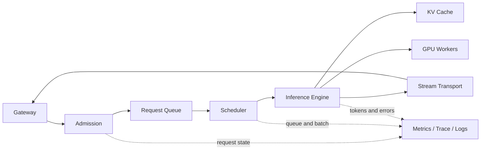

# LLM Serving：模型文件不会自己变成稳定 API

进程已经监听 8000 端口，健康检查也返回 200，第一条生成请求却立刻 OOM。原因是“Web 进程可访问”“模型加载完成”“KV Cache 已分配”“实例能够接收目标请求”是四个不同状态。Serving 的任务是把模型制品和有限计算资源变成有契约、有调度、有终态的在线服务。

本篇先建立完整生命周期。后续文章再分别深入 Transformer 推理、动态批处理、vLLM 和量化。

## Serving 位于平台哪一层

Gateway 处理外部身份、业务配额和模型路由；Serving 接收规范化模型请求，判断能否执行，把请求交给调度器，在引擎中完成 Tokenize、Prefill 与 Decode，再把增量结果和最终用量返回。Serving 不负责业务对话状态、RAG 权限或最终账单，但要提供这些上层能力需要的稳定事实。

## 控制流与数据流

控制流包含模型加载、实例注册、健康、准入、调度、取消和关闭。数据流包含消息或 Token、模型权重、KV Cache、Logits、采样结果和流式事件。把两者混在一个函数里，会让模型加载失败表现成通用 500，也让取消无法到达执行器。

请求进入后先做结构与能力校验：模型是否存在，输入长度是否超限，数据类型与硬件是否兼容，并发槽是否可用。通过准入的请求才进入队列。调度器根据可用 Token、显存 Block、请求阶段和公平策略组成 Batch；执行器调用设备 Kernel；传输层按顺序发送事件并处理断开。

## 启动与就绪是状态机

| 状态 | 正在发生什么 | 可以接流量吗 |
| --- | --- | --- |
| starting | 进程、配置和端口初始化 | 否 |
| downloading | 获取模型制品并校验 | 否 |
| loading | 权重映射、设备初始化 | 否 |
| warming | 建立 Kernel/缓存并做受控预热 | 通常否 |
| ready | 目标请求可以进入准入 | 是 |
| draining | 不接新请求，排空在途执行 | 否 |
| failed | 启动或运行不可恢复失败 | 否 |

Liveness 只判断进程是否需要重启；Readiness 应在模型与执行器可用后成功。若把端口监听当作就绪，滚动发布会把流量送到仍在加载几十 GB 权重的实例。若把外部供应商或昂贵生成放进 Liveness，短时依赖故障又会触发无意义重启。

## 模型请求并非大小相同

输入长度、最大输出、模型大小、精度、工具定义和多模态内容都会改变资源成本。只按“一个请求占一个并发”限制，短分类与长上下文生成会被当作相同工作。Serving 可按最大活动序列、Batch Token、KV Cache 容量和租户权重共同准入。

估算值不能完全相信客户端。服务端要解析真实输入，并对最大输出设置平台上限。过载时应排队、降级或快速拒绝，而不是让所有请求同时进入 GPU 后一起超时。

## 四类核心指标

| 维度 | 指标 | 回答的问题 |
| --- | --- | --- |
| 延迟 | 排队时间、TTFT、TPOT、总时间 | 慢在等待、首轮计算还是逐 Token 生成 |
| 吞吐 | Request/s、Input Token/s、Output Token/s | 单位时间完成了多少不同工作 |
| 资源 | GPU 利用率、显存、KV Block、CPU、网络 | 当前瓶颈在哪种资源 |
| 正确性 | 准入拒绝、取消、超时、OOM、Finish Reason | 请求为什么结束，是否释放资源 |

平均延迟会掩盖长尾，应按模型、版本、输入/输出长度档位和终态观察分位数。标签不能直接放 Prompt、用户 ID 或任意请求 ID，高基数关联交给 Trace 与日志。

## 流式响应改变的是交付时间

流式让客户端更早看到输出，通常降低感知等待，但不会减少模型必须执行的 Decode。TTFT 从请求接受到第一个可见 Token，TPOT 描述后续 Token 间隔；两者受不同阶段影响。

传输层还要表达完成、长度截断、内容拒绝、工具调用、错误和取消。客户端断开后，Serving 应移除队列请求或停止活动序列，回收 KV Cache。只关闭 Socket 而不通知调度器，会产生没有消费者的计算。

## 错误边界和重试

输入超限、未知模型和能力不支持是确定性拒绝；排队超时、引擎过载和节点故障可能短时恢复；执行已开始后连接丢失，结果可能未知。Gateway 只有知道 Serving 是否接受、是否开始生成、是否产生用量，才能判断重试与计费。

OOM 不应统一重启整个节点。先区分模型加载 OOM、Prefill 峰值、KV Cache 不足、并发过高和显存碎片，再调整模型、精度、长度、Batch 或实例布局。重启可能暂时清空状态，却不会改变错误容量模型。

## Serving 的验收边界

一份可交付设计至少覆盖：制品来源与校验、状态机、Readiness、输入上限、准入与队列、取消传播、指标、错误契约、Drain 和回滚。回答质量需要独立 Eval，API 健康也需要独立运行验证；两者都通过，模型能力才适合进入平台路由。
