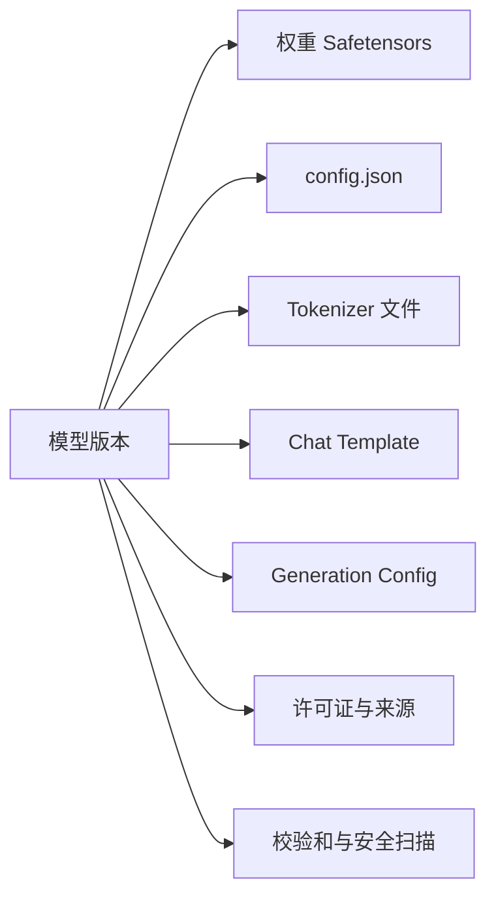

# 模型权重、Tokenizer、精度、量化与制品管理

部署目录里有一个几十 GB 的权重文件，服务能启动，但换了一个看起来同名的 Tokenizer 后，输入长度和输出格式都变了。模型不是单个 `.bin` 文件；它是一组必须一起版本化、校验和、授权和验证的制品。

本文先列出一套最小制品清单，再计算精度对存储/显存的影响，最后讨论量化如何改变容量与质量验证。所有数值推导都是公式或示例，不代表某个具体模型的实测效果。

## 模型制品有哪些文件



| 制品 | 决定什么 | 缺失或不匹配的表现 |
| --- | --- | --- |
| 权重 | 参数值与精度 | 无法加载或输出错误 |
| 配置 | 层数、隐藏维度、架构 | 权重形状不匹配 |
| Tokenizer | 文本与 Token ID 映射 | 长度、特殊 Token、乱码变化 |
| Chat Template | 消息怎样拼成输入 | 对话格式不符合模型训练方式 |
| Generation Config | 默认采样和停止 | 输出长度、停止行为变化 |
| 许可证/来源 | 能否使用与如何分发 | 合规和供应链风险 |

文件名不保证兼容。以模型发布的 revision 或 commit 固定一组文件，并记录下载时间、来源、许可证和 SHA-256。

## 第一步：用参数量估算理论权重大小

每个参数占用字节数取决于数据类型：

| 类型 | 理论字节/参数 | 常见用途 |
| --- | ---: | --- |
| FP32 | 4 | 训练或高精度参考 |
| FP16 | 2 | 推理常见格式 |
| BF16 | 2 | 训练/推理，指数范围接近 FP32 |
| INT8 | 1 | 量化推理，另有 scale/zero point |
| INT4 | 0.5 | 更激进的量化，额外元数据与误差更重要 |

```text
理论权重字节数 = 参数量 × 每参数字节数
```

例如 7B 参数 FP16 理论约 `7,000,000,000 × 2` 字节，约 14GB 十进制；实际文件可能因分片、元数据、压缩和格式不同而略有差异。运行时还要加工作区、激活、KV Cache 和框架开销，所以不能用这个结果直接决定 GPU 型号。

训练还需要梯度、优化器状态和激活，通常远大于只加载推理权重的占用。不要把推理估算套到训练集群。

## 第二步：Tokenizer 是输入契约

Tokenizer 把字符串变成 Token ID，再把 ID 解码回文本。分词规则、词表、特殊 Token、`bos/eos/pad` 和 chat template 共同决定模型实际接收到什么。

同一句中文在不同 Tokenizer 中可能消耗不同数量 Token。它会影响上下文预算、费用和 KV Cache，但不能从字符数准确推导 Token 数。

最小检查应记录：

1. Tokenizer 版本与模型 revision。
2. 特殊 Token ID 是否与配置一致。
3. 一个固定消息样本经过 Chat Template 后的字符串或 Token 数。
4. 超长输入怎样截断，是否保留系统消息和用户问题。
5. `pad_token`、`eos_token` 与 batch 行为是否符合框架要求。

当模型权重升级而 Tokenizer 不变，仍需用回归样本检查；当 Tokenizer 变化，不能假设向量、缓存或 Token 预算仍兼容。

## 第三步：理解量化的取舍

量化用较低位宽表示权重或激活，以减少存储、显存和带宽。它不是“把文件压小就结束”：需要 scale、zero point、分组策略、校准数据和推理内核支持。

| 格式 | 主要收益 | 主要风险 |
| --- | --- | --- |
| FP16 | 兼容性较好，权重约减半 | 精度和显存仍可能不够 |
| BF16 | 指数范围大，训练稳定性常较好 | 硬件支持要求不同 |
| INT8 | 显存与带宽进一步下降 | 某些层/任务精度退化 |
| INT4 | 能让更大模型进入较小显存 | 误差、内核与校准依赖更明显 |

量化格式名称相同也可能使用不同校准方法和内核。部署记录需要包含量化工具、参数、校准数据版本、目标硬件和推理引擎版本。

不要用通用语言任务的一个分数推断所有场景。知识问答、代码、数学、长上下文和工具调用应分别准备回归集，至少检查格式、事实、引用和拒答边界。

## 第四步：Safetensors 与安全加载

Safetensors 用结构化元数据和安全加载方式保存张量，避免某些序列化格式在加载时执行任意代码的风险。它并不自动保证权重来自可信来源，也不解决许可证问题。

制品接收流程：

1. 从明确来源固定 revision 下载 manifest 与文件列表。
2. 校验 HTTPS/TLS、文件大小和 SHA-256。
3. 扫描压缩包、配置和脚本；默认不执行仓库中的任意安装脚本。
4. 检查许可证、模型卡与商用限制。
5. 在隔离环境加载，记录框架、驱动、硬件和日志。
6. 运行固定 Tokenizer、格式、质量和资源回归。
7. 生成内部制品清单与内容摘要，部署时按摘要拉取。

校验和只能证明文件内容未变化，不能证明来源本身可信。来源与校验需要同时记录。

## 第五步：为模型版本设计兼容窗口

在线服务切换模型时，至少有三种版本同时影响结果：应用代码、模型制品、知识/提示策略。把模型文件覆盖到同一路径会让回滚无法复现。

目录或仓库应使版本不可变，例如 `models/<model-id>/<revision>/...`。服务配置指向明确 revision，候选启动和健康检查加载相同 revision；切流只改变引用，不删除旧制品。

Embedding 模型变更更需要版本隔离：向量维度、归一化、距离和语义空间都可能变化。必须先建立新投影和召回评测，不能直接覆盖旧向量列。

Tokenizer 或 Chat Template 变更会影响输入 Token 数和输出格式，网关的 Token 预算与成本统计也要随版本回归。

## 第六步：写一份制品清单

| 字段 | 示例内容（占位） | 作用 |
| --- | --- | --- |
| model_id/revision | `reader-model / immutable-rev` | 精确定位 |
| source/license | 官方仓库与许可 | 来源、分发边界 |
| files/checksum | manifest、SHA-256 | 防漂移与损坏 |
| tokenizer/template | 版本与特殊 Token | 输入兼容 |
| precision/quant | BF16、INT8 等 | 显存与内核前提 |
| runtime/hardware | 引擎、驱动、GPU 架构 | 可运行条件 |
| eval baseline | 固定数据集与结果 | 质量比较 |
| security review | 扫描与批准记录 | 供应链门禁 |

“占位”表示字段形状，不是假装已有某模型结果。真正部署必须填入可审计值。

## 正常结果、失败结果和恢复

- 下载文件校验一致、Tokenizer 特殊 Token匹配、短输入能生成：进入容量与质量评测。
- 权重形状与配置不匹配：停止发布，回到同一 revision，不在代码里强行 reshape。
- 量化内核不支持目标 GPU：换兼容引擎或格式，不能只把显存参数调大。
- 启动成功但质量回归失败：保留旧版本，停止切流，检查量化/模板/知识版本组合。
- 文件下载中断：删除不完整临时文件，按校验和重新获取，不把半个权重目录注册为可用。

## 实践任务

选一个公开、许可证清晰的模型，在隔离环境完成：固定 revision，生成 manifest 与 SHA-256，记录 Tokenizer 与 Template，分别用原始精度和官方支持的量化格式启动最小加载检查。不要公布或声称未实测的吞吐；用固定输入记录是否加载成功、显存基线和质量回归结果。

## 参考资料

- [Hugging Face Safetensors](https://huggingface.co/docs/safetensors/index)
- [Hugging Face Transformers model files](https://huggingface.co/docs/transformers/main/en/installation#cache-setup)
- [NVIDIA Mixed Precision Training](https://docs.nvidia.com/deeplearning/performance/mixed-precision-training/index.html)
- [PyTorch numerical accuracy](https://pytorch.org/docs/stable/notes/numerical_accuracy.html)
- [NIST Secure Software Development Framework](https://csrc.nist.gov/Projects/ssdf)
