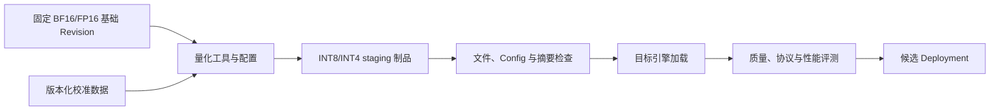

# 模型精度与量化是什么？FP16、BF16、INT8 和 INT4 改变了什么

模型参数是大量数字。训练文件里可能以 FP32、BF16 或 FP16 保存，部署时又能转换成 INT8、INT4。位数减少后，文件和显存通常变小，设备每次能搬运更多参数；可表示的数值也变少，量化、反量化和专用 Kernel 会带来新的误差与兼容要求。

“4-bit 模型只有原模型四分之一显存”只描述理想权重下限。比例尺、零点、未量化层、KV Cache、激活和 Runtime 都没有算进去。性能也不会只按位数线性变快，目标 GPU 必须有匹配 Kernel，模型质量则要用真实任务评估。

::: info 数值精度与量化

数值精度描述计算机用多少位、怎样编码一个数，可表示范围与相邻数间隔由格式决定。FP16、BF16 是 16 位浮点格式，FP32 是 32 位浮点格式。

量化把原本较高精度的数映射到更少离散级别，常用比例尺和可选零点在整数码与近似实数之间转换。INT8、INT4 权重因此需要量化元数据和对应计算 Kernel。

:::

## 计算机为什么不能保存任意精确的实数

数学上的实数有无限可能，小数也可能无限展开。计算机存储位数有限，只能选择一组可表示值。一个真实参数落在两个可表示值之间时，需要舍入到其中一个，产生表示误差。位数越少，通常可选级别越少。

误差大小与格式和数值范围有关。整数格式在固定区间内间隔均匀，浮点格式让绝对间隔随数量级变化，能同时表示很小与很大的数。神经网络矩阵中参数分布、离群值与中间激活范围都会影响误差。

一次舍入很小，几十层矩阵乘和归一化会传播误差。并非所有误差都同向叠加，模型也对部分扰动有容忍；某些敏感层、长上下文或低概率候选会更容易变化。因此不能从单个参数误差直接推导最终答案质量。

计算格式还涉及下溢、上溢、NaN 和 Infinity。范围不足时大值变无穷，小值变零；训练梯度尤其敏感。推理没有反向梯度，通常更容易使用低精度，但 Softmax、归一化和累加等部分仍可能保留较高精度。

硬件按特定格式提供算力和内存带宽。格式在文件中存在，不表示 GPU 有高效算子。软件可能先转换到 FP16 再计算，节省文件却未获得预期速度。

因此“精度”至少有三个位置：权重怎样存储，激活和 KV Cache 怎样存储，矩阵乘怎样累加。比如权重文件是 INT4，Kernel 可能在寄存器中反量化成 FP16，再用更高精度累加；它节省了磁盘和部分显存，却不等于整条计算链都用 4 位。FP16、BF16、INT8 和 INT4 的区别要放进这个位置关系里理解，而不是只背每个名字占几字节。

边界也很具体。低精度适合数值范围和误差经过验证的层，Softmax、归一化或异常值敏感的层可能保留更高精度。一个模型在短输入上质量正常，不能推导长上下文和工具调用仍然正常；格式支持、Kernel 和质量回归需要分别记录。

## 浮点数中的符号、指数和尾数分别表示什么

二进制浮点通常由符号位、指数位和尾数或有效数字位组成。符号表示正负，指数控制数量级，尾数控制该数量级内的细分精度。指数位越多，可表示范围通常越广；尾数位越多，相邻数更密。

FP32 有 1 位符号、8 位指数和 23 位显式尾数。FP16 有 1 位符号、5 位指数和 10 位尾数。BF16 保留与 FP32 相同的 8 位指数，只用 7 位尾数。三者还涉及隐含位、特殊值和次正规数，基本对比先看范围与精细度。

FP16 尾数比 BF16 多，所以在相近范围内表示更细；指数位少，动态范围也小。BF16 范围接近 FP32，更不易因数值太大而溢出，单个数的相对精度比 FP16 粗。说 BF16 比 FP16“精度更高”或“更低”都不完整，要分范围和有效位。

格式转换会舍入。FP32 权重转 BF16，低位尾数丢失；转 FP16 还可能出现超范围。推理引擎读取时要记录源 dtype 与实际运行 dtype，不能只看 Config 默认。

矩阵乘常让输入使用低精度，累加器使用 FP32 或另一较高精度，减少大量乘积相加误差。API 写 `dtype=fp16` 不能推导每个算子和中间值都严格 FP16，Kernel 实现才是事实。

## FP32 是什么，它为什么常作为比较基线

FP32 每个数占 4 字节，提供较宽范围和约 7 位十进制有效精度。训练中主权重、优化器状态或某些累加常使用 FP32。早期推理也直接用 FP32，兼容广但权重与带宽成本高。

7B 参数的 FP32 权重理想下限约 28 GB，尚未包含任何运行状态。更大的模型很快超过单卡显存。若 GPU 对 FP32 矩阵算力低于 Tensor Core 低精度路径，吞吐也会受影响。

FP32 输出不是绝对真实答案。模型训练本身、随机采样和数据决定质量；FP32 只是减少由更低精度引入的数值变化。量化评估常与一个选定 FP16/BF16 或 FP32 基线比较，基线版本和模板必须一致。

模型仓库标 FP32 可能指保存权重，不代表训练全程和所有计算都是 FP32。加载时 `torch_dtype=auto` 的行为由 Config 与库决定。部署报告读取实际张量 dtype 和 Engine 日志。

FP32 也会有舍入和非结合性。并行归约改变加法顺序，结果末位可能不同。固定 FP32 不保证跨 GPU 与 Kernel 字节确定，只减少一类精度差异。

## FP16 是什么，它节省了什么又容易失去什么

FP16 每个值 2 字节，权重理想内存是 FP32 的一半。许多 NVIDIA GPU 对 FP16 Tensor Core 有高吞吐，推理可以减少权重带宽。7B 权重理想约 14 GB，仍要给 Cache 与工作区留空间。

FP16 指数范围较窄，大激活或中间结果可能溢出。训练使用 Loss Scaling 防止小梯度下溢，推理没有梯度，仍可能在特定模型或输入出现 NaN。归一化和 Softmax 常用更稳定实现。

FP16 尾数位比 BF16 多，在其可表示范围内分辨率更细。模型原本以 FP16 训练或验证，推理采用 FP16 常有成熟支持。原模型含超出范围权重时，直接转换可能失败或失真。

FP16 模型文件也可能只是储存格式，Kernel 内部用混合精度。反过来，INT4 权重也可能解量化成 FP16 后乘法。性能报告要说明存储、输入、计算和累加各自格式。

选择 FP16 要看 GPU 架构。设备支持表中的“支持 FP16”不表示所有模型算子都走最快路径，Attention、MoE 和自定义层可能受其他 Kernel 限制。候选运行用 profiler 与吞吐验证。

## BF16 是什么，它与 FP16 的关键区别在哪里

BF16 也是 16 位，每个数 2 字节。它用 8 位指数保留 FP32 的大致动态范围，尾数只有 7 位。对于训练和含较大范围激活的模型，BF16 更不容易溢出，许多现代模型选择它。

BF16 与 FP16 的权重字节相同，所以仅把 FP16 换 BF16 不会进一步省显存。区别在可表示数值和硬件支持。某些较老 GPU 没有原生 BF16 快速路径，软件模拟或转换会让性能不如预期。

从 FP32 转 BF16 会丢更多尾数细节，但保留范围。模型是否受影响取决于参数和计算敏感性。不能用一个困惑度结果覆盖所有语言、代码和工具调用，业务样本仍要比较。

Serving 的 `dtype=auto` 可能根据模型 Config 选择 BF16，设备不支持时回退或报错。正式配置显式设置，启动日志确认实际选择。FP16 与 BF16 候选都跑相同质量和性能基线。

KV Cache 也可以使用 BF16 或其他 dtype。权重 BF16 不强制 Cache BF16，某些引擎允许 FP8 KV。报告分别记录，避免把权重精度改动与 Cache 质量变化混在一起。

## INT8 量化是什么，比例尺怎样把整数还原为近似实数

有符号 INT8 通常提供 -128 到 127 的整数码。要表示浮点权重，需要选择 scale，把实数近似为 `q = round(x / scale)`，并裁剪到整数范围；使用时近似还原 `x_hat = q × scale`。非对称量化还加入 zero point。

假设一组权重绝对最大值 1.27，使用对称 INT8，scale 可选约 1.27/127 = 0.01。权重 0.126 被映射为 13，还原为 0.13，误差 0.004。权重超出范围会被裁剪，误差更大。

整个张量共用一个 scale 实现简单，离群值会把范围拉大，让大多数小值可用级别变稀。Per-channel 为每个输出通道使用 scale，通常更准确，元数据和 Kernel 更复杂。激活随输入变化，量化比静态权重更难。

Weight-only INT8 只把权重低位保存，激活和计算可能是 FP16/BF16。W8A8 表示权重与激活都 8 位，累加通常更高精度。看到 INT8 标签要问 W、A、KV 和累加各是什么。

INT8 权重理想约 1 字节/参数，7B 约 7 GB，加 scale 与未量化层。支持高效 INT8 Kernel 的 GPU 上可以提高吞吐，不支持时反量化开销抵消收益。质量要比较基线。

INT8 量化的关键是映射合同而不只是数字变小。校准数据决定 scale 是否覆盖真实激活范围，离群值会导致大部分码值利用率很低；Per-channel 或 Group-wise 可以缓解，却增加 scale 元数据和 Kernel 处理。比如同一组权重用一个 scale 得到的误差，可能明显大于按输出通道分别校准的误差。

它与截断、剪枝和稀疏化也不同。量化改变每个数的表示精度，剪枝改变非零结构，稀疏 Kernel 还要求硬件和布局支持。一个 INT8 文件能被加载，只证明制品格式可读，不证明引擎真的用 INT8 Kernel，也不证明质量和速度达到目标。区别要在权重、激活和执行 Kernel 三个位置分别确认。

::: info 量化审查的最小证据

同一模型、同一 Tokenizer 和固定样本，记录原始 dtype、量化方案、scale/zero point、实际 Kernel、显存峰值、延迟和质量结果。只有文件大小变化而没有这些证据，不能把候选标成可发布。

:::

## 对称量化与非对称量化怎样映射零点

对称量化通常让整数零对应实数零，并用一个绝对最大范围计算 scale。INT8 可以使用约 -127 到 127 的对称码。公式简单，矩阵 Kernel 容易实现；原数据分布若明显偏向正数，一侧码位会闲置。

非对称量化用 `x_hat = scale × (q - zero_point)`，让整数区间覆盖实数最小值到最大值。实数零映射到可表示的 zero point，适合 ReLU 等偏正分布。矩阵乘需要处理零点校正，元数据和计算更复杂。

权重分布常以零为中心，对称方法普遍；激活分布随层和输入变化，可能使用非对称。方法选择由格式与 Kernel 限制，不能在 Config 中随意切换一个布尔值后继续用同一权重字节。

Zero point 自己也要存储，按 group 或 channel 数量增加元数据。4-bit 每个码只有少量级别，零点与 scale 的选择对误差更敏感。打包布局还决定 nibble 顺序，加载器不匹配会解出完全错误数值。

检查量化制品时，从少量张量读取 scale、zero point、group 和 packed shape，用官方反量化规则还原并与基础权重比较。这个静态抽样能发现格式错位，不代表模型任务质量通过。

## Per-tensor、Per-channel 和 Group-wise 分别共享多大范围

Per-tensor 让整个张量共享一个 scale。元数据最少，某个离群值会决定全张量范围，其余大多数小值只能用较粗间隔。它适合分布均匀或对误差不敏感的张量。

Per-channel 按输出通道或指定轴保存 scale。矩阵每一行的范围可以不同，通常比全张量准确。Kernel 要知道 scale 轴并在计算中广播。Config 与实际张量轴不一致会得到形状错误或静默错误。

Group-wise 在一行内每 N 个权重共享 scale，INT4 常见 group 32、64、128 等。它比 per-channel 更细，质量可能更好，scale 数量增加，读取和反量化也更频繁。最小 group 不一定最快或最好。

举例，一行有 4096 个权重，group size 128，会有 32 组 scale。若 scale 用 FP16，每行 scale 至少 64 字节；4-bit 权重本身 2048 字节，scale 约再加 3.125%，未含 zero point 和对齐。这个比例随 group 改变。

不同层可以用不同策略，敏感层保留 16 位，其余 group-wise 4 位，形成混合权重制品。一个“INT4 模型”的平均 bit 可能高于 4。容量估算读取实际张量与元数据，不能只按标签。

## 离群值为什么会让低比特量化更困难

某些权重或激活绝对值远大于主体分布，它们被称为离群值。共享 scale 要覆盖离群值，主体值会挤在很少整数级别；若裁掉离群值，相关通道误差又很大。低 bit 级别少，冲突更明显。

Per-channel 与小 group 把离群影响限制在局部。AWQ 一类方法根据激活显著性选择缩放或保护重要权重，SmoothQuant 在权重和激活之间迁移范围。方法都有假设和配置，不是自动无损。

也可以让少量离群通道保留 FP16，形成 mixed precision。Kernel 需要分别计算再合并，格式和性能复杂。显存节省略低，但可能比全层低比特质量好。发布 Manifest 记录例外层。

校准集若没有触发真实离群激活，W8A8 线上可能饱和。加入长上下文、代码、中文和业务极端样本，观察每层范围与 clipping。校准不是用越多数据越好，而是覆盖将要服务的分布。

离群检测阈值和 clipping 会直接改变模型，应版本化。转换工具默认改变也要重新生成 artifact，不能把同名 INT8 当同一制品。质量失败回到层级误差与样本，不先无目的调随机参数。

## 用一个小程序计算理想权重和分组元数据

下面 Python 只做容量算术，不读取模型，也不预测实际显存。输入参数量、bit、group 和每组元数据字节，输出十进制 GB 与二进制 GiB。它适合审查第一步，后面仍用真实文件和加载指标替换。

```python
def estimate_weight_bytes(
    parameters: int,
    bits_per_weight: int,
    group_size: int | None = None,
    metadata_bytes_per_group: int = 0,
) -> int:
    packed = (parameters * bits_per_weight + 7) // 8
    if group_size is None:
        return packed
    groups = (parameters + group_size - 1) // group_size
    return packed + groups * metadata_bytes_per_group


total = estimate_weight_bytes(
    parameters=7_000_000_000,
    bits_per_weight=4,
    group_size=128,
    metadata_bytes_per_group=2,
)
print(f"{total / 1_000_000_000:.3f} GB")
print(f"{total / 1024**3:.3f} GiB")
```

假设每组只保存一个 2 字节 scale，结果约 3.609 GB，即权重打包 3.5 GB 加约 0.109 GB scale。真实格式可能还保存 zero point、索引、Padding 和非量化张量，程序因此是下限模型。

把输出与权重文件总大小比较，差异很大时读取索引按张量分类。再与 GPU 加载后权重相关占用比较，后者包含布局、Allocator 与可能转换。每一步的口径不同，报告不要只写一个“显存”。

容量工具也要防溢出和单位混淆。Python 整数不会普通溢出，其他语言需用 64 位；GB 与 GiB 同时输出。参数量从权重索引统计比仓库名称更可靠，MoE 总参数不能用 active 参数替代存储。

## INT4 量化是什么，Group Size 为什么影响大小和质量

INT4 用 4 bit 表示一个码，理论上两个值装进一字节。常见有符号范围可理解为约 -8 到 7，具体编码取决于格式。级别比 INT8 少得多，scale 粒度对误差更重要。

Group-wise Quantization 把连续若干权重分组，每组独立 scale 和可选 zero point。Group Size 128 表示每 128 个值共享参数。分组越小，局部范围更贴合，质量通常更好；元数据更多，Kernel 访问也更复杂。

4-bit 权重理想为 0.5 字节/参数，7B 约 3.5 GB。若每组额外保存 FP16 scale、zero point 和打包对齐，实际高于 3.5 GB。Embedding、Norm 或输出层可能保留 16 位，也增加差距。

INT4 不是一个统一文件格式。AWQ 根据激活显著性保护重要权重，GPTQ 使用近似二阶信息逐层量化，bitsandbytes、GGUF 与引擎格式有不同布局。目标 Runtime 支持某个名字，不表示任意仓库都兼容。

低位误差可能改变少数 logits 排序，随机采样会进一步放大文本差异。回答字面不同不等于质量必然下降，需要任务指标与人工评估。工具 JSON、数学和罕见语言可能比普通聊天更敏感。

## 权重量化、激活量化和 KV Cache 量化有什么区别

权重量化处理训练后固定参数，离线计算 scale 并写新制品。它直接减少模型文件、显存和权重读取。Weight-only 对推理输入变化不敏感，通常是部署第一步。

激活是每次请求在层间产生的中间张量，范围随 Token 和输入改变。静态激活量化使用校准数据估计范围，动态量化运行时计算 scale。W8A8 可以进一步利用低精度算力，质量与 Kernel 要更严地验证。

KV Cache 量化处理注意力历史 K/V，减少每 Token Cache 字节，长上下文与高并发受益。它不缩权重文件，可能影响 Decode 注意力。不同层或 Head 的范围也会影响 scale 设计。

计算累加精度是第四个维度。INT8 乘法常累加到 INT32，再转换到浮点；FP16 Tensor Core 可能累加 FP32。数值稳定来自整条算子，不由权重后缀单独决定。

模型说明写 W4A16，通常表示 4 位权重和 16 位激活，仍要说明 FP16 还是 BF16、KV 与累加。发布目录把四类 dtype 分字段保存，避免一个 `precision=int4` 丢掉重要事实。

## PTQ、校准和 QAT 分别在什么时候发生

Post-Training Quantization 在训练完成后转换权重，简称 PTQ。Weight-only 可以直接分析权重，某些方法还用少量校准输入估计激活与敏感度。它不重新完整训练，速度快，适合尝试多个部署格式。

校准数据应覆盖目标语言、长度、代码、工具和业务内容分布，不需要标签也可能包含敏感文本。使用真实数据要脱敏与授权，保存数据版本。只用随机文本会给出不代表线上激活的范围。

Quantization-Aware Training 在训练中模拟量化误差，让模型适应低位表示。它通常能改善低比特质量，成本更高，也产生新的训练制品与超参数。QAT 模型仍需目标 Kernel 部署，不能当普通 FP 模型加载。

SmoothQuant 等方法可在权重与激活之间迁移量化难度，AWQ/GPTQ 各有假设。方法名不能替代转换配置。发布记录校准集摘要、算法、bits、group、symmetric、desc_act 等实际参数。

转换完成先检查文件与 Config，再在隔离 Engine 加载。静态张量误差、困惑度和下游任务逐级评估。一个方法在 7B 英文模型有效，不能推断 70B 中文或多模态相同。

## 量化制品怎样从基础模型产生并保持可追溯

输入是固定基础 Revision 和量化工具镜像。转换任务读取 Manifest，验证权重，使用版本化配置和可选校准集，输出到新 staging 前缀。每个文件计算 SHA-256，Config 写量化方法与参数。

量化不是覆盖原模型。新制品有自己的 artifact revision，并引用 base revision、工具、代码提交、硬件和校准数据摘要。原 BF16 制品保留基线与回滚。文件名相同也位于不同不可变路径。

静态检查读取权重 Header，确认 dtype、shape、分片索引和 Config 一致。某些 4-bit 张量以 packed INT32 保存，看到物理 dtype 不能直接说未量化，要按格式解析。目标引擎加载测试才验证布局。

发布系统把 artifact 与 deployment 分开。相同 AWQ 制品可用不同 vLLM 版本、张量并行和上下文形成候选。质量通过不等于性能通过，加载成功也不等于目标 API 合同通过。

下面这张图把量化任务的输入、暂存制品、检查、加载和评测连起来，便于区分文件生成完成与候选部署可用这两个状态。



图中校准数据只在方法需要时进入，基础制品始终可回溯。候选失败不会修改基础和当前部署。量化工具升级需要重新生成 artifact revision，不能复用旧结果名。

## 权重内存怎样计算，为什么实际显存总会更多

理想权重字节等于参数量乘每参数 bit 再除以 8。7B 模型 FP16 为约 14 GB，INT8 为 7 GB，INT4 为 3.5 GB。这里 B 与 GB 是十进制量级，工具显示 GiB 时数值不同。

量化元数据加在理想值上。假设每 128 个 INT4 权重保存一个 FP16 scale，scale 开销为每 128 个权重 2 字节，约 0.015625 字节/参数，未含 zero point 与对齐。7B 单 scale 约再加 0.109 GB。

未量化层、词表头和 Padding 也占空间。文件加载时可能有 CPU 副本，GPU 上还有 KV Cache、激活、临时工作区、CUDA Context 与通信缓冲。实际 `nvidia-smi` 显存不能与理想权重一一相等。

| 表示 | 理想字节/参数 | 7B 权重下限 | 主要额外项 |
| --- | ---: | ---: | --- |
| FP32 | 4 | 28 GB | Runtime、KV、工作区 |
| FP16/BF16 | 2 | 14 GB | Runtime、KV、工作区 |
| INT8 | 1 | 7 GB | scale、zero point、未量化层 |
| INT4 | 0.5 | 3.5 GB | 分组元数据、打包对齐、未量化层 |

表格只用于第一轮容量筛选。真正部署读取模型加载后的权重内存、Cache Pool 和峰值，保留安全余量。不能因为 INT4 理论能放两份就直接在一张卡启动两个生产实例。

## 低位权重为什么不一定让请求更快

推理时间包含 Tokenize、排队、Prefill、Decode、Detokenize 和网络。量化只直接影响模型计算与数据搬运，队列和代理不会自动变快。短请求由固定开销主导时，总延迟改善可能很小。

Decode 常受权重内存带宽限制，压缩权重能减少每步读取，可能明显增吞吐。Prefill Batch 大时计算利用高，反量化开销和低精度算力支持共同决定结果。GPU 有原生 INT8/FP8 路径，不代表任意 INT4 格式高效。

Kernel 如果需要先把 INT4 解到 FP16，再用通用矩阵乘，节省显存却不一定快。专用 fused Kernel 能边读取边反量化并计算。模型结构、group size 和 shape 必须满足 Kernel 路径，回退日志要观察。

量化后同卡可容纳更多 KV Cache 与并发，吞吐提升可能来自 Batch 变大，而非单请求 Kernel 更快。报告分开单并发延迟与最大 Goodput。不能只在 INT4 上提高并发再说每个请求更快。

多卡模型量化后可能缩到单卡，省去 NCCL 通信，收益很大；也可能仍多卡但每卡余量增加。部署拓扑变化会影响故障域与成本，评测要用最终拓扑。

## 怎样评估量化后的质量边界

先固定基线：同一 base revision、Tokenizer、Chat Template、Prompt、采样和评测代码。Greedy 或低随机设置便于归因，仍允许低精度导致文本差异。比较任务分数，不要求字节相同。

通用指标可以看困惑度、常识、数学、代码和长上下文，业务还要测 RAG 引用、结构化 JSON、工具参数、中文专业术语和安全拒答。平均分相近时，关键高风险用例仍可能退化。

量化误差可能随上下文长度和 Batch 改变。短 Prompt 通过后，再测部署允许的长输入与 KV dtype。工具调用中一个括号错误会让解析失败，比普通措辞差异影响大，指标按场景加权。

人工评估需要盲测与明确准则，不能看到“INT4”后先入为主。失败样本保存输入版本、输出、finish reason、Token 和部署配置。包含真实用户数据时按权限和保留政策处理。

质量门槛按模型用途设定。离线摘要能接受轻微措辞差异，高风险决策和代码执行需要更严格。未覆盖语言与能力标为未知，不把通用分数扩展到所有场景。

## 怎样确认引擎与硬件真的支持该量化格式

静态检查从模型 Config 的 quantization_config、权重索引和工具说明开始，核对 vLLM 等目标版本支持的方法、bits、group size 与模型架构。再核对 GPU Compute Capability、驱动与 Kernel 构建。

启动日志应明确选择量化 Loader 与 Kernel，未识别时直接失败比静默当 FP16 更安全。加载后检查实际显存与预期量级；若仍接近 BF16，可能发生解量化常驻或部分权重未量化。

最小推理覆盖非流式、SSE、停止、usage 和取消。性能用固定长度与并发，Profiler 检查主要 Kernel。结果只适用于该 GPU 与软件版本，升级 Runtime 后重新验证。

某些格式只支持 Linux/CUDA，不支持 macOS 或 CPU。开发机不能运行时做文件和 Config 静态检查，标明 GPU 未执行。不要为了本地成功把生产格式转换成另一格式后混称同一验证。

量化模型的许可证与 base model 一样要审查，转换工具也可能有许可证与来源。内部 artifact Manifest 保存整个链，不从第三方量化仓库直接进入生产。

## 一次 BF16 到 INT4 的候选怎样完整推演

输入是固定 BF16 模型 Revision、AWQ 量化配置和受控校准集。转换容器验证源摘要，运行量化，输出新 shard、索引和 Config。状态从 building 到 artifact_verified，基础模型没有修改。

静态计算显示理想权重从约 14 GB 降到 3.5 GB 加元数据。候选 GPU 实际加载记录 4.x GB 权重相关占用、Runtime 与 KV 分开。若没有目标 GPU，这项保持“待实际测量”，不编数值。

引擎完成 Warmup 和接口合同，质量集与 BF16 基线比较。结构化输出失败超过门槛，候选不发布，即使吞吐更高。若质量通过，再跑混合长度性能，记录 TTFT、TPOT、Goodput、显存与功耗条件。

切一小组测试流量到 INT4 deployment，Gateway 同时记录 artifact revision。异常时路由回 BF16，旧实例和制品保留。量化不会修改业务模型名，回滚不需要现场重新转换。

最终报告说明权重格式、激活与 KV dtype、group、工具、校准、硬件、质量差异、性能和未测项。精度选择不是一个后缀，而是一组从数值表示到运行和业务结果的可验证合同。

归档时同时保留基础模型与量化候选的评测输入版本，确保后续工具升级后还能重放同一比较。
