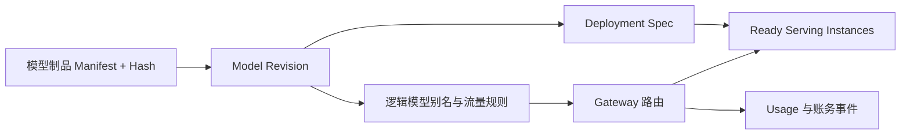

# 多模型平台是什么？模型版本、部署实例和流量切换怎样管理

只有一个模型时，文件目录和一个 Deployment 也许够用。平台开始同时提供通用对话、代码、Embedding、重排和视觉模型后，几个名字很容易混在一起：目录里的权重文件是一个模型版本，GPU 上加载它的进程是一个部署实例，客户端看到的 `chat-default` 是一个逻辑别名，Gateway 还可能把同一别名按租户分到不同版本。

如果这些身份没有分开，发布会出现无法解释的结果。客户端请求模型名不变，但背后突然换了 Tokenizer；旧实例还在接流量却被管理员误删；账单只记录逻辑名，出了质量回归无法知道实际 Revision。多模型平台要管理的不是一张“模型列表”，而是一组有状态、有引用和有回滚关系的对象。

::: info 多模型平台的准确含义

多模型平台是管理多个模型制品、版本、部署实例、路由和生命周期的工程系统。它负责登记可验证的模型身份，创建或更新运行实例，把逻辑模型名映射到版本和流量策略，并记录加载、就绪、发布、下线和回滚状态。

模型平台不等于模型仓库。仓库保存制品和元数据，平台还要连接 GPU 调度、Serving、Gateway、配额、观测、账务与审批。它也不替代模型评测，质量指标需要由评测系统提供。

:::

## 模型制品、版本和逻辑别名分别是什么

模型制品是一组可部署文件和清单，包括权重 Shard、配置、Tokenizer、Chat Template、精度或量化信息、依赖与校验值。制品 ID 只表示一组文件，不表示已经在 GPU 上运行。对象存储路径可变，Hash 和 Manifest 才是可追溯身份。

模型版本是制品加上语义版本、训练或转换来源、兼容硬件、评测结果和审批状态。两个版本可能来自同一基础模型但使用不同量化或 Prompt Template，运行行为不能因为名字相似就视为相同。版本一旦被部署，关键文件不应原地覆盖。

逻辑别名是客户端使用的稳定标识，例如 `chat-default` 或 `embedding-search`。别名指向一个或多个已登记版本，并带流量权重、租户范围和生效时间。切换别名不修改客户端，但会改变后续请求的实际 Revision，因此每次请求仍要记录最终版本。

部署实例是一个实际运行的 Serving 进程或 Pod，包含镜像、模型版本、GPU 资源、配置、区域、协议能力和健康状态。同一模型版本可以有多个实例，也可以在不同硬件和量化方式上运行。实例终态与版本审批状态不是一回事。

这四层关系用表格表达更容易复查。表格前的正文已经定义了概念，表格只放它们的所有者、变化方式和失败证据。

| 对象 | 主要内容 | 谁改变 | 典型失败 |
| --- | --- | --- | --- |
| 制品 | 权重、Tokenizer、Manifest、Hash | 构建与登记流程 | 文件缺失、Hash 不符 |
| 版本 | 制品身份、兼容矩阵、评测与审批 | 模型发布流程 | 未批准、质量回归 |
| 别名 | 客户端名、版本指向、流量权重 | 路由控制面 | 指向未 Ready 版本 |
| 实例 | Pod、GPU、镜像、配置、运行状态 | 部署控制器 | OOM、探针失败 |

读者应能从表格反推排查方向：下载失败查制品，未准入查版本，流量不对查别名，Pod 不健康查实例。把四个对象压成一个 `model_name` 字段，会失去这种定位能力。

多模型平台的作用是管理这些身份之间的变化，让客户端使用稳定的逻辑名，同时让控制面记录实际版本和实例。它和一个简单的模型列表不同，列表只回答“有哪些名字”，平台还要处理版本审批、能力矩阵、容量、健康探测、流量权重和回滚。它与 Gateway 的区别是，平台拥有模型的登记和部署事实，Gateway 在请求时读取这些事实做路由。

例如 `chat-default` 从 revision 41 切到 revision 42，控制面先创建候选实例，确认 Tokenizer、量化格式、探针和最小样本都通过，再修改别名指针。已经开始的流式请求继续使用旧实例，新请求根据生效时间进入新实例。若新实例出现 OOM，健康控制器停止分配，别名可以回到 41，但已经写入的 usage 和任务状态不会自动倒退。

控制面与数据面要分开记录。控制面改变的是版本、权重、策略和生效时间，数据面处理真正的 Token 和 GPU 计算。控制面暂时不可用时，数据面可以使用最近一次经过签名的路由快照继续服务有限时间；快照过期后应拒绝不确定的路由，不能用任意默认模型代替。
## Model Registry 怎样记录可部署身份

Registry 的最小记录包含 model ID、revision、制品 URI、Manifest Hash、Tokenizer Revision、架构、dtype、量化、上下文上限、支持任务和兼容 GPU。还应记录来源、构建工具链、创建时间、所有者、评测链接和状态。路径、Tag 或显示名称不能代替 Hash。

状态可以分为 uploaded、validated、approved、deprecated 和 revoked。上传成功不等于可部署，校验通过也不等于质量批准。Revoked 版本不能被新流量选择，已经运行的实例是否立即停止要有独立流程和审计。

Manifest 校验包括文件列表、大小、SHA-256、配置 Schema、Tokenizer 固定样本和签名。构建时生成，部署前重新读取并校验。下载到节点缓存后再校验一次，防止部分文件或旧目录被误用。

Registry 不保存完整 Prompt 或真实用户输入。评测结果只记录样本集版本、指标、设备和代码身份，质量平台负责原始数据权限。模型卡可以写已知限制和不支持功能，供路由和审批读取。

制品清理按引用计数或版本状态做。当前别名、候选实例、回滚版本和离线评测都可能引用同一制品。删除前列出这些引用，不能按时间直接删最旧目录。大文件清理是容量操作，也要通过审计和可恢复策略。
## 部署实例怎样从版本变成可调用服务

控制面根据 Deployment Spec 创建实例。Spec 固定模型 Revision、镜像 digest、GPU 数、并行参数、最大上下文、端口、探针、模型卷和日志标签。实例启动后依次完成环境检查、制品校验、权重加载、Cache 规划、Warmup 和 Readiness。

实例状态要细分 creating、loading、warming、ready、draining、failed 和 retired。HTTP 进程监听只能说明 API Server 存活，Ready 还要证明模型和最小推理路径可用。Draining 实例拒绝新请求但允许现有请求完成或取消。

同一版本的实例可以放在不同 GPU、区域或容量池。平台记录每个实例的真实硬件、驱动、引擎、显存和配置，不能把版本级兼容性当成所有设备都验证。路由选择时只把 Ready 且满足能力矩阵的实例放入候选。

实例失败要关联失败阶段。拉不到镜像是运行环境，模型文件缺失是制品挂载，CUDA 不可用是设备链路，OOM 是容量，协议响应错误是 Serving 合同。控制面根据失败类型决定重试、换节点、阻止发布或回滚。

部署控制器不应直接修改 Registry 的版本状态。实例 Ready 可以作为候选信号，质量评测和审批仍由发布流程决定。否则一个能加载但输出错误的版本会自动获得生产资格。
## 版本发布怎样从候选走到流量

发布输入包含目标版本、实例规格、别名、租户范围和验证计划。控制面先创建候选部署，候选使用独立实例名和日志标签，不接生产全量流量。环境、制品、协议、质量、容量和安全检查分别产生证据。

灰度方式包括按租户、按稳定哈希、按请求头或按权重。稳定哈希让同一会话尽量保持版本一致，权重便于逐步改变比例。灰度配置包含开始和结束时间、最大流量、自动停止条件与回滚指针。

指标比较必须在相同输入分布、硬件、Batch、采样和版本下进行。TTFT、TPOT、错误率和 GPU 成本只是运行指标，质量回归还要看固定评测集、工具调用和安全规则。候选没有覆盖的能力标为未验证，不因为整体健康就默认支持。

发布期间旧版本继续保留。Gateway 只把小比例请求送到候选，若 p95、错误、质量或计费异常超过阈值，路由恢复旧版本，候选进入 draining。旧实例不能在灰度刚开始就删除，否则回滚只剩配置而没有可用后端。

流量切换事件写入控制面和账务审计。请求记录逻辑别名、实际 Revision、实例 ID 和配置版本。这样用户问“为什么同一个模型名今天结果不同”时，平台能回答是版本、路由还是输入变化。
## 多模型平台怎样处理容量和冷启动

每个版本有权重基线、KV Cache 预算、最大上下文、并发、Batch 和 GPU 需求。平台根据实例规格计算最小副本和峰值，而不是把所有模型都按请求数一比一扩容。共享模型服务时，租户和版本之间还要有队列公平策略。

冷启动包括拉镜像、挂载或下载模型、Hash 校验、CPU 解析、GPU 加载、通信初始化、Kernel 编译和 Warmup。把时间全部归到“容器启动”会让探针和扩容误判。实例 Ready 前，Gateway 不应把生产流量直接压入。

热模型池可以保持常用版本的 Ready 实例，降低延迟但增加闲置 GPU 成本。按区域和时间预测预热需要观察历史请求，不能把一次高峰当长期规律。长尾模型可采用按需启动和明确冷启动提示。

版本下线要先停止新路由，等待 running 和 waiting 清空，再 Drain 实例，最后清理缓存。仍有会话固定在旧版本时，平台要有迁移或结束策略。直接删除别名不代表没有请求在后端。

容量账本包括当前实例、候选实例、回滚实例和预热池。发布时的 Surge 需要额外 GPU，清理太早会丢回滚，清理太晚会浪费容量。控制面展示引用关系，比一张总 GPU 数更有用。
## 配置、权限和审计怎样防止版本漂移

部署配置使用声明式版本，包含镜像 digest、模型 Revision、资源、路由和探针。禁止在 Pod 内手工下载另一个模型或修改默认配置。启动日志打印配置 Hash 和模型 Revision，方便和控制面记录对照。

修改 Registry、部署规格、别名和价格需要不同权限。模型作者可以上传和申请验证，平台操作员可以启动候选，发布审批者可以切流，账务管理员可以修改价格。所有动作记录主体、时间、前后版本、原因和审批引用。

配置发布采用 Schema 校验、差异审查和原子版本。别名不能指向 revoked 或不存在的版本，权重总和要满足规则，候选实例的能力要覆盖逻辑模型声明。发现配置漂移时，控制器可以恢复声明版本，而不是默默采用现场修改。

私有模型制品的下载凭证短期化，实例只读访问必要路径。镜像和模型分别签名，部署前验证来源。模型目录、日志和 Trace 不暴露训练数据、Secret 或本机路径。

审计记录还要支持删除和合规。运行状态和账单必需字段长期保留，Prompt 内容按数据政策限制。模型制品的 Hash 可公开给内部审计，权重本身只在授权范围下载。
## 回滚、迁移和下线有什么区别

回滚是把流量或部署恢复到已验证的旧版本，目标是尽快恢复服务。迁移是把工作负载从一套实例、硬件或区域转到另一套，目标可能包含成本、容量或基础设施变化。下线是停止接受新流量并结束版本生命周期，通常不保证旧版本还能快速恢复。

回滚主要修改别名、权重或 Deployment 指针，旧制品、镜像和配置仍要存在。迁移要重新校验 GPU、模型卷、协议、密钥、数据区域和容量，不能只复制 Pod YAML。下线要先处理会话、缓存、账单、评测引用和回滚窗口，再删除资源。

候选版本出现错误时，回滚并不会修复错误账单或已经输出的内容。Gateway 和账务按 request ID 处理终态，质量平台记录受影响版本和样本。恢复之后要跑同一组协议、取消和计费回归。

数据库或缓存 Schema 变化会影响回滚。新版本写入旧版本不认识的状态，单纯切换镜像可能继续失败。平台发布把 Schema 兼容、模型版本和配置版本分开记录，必要时采用向后兼容窗口。

清理历史版本前用引用清单确认当前、灰度、回滚、评测和审计是否仍需要。删除一个无人引用的缓存可以恢复空间，删除唯一回滚制品则改变风险。清理动作本身也要可审计、可恢复。
## 制品契约怎样防止模型目录可部署但运行失败

Registry Schema 至少验证架构名称、权重文件、配置字段、Tokenizer、特殊 Token、dtype、量化元数据和上下文上限。文件完整并不保证字段语义正确，所以要用固定文本跑 Tokenize，再检查模型结构能否加载一个小批次。校验结果和工具版本进入 Revision。

Manifest 还要写模型允许的输入和输出能力。纯文本、Embedding、视觉、工具调用和结构化输出需要不同协议，不能只在 `tags` 中写一个模糊的“支持多模态”。Gateway 读取能力字段，后端适配器读取相同字段，未声明的能力直接拒绝。

量化制品要记录校准数据身份、量化方法、组大小、激活精度和所需 Kernel。一个 INT4 权重目录可能包含 BF16 的部分层，不能从目录名猜实际字节和质量。部署前做显存估算和固定样本回归，输出显式“可部署”或具体不通过原因。

安全签名覆盖 Manifest 和文件列表，下载后重新计算 Hash。镜像签名与模型制品签名分别验证，镜像可信不代表模型文件可信。制品替换时产生新 Revision，禁止在原目录覆盖后继续使用旧 Revision 名。

契约失败时版本不进入 approved。控制面可以保留 uploaded 供修复，但路由和部署 API 拒绝引用。这个状态边界让“存储成功”和“用户可调用”分开，减少半成品进入生产。
## 模型能力矩阵怎样决定路由与实例规格

能力矩阵把逻辑模型需要的协议字段、上下文、输入类型、工具调用、流式事件、精度和并行方式列出来。实例注册自己实际支持的能力，路由只选择矩阵交集。这样同一个别名不会把图片请求发给文本模型，也不会把工具事件发给只支持纯文本的后端。

矩阵还包含资源范围。模型版本声明最小显存、推荐 GPU 架构、最大 Batch Token、KV Cache 精度和多卡要求。实例报告当前 GPU、驱动、Engine 版本和实际生效参数。部署控制面在创建候选时先检查静态兼容，Ready 后再用合成请求验证动态行为。

能力版本要考虑向后兼容。新增可选字段通常可以灰度，改变 Tokenizer、停止词或默认采样属于行为变化，需要新 Revision 或兼容标记。客户端看到同一逻辑别名时，Gateway 仍记录实际能力版本，避免质量问题无法重现。

多个后端使用同一别名时，路由适配器不能只判断 HTTP 200。它要解析 finish reason、usage、工具事件和错误分类，统一内部事件。后端响应缺少必需字段，Gateway 标记协议失败并停止候选权重，而不是把空内容当成功。

矩阵每次改动都进入发布评审。模型作者修改了 Chat Template，平台需要知道影响哪些别名和租户；Serving 引擎升级改变量化支持，实例能力要重新登记。把矩阵当静态文档会产生漂移，应该由 Registry 和候选验证生成。
## 评测准入怎样阻止“能启动但不该发布”的模型

评测集版本、采样参数、Tokenizer、代码和模型 Revision 要固定。功能集检查格式、停止、工具调用和长上下文；质量集检查任务指标、人工规则或离线评分；安全集检查拒答、越权和敏感数据处理。不同测试的结果不能用一个健康状态覆盖。

评测输出至少有样本 ID、输入摘要、模型 Revision、输出 Hash、评分、错误和运行环境。Prompt 内容按权限保存，公开报告使用脱敏样本。失败样本要能从请求 ID 或样本 ID 重新运行，不能只留平均分。

候选实例还要做运行回归。固定请求验证 `/v1/models`、非流式、SSE、取消、超长拒绝和 usage。质量通过但 SSE 结束标记错误，仍不能进入支持流式的别名。性能测试固定输入分布，报告 p50/p95 和错误，不复制官方硬件数字。

评测门槛由版本和用例声明。新版本可以只改变量化，复用协议但仍需精度和显存回归；改变模板或工具适配则增加对应用例。未执行的能力标记为 unknown，路由默认不放行。

评测完成后由审批者把版本从 validated 变成 approved。审批引用评测运行、制品 Hash 和候选配置。自动控制器不能因为 Pod Ready 就跳过这一步，人工审批也不能修改评测结果。
## 预热池、缓存和自动扩缩怎样共存

模型版本有长尾流量时，所有版本常驻 GPU 成本很高。平台可以给高频别名保留 Ready 预热池，对低频版本按需启动。预热池要有最小副本、最大闲置时间和回收顺序，不能让候选或回滚版本挤掉在线容量。

模型缓存按 Revision 和 Hash 分目录。节点缓存命中缩短冷启动，但缓存不是来源真相，启动仍要校验 Manifest。多个 Pod 同时下载要有文件锁或临时目录，先写完整文件再原子重命名，避免一个 Pod 读到部分 Shard。

扩容信号包括逻辑模型队列、实例 running、Token 到达率、Ready 副本和冷启动时间。按总 GPU 利用率扩容会忽略某一个长上下文版本挤满 KV Cache。控制面按模型别名或实例池分开计算，防止一个版本的压力拖动所有版本扩容。

缩容时先减少 Gateway 权重，再等待实例 Drain 和 Cache 回收。预热池可以先缩低频版本，保留热门版本的最小容量。候选灰度和回滚版本需要单独预算，不能被通用缩容器误删。

容量报告把权重、Cache、工作区、下载、Warmup 和请求队列分开。冷启动期间的额外 GPU 和对象存储流量进入发布成本，不能只统计 Ready 后的平均 Token 价格。
## 平台运维接口怎样让状态可查询

只读查询应能从别名找到版本、从版本找到制品和实例、从实例找到 Pod、GPU 与配置。每个接口返回资源版本、更新时间、状态、失败原因和关联 ID，避免调用者只能看一个“在线/离线”布尔值。

操作接口按状态转换设计。创建候选、批准版本、增加灰度、开始 Drain、回滚别名和下线版本都检查前置状态，重复调用幂等。不能在 failed 版本上直接切流，也不能在还有 running 请求时强制删除而不记录决定。

事件流记录控制面动作和实例反馈。实例加载失败上报阶段与错误，控制面决定重试或阻止；Gateway 记录路由和请求，账务记录 usage。事件有唯一 ID、版本和时间，迟到事件不能覆盖更新的终态。

管理员界面显示版本、实例、流量、容量和质量的关联。只显示“模型 A 有 3 个实例”不够，还要知道 2 个 Ready、1 个 Warming，流量 95% 在旧 Revision，候选 p95 是否超过门槛。高风险操作要求输入版本或确认引用。

平台自身也要被观测。控制器调谐延迟、队列、失败重试、Registry 可用性、事件积压和权限拒绝都可能影响发布。模型 Serving 正常而控制面停止调谐，旧版本会一直接流量，业务未必立刻报错却失去变更能力。
## 模型平台关系怎样画成一条可追溯链

下面的 Mermaid 图把制品到用户请求的关系放在一条链上。它用于说明所有权和状态转换，不能表示所有组件都部署在同一进程。

制品改变会产生新 Revision，Revision 改变需要新的部署或明确兼容证明，部署 Ready 后别名才可指向。请求经过 Gateway 后记录实际实例和版本，账务从 usage 事件结算。若图中某个箭头没有对象 ID，追溯就会断。
## 一次模型发布怎样从候选到回滚

输入是新模型 Revision `model-2026-08-18`、逻辑别名 `chat-default`、两张 GPU 的候选规格和固定回归集。Registry 校验 Manifest、Tokenizer 和签名，版本状态变为 approved。控制面创建候选实例，实例完成加载、Warmup 和 `/ready`，状态变为 ready。

Gateway 先把测试租户路由到候选。请求状态记录别名、Revision、实例和 attempt ID，Serving 返回非流式与 SSE 结果，质量与协议断言通过。接着按稳定哈希给 5% 内部流量，观测 TTFT、错误、Token、GPU 峰值和账务事件。

假设候选在工具调用测试中返回不支持的事件格式。Gateway 合同测试失败，控制面停止增加权重，路由恢复旧 Revision，候选进入 draining。旧实例继续接流量，正在运行的候选请求按取消或完成策略结束。失败证据包含请求、事件顺序、版本和配置 Hash。

如果候选通过，权重逐步提高，直到全量。每个请求账单仍按实际 Revision 和价格版本记录。稳定观察期后，旧版本降为 rollback，不能立即删除模型制品和镜像。迁移或下线另走独立审批。

验证查询包括 Registry 状态、Deployment/Pod、Gateway 路由、Serving Ready、固定样本、账务行和旧版本回滚请求。当前文章没有创建真实集群或模型实例，所有性能和质量结果必须在目标环境实际执行后再填。

完整审计还要保存清理前的引用清单。当前别名、候选、回滚、评测、缓存、账务和运行日志各自指出一个对象；只有所有引用都移除，版本才可下线。清理后的空间变化与保留的回滚对象也应记录，否则下一次发布仍会误删可用制品。

平台重启后的恢复也属于验证。控制面从 Registry、Deployment 和路由存储重建视图，不把进程内缓存当真相；已经 Ready 的实例重新上报心跳，正在 Draining 的实例不能回到接流量状态。若控制面在中途崩溃，重复执行发布步骤仍只创建同一个候选版本，不增加第二组未追踪实例。

最后对照用户可见结果：同一个逻辑别名在灰度前、灰度中和回滚后分别返回哪个 Revision，usage 和价格版本是否匹配，引用的模型卡与限制是否正确。多模型平台的价值要落在这些可追溯事实上，不能只看控制台里模型数量增加。
