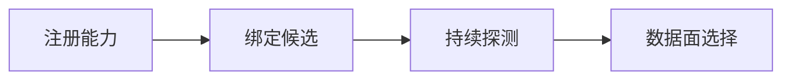

# 多模型管理平台：注册、版本、路由、健康与切换

业务配置写的是 `smart-chat`，平台切换 Qwen 新 revision 后，工具调用突然失效。健康检查仍返回 200，因为探针只问了普通文本。模型切换不只是换 endpoint：逻辑能力、制品 revision、Serving 配置和验证场景必须作为不同实体管理。


## 一次逻辑模型解析怎样避开错误切换



先看完整路径，再进入局部配置。这样即使组件名字变化，也能知道失败发生在交接之前还是之后。

### 注册能力：Control Plane

录入逻辑模型、允许能力、数据区域和策略版本。

这里不靠猜测，优先读取 registry version、capability schema。

### 绑定候选：Release Controller

关联 artifact revision、deployment 配置和验证结果。

决定下一步前需要看到 digest、engine version、candidate state。

### 持续探测：Health Controller

执行基础健康与能力探针，聚合为可路由状态。

这一动作的可观察结果是 probe type、success window、last error。处理动作应晚于取证，否则重启或重试可能覆盖最早的失败现场。

### 数据面选择：Gateway

按缓存的已发布快照选择 deployment 并记录决策版本。

可以从这些位置确认结果：model alias、deployment_id、snapshot version。若完全没有证据，先判断请求是否到达本阶段；若记录冲突，则对齐 request_id、实例和时间窗口。

## 模型、版本和部署为何不能放在一张字符串表里

这里先暂停操作，把容易混用的概念拆开。定义的价值在于划清责任，而不是增加名词数量。

| 概念 | 在这条链路中的含义 |
| --- | --- |
| Logical Model | 业务使用的稳定标识与能力契约，例如 chat、tool calling、context limit，不绑定供应商品牌。 |
| Artifact Revision | 不可变模型制品版本，包含权重、Tokenizer、模板和许可证证据。 |
| Deployment | 某个 revision 在具体区域、引擎、硬件和配置上的运行实例集合。 |
| Capability Probe | 针对声明能力的最小确定性验证，比只检查 `/health` 更接近可路由状态。 |

::: tip 判断原则
不要从产品名推断能力。把可观察输入、持久状态、失败终态和下游交接点写出来。
:::

## 路由命中不等于模型成功

| 表面现象 | 实际可能发生的事 | 下一步证据 |
| --- | --- | --- |
| HTTP health 成功 | 工具、结构化输出或长上下文能力可能已退化 | 按声明能力运行 probe |
| 切换同名模型 | revision、Tokenizer 或模板实际变化 | 将制品摘要写入候选验证 |
| 自动摘除抖动 | 单次探针失败导致频繁切换，放大流量波动 | 使用时间窗口、阈值和冷却 |
| 控制面不可用 | 数据面若依赖实时查询会一起失败 | 保留最后已验证快照并设过期策略 |

::: warning 先保留现场
如果先重启、扩容或删除对象，最早失败可能被覆盖。先确认对象身份、版本和时间线，再决定处理动作。
:::

## 用分离的数据模型表达稳定标识与运行实例

JSON 是控制面概念示例。输入为逻辑模型和一个候选 deployment；输出给网关的是已发布快照，不是边写边读的草稿。

```json
{
  "logical_model": "smart-chat",
  "capabilities": ["chat", "stream", "tools"],
  "deployment": {
    "id": "dep_20260817_a",
    "artifact_revision": "sha256:...",
    "engine": "vllm",
    "region": "cn-east",
    "state": "candidate"
  }
}
```

候选通过普通、流式、工具、长度与错误契约后才能进入 published snapshot。Gateway 不应每次请求查询多张控制面表，否则控制面抖动会进入数据面；它应消费有版本的快照，并在路由日志中写入 snapshot version。


## 把结论限制在证据范围内

模型能力不是营销名称，应由可测试契约支撑。供应商模型可能无法获得权重摘要，也要记录外部版本、区域、API 版本和核对时间。健康切换不得绕过租户区域和成本策略。

模型平台提供稳定调用能力后，Agent Runtime 才能安全地执行多步任务。下一篇沿 Turn、工具、Checkpoint、取消和恢复追踪一个长任务。
