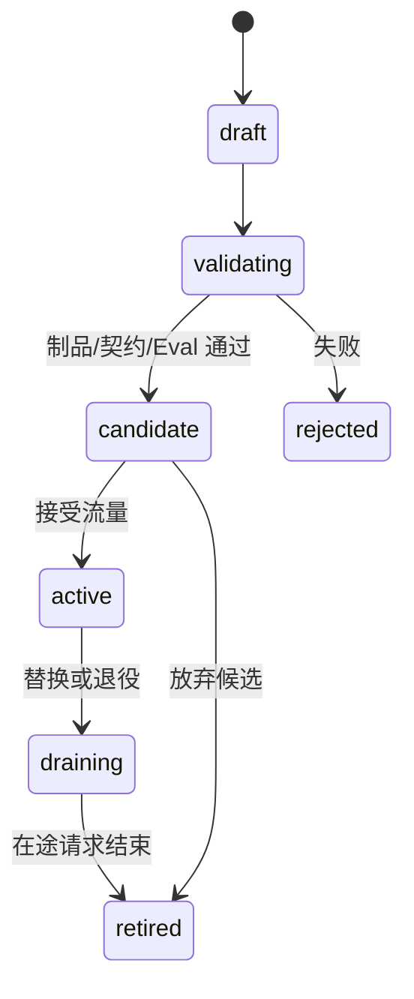

# 多模型平台：同一个“模型”至少有四种身份

控制台显示 `chat-pro` 正常，实际请求却落到已经退役的旧权重。问题是业务别名、模型制品、Deployment 和运行实例被写在同一条记录里，更新其中一个字段就悄悄改变了其他含义。

多模型平台要把控制面与数据面分开。控制面管理目录、版本、策略和发布；数据面承载真实请求。业务只依赖稳定公开模型和能力，具体供应商或自托管实例可以在受控规则下替换。

## 四种对象

| 对象 | 示例语义 | 生命周期 |
| --- | --- | --- |
| Public Model | `chat-pro`，业务稳定入口 | 产品契约，长期稳定 |
| Model Artifact | 仓库 Revision、Tokenizer、权重 | 不可变制品版本 |
| Deployment | 引擎、区域、硬件、配置、制品绑定 | 发布与回滚单元 |
| Replica/Endpoint | 某个运行实例及健康状态 | 动态运行状态 |

托管 GPT 或 Claude 没有本地权重，也仍可注册为外部 Deployment，绑定供应商 model string、区域、凭证引用、能力和限制。Qwen、DeepSeek、Llama 等自托管模型则绑定本地制品和 Serving 配置。

## Capability 代替供应商特判

Registry 可以声明文本、视觉、音频、最大上下文、工具调用、结构化输出、Embedding、流式、数据地域和安全等级。能力必须来自官方说明与实际契约测试，不由模型自己声称。

业务请求“需要 JSON Schema 与工具”时，Gateway 根据 Capability 过滤候选，而不是在代码里判断名称是否包含某个品牌。供应商字段由 Adapter 翻译，业务层只看稳定内部请求和错误。

## 控制面发布状态

Artifact 注册后先核对来源、许可证、文件和引擎兼容；Deployment 候选再验证接口、容量、安全和质量。Active 是路由资格，不等于所有流量立即切换。Draining 停止新请求并保留在途任务，Retired 仍保留历史引用和回滚信息。

## 健康包含哪些层

进程健康、模型 Ready、依赖可用、容量充足和质量合格是不同信号。运行探测适合高频自动更新，质量 Eval 适合版本发布和定期回归。不能因为几次业务失败就立即把模型判死，也不能因为 TCP 可连就视为完整能力健康。

控制面聚合信号并保留时间：最后一次成功、错误率、队列、TTFT、容量、供应商状态和熔断状态。路由使用有时效的快照，信号过期时采取保守策略。

## 切换与 Failover

版本发布先创建新 Deployment，旁路调用固定样本，逐步加入少量流量，比较错误、延迟、用量和 Eval。切换改变 Public Model 到 Deployment 的规则，不修改业务请求。旧 Deployment 在观察期保持可恢复。

运行故障 Failover 还要检查能力、数据地域、成本、Deadline 和会话一致性。模型行为不同可能让 Agent 工具参数或 RAG 引用发生变化，因此“能返回文本”不是等价替代的充分条件。

## 配置与 Secret

Registry 保存 Secret 引用，不保存明文 API Key。凭证按租户、环境和供应商隔离，并支持轮换。Deployment 配置要版本化，但健康、负载和临时熔断属于运行状态，不能写回不可变版本。

配置变更需要审计：操作者、原因、旧值、新值、审批、发布时间和回滚点。高风险动作如扩大模型权限、改变地域或启用自定义代码，应经过更严格门禁。

## 模型目录的查询与审计

平台至少提供按公开模型、能力、状态、区域、制品和引擎查询。一次请求日志记录 Public Model、选中 Deployment、Artifact Revision、路由规则版本和 Replica，才能在模型升级后复现当时行为。

最终模型平台不是“供应商下拉框”。它是一套把名称、能力、制品、部署、实例和策略分离的状态模型，使业务契约稳定、运行选择可解释、版本切换可验证、失败能够回滚。
