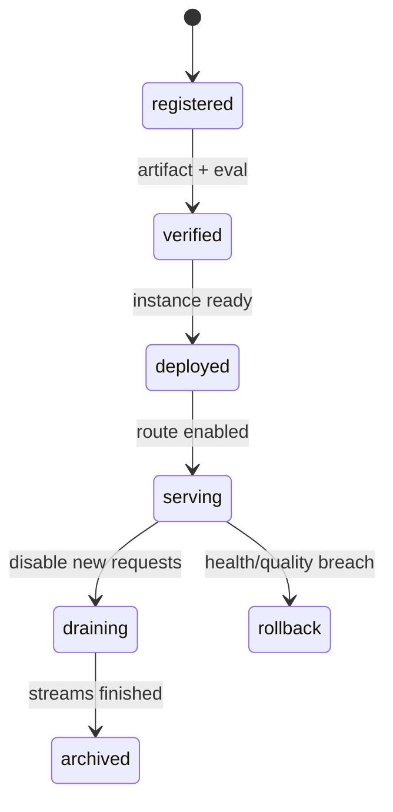

# 多模型管理平台：注册、版本、路由、健康与切换

模型服务已经上线，产品却不知道“默认模型”对应哪一份权重；切换版本后旧的 Agent 仍使用了不兼容的工具格式。多模型平台需要把模型注册、能力、部署实例和流量切换分开，控制面保存事实，数据面执行请求。

## 模型注册表保存什么

| 对象 | 字段示例 | 用途 |
| --- | --- | --- |
| Model | 公开名、模态、上下文、能力 | 给调用方稳定契约 |
| Revision | 制品摘要、Tokenizer、策略版本 | 复现、评测和回滚 |
| Deployment | 实例、节点、健康、容量 | 把 Revision 放到运行位置 |
| Route | 租户、权重、条件、有效期 | 决定请求落点 |
| Evaluation | 数据集、指标、风险备注 | 发布门槛和能力声明 |

公开模型名不应直接等于容器名或 Hub 路径。注册表中的“可用”还要区分制品已验证、实例 Ready、路由已启用和预算允许。

## 一次切换的状态变化

切换不是修改一个字符串。先让新 Revision 在旁路或小流量下通过协议、延迟、质量和安全检查，再逐步改变 Route。旧实例要排空正在进行的流式连接，并保留可回退的制品和配置。

## 能力发现要比模型名更细

“支持工具调用”“支持 JSON Schema”“上下文 128k”“可流式”都是能力声明，不能靠模型名字猜。Gateway 和 Agent Runtime 根据能力选择路径，模型平台提供版本化的 capability manifest。能力变化时要触发兼容性检查，而不是等线上 400。

## 健康管理不只看 /health

实例可能进程健康但显存接近上限，或能生成文本却无法完成工具格式。健康信号应分为进程、协议、资源和质量四层。质量信号通常来自抽样评测或业务反馈，不适合直接做每秒探针，但可以触发降权、冻结发布或回滚。下一篇把模型候选交给 Agent Runtime，讨论状态、工具和取消。

## 路由变更也需要回滚边界

将 10% 流量切到新 Revision 时，路由配置本身应有版本、审批、有效期和变更记录。监控同时按旧/新 Revision 比较协议错误、TTFT、成本、格式质量和安全拒绝率，不能只看整个模型名的平均值。

发现问题时优先撤回新 Route，保留新实例和日志供分析；不要立刻删除制品，否则无法复现。对已有长连接和 Agent Turn，要定义继续使用旧 Revision 还是在下一个 Turn 切换，避免同一状态机中途改变能力。

## 模型下线前要检查引用关系

一个 Revision 可能仍被历史 Turn、长连接、评测、回滚路由或离线任务引用。下线前先查询这些引用，再进入 draining，而不是直接删除镜像或对象。模型制品、部署实例和公开路由分别有不同生命周期。

归档后仍保留 manifest、评测和审计摘要，允许在需要时重建候选实例。真正删除前要确认没有发布版本和保留策略依赖它，这和数据库迁移清理旧字段是同一种兼容性问题。
