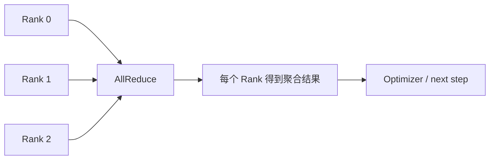

# NCCL、Collective、AllReduce 与多机 GPU 通信

多机训练中一个 GPU 进程退出，其他 rank 全部卡在 AllReduce；应用日志没有报错，网络设备日志却显示丢包。NCCL 不是“让 GPU 自动互联”的按钮，它实现 collective 通信，要求 rank、拓扑、网络和调用顺序彼此一致。

## Collective 的参与者和终点



AllReduce 让每个 Rank 对同一组数据做聚合并拿到结果。AllGather、Broadcast、ReduceScatter 等操作的参与者、数据量和顺序必须一致。一个 Rank 少调用一次，其他 Rank 就会等待。

## 通信路径受拓扑影响

| 路径 | 特点 | 诊断关注 |
| --- | --- | --- |
| GPU-GPU 高速互联 | 带宽高、延迟低 | 拓扑、P2P、可见设备 |
| PCIe | 共享根复杂、竞争明显 | NUMA、插槽和带宽 |
| 节点间网络 | 受 NIC、交换机和路由影响 | 接口、MTU、端口、拥塞 |
| 容器网络 | 还叠加 namespace 和权限 | 设备挂载、主机网络、RDMA |

NCCL 可能根据拓扑选择不同算法和通道。没有目标硬件与网络，不能写出具体带宽阈值；可以先核对 rank 映射、设备可见性和网络路径。

## 为什么会“全局挂起”

常见原因包括 rank 数不一致、某个进程在进入 collective 前因数据或 CUDA 错误退出、不同 rank 的张量 shape 不同，以及网络连接建立失败。应用层只看到等待，必须把每个 rank 的最后一个阶段、序号和错误码放到同一时间线上。

## 诊断信息要带版本和拓扑

```bash
NCCL_DEBUG=INFO NCCL_DEBUG_SUBSYS=INIT,COLL ./train.sh
python -c 'import torch; print(torch.cuda.device_count())'
ip addr
ibstat  # 仅在使用 InfiniBand 且工具存在时
```

这些是解释性诊断命令。NCCL_DEBUG 输出会很大，生产环境要控制采样和敏感信息；ibstat 只适用于相应网络。日志中至少保留 rank、host、device、communicator 和 collective 序号。

## 恢复与重试

collective 中途失败时，继续使用同一 communicator 往往不安全。训练框架需要停止整个 job，保存或丢弃明确的一致 checkpoint，再以新的 rank 集合重启。把一个 rank 单独重试，通常会让状态更加不一致。下一篇进入不可变制品和签名，讨论训练/Serving 产物怎样安全进入环境。

## 超时日志也需要关联到训练步骤

NCCL 超时本身只说明 collective 没在期限内完成，根因可能在更早的 CUDA OOM、数据加载阻塞、rank 崩溃或网络问题。训练框架应给每个 step 和 collective 记录序号，并在异常时收集所有 rank 的最后状态。

网络调优不能先盲改环境变量。先确认所有节点使用同一版本、正确网卡和可达端口，再用小规模 collective 验证基础路径，最后才评估算法、通道和拓扑。每次变更只改一个变量，保留对照证据。

## Collective 的输入必须在所有 rank 上一致

除了调用顺序一致，参与 collective 的张量 shape、dtype、device 和 group 也必须按框架约定一致。某个 rank 因条件分支跳过通信，或者数据批次导致 shape 不同，都可能表现为另一个 rank 的超时。

将通信调用封装在统一训练步骤里，避免把 collective 放进难以同步的业务分支。调试时先缩小到最少 rank 和最小张量，验证顺序，再逐步恢复真实模型和网络。
