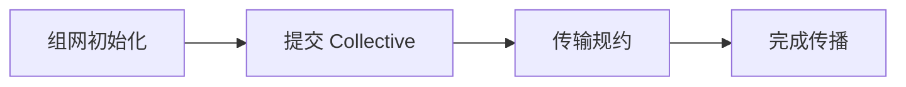

# NCCL、Collective、AllReduce 与多机 GPU 通信

八个训练进程中七个卡在 AllReduce，一个进程日志里却先出现数据加载异常。大家只盯着 NCCL timeout，以为网络丢包。Collective 是同步协作：只要某个 rank 没有进入同一个操作，其他 rank 就会在通信点等待。通信故障的第一步是确认所有进程是否以相同顺序参加，而不是立即调整网卡参数。


<InfraFigure src="/images/ai-infra/nccl-gpu-communication/hero.png" alt="多个 GPU Rank 通过 NVLink、PCIe 与网络执行 AllReduce 的插画"
  icon="communication" caption="Collective 要求通信组中的 Rank 按一致顺序参与；一个 Rank 迟到会表现为所有 Rank 等待。" />


## 一次 AllReduce 如何跨过进程与物理拓扑



先看完整路径，再进入局部配置。这样即使组件名字变化，也能知道失败发生在交接之前还是之后。

### 组网初始化发生时，先看 Launcher/NCCL

为每个 rank 分配设备，交换唯一 ID 并建立 communicator。

这里不靠猜测，优先读取 rank mapping、world size、init logs。

### 从 提交 Collective 留下的证据回到 Training Process

各 rank 以相同顺序提交相同元素数与 dtype 的操作。

决定下一步前需要看到 sequence number、tensor shape。

### 3. NCCL/Links 怎样完成传输规约

选择 NVLink、PCIe、共享内存或网络路径分块传输并规约。

这一动作的可观察结果是 topology、transport、bytes。处理动作应晚于取证，否则重启或重试可能覆盖最早的失败现场。

### 4. 完成传播：All Ranks 持有当前状态

所有参与者完成后继续训练；异常被异步传播或在 watchdog 暴露。

可以从这些位置确认结果：collective duration、timeout、failed rank。若完全没有证据，先判断请求是否到达本阶段；若记录冲突，则对齐 request_id、实例和时间窗口。

## Collective 与普通点对点发送有什么不同

这里先暂停操作，把容易混用的概念拆开。定义的价值在于划清责任，而不是增加名词数量。

| 概念 | 在这条链路中的含义 |
| --- | --- |
| Rank | 通信组中的进程编号，world size 是总 rank 数；rank 不等于物理 GPU 型号。 |
| Communicator | 包含参与 rank、设备与通信上下文的 NCCL 对象，所有成员必须一致初始化。 |
| AllReduce | 每个 rank 提供输入，经规约后每个 rank 获得相同结果，常用于同步梯度。 |
| Ring/Tree | Collective 的通信算法拓扑选择，各自在带宽、延迟和规模上有取舍，库会结合环境选择。 |
| RDMA | 网络设备直接访问已注册内存的数据路径之一，可降低 CPU 参与，但依赖 NIC、驱动、拓扑和配置。 |

::: tip 判断原则
不要从产品名推断能力。把可观察输入、持久状态、失败终态和下游交接点写出来。
:::

## 别让表面现象替你下结论

| 表面现象 | 实际可能发生的事 | 下一步证据 |
| --- | --- | --- |
| NCCL timeout | 可能是 rank 迟到、进程退出、shape 不一致或真实网络故障 | 找最早异常和 collective 序列 |
| ping 正常 | 不能证明 GPU 通信端口、MTU、RDMA 和吞吐路径正常 | 检查实际 transport 与链路 |
| 单机正常 | 跨节点新增 NIC、交换网络和路由边界 | 分别验证节点内与节点间 |
| 所有 GPU util 低 | Collective 等待或数据阶段阻塞 | 看通信 span 和 rank 状态 |

::: warning 先保留现场
如果先重启、扩容或删除对象，最早失败可能被覆盖。先确认对象身份、版本和时间线，再决定处理动作。
:::

## 从 rank 不一致到网络故障逐层排除

环境变量和日志字段仅用于诊断，输出可能暴露主机/网卡信息，应在受控日志中使用。未在真实多机集群执行。

```bash
NCCL_DEBUG=INFO NCCL_DEBUG_SUBSYS=INIT,GRAPH,NET torchrun \
  --nproc_per_node=8 train.py

# 同时核对：
# rank -> CUDA device 映射
# 所有 rank 的 collective sequence 与 tensor shape
# 节点内 NVLink/PCIe 拓扑与跨节点 NIC 选择
# 第一个出现应用异常的 rank，而不只是最后超时的 rank
```

DEBUG 日志能显示初始化、拓扑和网络选择，但开启会增加输出。若某 rank 因 OOM、数据异常或控制流分支没进入 collective，其他 rank 的 timeout 是结果而非根因。只有所有序列一致后，才继续检查端口、路由、MTU、RDMA、驱动和链路错误。


## 把结论限制在证据范围内

NCCL 会根据版本和拓扑选择算法，手动强制环境变量可能在另一集群变差。日志示例只解释字段，本章没有多机网络或 GPU 实测。

训练与推理制品最终都要进入交付链。下一阶段先建立不可变镜像、模型、SBOM、签名和环境提升，再讨论切流与恢复。
