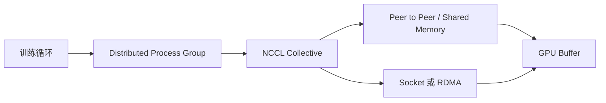

# NCCL 是什么？多张 GPU 怎样完成 AllReduce 与跨机通信

分布式训练的每个 Rank 能独立完成前向和反向，却必须在参数更新前交换梯度。张量并行还要在层之间收集或归约张量。单机可以经过 PCIe、NVLink 或 NVSwitch，跨机还要经过网卡、交换机、TCP 或 RDMA。任何一个 Rank、接口或路由异常，其他 Rank 往往只看到 Collective 超时。

NCCL 提供面向 NVIDIA GPU 的集合通信原语和拓扑选择。框架调用 AllReduce、AllGather、Reduce-Scatter 等 API，NCCL 建立通信器，选择通道与传输，把 GPU Buffer 在 Rank 间移动。它不负责模型梯度是否正确，也不调度 Kubernetes Pod。本文只做机制、命令和诊断推演，没有在真实多节点 GPU 网络实测带宽。

::: info NCCL 的准确含义

NCCL 是 NVIDIA Collective Communications Library，为多 GPU 提供高性能集合通信和点对点通信。它根据 GPU、PCIe、NVLink、网络接口和拓扑选择算法与传输，常被 PyTorch Distributed、DeepSpeed 和其他训练框架调用。

NCCL 不等于网络协议。它可以使用共享内存、Peer-to-Peer、Socket 或 RDMA 等传输。应用仍要正确建立 Rank、通信组、Buffer 和调用顺序。

:::

## NCCL 是什么，它在分布式训练中负责哪一层

NCCL 是 NVIDIA 提供的集合通信库，负责让多个 NVIDIA GPU 进程在指定通信组内交换 GPU Buffer。它提供 AllReduce、AllGather、Reduce-Scatter、Broadcast 和点对点操作，并依据设备拓扑选择本地或跨机传输路径。训练框架调用这些原语，NCCL 负责数据怎么移动，模型代码仍负责何时调用以及数据代表什么。

它解决的是“每个 Rank 都有一份局部状态，怎样按同一协议交换”的问题。数据并行反向后需要把局部梯度归约，ZeRO 需要把梯度或参数按所有权分片，张量并行需要在层之间共享中间张量。NCCL 不决定参数是否已经更新、不验证梯度数学正确，也不负责给 Kubernetes 分配 GPU，这些属于训练循环和平台控制面。

NCCL 与 TCP、RDMA 的区别是层次不同。TCP 或 RDMA 是传输路径，NCCL 可以在这些路径之上组织集合通信；与 PyTorch Distributed 的区别是，后者提供进程组和框架接口，底层可能选择 NCCL、Gloo 或 MPI。看到日志中的 `NET/Socket` 只说明某条传输路径，不等于应用已经完成一次 AllReduce。

一个简单例子是四个 Rank 各有一个梯度数组 `[1, 2]`、`[3, 4]`、`[5, 6]`、`[7, 8]`。AllReduce 求和后，每个 Rank 都应得到 `[16, 20]`；Reduce-Scatter 则可能让 Rank 0 得到 `[16]`、Rank 1 得到 `[20]`，具体分片顺序由协议决定。输入 count、dtype、Group 和调用顺序不一致时，结果可能错误或其他 Rank 永久等待。

通信调用通常进入 CUDA Stream，Host 看到函数返回不一定代表所有 GPU 都完成。同步点、异步错误和远端 Rank 退出都会改变错误出现的位置。诊断要记录 Collective 类型、Group 成员、Buffer 大小、dtype、Stream、算法和第一条失败日志，不能只抄最后的 timeout。

理解 NCCL 时还要区分“通信语义”和“通信实现”。AllReduce 规定所有参与者最后都拿到归约结果，这是语义；数据被切成多少块、走 Ring 还是 Tree、同机走 NVLink 还是 PCIe、跨机走 Socket 还是 RDMA，属于实现。训练代码依赖前者，性能调优主要观察后者。若把两层混在一起，看到算法变化就会误以为数学结果也变了，或者看到 TCP 端口可达就认定 Collective 一定能完成。

NCCL 的使用边界也很明确。它适合 NVIDIA GPU 之间的大规模集合通信，不负责通用业务消息、任务队列或数据库复制。CPU 进程之间的普通数据交换可以选择 Gloo、MPI 或应用协议，异构加速器则要看对应厂商和框架支持。即使训练框架默认选择 NCCL，应用仍要保证所有 Rank 使用兼容的张量形状、数据类型和调用顺序，库本身无法猜出某个分支为何少执行了一次通信。

Communicator 可以理解为一次通信会议的成员表和上下文。成员在初始化时确定，之后每次 Collective 都以它为范围。一个 Rank 退出后，其他成员不会自动组成一个更小的新会议继续训练，因为参数、优化器和数据步数已经可能不一致。框架通常结束整个作业，从共同 Checkpoint 建立新的进程组。这个恢复边界解释了为什么 NCCL 超时常被设置为 Job 失败，而不是在单个 Worker 内无条件重试。

下图把 NCCL 所在层级与其他组件放在一起，箭头表示调用关系，不表示 NCCL 自己创建训练进程。



图中训练循环决定一次梯度交换的时机，Process Group 提供 Rank 和 Communicator，NCCL 选择算法与传输，底层路径只负责移动字节。排障时沿这层关系向下找最早失败，才不会把模型没有调用 Collective、设备 OOM 和网络接口错误混成一个“网络问题”。

::: info 当前验证边界

本文的 Rank 数字、数组结果和跨机命令用于机制推演。没有真实两节点 GPU 环境时，只能静态检查命令、配置和日志解释，不能填写实测带宽、拓扑最优或训练加速比。

:::
## Rank、World Size 和 Communicator 分别是什么

Rank 是通信组内进程的整数编号，World Size 是组内 Rank 数量。Local Rank 通常表示进程在本节点的 GPU 索引，但它不是全局 Rank。一个进程可以加入多个 Group，每个 Group 有自己的 Rank 顺序和 Collective。

Communicator 是 NCCL 为一组 Rank 建立的通信上下文。初始化时各 Rank 获得共同 Unique ID，通过外部 Rendezvous 交换，调用 `ncclCommInitRank`或框架封装加入。成员、顺序和 World Size 必须一致。

数据并行组、张量并行组和流水线组可以不同。例如全局 16 Rank 中，每四 Rank 组成一个张量组，每八 Rank 组成一个数据组。一次 AllReduce 只在指定 Group 内发生。日志只打印 global rank 会让排障缺少组坐标。

每个 Rank 把通信操作放进 CUDA Stream。调用通常异步，错误可能在同步或后续操作出现。所有 Rank 必须以兼容顺序调用 Collective，一个 Rank 少调用一次，其他 Rank 可能等待。

Communicator 错误后是否可继续按错误类型和版本决定。设备错误、远端退出或异步错误常需要销毁通信器和重启作业。训练框架负责把 NCCL 状态转换为 Job 失败与恢复。
## AllReduce 怎样让每个 Rank 得到相同结果

AllReduce 先对所有 Rank 的同形状 Buffer 执行 Reduce，如求和，再把结果分发给每个 Rank。数据并行用它把局部梯度求和或平均，使每个 Rank 在优化器更新前看到一致梯度。

输入输出元素数量和 dtype 必须一致。一个 Rank 使用不同 count 或调用顺序，可能得到错误、死锁或数据损坏。Buffer 通常位于 GPU 显存，NCCL 直接通信，避免先复制到 CPU。

AllReduce 的数学结果与执行顺序有关。浮点加法不满足严格结合律，不同算法和 Rank 顺序会产生小数值差异。训练验证使用合理容差，系统性偏差或 NaN 需要继续调查。

框架可能把多个参数梯度打成 Bucket，再对 Bucket 做 AllReduce，以减少启动次数并与反向重叠。Bucket 越大带宽效率可能高，峰值和等待也增加。某一层反向完成后才能发送对应梯度。

AllReduce 不保存长期状态。它对当前 Buffer 通信，模型参数一致性由训练循环和所有 Rank 共同调用保证。一个 Rank 在更新前跳过 Collective，会让参数分叉。

AllReduce 的输出所有权是“每个参与 Rank 都得到归约后的完整 Buffer”。这与 Reduce 只有 Root 得到结果、Reduce-Scatter 每个 Rank 得到分片不同。选择原语前先写出输出需要完整副本还是分片，再决定是否需要额外 AllGather。一个看似能运行的 Collective，如果输出所有权错了，后续 Optimizer 可能在错误的参数上更新。

通信时间还要拆成启动延迟、有效传输和等待最慢 Rank 的时间。小 Bucket 可能被启动次数限制，大 Bucket 可能增加显存峰值；通信与反向重叠时，计算完成顺序也会决定某个 Bucket 能否及时发送。测试中只看总平均带宽，会漏掉尾部 Rank 或某层等待。
## Reduce-Scatter 和 AllGather 为什么常一起出现

Reduce-Scatter 把所有 Rank 输入先 Reduce，再把结果分片，每个 Rank 只得到一段。ZeRO Stage 2/3 使用它让梯度聚合后直接归负责 Rank，避免每个 Rank 保存完整梯度。

AllGather 做相反方向：每个 Rank 提供一个分片，所有 Rank 收集成完整结果。ZeRO Stage 3 在层计算前聚合参数，张量并行在需要完整激活时也会使用。两者组合可以实现某些 AllReduce，但状态所有权不同。

分片长度和 Rank 顺序必须一致。非整除数据可能 Padding 或使用变长支持，框架负责协议。应用自定义 Collective 时不能假设每 Rank 分片对应任意参数，要记录 offset 和布局。

Reduce-Scatter 减少每 Rank 最终 Buffer，但通信过程中仍有 Chunk 和临时空间。AllGather 暂时增加完整参数，显存峰值与 Bucket 和 Prefetch 有关。状态分片公式不能忽略通信 Buffer。

调试时记录 Collective 类型、Group、count、dtype、Stream 和参数 Bucket。看到网络带宽相同，不代表 AllReduce 与 AllGather 的语义可互换。
## Broadcast、Reduce 和点对点分别适合什么

Broadcast 让 Root Rank 的 Buffer 发送到组内所有 Rank，常用于初始化参数或配置。其他 Rank 的输入不参与计算，Root 和 count 必须一致。大模型初始化全部 Broadcast 可能形成 Root 瓶颈，分片加载更合适。

Reduce 把所有 Rank 输入归约到 Root，只有 Root 得到结果。日志统计或某些聚合可以用，但训练梯度通常需要每 Rank 更新，使用 AllReduce 更直接。错误使用 Reduce 会让非 Root 参数没有正确梯度。

Send/Recv 是点对点通信，流水线并行常在相邻 Stage 传激活和梯度。双方调用顺序、Tag 或框架协议必须匹配。环形算法内部也会使用点对点式数据传递，但应用只调用 Collective API。

Collective 选择来自算法语义，不是性能偏好。需要每 Rank 完整结果就用 AllReduce/AllGather，需要分片结果就用 Reduce-Scatter。先确定输出所有权，再调算法和通道。

不同 Collective 可以在不同 Stream 重叠，但共享网络和 GPU 拷贝资源。并发太多会争用，Profiler 需要按 Group 和 Stream 理解，不只看总带宽。
## Ring 和 Tree 算法怎样移动数据

Ring AllReduce 把 Rank 连成环，把 Buffer 切成 Chunk。Reduce-Scatter 阶段每个 Rank 向下一 Rank 发送 Chunk 并与收到数据归约，多轮后每个 Rank 拥有一段最终结果；AllGather 阶段再绕环分发各段。大消息能较好利用链路带宽。

Tree 算法使用树形上行归约和下行广播，步骤数随 Rank 数量对数增长，常对小消息和延迟敏感场景有优势。实际 NCCL 会根据消息大小、拓扑和版本选择算法，用户可通过环境变量影响，但不应无依据强制。

Channel 让通信使用多个并行数据路径。更多 Channel 可能提高带宽，也增加资源和调度开销。NCCL 建立拓扑图，选择 GPU、NIC 和 CPU 路径。算法名相同，在不同硬件上的实际路径也不同。

Ring 中一个慢 Rank 会拖慢整个环，Tree 中关键父节点异常也会影响子树。Collective 是同步依赖，平均 GPU 性能不能掩盖单个 Straggler。监控按 Rank 看通信时间和网络。

算法验证使用 nccl-tests 或框架小程序测不同消息大小，报告 algbw 和 busbw 时说明定义。测试带宽不是训练有效吞吐，训练还有计算、Bucket、同步和数据管道。
## PCIe、NVLink、NVSwitch 和网卡怎样组成拓扑

同节点 GPU 可以通过 PCIe 交换，也可能有 NVLink 直连或经 NVSwitch 全互联。GPU 到 NIC 还经过 PCIe Root、NUMA 和 GPUDirect RDMA 路径。`nvidia-smi topo -m`等工具能显示部分关系，具体字段按设备文档解释。

张量并行通信频繁，优先放在高速 GPU 域。跨节点数据并行可以使用 InfiniBand/RoCE 或 TCP。Pod 调度拿到多张 GPU，不保证它们连接方式最优；训练启动前记录实际 UUID 和拓扑。

NUMA 影响 CPU 线程、Pinned Memory 和网卡。进程绑定不当，数据可能跨 CPU Socket。网卡选择错误会让 NCCL 走管理网或低速接口。容器还要有设备、RDMA 和共享内存权限。

拓扑不是静态名称。MIG、虚拟化、云实例和驱动会改变可见路径。平台标签只能做预筛选，候选作业运行拓扑检查和小 Collective 基准，确认实际路径。

多 NIC 系统需要明确接口、路由和 Bond。NCCL 自动选择可能满足连接但不满足预期带宽。环境配置进入作业版本，不能在 Node 手工临时导出后忘记记录。

拓扑证据要与实际进程绑定。记录 GPU UUID、Local Rank、NIC 名称、NUMA 节点和 `nvidia-smi topo -m` 输出，才能解释为什么同一算法在两台机器上的路径不同。容器内看到的设备编号可能经过 `CUDA_VISIBLE_DEVICES` 重排，日志若只写 `cuda:0`，离开该进程环境后无法还原真实卡。

拓扑与通信组一起决定成本。张量并行通常频繁交换层内张量，更依赖高速 GPU 互联；数据并行的梯度交换可以跨节点，但消息大小和同步点仍会拖慢 Step。一个 Pod 获得四张 GPU，不代表这四张卡属于同一 NVLink 域，也不代表网卡位于最佳 PCIe Root。
## Socket、共享内存和 RDMA 传输有什么区别

同一主机的进程可以使用 GPU P2P、共享内存或其他本地传输。跨机 Socket 通过 TCP/IP，部署简单、兼容广，但 CPU 参与和延迟/带宽可能不如 RDMA。RDMA 让网卡更直接地访问内存，减少 CPU 拷贝，依赖硬件、驱动、网络和权限。

InfiniBand 和 RoCE 都可承载 RDMA，配置与运维不同。RoCE 对无损网络、PFC/ECN 和拥塞更敏感，InfiniBand 有自己的 Fabric 管理。NCCL 插件和 libibverbs 必须在容器可用。

GPUDirect RDMA 允许 NIC 与 GPU 显存直接传输，避免经过 CPU 主存。是否启用取决于 GPU、NIC、PCIe 拓扑、驱动和 IOMMU。看到 RDMA 接口存在不代表 GPUDirect 路径已生效。

Socket 接口用 `NCCL_SOCKET_IFNAME`等配置筛选，RDMA 设备也有相应设置。环境变量名称和语义按目标 NCCL 版本核对。错误配置可能完全无法连接，也可能回退到可用但较慢路径。

传输验证从连通、正确性、带宽和训练四层进行。ping 或 TCP 连接只证明基础网络，nccl-tests 证明 Collective，真实训练再验证 Bucket 与重叠。四层不能互相替代。
## Rendezvous 和 NCCL 初始化怎样开始

训练启动器先为每个进程设置 Rank、World Size、Master 地址和端口。框架使用 TCP Store、etcd 或其他 Rendezvous 让进程发现并交换 NCCL Unique ID。所有成员到齐后创建 Communicator。

DNS、端口、防火墙、Service 和 NetworkPolicy 任何一层错误都可能让初始化超时。一个 Pod 尚未调度，其他 Rank 也会等待。日志要显示当前世代、已加入成员和缺失 Rank，不只打印“timeout”。

容器内 Hostname 和网络接口要可达，不能把 localhost 当跨 Pod 地址。Kubernetes Job 可能重建 Pod，旧 Rank 迟到不能加入新作业。Job ID 和 Rendezvous 世代防止两组成员混合。

初始化还会探测 GPU P2P、网络插件和拓扑，创建 Channel 与 Buffer。某个 Rank GPU 不可用或共享内存不足，会在这一阶段失败，其他 Rank 可能只看到远端关闭。

超时设置要覆盖合理启动，不无限等待。Gang Scheduling 让一组 Pod 同时获得资源，减少部分启动。失败后作业控制器清理全部 Rank 和 Rendezvous 状态，再决定重试。
## NCCL 环境变量怎样用于诊断而不是永久复制

`NCCL_DEBUG=INFO`可以输出初始化、拓扑、网络和错误信息，`NCCL_DEBUG_SUBSYS`限制子系统。日志量大且含主机、接口和拓扑，只在候选或受控时间开启，公开前脱敏。

接口、算法、协议和传输环境变量可以排除错误路径，例如临时禁用某 P2P 或指定 Socket 接口。它们适合验证假设，不应把一串不理解的变量作为永久“稳定配置”。升级 NCCL 后默认选择可能改善，旧强制项反而限制性能。

异步错误处理和阻塞等待由框架和 NCCL 版本共同配置。启用后框架能更早发现失败并结束其他 Rank。配置要与启动器和超时一致，否则 Worker 退出、控制器仍认为任务运行。

日志中的 Channel、Tree 和 Ring 是实际拓扑证据，不能从一行“NET/Socket”直接推断全部流量都走 Socket。按 Rank 对齐日志，找到第一个警告和路径选择。

诊断完成后移除临时变量，保留结论、版本和必要的稳定配置。高日志级别有性能与敏感信息风险，不能在长期生产训练默认开启。
## nccl-tests 怎样测正确性和带宽

nccl-tests 提供 all_reduce_perf、all_gather_perf 等程序，能在指定 Rank、GPU 和消息大小下测 Collective。它们验证 NCCL 链路与性能基线，不运行模型。构建版本、CUDA、MPI 或启动方式要与环境匹配。

测试从小消息到训练 Bucket 大小，运行多次 Warmup 和正式迭代。输出检查 out-of-place/in-place、dtype、op、time、algbw、busbw 和 errors。带宽定义按工具文档，不与网卡线速直接等同。

下面的命令是解释性结构，主机、进程数和路径必须替换，当前未执行。

```bash
mpirun -np 8 -H node-a:4,node-b:4 \
  -x NCCL_DEBUG=INFO \
  -x NCCL_SOCKET_IFNAME=eth0 \
  ./build/all_reduce_perf -b 8M -e 1G -f 2 -g 1
```

命令启动八个进程，每节点四个，每进程一张 GPU，消息从 8MiB 倍增到 1GiB。真实环境若使用 RDMA 接口，配置不同。测试前确认这是隔离 Node，避免占用生产训练 GPU。

结果按消息大小画曲线，单节点与跨节点分开。错误数必须为零。带宽达到基线后仍要运行框架小训练，确认 Process Group、Bucket 和数据类型一致。
## 常见超时和性能问题怎样定位

Collective 超时先找最早失败 Rank。一个 Rank 在反向 OOM 或数据加载崩溃，其他 Rank 等待 AllReduce，最后报 NCCL timeout。只调大超时会把根因隐藏更久。每 Rank 日志和训练状态按时间对齐。

初始化超时检查 Rendezvous、Pod 状态、DNS、端口、NetworkPolicy、接口和 World Size。运行中超时检查设备错误、网络丢包、Straggler、调用顺序和 Buffer 大小。所有 Rank 是否进入同一个 Collective 是第一项。

带宽低先比较 nccl-tests 与训练。两者都低，查拓扑、接口、RDMA、NUMA 和网络；测试正常而训练低，查 Bucket、通信重叠、计算和小消息。只有某 Rank 慢，查该 Node 硬件和进程绑定。

错误如 `unhandled system error`、remote process exited 和 async error 需要结合前文日志。错误字符串不是唯一根因。GPU Xid、内核日志、网卡计数器和 Kubernetes 事件提供下层证据。

修复后重复同一消息大小和训练步骤，保存版本、拓扑和环境。移除临时禁用项，确认性能和正确性仍通过。一个成功的 all_reduce_perf 不能证明 Checkpoint 与训练收敛。

故障定位可以按四层证据推进：先确认所有 Rank 和 Group 成员到齐，再确认每个 Rank 是否进入同一个 Collective，接着检查 GPU、Stream 和 Buffer，最后检查接口、RDMA、路由和交换机计数器。若 Rank 5 先 OOM 退出，Rank 0 的 timeout 只是传播结果；若所有 Rank 都完成调用但带宽低，才把重点放到拓扑和传输路径。

恢复动作也有边界。通信器失效后继续复用旧 Communicator 可能产生更难解释的错误，通常由训练框架结束全部 Rank，清理 Rendezvous 和临时资源，再从一致 Checkpoint 重启。只重启一个 Worker 会让其他 Rank 等待或把旧世代成员混入新作业。
## Collective 的调用顺序怎样成为同步合同

集合通信的同步合同包含成员、顺序、count、dtype、输入输出 Buffer 和所属 CUDA Stream。所有 Rank 要以兼容顺序进入同一个 Collective，不能让 Rank 0 先做一次 Broadcast、Rank 1 直接做 AllReduce。框架通常把梯度 Bucket 按固定顺序提交，模型代码若在某个 Rank 上条件分支跳过一层，就可能让后续通信全部错位。

条件分支在数据并行中尤其容易出问题。假设一个 Rank 的 Batch 因数据过滤为空，代码提前 `continue`，其他 Rank 仍进入梯度 AllReduce，空 Batch 的进程会等待或使用未初始化 Buffer。正确做法是让所有 Rank 参与同一协议，或者由框架提供显式的空样本处理和一致的梯度缩放。日志要记录每个 Collective 的序号，便于找出第一个分叉。

Collective 的异步属性会延迟错误。函数返回后，Host 可能继续准备下一层，真正的非法访问或远端退出在 Stream 同步、下一次通信或进程结束时才出现。调试时可以临时提高同步和错误检查级别，把通信序号、Rank、Stream 和设备 Xid 对齐；验证完成后再撤销高开销诊断设置。
## nccl-tests 输出怎样解读

`nccl-tests` 适合验证 Collective 的正确性和通信基线，不是训练吞吐测试。命令输入包括进程数、每进程 GPU 数、消息起止大小、步长、dtype 和环境变量，输出通常包含迭代时间、algbw、busbw 和错误计数。algbw 与 busbw 的定义不同，不能直接与网卡标称线速比较。

消息从小到大运行，可以看到启动延迟、带宽饱和和跨节点拐点。单节点 NVLink 结果和跨节点 RDMA 结果要分开记录，Node、GPU、NCCL、CUDA、Driver、网络接口和拓扑不能省略。错误计数为零只证明测试覆盖的调用成立，不证明训练数据、梯度和 Checkpoint 都正确。

实际测试还要固定拓扑和进程绑定。Kubernetes Pod 可能拿到不同 UUID，`CUDA_VISIBLE_DEVICES` 会重排编号，MPI 或 torchrun 的 Rank 映射也会影响路径。测试后把命令、环境和日志归档到候选版本，升级驱动或 NCCL 后重新比较，不能把旧基线永远当作当前事实。
## 跨机故障怎样从第一条证据定位

输入是一条八 Rank 作业，启动器先完成 DNS、端口和 Rendezvous，随后各 Rank 交换 Unique ID 并创建 Communicator。若某个 Pod 尚未调度，其他 Rank 的初始化日志会停在等待成员；若接口可达但 RDMA 库缺失，Communicator 可能回退 Socket 或直接报系统错误。初始化阶段的证据和运行中 Collective 超时要分开看。

状态进入运行后，Rank 依次完成数据加载、前向、反向和梯度 Bucket。某个 Rank 在反向阶段 CUDA OOM 退出，其他 Rank 仍进入 AllReduce，Watchdog 过一段时间报告 timeout。最早的失败证据是该 Rank 的显存分配栈和 OOM 行，timeout 是传播结果。相反，如果所有 Rank 都完成调用而单个 Node 的网络计数器丢包，重点才转向接口、交换机和 RDMA。

修复按最小范围进行。先保存各 Rank 日志、GPU Xid、Pod 事件、拓扑、网卡计数器和 Checkpoint，再停止整个 Job，避免一个 Rank 留在旧通信组。重新启动时使用新的 Rendezvous 世代，确认所有成员、Group 和设备 UUID 一致，先跑固定数组 Collective，再跑小步训练。

验证结果包括数值一致性、错误计数、通信时间、训练 Step time 和恢复后的 Loss。只调大 NCCL timeout 可能让根因更晚出现，只切换 Socket 或 RDMA 变量可能隐藏真正的设备错误。每个临时设置都要带假设、结果和移除条件，避免把诊断手段永久写进生产环境。
## 一次跨机 AllReduce 怎样完整推演

输入是两台 Node、每台四张 GPU、八 Rank 数据并行作业。Rendezvous 给每个 Rank 分配全局和本地编号，NCCL 探测同节点 NVLink 与跨节点网卡，建立 Communicator 和 Channel。每个 Rank 完成反向，产生同形状梯度 Bucket。

AllReduce 把 Bucket 切成 Chunk，在本地和跨机路径执行 Reduce-Scatter 与 AllGather，所有 Rank 最终得到相同求和梯度。框架按 World Size 平均，优化器更新同一步参数。输出验证比较各 Rank 梯度 Hash 与参数摘要。

现在 Rank 5 在 AllReduce 前因 CUDA OOM 退出。其他 Rank 进入 Collective 后等待，Watchdog 最终报告超时和远端退出。最早证据是 Rank 5 的 OOM，不是 Rank 0 的 NCCL timeout。作业控制器停止所有 Rank，从完整 Checkpoint 恢复。

另一个故障是 Node B 选错低速接口。通信能完成但 Step time 显著变长，nccl-tests 跨机带宽低，NCCL 日志显示 Socket 接口。修正接口或 RDMA 配置后重复基准和训练，错误为零且 Step time 回到候选范围。

验证结果要同时包含正确性和性能。先用固定数组确认 AllReduce、Reduce-Scatter 与 AllGather 的数值和形状，再用训练 Bucket 大小测 warmup 后的通信时间，最后跑一小段真实训练确认梯度和 Loss 没有异常。任何一步失败都要保留输入、Group、Rank、版本和日志，不能用“能跑完 nccl-tests”替代训练恢复验证。

当前文章未在两节点八卡环境运行。实际报告必须记录 GPU/NIC 拓扑、NCCL/CUDA/Driver、交换网络、消息大小、算法、带宽、错误和训练结果，不能把示例命令输出当成真实证据。
