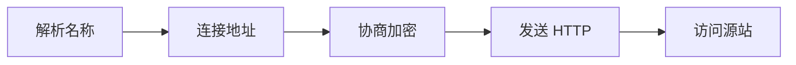

# DNS、TCP、TLS、HTTP 与代理请求链

浏览器显示“连接超时”，源站日志却一行都没有。有人重启 Nginx，有人修改应用超时，还有人怀疑证书，但这些动作没有回答最关键的问题：请求究竟有没有得到 IP、有没有建立 TCP 连接、TLS 握手完成没有、HTTP 发到了哪个 Host，以及反向代理是否成功连接源站。只有把每一层的输入和输出分开，故障才不会被一句“网络问题”吞掉。


## 从 dig 到 curl 完成一次逐层诊断

以下是可在 macOS 或 Linux 上运行的只读诊断命令。输入域名为 `api.example.com`，真实排查时替换为目标域名；输出会受当前网络、DNS 缓存和证书影响。

```bash
dig api.example.com A +noall +answer +comments
dig api.example.com AAAA +noall +answer +comments
nc -vz -w 3 api.example.com 443
openssl s_client -connect api.example.com:443 -servername api.example.com -alpn h2,http/1.1 </dev/null
curl -sv --connect-timeout 3 --max-time 15 https://api.example.com/health -o /dev/null
curl -sS -o /dev/null -w "dns=%{time_namelookup} connect=%{time_connect} tls=%{time_appconnect} ttfb=%{time_starttransfer} total=%{time_total}\n" https://api.example.com/v1/models
```

`dig` 的 `NOERROR` 只表示查询被正常处理；ANSWER 为空可能是记录类型不匹配，`NXDOMAIN` 才表示名称不存在。A 是 IPv4 地址，AAAA 是 IPv6 地址，CNAME 把一个名称指向另一个名称，TTL 表示缓存还能保留多久而不是记录永久有效。`nc` 成功证明 TCP 端口可达；`openssl` 中主机名不匹配、过期或链不受信会在 TLS 阶段失败；`curl` 已显示 `> GET` 后才算进入 HTTP。

## URL 为什么不是服务器地址的另一种写法

理解下面这些词时，要同时回答输入、状态和输出分别在哪里。它们不是可以互换的产品标签。

| 概念 | 在这条链路中的含义 |
| --- | --- |
| URL | `https://api.example.com:443/v1/models?limit=10` 同时描述 scheme、主机名、端口、路径和查询参数。浏览器必须先把主机名解析为 IP，才能向端口建立连接。 |
| DNS | 把域名等名称查询为记录的分布式命名系统。它不传输 HTTP，也不保证查询到的 IP 正在监听目标端口。 |
| TCP | 在两个 socket 之间建立有序、可靠字节流的传输协议。握手成功只说明传输通道建立，不代表证书或 HTTP 路径正确。 |
| TLS | 在 TCP 字节流上提供服务器身份验证、机密性和完整性。HTTPS 是 HTTP 运行在 TLS 之上，不是另一套业务协议。 |
| 反向代理 | 代表源站接收客户端请求，再以自己的 socket 发起第二条上游连接。客户端到代理与代理到源站是两段独立连接。 |

::: tip 判断原则
遇到新术语，先问它改变了哪份状态；如果没有状态所有者，这个名词暂时不能指导排障。
:::

## 把一次 HTTPS 请求拆成五次状态变化



图里每个节点都要产生可观察结果；没有结果时，上一节点是否真正交付就是第一项检查。

### 解析名称：Stub 与递归解析器

浏览器/OS 缓存未命中后，由递归解析器查询权威服务器，返回 A、AAAA 或 CNAME 链。

决定下一步前需要看到 `dig` 的 status、ANSWER、TTL、SERVER。

### 连接地址：客户端与内核

客户端选择 IP 和端口，TCP 通过 SYN、SYN-ACK、ACK 建立连接。

这一动作的可观察结果是 `nc`、`curl time_connect`、拒绝或超时。处理动作应晚于取证，否则重启或重试可能覆盖最早的失败现场。

### 协商加密：TLS 两端

ClientHello 携带 SNI 和 ALPN，服务端返回证书链并协商密钥。

可以从这些位置确认结果：`openssl s_client`、证书主机名、有效期、ALPN。若完全没有证据，先判断请求是否到达本阶段；若记录冲突，则对齐 request_id、实例和时间窗口。

### 发送 HTTP：客户端与代理

请求行、Headers 和 Body 进入代理，代理完成路由、鉴权或 TLS 终止。

这里不靠猜测，优先读取 `curl -v`、状态码、响应头、request_id。

### 访问源站：反向代理

代理创建上游连接，改写或转发 Host、Authorization、X-Forwarded-For。

决定下一步前需要看到 代理日志、upstream_status、502/504。

## 连接失败不等于 DNS 故障

| 表面现象 | 实际可能发生的事 | 下一步证据 |
| --- | --- | --- |
| DNS 有 IP | 只证明名称解析有结果，端口、TLS 和源站仍可能不可用 | 继续测 TCP，不要直接宣布“网络正常” |
| Connection refused | 目标 IP 可达，但该端口无人监听或被明确拒绝 | 检查监听地址、端口映射和防火墙 reject |
| Connection timed out | SYN 或响应被丢弃，也可能路由错误或安全组 silent drop | 比较不同网络和目标 IP，检查路由与过滤策略 |
| TLS hostname mismatch | 证书身份与请求域名不符，可能 SNI/虚拟主机选错 | 带正确 `-servername` 检查证书 SAN 与代理配置 |
| 502 Bad Gateway | 代理连上或调用源站时得到无效结果，常见于拒绝、协议错或上游提前断开 | 看 upstream_addr、upstream_status 和源站日志 |
| 504 Gateway Timeout | 代理等待上游超过自己的超时预算 | 区分连接超时、首字节超时和流式空闲超时 |

::: warning 结论的边界
示例输出用于建立判断路径，不应被当成目标环境的真实结果。版本、硬件和请求形状变化后要重新验证。
:::

## DNS 查询不是一次直接问答

浏览器可能先查自己的缓存，再询问操作系统。应用通常把查询交给 stub resolver；stub 不负责遍历全球 DNS，而是把问题发给配置好的 recursive resolver。递归解析器若没有有效缓存，会从根、顶级域和目标域的 authoritative server 逐级获得答案。权威服务器保存该 DNS zone 的正式记录，递归解析器则代表客户端完成查询并按 TTL 缓存。

A 记录返回 IPv4，AAAA 返回 IPv6，CNAME 把当前名称别名指向另一个名称。客户端最终仍需要 A 或 AAAA 才能建立 IP 连接。TTL 到期只意味着缓存需要重新确认；在 TTL 内看到旧地址可能是正常缓存行为。NXDOMAIN 表示被查询名称不存在，SERVFAIL 则表示解析过程失败，两者处理方向不同。

下面是教学化的 `dig` 输出，真实服务器、地址和 TTL 会不同：

~~~text
;; ->>HEADER<<- opcode: QUERY, status: NOERROR, id: 12001
;; flags: qr rd ra; QUERY: 1, ANSWER: 1

;; QUESTION SECTION:
;api.example.com.        IN  A

;; ANSWER SECTION:
api.example.com.  60     IN  A  203.0.113.10

;; SERVER: 192.0.2.53#53
~~~

`status: NOERROR` 说明 DNS 查询本身成功，ANSWER 给出 A 记录，60 是剩余 TTL，SERVER 是本机实际询问的递归解析器。这里完全没有 443 端口、TLS 证书或 HTTP 路径的信息，因此不能从这段输出推导网站可访问。

## TCP 连接的是 IP、端口和协议组成的 socket

服务端创建 socket 后，用 `bind` 把它关联到本地 IP 和端口，再调用 `listen` 建立监听队列。客户端调用 `connect` 时，内核向目标发送 SYN；服务端监听栈回复 SYN-ACK；客户端再发 ACK，三次握手完成。端口只是 16 位编号，真正区分连接的是源 IP、源端口、目标 IP、目标端口和传输协议。

~~~bash
ss -ltnp "sport = :443"
nc -vz -w 3 203.0.113.10 443
~~~

`ss` 在服务器侧回答“哪个进程在哪个地址监听”；绑定 `127.0.0.1:443` 只接受本机 loopback，绑定 `0.0.0.0:443` 才覆盖所有 IPv4 本地地址。`nc` 在客户端侧只验证 TCP。立即出现 refused 通常说明目标栈明确回复端口不可用；等待到 timeout 更像数据包被丢弃、路由不可达或过滤策略静默丢弃。

## TLS 握手先验证身份，再建立会话密钥

TCP 建立后，客户端发送 ClientHello，其中 SNI 告诉共享 IP 上的代理它想访问哪个域名，ALPN 提议 HTTP/2 或 HTTP/1.1 等上层协议。服务端返回证书链和协商参数。客户端要验证证书有效期、签发链、目标主机名是否出现在 SAN，以及签名是否可信；任一失败都发生在 HTTP 请求之前。

~~~text
subject=CN = api.example.com
issuer=C = US, O = Example CA
Verify return code: 0 (ok)
ALPN protocol: h2
~~~

这段预期输出表示证书链验证成功并协商 HTTP/2。它仍不说明 `/v1/models` 存在或 Authorization 有效。若不传 `-servername`，共享入口可能返回默认证书，从而制造与真实客户端不同的结果。

## HTTP 才开始表达业务请求

HTTP/1.1 请求由请求行、Headers、空行和可选 Body 组成；响应由状态行、Headers、空行和 Body 组成。下面的文本不是需要直接执行的命令，而是线上的字节语义：

~~~http
POST /v1/chat/completions HTTP/1.1
Host: api.example.com
Authorization: Bearer <redacted>
Content-Type: application/json
X-Request-ID: req_demo

{"model":"smart-chat","messages":[{"role":"user","content":"hello"}]}
~~~

~~~http
HTTP/1.1 200 OK
Content-Type: application/json
X-Request-ID: req_demo

{"id":"chatcmpl_demo","choices":[]}
~~~

`Host` 决定虚拟主机，Authorization 携带凭证，Content-Type 说明 Body 的解释方式，request ID 用于跨代理和应用关联。HTTP/1.1 keep-alive 可以复用 TCP 连接；HTTP/2 把多个 stream 复用到一条连接。SSE 则保持一个 HTTP 响应并持续发送事件，代理的读取超时和缓冲策略会影响 Token 何时可见。

## 反向代理制造了两条独立连接

客户端与代理完成连接 A，代理再与源站建立连接 B。代理可以终止 TLS、校验 Key、改写路径和加入 `X-Forwarded-For`；源站看到的 peer 往往是代理地址，所以必须只信任受控代理写入的转发头。代理无法连接源站、收到协议错误或上游提前关闭时常返回 502；已连接但等待上游超过预算时常返回 504。具体含义仍要结合产品日志字段。

一条可执行的排查顺序是：先用 `dig` 固定解析结果，再用 `nc` 或 curl 的 connect 时间确认 TCP，然后用 `openssl s_client` 核对 SNI、证书链与 ALPN，再用 `curl -v` 看请求是否进入 HTTP。若入口失败而直连源站成功，读取代理 upstream 地址、状态和超时；若两者都失败，回到源站监听、路由和应用日志。每一步都应记录输入、时间和结论，避免下一条命令在不同 IP 或不同实例上运行。

## 哪些结论还需要真实环境验证

HTTP/1.1 通常按请求顺序使用连接，keep-alive 允许复用；HTTP/2 在一条连接上复用多个 stream。SSE 是服务端持续发送文本事件的 HTTP 响应，不等于 WebSocket。代理缓冲会让源站已经生成的 Token 堆在代理内，所以“源站快、客户端慢”必须同时检查两段连接。

网络层解释了请求怎样到达一个进程。接下来把这个进程放进 OCI 容器，看看 namespace、cgroup、挂载和 PID 1 为什么会改变同一条证据链。
