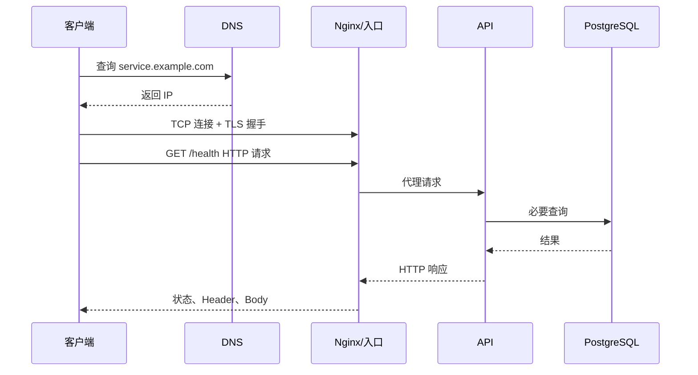

# DNS、TCP、TLS、HTTP 与代理请求链

浏览器显示“网站打不开”，这句话可能对应完全不同的问题：域名没有解析，TCP 端口没有监听，TLS 证书不匹配，Nginx 找不到上游，或者应用真的返回了 500。

本章会从一条 HTTPS URL 出发，逐层检查 DNS、TCP、TLS、HTTP 和反向代理。你会得到一份可以直接用于值班的请求链记录。示例使用 `service.example.com` 作为保留域名，不代表真实服务。

## 先画出请求走过的路



每一层都只根据自己的证据下结论。DNS 成功不代表端口可达，TLS 成功不代表 HTTP 是 200，HTTP 200 也不代表业务数据正确。

## 第一步：用 dig 检查 DNS

在客户端实际所在网络运行：

```bash
dig service.example.com A +noall +answer
dig service.example.com AAAA +noall +answer
```

第一条查 IPv4 A 记录，第二条查 IPv6 AAAA 记录。输出会包含名称、TTL、类型和地址。TTL 表示递归解析器可以缓存多久，不是“修改后一定在 TTL 秒内全球生效”的绝对承诺，因为链路上还可能存在其他缓存。

没有 answer 时查看完整响应：

```bash
dig service.example.com
```

关注 `status`：

- `NOERROR` 且无答案：名称存在，但当前查询类型没有记录。
- `NXDOMAIN`：权威 DNS 认为名称不存在。
- `SERVFAIL`：解析链出现错误，常见于 DNSSEC、权威服务或上游故障。

指定公共解析器只用于对比，不代表客户端一定使用它：

```bash
dig @1.1.1.1 service.example.com A +noall +answer
```

命令输入是指定解析器和域名，输出仍是状态码、TTL 与地址；本地解析与公共解析不同时，记录各自服务器和时间，再查权威记录。不要看到不同 IP 就立刻认定污染，CDN、地理调度和轮询本来就可能返回不同地址。对比完成后再用 `curl` 验证某个地址是否真的能完成 TLS 和 HTTP，而不是只凭 DNS 输出下结论。

## 第二步：验证 TCP 是否能建立连接

DNS 得到地址后，HTTPS 默认连接 TCP 443。`curl` 可以同时完成 TCP、TLS 和 HTTP，但先用详细时间拆解：

```bash
curl -o /dev/null -sS \
  -w 'dns=%{time_namelookup} connect=%{time_connect} tls=%{time_appconnect} first_byte=%{time_starttransfer} total=%{time_total}\n' \
  https://service.example.com/health
```

这些时间是从请求开始累计的：`time_connect` 包含 DNS 后到 TCP 建连，`time_appconnect` 到 TLS 完成，`time_starttransfer` 到首字节。要看某阶段耗时，应做相邻差值，而不是把它们直接相加。

常见错误语义：

- `Connection refused`：目标主机主动拒绝，常见于无监听或防火墙 REJECT。
- `Connection timed out`：在超时内没完成，可能是丢包、防火墙 DROP、路由或目标繁忙。
- `No route to host`：本机路由或网络不可达。

只靠 `ping` 不能证明 TCP 443 可达。有些网络允许 HTTPS 但禁 ICMP，也有主机能 ping 通却没有监听应用端口。

服务端同时使用上一章的 `ss -lntp 'sport = :443'` 和防火墙规则核对。云环境还要区分主机防火墙、网络 ACL、负载均衡和安全组。

## 第三步：用 openssl 拆开 TLS 握手

```bash
openssl s_client \
  -connect service.example.com:443 \
  -servername service.example.com \
  -showcerts </dev/null
```

`-connect` 指定地址和端口，`-servername` 发送 SNI。一个 IP 托管多个域名时，服务端靠 SNI 选择证书；漏掉它可能拿到默认站点证书。

检查：

1. 叶子证书的 Subject Alternative Name 是否包含目标域名。
2. `notBefore` 与 `notAfter` 是否覆盖当前时间。
3. 服务端是否发送了完整中间证书链。
4. 最后的 `Verify return code` 是否为 0。
5. 协商的 TLS 版本和密码套件是否符合客户端要求。

`openssl s_client` 的输出很长，不能只看到证书文本就判断成功。证书过期、名称不匹配、缺少中间证书和本机信任库问题要分开记录。

需要检查证书日期时：

```bash
openssl s_client -connect service.example.com:443 \
  -servername service.example.com </dev/null 2>/dev/null \
  | openssl x509 -noout -subject -issuer -dates -ext subjectAltName
```

管道左侧取得服务端实际发送的证书，右侧只输出主体、签发者、有效期和域名列表，便于保存为排障证据。这是只读检查；自动续期是否正常，还要核对证书管理器日志和下一次演练时间。

## 第四步：用 curl 查看真正的 HTTP 交换

```bash
curl --verbose --fail-with-body \
  --connect-timeout 3 --max-time 10 \
  https://service.example.com/health
```

`--verbose` 会显示请求和响应 Header，但可能包含敏感信息，粘贴到工单前要脱敏。`--connect-timeout` 只限制建连阶段，`--max-time` 限制整个请求。

重点记录：最终 URL、状态码、响应 Header、Body 摘要和各阶段耗时。状态码先按协议理解：

| 状态 | 常见含义 | 下一步 |
| --- | --- | --- |
| 301/308 | 永久跳转 | 看 `Location`，检查循环和方法保留 |
| 401 | 未认证 | 查凭证与挑战，不等同于权限不足 |
| 403 | 已识别但不允许 | 查主体、策略和资源范围 |
| 404 | 当前路由不存在 | 区分入口 404 与应用 404 |
| 429 | 限流或配额 | 看 `Retry-After` 和准入指标 |
| 502 | 代理没拿到有效上游响应 | 查 upstream 连接、协议和进程 |
| 504 | 代理等待上游超时 | 对齐代理、应用和下游 Deadline |

跟随跳转时使用 `--location`，同时用 `--max-redirs` 限制次数。诊断阶段先看第一跳，避免自动跳转掩盖错误入口。

## 第五步：绕过 DNS做对照，但保留域名语义

怀疑 DNS 指向错误地址时，可以让 curl 临时把域名解析到指定 IP：

```bash
curl --resolve service.example.com:443:203.0.113.10 \
  --verbose https://service.example.com/health
```

`203.0.113.10` 属于文档示例地址。`--resolve` 只影响这次 curl，URL 中仍是原域名，因此 TLS SNI 和 HTTP Host 都保持正确。直接访问 `https://IP/` 往往会因证书和虚拟主机不匹配产生新的干扰。

对照结果：正常 DNS 失败、`--resolve` 成功，说明问题更可能在 DNS 或调度；两者都失败，继续看目标入口；两者都成功，则检查用户所在网络、缓存或浏览器差异。

## 第六步：理解 Nginx 到上游的第二条连接

客户端与 Nginx 的连接成功后，Nginx 还要独立连接 API。代理至少要正确传递这些信息：

- `Host`：用户访问的主机名。
- `X-Forwarded-For`：代理链中的来源地址列表。
- `X-Forwarded-Proto`：外部是 HTTP 还是 HTTPS。
- W3C Trace Context：让入口和应用 Trace 连起来。

只有可信代理才能追加和重写这些 Header。应用若直接相信任意客户端发送的 `X-Forwarded-For`，攻击者可以伪造来源 IP。框架的 `trust proxy` 应限制可信入口或代理跳数。

Nginx 访问日志建议同时记录请求时间和上游时间，例如 `$request_time`、`$upstream_connect_time`、`$upstream_header_time`、`$upstream_response_time`、`$upstream_status`。如果总时间长而上游时间短，问题可能在客户端传输或入口；如果上游响应时间长，再进入应用 Trace。

## 第七步：给超时建立一份预算

“请求超时”必须说明哪一层的哪个计时器触发。常见计时器包括：

1. 客户端总超时。
2. 负载均衡或 Nginx 读写超时。
3. 应用整体 Deadline。
4. 数据库连接、查询超时。
5. 模型或外部 HTTP 超时。
6. 流式连接的空闲与总时长限制。

内层超时应早于外层，并为错误映射和终态返回留时间。例如入口 30 秒断开，应用可以使用 27 秒 Deadline，下游调用再使用当前剩余预算的一部分。不要每层都配置 30 秒；串行步骤会把总时长不断放大。

连接超时、首字节超时和连接空闲超时也不是一回事。SSE 长连接可能总时长很长，但需要通过心跳避免被空闲超时清理；普通 API 则应有明确总 Deadline。

## 故意排查三种现象

### 域名能解析，但 curl 连接拒绝

保存 dig 结果和目标 IP；服务端用 `ss` 查 443；若 Nginx 只监听环回地址，修监听并先 `nginx -t`。如果端口被其他进程占用，查 PID 与配置，不要直接杀掉来源不明进程。

### TLS 成功，但返回 502

客户端到入口正常。查看 Nginx 错误日志、`upstream_status` 和 `upstream_connect_time`；在入口主机或容器网络内直接请求上游健康接口。常见原因是上游进程未启动、服务名解析失败、端口错或 HTTP/HTTPS 协议配错。

### 偶尔 504，应用日志没有请求

先判断请求是否到达应用。入口的上游连接时间若已经超时，应用当然没有日志；若入口记录已连接但没有响应，再查应用线程、连接池和下游。把同一个 request/trace ID 加入入口与应用，能避免只靠时间猜测。

## 形成一份请求链记录

| 层 | 检查 | 证据 | 结论 |
| --- | --- | --- | --- |
| DNS | `dig A/AAAA` | 状态、TTL、地址、解析器 | 名称指向哪个入口 |
| TCP | curl timing、服务端 `ss` | connect 时间、监听 PID | 端口能否建立连接 |
| TLS | `openssl s_client` | SAN、日期、链、verify code | 身份与加密是否成立 |
| HTTP | `curl -v` | 状态、Header、Body、首字节 | 协议结果是什么 |
| Proxy | 访问/错误日志 | upstream 状态与耗时 | 入口还是上游故障 |
| App | Trace、日志、依赖指标 | 路由、版本、下游 Span | 业务阶段在哪里失败 |

迁移练习：给一条流式 SSE 路由做同样检查。记录首个事件时间、心跳间隔、代理缓冲与空闲超时；让客户端主动断开，确认取消是否传到应用。下一章会把服务装入容器，继续处理 Namespace、cgroup 和 PID 1。
