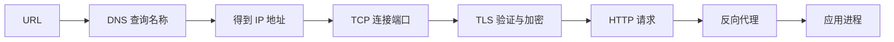
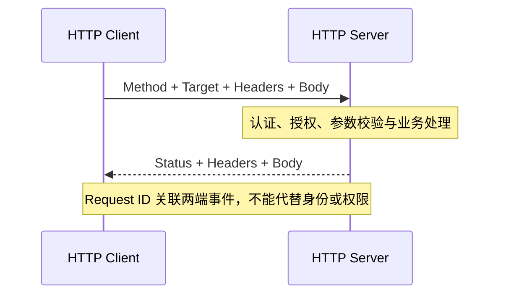
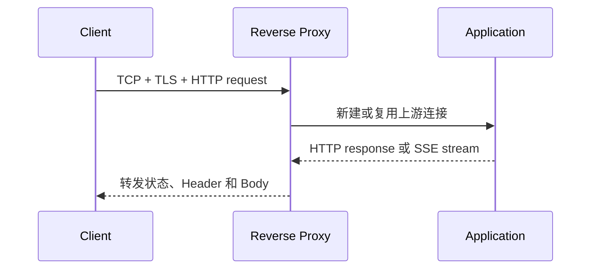

# DNS、TCP、TLS 和 HTTP 分别是什么？一次请求怎样到达服务器

在浏览器输入 `https://api.example.com/v1/models` 后，浏览器不能直接把这串文字交给远端应用。它先要从 URL 中取出协议、主机名、端口和路径，把主机名查询成网络地址，再和该地址建立连接。HTTPS 还要验证服务器身份并协商加密，之后才能发送 HTTP 请求。

这些步骤由不同协议完成。DNS 负责名称查询，TCP 提供可靠字节流，TLS 在字节流上验证身份并加密，HTTP 定义客户端和服务器怎样表达请求与响应。反向代理会在客户端和真正的应用之间再建立一条连接。任意一层失败，浏览器都可能只显示“无法访问”或“连接超时”，服务端应用日志甚至一行都没有。



这张图表示依赖顺序，不表示每层只交换一个数据包。DNS 可能命中多级缓存，TCP 会重传丢失的数据，TLS 和 HTTP/2 也有自己的状态。排查时按顺序确认每层输入和输出，可以避免在 DNS 尚未得到地址时就修改应用超时。

## URL 是资源地址的描述，不是服务器本身

URL 是 Uniform Resource Locator 的缩写，中文常译为统一资源定位符。它描述如何访问一个资源，常见结构包括 scheme、host、port、path、query 和 fragment。浏览器根据这些部分决定使用什么协议、连接谁、请求什么内容。

以 `https://api.example.com:8443/v1/models?limit=10#result` 为例，`https` 是 scheme，说明使用运行在 TLS 上的 HTTP；`api.example.com` 是主机名；`8443` 是显式端口；`/v1/models` 是路径；`limit=10` 是查询参数；`result` 是 fragment，通常只由客户端处理，不发送给服务器。

主机名不是 IP 地址。人们使用域名是因为名称便于记忆，也能在服务器地址变化时保持调用入口稳定。客户端必须先通过 DNS 获得 A 或 AAAA 等记录，才能选择目标 IP。URL 中没有显式端口时，客户端根据 scheme 使用默认值，HTTP 常用 80，HTTPS 常用 443。

路径也不是服务器磁盘路径。`/v1/models` 只是 HTTP 请求目标，Nginx 或应用路由会决定怎样处理它。服务器可以把路径映射到函数、代理上游或静态文件，不应该从 URL 推断远端一定存在同名目录。

::: info URL 各部分解决的问题

scheme 决定通信规则，host 指定要找的名称或地址，port 指定目标服务入口，path 与 query 表达应用资源和参数。URL 描述访问意图，DNS、TCP、TLS 和 HTTP 分别把这份意图变成可传输的操作。

:::
## DNS 是什么，域名怎样变成 IP 地址

DNS 是 Domain Name System 的缩写，中文是域名系统。它是一套分布式命名系统，客户端可以查询一个名称对应的记录。最常见的结果是 IPv4 或 IPv6 地址，也可以得到别名、邮件服务器和其他数据。DNS 不负责传输 HTTP，也不保证查询到的地址上有进程监听。

浏览器需要访问 `api.example.com` 时，通常先检查自身缓存和操作系统缓存。应用把问题交给本机的 stub resolver，stub 再询问配置的递归解析器。递归解析器若没有未过期答案，会从根服务器获得顶级域线索，再找到目标域的权威服务器，最后把结果返回客户端并缓存。

递归解析器代表客户端寻找答案，权威服务器保存某个 DNS zone 的正式记录。二者角色不同。公司内部解析器还可能根据网络位置返回私网地址，公共解析器返回公网地址，因此在两台机器执行相同查询，结果不一定相同。排障需要记录实际询问的解析器和返回记录。

A 记录保存 IPv4 地址，AAAA 记录保存 IPv6 地址。CNAME 表示当前名称是另一个名称的别名，解析器还要继续查询目标名称的地址。TTL 是记录允许缓存的秒数，剩余 TTL 为零附近时解析器会重新确认；TTL 内仍看到旧地址可能是正常缓存，不等于权威记录没有修改。

NXDOMAIN 表示被查询的名称不存在。NOERROR 但 ANSWER 为空可能只是所查记录类型没有结果，比如名称只有 A 记录却查询 AAAA。SERVFAIL 表示解析器无法完成查询，可能涉及权威服务器不可用、DNSSEC 校验或上游故障。三种状态的处理方向不同。

```bash
dig api.example.com A +noall +answer +comments
dig api.example.com AAAA +noall +answer +comments
dig api.example.com CNAME +noall +answer +comments
```

一段教学化输出如下，`203.0.113.10` 属于文档示例地址，不代表真实服务器：

```text
;; ->>HEADER<<- opcode: QUERY, status: NOERROR, id: 12001
;; flags: qr rd ra; QUERY: 1, ANSWER: 1

;; ANSWER SECTION:
api.example.com.  60  IN  A  203.0.113.10
```

`status: NOERROR` 表示查询正常完成，ANSWER 给出 A 记录，60 是返回时的 TTL。它只能证明解析器给出了地址，不能证明 443 端口可达、TLS 证书正确或 `/v1/models` 存在。若应用和 `dig` 结果不同，还要检查应用使用的解析库、缓存、容器 DNS 与 IPv4/IPv6 选择。

DNS 缓存存在于多个位置。浏览器、操作系统、递归解析器和应用进程都可能保存答案，各自遵循的刷新时机不完全相同。权威服务器已经把 A 记录改到新地址，某个长时间运行的客户端仍可能复用旧连接，甚至没有再次发起 DNS 查询。验证变更时要区分“权威记录已经更新”“当前解析器已经刷新”和“现有连接已经切换”。

负缓存同样受时间影响。解析器收到 NXDOMAIN 后可以缓存名称不存在的结论，在记录刚创建时，部分客户端仍会暂时失败。盲目重复修改记录会让时间线更混乱。更合适的做法是查询权威结果、记录 TTL 和 SOA 信息，再分别询问业务实际使用的递归解析器。

DNS 还可能返回多个地址。客户端会按自己的地址选择和连接策略尝试，某个地址故障时，另一地址可能成功。只测试列表中的第一个 IP 无法代表用户行为；只用域名测试又可能不知道本次连到了哪一个实例。`curl` 的 `remote_ip`、服务端访问日志和负载均衡实例标识需要在同一请求上对齐。

内部服务发现也常使用 DNS。Docker Compose 把服务名解析到项目网络中的容器地址，Kubernetes Service 有自己的集群 DNS 名称。这里仍然只解决名称到地址，后端端点是否 Ready、端口是否匹配由容器和集群对象决定。名称能解析却没有可用 Endpoint，应用依旧无法建立连接。
## IP、端口和 socket 怎样确定通信双方

IP 地址用于在网络中标识接口并路由数据包。IPv4 常写成四段十进制数，IPv6 使用更长的十六进制表示。一个域名可以返回多个 IP，用于负载分布和容灾；一台服务器也可以拥有多个地址。DNS 名称与 IP 不是永久一一对应关系。

端口是 TCP 或 UDP 头部中的 16 位编号。操作系统用目标地址、目标端口和传输协议把到达的数据交给对应 socket。Web 服务器通常监听 TCP 443，PostgreSQL 常见 5432，这些只是约定和默认配置，实际服务可以使用其他端口。

socket 是操作系统提供的通信端点。服务端创建 socket，调用 `bind` 绑定本地地址和端口，再调用 `listen` 等待连接。客户端创建 socket 并调用 `connect` 指定目标。一个已建立 TCP 连接通常由源 IP、源端口、目标 IP、目标端口和协议共同区分，客户端临时端口让同一台机器能够同时建立多条连接。

监听 `127.0.0.1:8000` 只接受本机回环连接，监听 `0.0.0.0:8000` 覆盖本机所有 IPv4 接口。容器有自己的网络命名空间，容器内的 `127.0.0.1` 指向容器自身，不是宿主机或另一个服务。端口映射和反向代理都在不同网络边界之间转交连接。

```bash
ss -ltnp 'sport = :443'
ip route get 203.0.113.10
```

`ss` 在服务端回答哪个进程监听哪个本地地址。`ip route get` 显示内核准备使用的出口接口、下一跳和源地址，它不发送 HTTP 请求。两条命令分别观察本地 socket 和路由选择，不能替代客户端侧的连通性验证。
## TCP 是什么，三次握手建立了什么

TCP 是 Transmission Control Protocol 的缩写，中文是传输控制协议。它在两个 socket 之间提供有序、可靠的字节流。应用写入的字节可能被拆成多个网络段，TCP 使用序号、确认、重传和流量控制，让接收方按顺序读取。TCP 不理解 HTTP 方法、JSON 和 Token，它只处理字节。

客户端连接服务器时先发送 SYN，携带初始序号。服务端监听队列接受该请求后回复 SYN-ACK，既确认客户端序号，也提供自己的初始序号。客户端再发送 ACK，双方进入已建立状态。三次握手确认两个方向都能交换初始控制信息，并建立连接状态。

握手成功只说明连接建立。服务器可能随后在 TLS 阶段返回错误，也可能在 HTTP 层拒绝鉴权。握手失败则发生在应用收到 HTTP 之前。服务端端口没有监听时，内核通常返回 RST，客户端很快看到 connection refused；防火墙静默丢包或路由异常时，客户端反复等待重传，最终出现 timeout。

TCP 是字节流，没有消息边界。应用一次 `write` 的内容，对端可能分多次 `read`，多次写入也可能在一次读取中出现。HTTP/1.1 通过请求行、Header、Content-Length 或分块编码划分消息，HTTP/2 在连接中定义 Frame 和 Stream。应用不能把一次 socket 读取误认为完整业务消息。

```bash
nc -vz -w 3 api.example.com 443
curl -sS -o /dev/null \
  --connect-timeout 3 \
  -w 'remote_ip=%{remote_ip} connect=%{time_connect}\n' \
  https://api.example.com/health
```

`nc` 成功只验证 TCP 连接，没有发送有效 HTTPS 请求。`curl` 的 `time_connect` 包含 TCP 建立所需时间，`remote_ip` 说明本次实际选择的地址。如果 AAAA 记录存在但 IPv6 路径不可用，客户端可能先等待 IPv6 再回退 IPv4，表现为连接变慢；排查时要分别固定地址族验证。

TCP 还支持保持连接。HTTP/1.1 keep-alive 可以在一条 TCP 连接上顺序发送多个请求，减少重复握手。连接池保存的是可复用连接，不保证远端永远有效。代理、NAT 或服务器可能在空闲后关闭连接，客户端借出前或失败后要按协议处理，而不是无限重试可能已产生副作用的请求。
## TLS 是什么，HTTPS 为什么需要证书

TLS 是 Transport Layer Security 的缩写，中文通常称传输层安全协议。它运行在可靠字节流之上，为通信提供服务器身份验证、机密性和完整性。HTTPS 就是 HTTP 通过 TLS 连接传输。TCP 建立后，客户端还不能直接相信对端就是目标域名，需要在 TLS 握手中验证身份。

客户端发送 ClientHello，包含支持的 TLS 版本、密码套件、随机数和扩展。SNI 扩展携带客户端想访问的主机名，让共享同一 IP 的服务器选择正确证书。ALPN 扩展用来协商 HTTP/2 的 `h2` 或 HTTP/1.1 等上层协议。服务端返回 ServerHello、证书链和密钥协商信息，双方据此建立会话密钥。

证书把公钥和域名身份绑定在一起。客户端检查证书有效期、签名链和 Subject Alternative Name，目标主机名必须出现在 SAN 中。根证书通常预装在操作系统或应用信任库里，中间证书由服务器随握手提供。服务器漏发中间证书时，有些已缓存中间证书的客户端可能成功，干净环境中的客户端却失败。

SNI 与 HTTP `Host` 不在同一阶段。SNI 在 TLS 握手中发送，用于选择证书和 TLS 配置；`Host` 在 TLS 完成后的 HTTP 请求里发送，用于选择虚拟主机和路由。两者通常使用相同域名，但代理测试时可能分别被改写。证书验证成功也不说明 HTTP 鉴权成功。

```bash
openssl s_client \
  -connect api.example.com:443 \
  -servername api.example.com \
  -alpn h2,http/1.1 \
  -showcerts </dev/null
```

需要关注输出中的证书 subject、issuer、SAN、有效期、协商协议和 `Verify return code`。`0 (ok)` 表示当前 OpenSSL 信任库完成了证书链验证，仍要确认命令确实使用目标域名和正确网络。省略 `-servername` 可能得到入口的默认证书，制造与浏览器不同的结果。

TLS 错误要按验证项处理。主机名不匹配检查访问域名、SNI、证书 SAN 和代理虚拟主机；证书过期检查当前时间和证书更新；unknown CA 检查信任库与完整链。临时加 `-k` 跳过验证只适合隔离诊断，它不能作为正式修复，否则客户端失去确认服务器身份的能力。

比如访问 `api.example.com` 时，证书的 SAN 里必须包含这个主机名，证书签发给同一 IP 并不够。客户端先验证“我连接的入口是否被可信机构授予这个名字”，再建立会话密钥。这个例子也说明 TLS 解决的是通信身份、机密性和完整性，用户是否有权调用 `/v1/models` 仍要由 HTTP 层的认证和应用授权处理。
## HTTP 是什么，请求和响应怎样表达业务

HTTP 是 Hypertext Transfer Protocol 的缩写，中文是超文本传输协议。它定义客户端怎样发送请求、服务器怎样返回响应。HTTP 消息表达方法、目标、Header、Body 和状态，运行在 TCP 或其他可靠传输之上。浏览器页面、JSON API 和 SSE 都可以使用 HTTP。

HTTP/1.1 请求以请求行开始，包含方法、路径和协议版本，随后是 Header、空行和可选 Body。响应以状态行开始，随后同样有 Header 和 Body。下面的文本展示字节语义，不是需要直接在 Shell 执行的命令。



```http
POST /v1/chat/completions HTTP/1.1
Host: api.example.com
Authorization: Bearer <redacted>
Content-Type: application/json
X-Request-ID: req_demo_01

{"model":"chat-default","messages":[{"role":"user","content":"hello"}]}
```

`Host` 让服务器选择虚拟主机，`Authorization` 携带凭证，`Content-Type` 说明 Body 的编码，request ID 用于关联日志。服务器不能信任客户端随意提供的用户 ID 或租户范围，真实身份要从凭证和服务端授权上下文取得。日志也不应记录完整 Authorization。

状态码表达 HTTP 层结果。2xx 表示请求按服务器定义成功处理，4xx 通常表示请求、身份或权限问题，5xx 表示服务器处理失败。状态码不能代替业务结构，HTTP 200 的 Body 里仍可能包含模型拒答或部分结果；反过来，429 可以准确表示当前请求被限流，并不等于整个服务损坏。

HTTP/1.1 可以复用连接，但同一连接上的响应顺序受请求顺序影响。HTTP/2 把消息拆成 Frame，用多个 Stream 在一条连接上复用，Header 会压缩传输。协议改变连接使用方式，不会自动改变 REST 路径、鉴权和业务含义。ALPN 决定 TLS 连接上采用哪个 HTTP 版本。

SSE 使用 `text/event-stream` 响应保持连接，服务端持续写入以空行结束的事件。它适合模型逐 Token 输出，是服务器到客户端的单向流，不等于 WebSocket。代理或应用缓冲会让事件在中间积累，客户端最后一次看到整段文字，HTTP 状态仍可能是 200。

HTTP Header 在代理链中有信任边界。客户端可以自由填写大部分 Header，因此源站不能因为看到 `X-User-ID` 就认定用户身份。入口完成鉴权后，应通过受控网络或签名上下文把可信身份交给内部服务，并覆盖客户端同名字段。`Authorization`、Cookie 和 Prompt 等敏感数据只传给确实需要的组件。

请求 ID 也不负责鉴权。它是关联事件的标识，客户端自带的值可能重复或恶意构造。入口可以验证格式、限制长度，或者生成内部 Trace ID 并把外部 ID 作为关联字段。日志、错误响应和上游调用使用一致标识，排障时才能知道代理的 504 对应哪一次源站等待。

HTTP Body 可能很大。模型请求带长上下文，文档接口还会上传文件，代理和应用需要分别设置大小上限、读取超时与临时存储策略。请求在代理层因 body too large 被拒绝时，应用没有日志是正常现象；把应用限制调大不会改变入口限制。限制位置要写进错误语义，让客户端知道应该缩小输入，而不是不断重试。

流式响应开始后，服务器通常已经发送状态行和 Header，后续生成失败无法再把状态码改成 500。SSE 需要用事件类型或结构化错误表达流内终态，客户端收到连接关闭时还要区分正常 `[DONE]`、明确错误和没有终态的中断。重连是否重放取决于接口是否保存事件序号，不能假设重新 POST 一次不会重复计费或工具动作。
## 反向代理是什么，为什么会出现两条连接

反向代理位于客户端和源站应用之间，代表源站接收请求，再以客户端身份连接内部上游。Nginx、Envoy 和云负载均衡器都可以承担这类角色。客户端只知道公开入口，源站可以隐藏在私网，并由代理统一处理 TLS、路由、限流和日志。

客户端到代理是连接 A，代理到源站是连接 B。两条连接有独立的地址、端口、协议、超时和连接池。入口可以使用 HTTPS，内部上游使用 HTTP；也可以两段都使用 TLS。客户端连接正常不代表代理能够连接源站，源站正常也不代表公开入口证书和路由正确。

代理会根据 server name、Host、路径和方法选择上游。它可能改写路径，添加 `X-Forwarded-For`、`X-Forwarded-Proto` 和请求 ID。源站只能信任由受控代理写入的转发头，若公网客户端可以绕过代理直连并伪造 Header，应用会得到错误的来源身份。

502 Bad Gateway 常表示代理连接上游失败、协议不匹配、上游提前关闭或返回无效响应。504 Gateway Timeout 表示代理等待上游连接或响应超过配置预算。具体产品对错误的细节不同，需要同时看 access log 中的 upstream 地址、upstream 状态与时间，以及源站同一 request ID 的日志。



图里代理终止了客户端 TLS，内部是否再次使用 TLS 要由部署决定。代理读取上游响应后可能缓冲、压缩或分块发送。普通 JSON 与流式 SSE 的策略通常不同，不能为了流式关闭全站所有缓冲，也不能让短连接超时直接套用到长时间生成。

反向代理与正向代理的区别在于“谁为谁寻找目标”。正向代理代表客户端访问外部站点，客户端通常知道代理地址并把目标交给它；反向代理代表服务器接收外部请求，客户端只看到公开入口，源站地址和内部拓扑可以隐藏。两者都可能建立连接池和改写 Header，但信任边界、路由责任和审计字段不同。例如办公网络的出站代理正常，不能证明企业 API 的反向代理能连到模型服务。
## 用分层命令完成一次请求诊断

诊断从固定输入开始：目标 URL、当前网络、执行时间和期望结果。先解析 URL，确认域名、端口和路径；再读取 DNS；随后验证 TCP、TLS 和 HTTP。每条命令只回答自己覆盖的问题，不从早期成功推导后续一定成功。

```bash
dig api.example.com A +noall +answer +comments
nc -vz -w 3 api.example.com 443
openssl s_client -connect api.example.com:443 \
  -servername api.example.com -alpn h2,http/1.1 </dev/null
curl -sv --connect-timeout 3 --max-time 15 \
  https://api.example.com/health -o /dev/null
curl -sS -o /dev/null -w \
  'dns=%{time_namelookup} connect=%{time_connect} tls=%{time_appconnect} ttfb=%{time_starttransfer} total=%{time_total}\n' \
  https://api.example.com/v1/models
```

第一条得到名称记录；第二条只建立 TCP；第三条检查 TLS 证书、SNI 和 ALPN；第四条通过详细输出显示 HTTP 请求与响应；第五条记录各阶段时间。`time_starttransfer` 包含服务器开始返回首字节前的等待，不等同于模型首 Token 延迟，代理、应用排队和响应头都在其中。

| 现象 | 当前层的解释 | 下一步 |
| --- | --- | --- |
| NXDOMAIN | 名称不存在 | 核对拼写、zone 和查询的解析器 |
| 有 A 记录但 TCP refused | 地址可得，目标端口明确拒绝 | 检查监听地址、端口映射和防火墙 reject |
| TCP timeout | 握手未完成 | 检查路由、安全组、丢包和地址族 |
| 证书主机名不匹配 | TLS 身份与访问域名不符 | 核对 SNI、SAN 和虚拟主机 |
| HTTP 401 | 已进入 HTTP，凭证无效或缺失 | 检查授权配置，不回头修改 DNS |
| 502 | 代理未得到有效上游响应 | 对齐代理 upstream 字段和源站日志 |
| 504 | 代理等待上游超过预算 | 区分连接、首字节和流式空闲超时 |

若公开入口失败而同网络内直连源站成功，差异通常位于代理的上游地址、协议、Header 或超时。直连和入口都失败，继续检查源站监听与应用。诊断时不要用 `curl -k` 的成功证明证书正确，也不要用 Ping 代替 TCP 和 HTTP。

网络证据具有时间和位置。DNS 缓存会变化，负载均衡可能选择不同实例，办公室网络与服务器网络也可能经过不同代理。记录实际 IP、证书摘要、request ID 和时间窗口，才能和服务端日志对齐。下一篇把已经能够监听和通信的进程放进容器，解释网络命名空间、cgroup 和挂载为什么会改变同一组命令看到的结果。

完成排查后，应保留最小证据而不是保存完整敏感流量。域名、实际远端 IP、协议版本、证书摘要、HTTP 状态、各阶段耗时和脱敏请求 ID 通常足以支持回放；Authorization、Cookie、完整 Prompt 和响应正文不应进入普通排障记录。需要检查正文时，使用受权限控制的独立存储并记录访问审计。

复测时继续使用相同 URL、解析器、网络位置和超时预算，并记录新的实例与时间。输入条件改变后得到的成功结果，不能直接证明原来的故障已经修复。
## 浏览器看到的地址和应用看到的请求可能不同

浏览器地址栏里的 URL 经过代理、服务工作线程、缓存和重定向后，应用收到的 Host、路径和协议可能已经变化。HTTP 301 或 302 会让客户端重新发起请求，新的 URL 可能拥有不同域名和证书。浏览器缓存的 200 也可能让服务器日志没有对应记录，排查时需要禁用缓存或使用带时间戳的只读路径确认请求确实发出。

代理转发 `X-Forwarded-Proto: https` 时，应用可以知道客户端最初使用了 HTTPS；如果应用无条件相信这个 Header，绕过代理的客户端可以伪造协议状态。真实部署要限定可信代理网络，并由入口覆盖而不是拼接不可信输入。`X-Forwarded-For` 也可能包含多个地址，解析策略应写清哪些位置是受信任的。

HTTP 的请求体还可能经过压缩、分块和编码转换。`Content-Length` 描述当前消息体长度，不能与业务字段里的文件大小混为一谈。代理在读取完整请求体前可能拒绝过大请求，应用因此没有机会写日志。上传和流式请求要分别设置读取超时、大小上限和取消策略，不能只调整一个总超时。
## 超时要按阶段分配

“请求超时”通常包含 DNS 查询、TCP 连接、TLS 握手、代理到上游的连接、等待首字节、读取响应和客户端消费等多个阶段。一个很大的总超时掩盖不了阶段间的不匹配。比如代理连接上游只允许 3 秒，而模型排队可能需要 10 秒，客户端永远看不到应用有机会返回的结果。

连接超时限制建立 TCP 的等待时间，TLS 超时通常包含握手中的读取，读取超时限制两次读取之间允许的空闲时间。SSE 连接可以持续很久，但如果模型长时间没有事件，代理可能按 read timeout 断开。心跳事件可以证明连接仍然有数据，不能假装模型已经生成 Token。

```text
DNS lookup       0.012s
TCP connect      0.031s
TLS handshake    0.087s
proxy connect    0.004s
time to headers  0.420s
first SSE event  0.781s
stream total     6.204s
```

这组数字是解释性输出。它把客户端耗时拆成可比较的阶段，`first SSE event` 更接近用户感受到的首个 Token 时间，但仍可能包含应用组装首事件和代理读取。容量规划和告警应分别记录连接失败、首字节慢、事件间隔过长和总回答时间。
## HTTP 错误为什么不能只按状态码修复

同一个 502 可能来自源站拒绝连接、源站返回了截断的 HTTP 响应、代理与上游协议版本不匹配，或者应用在发送 Header 后提前退出。状态码只提供粗粒度分类，真正的判断需要 upstream_addr、upstream_status、连接耗时、响应头是否已发送和源站 request ID。

同样，504 也不一定说明模型计算太慢。代理可能连错地址、等待连接池空闲、等待 TLS 上游握手或等待应用首字节。对流式请求来说，首 Token 已经发送后才长期没有事件，和从未收到 Header 是两种不同故障。日志字段要能区分这些时间点。

客户端重试还会改变故障。GET 通常更容易做到安全重试，POST 模型请求可能产生费用、写入审计或触发工具调用。网关按错误类型选择重试，必须传递幂等键并限制次数。TCP 重传由协议自动处理，HTTP 重试由应用决定，两者不能混为同一个“网络重试”。

网络这一层的学习结果不是记住五个缩写，而是能够回答请求目前在哪条边界。DNS 结束后得到什么地址，TCP 建立了哪一个 socket，TLS 验证了哪个域名，HTTP 发送了哪些字段，代理把请求送给了哪个上游。只有这些问题能被证据回答，应用日志里的“请求失败”才有继续分析的入口。
