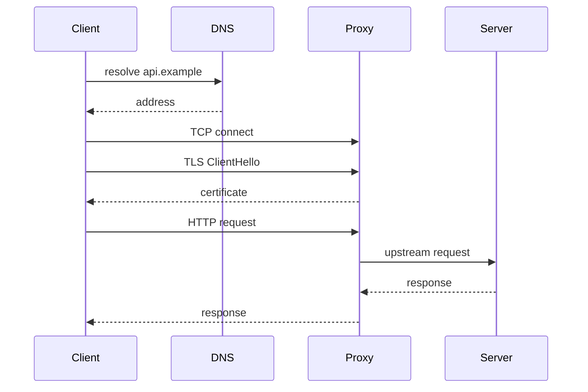

# DNS、TCP、TLS、HTTP 与代理请求链

浏览器报“连接超时”，源站日志却没有任何请求。这个现象通常不是一个故障，而是 DNS、TCP、TLS、HTTP 或代理链中的某一段没有完成。把 URL 当成一条可观测的请求路径，才能知道下一条证据应该在哪里。

## 同一个 URL，实际上要走五段路



DNS 只给出地址，不保证端口可达；TCP 建立连接，不代表 TLS 证书和 SNI 正确；TLS 成功后，HTTP Host、路径、认证和代理超时仍可能失败。源站没有日志时，优先怀疑请求还没有走到源站，而不是先修改应用。

## 逐层收集证据

```bash
dig +short api.example.com
curl -v --connect-timeout 3 https://api.example.com/health
curl -sS -o /dev/null -w 'dns=%{time_namelookup} connect=%{time_connect} tls=%{time_appconnect} ttfb=%{time_starttransfer} total=%{time_total}\n' https://api.example.com/v1/models
openssl s_client -connect api.example.com:443 -servername api.example.com </dev/null
```

curl 的时间字段把总耗时拆成解析、TCP、TLS、首字节和总时间。它们不是性能真相，但能告诉你延迟预算在哪一段消失。openssl 只帮助查看证书和握手，不能证明 HTTP 路由可用。

## 代理改变了谁拥有连接

| 位置 | 连接对象 | 常见超时/错误 |
| --- | --- | --- |
| 客户端 | 客户端到边缘代理 | DNS、TCP、证书、SNI |
| 代理 | 代理到源站 | upstream connect/read timeout |
| 源站 | 应用监听与处理 | 队列、线程、数据库或模型排队 |
| 流式响应 | 同一连接持续发送事件 | 缓冲、idle timeout、断线重试 |

代理可能终止 TLS，也可能透传；它可能重写 Host、路径和请求头。排查时要同时看客户端的 request ID、代理访问日志和源站日志，确认请求是否到达、是否转发、是否被重试。

## 超时不是越长越好

给每一段分配预算：解析和连接通常是秒级，模型首 Token 可能更长，流式连接还要考虑事件间隔和最大总时长。上游的 read timeout 必须覆盖合理的生成间隔，但不能无限等待一个已经失去心跳的连接。超时后是否重试，还要看请求是否产生了副作用。

## 边界：代理成功不等于业务成功

::: tip
**判断方法**

先用健康检查验证网络与进程，再用带 request ID 的真实接口验证认证、模型和流式行为。两者都通过，才能把问题移交给业务或模型层。下一篇会说明容器如何让“进程正常”与“宿主机可达”同时成立。
:::

## 把失败留在发生的那一层

DNS 返回多个地址时，客户端可能按 IPv6/IPv4、缓存或 Happy Eyeballs 策略选择不同路径。TCP connect timeout 多半发生在路由、防火墙或监听之前，TLS alert 则发生在建立加密会话期间，HTTP 502/504 通常意味着代理已经拿到了请求但上游失败或超时。错误码只是起点，不能跳过链路位置。

对同一个 request_id，记录客户端开始时间、代理接收/转发时间、源站开始/结束时间。四个时间点足以判断是客户端网络、边缘、上游连接还是应用处理。没有统一 ID 时，不要用相近时间戳强行拼出因果。

## 认证头也会在代理层改变语义

反向代理若没有正确转发 Authorization、Host、X-Forwarded-For 或 request ID，源站可能把合法请求判成未认证，或把所有用户记成同一个 IP。另一方面，不能无条件信任客户端自己填写的 X-Forwarded-For，因为它可以伪造。

需要明确哪一跳负责清理并重建可信转发头，哪一跳终止 TLS，哪一跳生成 request ID。把这些规则写进代理配置和应用日志字段，故障时才不会在两套身份记录之间来回猜。
