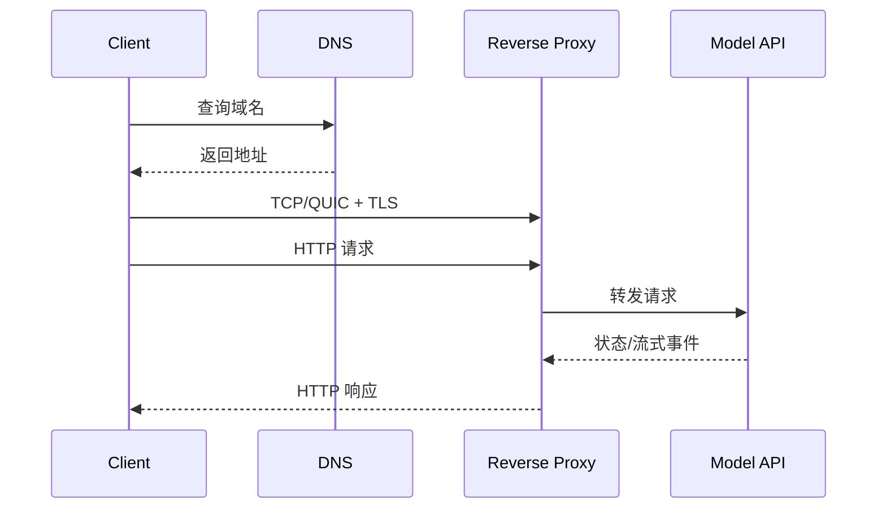

# DNS、TCP、TLS、HTTP 与代理请求链

浏览器显示 504，应用日志却没有这次请求。这个现象已经排除了很多“模型太慢”的猜测：请求可能没有到达应用，504 也可能由反向代理或上游网关生成。网络排障要沿层次向前走，不能从最终状态码直接跳到业务代码。

我们把输入固定为一个 URL、请求时间和客户端网络环境。输出不是一句“网络有问题”，而是 DNS 结果、连接目标、证书身份、HTTP 响应者、代理 upstream 与各层耗时组成的证据链。

## 五层请求路径



DNS 把名称映射到地址；传输层建立可用连接；TLS 证明对端身份并协商加密；HTTP 传递方法、路径、Header、Body 和状态；代理再选择源站并管理连接。任一层成功，只能证明该层到当前节点成功，不能替代下一层证据。

## DNS：先确认查到了谁

DNS 结果可能受本地缓存、递归解析器、不同记录类型、负载均衡和 TTL 影响。`A` 与 `AAAA` 记录可能指向不同网络路径；客户端优先 IPv6 时，IPv4 正常也不能证明请求一定成功。

解析结果正确的标准不是“有 IP”，而是返回地址属于预期入口、TTL 合理、不同解析器没有意外分叉。变更域名后，还要考虑旧缓存仍在 TTL 窗口内，不能把传播期当作随机故障。

## TCP、TLS 与 HTTP 分开验证

下面命令都是只读诊断。把域名、端口和路径换成目标系统。命令的输入是同一个公网入口，观察结果分别回答解析、握手、证书和 HTTP 响应问题。

```bash
# 分层记录域名、证书、状态码和各阶段耗时。
dig +short api.example.com A
dig +short api.example.com AAAA
openssl s_client -connect api.example.com:443 -servername api.example.com </dev/null
curl --verbose --output /dev/null \
  --write-out 'connect=%{time_connect} tls=%{time_appconnect} first_byte=%{time_starttransfer} total=%{time_total}\n' \
  https://api.example.com/health
```

`dig` 输出解析地址；`openssl s_client` 中应核对证书主题、SAN、签发链和有效期，`-servername` 用于发送 SNI；`curl` 的 verbose 输出能看到连接目标、TLS 协议、请求 Header 与响应 Header。`time_connect` 主要覆盖建连，`time_appconnect` 包含 TLS 完成时间，`time_starttransfer` 还包含服务端等待。若建连很快而首字节很慢，才有理由继续检查代理排队和应用处理。

## HTTP 状态码是谁生成的

401 说明请求到达了某个理解鉴权的组件，但不证明一定到达业务服务；502 常表示代理无法获得有效上游响应；503 可能来自没有可用实例、主动过载或维护策略；504 通常表示作为网关的组件等待上游超时。

要确认响应者，应结合 `Server`、`Via`、请求 ID、代理访问日志和应用日志。为每次请求生成或透传稳定的 `request_id`，就能核对入口日志是否有记录、选择了哪个 upstream、上游状态与耗时是多少、应用是否建立对应 Trace。

## SSE 为什么比普通 HTTP 更容易暴露问题

模型流式响应在一个长连接中持续发送事件。代理若默认缓冲，会等待积累更多数据后再发给客户端，于是模型已经生成 Token，用户仍看不到。连接空闲超时、客户端断开、压缩、心跳和慢消费者也会影响行为。

流式成功要观察事件到达间隔，而不只是最终 200。代理应关闭不必要的响应缓冲，应用应定期发送合法心跳或事件，断开后要把取消传给模型服务。网络层停止发送不等于 GPU 自动停止生成，这是跨层取消链的问题。

## 超时预算必须从外向内递减

如果浏览器等待 30 秒，代理等待 60 秒，应用调用模型等待 90 秒，客户端早已放弃，内部仍会继续消耗资源。合理做法是从外层 Deadline 推导内层剩余预算：入口留出传输和错误返回时间，Agent 再为检索、工具与模型分配更短预算。

重试也占预算。连接建立失败可能安全重试，已经发送请求但结果未知时则要考虑幂等和计费。对流式请求盲目重试，可能产生两次推理与两份账单。

## 最小证据表

| 层 | 必要证据 | 常见误判 |
| --- | --- | --- |
| DNS | 记录类型、地址、TTL、解析器 | 有 IP 就表示域名正确 |
| 连接 | 目标地址、端口、连接耗时 | ping 不通就表示 HTTPS 不通 |
| TLS | SNI、SAN、证书链、有效期 | TCP 成功就表示 HTTPS 可用 |
| HTTP | 方法、路径、状态、响应者、首字节 | 504 一定是模型生成慢 |
| 代理 | upstream、上游状态、连接/响应耗时 | 入口 200 就表示源站健康 |

沿这张表定位时，每一步都应产生能被下一位工程师复查的输出。只有确定断点以后，才进入 Nginx、应用、数据库或模型服务的具体排查。
