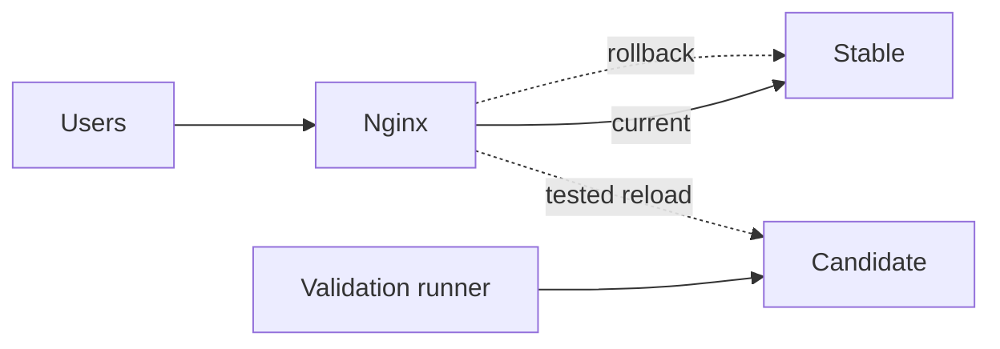

# Nginx 与反向代理

反向代理是公网协议与应用之间的信任边界：终止 TLS、规范化 Host/转发头、限制资源、路由流量并记录上游结果。很多“应用偶发 502”“SSE 一次性吐完”“HTTPS 无限重定向”和客户端 IP 伪造，根因都在代理语义没有明确。

## 请求经过代理后哪些信息可信

客户端可以自己发送 `X-Forwarded-For`、`X-Forwarded-Proto`。Nginx 应覆盖/按受信代理链追加；应用只在直接连接来自受控代理时读取这些头。公网客户端不能决定自己是 HTTPS、来自哪个 IP 或属于哪个 Host。

```nginx
map $http_x_request_id $request_id_from_client {
    default $request_id;
    ~^[A-Za-z0-9._-]{1,80}$ $http_x_request_id;
}

proxy_set_header Host $host;
proxy_set_header X-Forwarded-Host $host;
proxy_set_header X-Forwarded-Proto $scheme;
proxy_set_header X-Forwarded-For $proxy_add_x_forwarded_for;
proxy_set_header X-Request-ID $request_id_from_client;
```

如果 Nginx 前还有 CDN/LB，用 `set_real_ip_from` 只列其稳定网段，再指定真实 IP header 与递归规则。不能信任 `0.0.0.0/0` 提交的真实 IP 头。应用的 trusted proxy 配置与实际链路一致，否则限流、审计、Secure Cookie 和重定向都可能错误。

Host 使用允许列表 server block；未知 Host 返回拒绝，防止 Host header 注入影响绝对 URL、密码重置链接和缓存。

## 一份可审查的基础代理配置

```nginx
upstream application_current {
    zone application_current 64k;
    server app-stable:8000 max_fails=3 fail_timeout=5s;
    keepalive 64;
}

server {
    listen 443 ssl http2;
    server_name docs.example.invalid;

    client_max_body_size 8m;
    client_header_timeout 10s;
    client_body_timeout 30s;
    send_timeout 30s;

    location /api/ {
        proxy_http_version 1.1;
        proxy_set_header Connection "";
        proxy_set_header Host $host;
        proxy_set_header X-Forwarded-Proto $scheme;
        proxy_set_header X-Forwarded-For $proxy_add_x_forwarded_for;
        proxy_connect_timeout 3s;
        proxy_send_timeout 30s;
        proxy_read_timeout 30s;
        proxy_pass http://application_current;
    }
}
```

`proxy_connect_timeout` 控制连接上游，`proxy_send_timeout`/`proxy_read_timeout` 通常是连续写/读操作之间的超时，并非简单整个请求总时长。业务总 deadline 仍由应用传播。把所有 timeout 调成一小时会把卡死请求和连接无限保留。

上游 Keepalive 要清空 hop-by-hop `Connection`，连接池大小与上游实例/文件描述符匹配。不要对非幂等写随意配置失败自动切另一个 upstream，原请求可能已经产生副作用。

## TLS、HSTS 与证书生命周期

只启用当前支持的 TLS 版本和经验证套件，证书自动续期并监控到期。私钥权限最小，不进镜像公共 Layer和日志。HTTP 到 HTTPS 使用固定允许 Host，不反射任意 Host。

HSTS 会让浏览器在有效期内强制 HTTPS，错误配置不能靠删除响应头立刻撤销。先小 `max-age` 验证，确认所有子域都支持后再考虑 `includeSubDomains`，提交 preload 更是长期承诺。

OCSP、Session Resumption、HTTP/2/HTTP/3 的具体配置随 Nginx/OpenSSL/部署平台版本变化，要以当前官方文档和浏览器测试为准。HTTP/2 Server Push 已不再作为主流性能优化；使用 preload、103 Early Hints 或资源优先级时仍需实测。

## 静态资源和 HTML 使用不同缓存语义

带内容哈希的 JS/CSS/字体可长期不可变缓存；HTML/运行时配置保持短缓存或协商缓存，确保新入口能引用新资源。

```nginx
location ~* ^/assets/.+\.[a-f0-9]{8,}\.(js|css|woff2|png|webp)$ {
    root /srv/site;
    add_header Cache-Control "public, max-age=31536000, immutable" always;
    try_files $uri =404;
}

location = /index.html {
    root /srv/site;
    add_header Cache-Control "no-cache" always;
}

location / {
    root /srv/site;
    try_files $uri $uri/ /index.html;
}
```

SPA fallback 不能应用到 `/api` 或静态资源缺失，否则 404 JS 返回 HTML 200，产生难诊断 MIME 错误。Source Map 默认不公开；上传到监控系统后从公开产物排除，或经过授权提供。

预压缩 `.br/.gz` 与动态压缩选择要带正确 `Vary: Accept-Encoding`。对已经压缩的图片/视频或 SSE 不盲目压缩；压缩敏感响应需评估侧信道。

## SSE：关闭每一层的缓冲

SSE 要尽快发送响应头和事件。Nginx 配置：

```nginx
location /api/events/ {
    proxy_http_version 1.1;
    proxy_set_header Connection "";
    proxy_buffering off;
    proxy_cache off;
    gzip off;
    proxy_read_timeout 75s;
    add_header X-Accel-Buffering no always;
    proxy_pass http://application_current;
}
```

应用每个事件以空行结束并 flush，定期发送心跳使间隔小于代理 read timeout。CDN、Ingress、框架压缩 middleware 也可能缓冲，仅改 Nginx 不一定够。自动测试测量首事件延迟和分段到达，不能只看最终响应正文正确。

连接断开只代表通道变化，业务任务事件先持久化，重连用 `Last-Event-ID`/游标补发。发布切流前让旧实例停止新连接并排空，客户端退避重连新实例。

## WebSocket：Upgrade 只是开始

```nginx
map $http_upgrade $connection_upgrade {
    default upgrade;
    '' close;
}

location /socket/ {
    proxy_http_version 1.1;
    proxy_set_header Upgrade $http_upgrade;
    proxy_set_header Connection $connection_upgrade;
    proxy_read_timeout 60s;
    proxy_send_timeout 30s;
    proxy_pass http://application_current;
}
```

服务端仍需 Origin 校验、认证、消息大小/速率、心跳、背压和事件恢复。增加 read timeout 并不能检测业务卡死；心跳必须小于空闲超时。连接很多时调整 worker connections、文件描述符、上游容量并压测。

## 上传、下载与请求缓冲

普通 API 先缓冲请求体可保护慢上游，但大文件会占代理临时磁盘并推迟应用接收。大上传可使用对象存储直传，或专用 location 调整 `client_max_body_size`、`proxy_request_buffering off`，同时让应用流式读取、有总大小限制和超时。

关闭 request buffering 会把慢客户端连接直接占住上游，不是免费优化。按接口选择，而不是全局关闭。下载使用 `X-Accel-Redirect` 时内部路径由服务端映射，客户端不能直接提交文件系统路径；设置 Range、Content-Disposition 和权限。

## 限流与资源保护

Nginx 可做入口粗粒度请求/连接限制，应用继续做按用户/租户/操作的业务配额。

```nginx
limit_req_zone $binary_remote_addr zone=api_per_ip:10m rate=20r/s;
limit_conn_zone $binary_remote_addr zone=connections_per_ip:10m;

location /api/ {
    limit_req zone=api_per_ip burst=40 nodelay;
    limit_conn connections_per_ip 20;
    proxy_pass http://application_current;
}
```

IP 在 NAT/代理场景可能多人共享，不能作为唯一身份；先正确配置 real IP。对登录、上传和模型调用使用不同 zone。返回 429 并提供合理 Retry-After；过严全局限制会把代理变成拒绝服务点。

请求头、URI、body、连接数和速率都有边界。错误页隐藏版本与内部 upstream；`server_tokens off` 只是减少信息，不替代补丁更新。

## 安全响应头由资源模型决定

CSP 优先 nonce/hash 与逐步 Report-Only，上线前覆盖第三方脚本、Worker、字体和连接来源。`frame-ancestors`、`X-Content-Type-Options: nosniff`、Referrer-Policy、Permissions-Policy 根据页面能力配置。不要复制一份模板后用 `unsafe-inline *` 让其失去意义，也不要在 Nginx 与应用重复输出冲突头。

Cookie 的 Secure/HttpOnly/SameSite 由应用 `Set-Cookie` 正确设置；Nginx 可以做兜底属性调整，但不能理解每种 Cookie 的业务语义。CORS 也应在单一层管理，并按允许 Origin 返回 `Vary: Origin`，禁止凭证场景使用 `*`。

## 候选验证与原子切流

新版本以独立 upstream/容器启动，先通过内部候选地址验证健康和最小业务。不修改当前流量、不停止旧实例。切流只改变 upstream 指针/配置行：



配置修改前保存明确备份，运行 `nginx -t`，通过后 `nginx -s reload`。Reload 是优雅加载：旧 Worker 可继续处理现有连接，新 Worker 使用新配置；仍需检查进程和日志是否真正加载成功。

切流后同时检查公网入口、直接代理入口、关键 API、SSE 首事件、错误率和 upstream latency。旧实例保留观察期。若触发阈值，只把 upstream 改回并 reload，不重启数据库/缓存或删除候选。

## 日志、指标与隐私

```nginx
log_format upstream_json escape=json
  '{"time":"$time_iso8601","requestId":"$request_id",'
  '"method":"$request_method","uri":"$uri","status":$status,'
  '"requestTime":$request_time,"upstreamTime":"$upstream_response_time",'
  '"upstreamStatus":"$upstream_status","upstream":"$upstream_addr"}';
```

使用规范化 `$uri`，避免默认把敏感 query string 写日志；Authorization、Cookie 不记录。状态码按含义诊断：499 常是客户端/上游代理提前关闭，502 是上游协议/连接问题，504 是上游超时；不能全部归类“应用错误”。

上游有多个 attempt 时 `$upstream_*` 可能是逗号分隔序列，日志解析要保留。面板按版本/upstream 标记切流，关注连接数、等待、各状态码、request/upstream time 差值、SSE/WebSocket 连接与 reload 失败。

## 验证矩阵

| 场景 | 通过条件 |
| --- | --- |
| 伪造 Forwarded 头 | 应用只看到受信代理重写后的值 |
| 未知 Host | 不进入默认业务站点 |
| TLS 续期/重载 | 新证书生效，旧连接可排空 |
| 静态发布 | HTML 更新，旧哈希资源仍可按策略访问 |
| SSE | 首事件及时、心跳不中断、重连补发 |
| WebSocket | Upgrade、空闲、消息上限和排空正确 |
| 大上传 | 大小/超时生效，临时磁盘受控 |
| 候选失败 | 当前 upstream 不变 |
| 配置语法失败 | `nginx -t` 阻止 reload |
| 切流回滚 | 只改 upstream 即恢复，不动状态依赖 |

```bash
nginx -t -c /etc/nginx/nginx.conf
curl --fail --silent --show-error --resolve docs.example.invalid:443:198.51.100.10 \
  https://docs.example.invalid/health/ready
curl --no-buffer --max-time 5 https://docs.example.invalid/api/events/example
```

命令中的域名和资源均为中性示例。自动验收运行在隔离候选，验证后清理临时配置和证书，不写入仓库。

## 常见误区

- 无条件相信客户端 `X-Forwarded-*` 和 Host。
- 所有请求统一超长 timeout，掩盖卡死和资源泄漏。
- SPA fallback 把缺失 JS/API 返回成 HTML 200。
- SSE 只在应用 flush，代理/CDN 仍缓冲。
- WebSocket 配完 Upgrade 就忽略认证、背压和恢复。
- 全局关闭上传缓冲，使慢客户端直接拖住所有上游。
- HSTS 一次开启长周期和全部子域，没有回退窗口。
- `nginx -s reload` 前不执行配置测试，也不看 reload 结果。
- 候选未验证就覆盖旧 upstream，失败时重启整套依赖。
- 访问日志记录完整 query、Token 和用户正文。

## 参考资料

- [Nginx Proxy Module](https://nginx.org/en/docs/http/ngx_http_proxy_module.html)：upstream、缓冲、超时、Header 与转发语义。
- [Nginx WebSocket proxying](https://nginx.org/en/docs/http/websocket.html)：Upgrade/Connection 和隧道空闲超时。
- [HTTP Semantics RFC 9110](https://www.rfc-editor.org/rfc/rfc9110.html)：方法、状态、字段和缓存相关语义。
- [WHATWG Server-sent events](https://html.spec.whatwg.org/multipage/server-sent-events.html)：SSE 的 Content-Type、事件 ID 与重连。
- [OWASP HTTP Headers Cheat Sheet](https://cheatsheetseries.owasp.org/cheatsheets/HTTP_Headers_Cheat_Sheet.html)：安全响应头及其适用边界。
