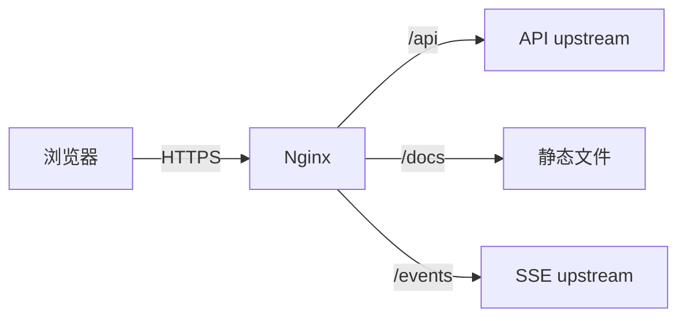

# Nginx 与反向代理

本篇目标是让初学者能解释一个请求如何在静态文件、API 和事件流之间路由，并亲手验证配置。开始前需要知道域名、端口和 HTTP 状态码；示例以 VitePress 文章刷新 404 为贯穿问题，先理解路径映射，再接触缓存和切流。

Nginx 位于浏览器和应用之间，可以终止 TLS、提供静态文件并把 `/api/` 转给后端。配置看起来只是路径转发，但错误的请求头、缓存和 fallback 会造成登录异常、SSE 延迟，或者文章刷新直接 404。

本篇先代理普通 API，再处理 VitePress 静态文章、哈希资源和 SSE。每次修改都先执行配置语法检查，再用真实 GET 验证正常页和不存在页。

## 请求通过代理后发生了什么

浏览器连接 Nginx，Nginx 重新连接 upstream。客户端可以伪造 `X-Forwarded-For` 和 `X-Forwarded-Proto`，代理应覆盖或按受信链追加；应用也只信来自受控代理的这些头。Host 使用允许列表，避免绝对链接、缓存和重置邮件受到 Host 注入。



## 步骤一：代理普通 API

连接、发送和读取超时含义不同，它们通常控制相邻 I/O 操作，而不是完整业务 Deadline。应用仍要传播总预算。非幂等写请求不应因 upstream 失败被代理随意重试到另一个实例，因为原实例可能已经提交副作用。

## 步骤二：让 VitePress 深层路由刷新可访问

VitePress 生成的无扩展路由通常对应磁盘上的 `path.html`。用户在站内跳转由客户端路由接管；直接刷新 `/docs/agent-practice/01-system-boundaries` 时，Nginx 必须尝试同名 `.html`。若只查 `$uri` 和 `$uri/`，磁盘文件存在却匹配不到，就返回 404。

下面是静态博客的最小规则。输入是无扩展 URL，输出是对应 HTML；随机不存在地址仍返回真实 404。它不同于管理后台 SPA 的统一 `index.html` fallback。

```nginx
server {
    root /srv/blog;

    location /assets/ {
        try_files $uri =404;
        add_header Cache-Control "public, max-age=31536000, immutable";
    }

    location / {
        if ($uri ~ ^(.+)/$) { return 308 $1; }
        try_files $uri $uri.html $uri/ =404;
        add_header Cache-Control "no-cache";
    }
}
```

`root` 把 URL 映射到站点构建目录；`location /assets/` 单独管理带哈希静态资源；第一条 `if` 只把文章末尾斜杠规范化为无斜杠地址；`try_files` 依次尝试原文件、同名 `.html` 和目录。`=404` 保留真实不存在状态。

这里的 `if` 只执行 `return`，用途明确；不要把复杂代理和变量改写堆进 Nginx `if`。这条 `$uri.html` 正是修复生产文章刷新 404 的关键。不能把所有未知博客地址都回退到首页，否则服务器对不存在文章返回 200，形成 Soft 404，也会掩盖内部坏链接。若构建产物使用目录 `index.html` 形式，则顺序按实际文件布局调整并测试。

## 步骤三：静态资源和 HTML 分开缓存

带内容哈希的 JS、CSS、字体和图片可以长期 `immutable`；HTML 与运行配置需要短缓存或协商缓存，使新入口及时引用新资源。静态资源不存在时返回 404，不能返回 HTML 200，否则浏览器会报 MIME 错误。

HTTP/2 Server Push 已不再是主流优化手段。资源预加载、Early Hints 和压缩都要根据真实瀑布与浏览器支持验证。Source Map 通常上传到监控系统后不对公网提供。

## 步骤四：SSE 关闭缓冲

SSE 需要事件逐条到达。Nginx 的响应缓冲、压缩中间件、CDN 或 Ingress 都可能攒批。SSE location 通常使用 HTTP/1.1 上游连接，关闭 proxy buffering、缓存和 gzip，并让应用发送间隔小于读取超时的心跳。

只看最终响应完整不够，测试要测首事件和分段到达时间。连接断开不代表后台任务失败；事件先持久化，客户端带 `Last-Event-ID` 重连补发。WebSocket 还要转发 Upgrade，并在应用层处理 Origin、认证、消息大小、背压和恢复。

## 正常结果和失败结果

| 请求 | 预期 |
| --- | --- |
| `/docs/.../article` 刷新 | 命中 `article.html`，返回 200 |
| 随机不存在文章 | 返回 404，不回首页 |
| 哈希资源 | 长缓存且文件缺失为 404 |
| 普通 API | Host、协议和客户端地址正确传递 |
| SSE | 首事件及时到达，不整段缓冲 |
| upstream 超时 | 明确 502/504，日志含 requestId |
| 配置语法错误 | `nginx -t` 阻止 reload |

候选切流只改变 upstream 或代理指针，先保存旧配置，`nginx -t` 通过后平滑 reload。旧实例保留为回滚点，不需要顺带重启数据库、缓存或整套 Compose。

## 从构建目录到公开 URL 做一次核对

先在构建机确认 `.vitepress/dist/docs/agent-practice/01-system-boundaries.html` 存在。部署后确认 Nginx `root` 正好指向产物根目录，而不是仓库根目录或多套了一层 `dist`。路径映射关系应是：公开 URL `/docs/agent-practice/01-system-boundaries`，磁盘文件 `${root}/docs/agent-practice/01-system-boundaries.html`。

修改线上配置时使用幂等脚本：只在旧规则出现一次时替换；修改前复制保留权限的备份；生成候选配置；`nginx -t` 通过后 reload；随后从本机 Nginx 入口发真实 GET。任何检查失败都恢复备份并再次测试语法、热加载。

| 回归请求 | 预期结果 |
| --- | --- |
| `/` | 200，首页 HTML |
| 无斜杠文章 | 200，命中同名 `.html` |
| 带斜杠文章 | 308 到无斜杠，再得到 200 |
| 显式 `.html` | 200，便于核对磁盘映射 |
| 页面引用的哈希资源 | 200，长期缓存 |
| 随机不存在地址 | 404，不返回首页正文 |

健康检查使用 `--resolve` 直接命中本机 Nginx，可以在 DNS 或 CDN 之外确认源站规则；公开入口仍要在部署任务完成后单独回归。安装脚本不改变 GitHub Actions 的触发方式，主分支推送仍在完整验证通过后自动部署已验证制品。

## 参考资料

- [Nginx Proxy Module](https://nginx.org/en/docs/http/ngx_http_proxy_module.html)
- [Nginx request processing](https://nginx.org/en/docs/http/request_processing.html)
- [Nginx WebSocket proxying](https://nginx.org/en/docs/http/websocket.html)
- [VitePress Deploy](https://vitepress.dev/guide/deploy)
