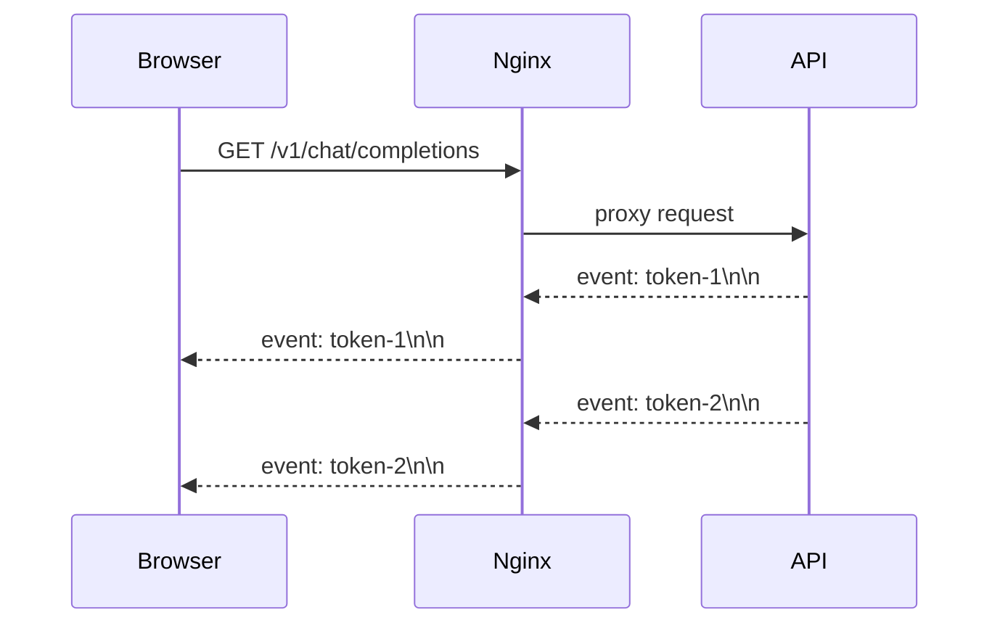

# Nginx、TLS、模型 API 与 SSE 流式入口

普通 JSON 接口很快返回，SSE 却要等几十秒才一次性出现。模型可能一直在生成，但代理把事件缓冲了。Nginx 既是 TLS 终止点和静态文件入口，也是会改变连接语义的中间层，配置必须围绕响应类型和停止条件来写。

## 普通响应和 SSE 走的是同一条 TCP 连接吗



SSE 需要持续发送 text/event-stream 事件，并让客户端尽快看到每个事件。proxy_buffering、proxy_read_timeout、Connection 头、压缩和缓存策略都会改变体验。普通接口关心完整响应时间，SSE 还关心事件之间的空闲间隔。

## 配置字段要和问题对应

```nginx
location /v1/ {
  proxy_pass http://api:8000;
  proxy_http_version 1.1;
  proxy_set_header Host $host;
  proxy_set_header X-Request-ID $request_id;
  proxy_buffering off;
  proxy_read_timeout 90s;
  proxy_send_timeout 90s;
}

location / {
  root /srv/web;
  try_files $uri $uri/ /index.html;
}
```

proxy_buffering off 只对需要即时转发的流式路径关闭，静态页面仍可使用缓存。read timeout 是两次上游数据之间允许的空闲时间，不是生成总时长。若模型很久没有 Token，应由应用发送心跳或由网关主动取消，而不是无限拉长超时。

## TLS 和热加载的安全顺序

证书由 Nginx 终止时，客户端看到的是 Nginx 的证书，源站内部可以使用另一条连接。修改配置后先执行 nginx -t，再热加载；配置测试失败时不能 reload。SSE 长连接存在期间，旧 worker 可能仍在服务，切换要考虑连接排空而不是只看新请求。

```bash
nginx -t
nginx -s reload
curl -N -H 'Accept: text/event-stream' https://example.test/v1/chat/completions
```

curl -N 关闭客户端输出缓冲，适合观察事件是否按到达顺序出现。它不是浏览器兼容性测试，也不能证明代理在高并发下不会耗尽连接。

## 故障定位看三份日志

| 日志 | 能证明什么 | 不能证明什么 |
| --- | --- | --- |
| 浏览器/客户端 | 收到事件的时间与断开原因 | 事件是否在源站及时产生 |
| Nginx access/error | 请求、上游状态、超时和连接 | 模型内部排队原因 |
| API/Serving | Token 生成、取消和异常 | 客户端是否被代理缓冲 |

::: warning
**边界**

SSE 不是消息队列。客户端断线后是否重放、是否重复计费，要由应用的事件 ID、Turn 状态和幂等策略决定。下一篇进入 Python 运行时，解释 API 进程如何同时处理网络、分词和多进程工作。
:::

## SSE 的背压从哪里开始

客户端读取很慢时，浏览器、Nginx、内核 socket buffer 和上游应用都可能积压字节。应用若继续无限生成，会把资源花在已经不可消费的连接上。实时系统需要在写入超时、客户端断开或队列上限出现时向上游传递取消，而不是只在 Nginx 侧等待。

因此验证 SSE 不只看“能否看到第一条 Token”，还要模拟中途断开并检查 Serving 是否收到了取消、usage 如何结算、Turn 是否进入终态。代理日志只有 499 还不够，它只能说明客户端离开，不能说明模型资源已经释放。

## 静态文件和 API 的缓存边界

单页应用的 index.html、带 hash 的静态资源和模型 API 需要不同缓存策略。带内容哈希的 JS/CSS 可以长期缓存，入口 HTML 应较快更新，包含用户数据、SSE 或模型结果的 API 默认不应被共享缓存。

路径匹配顺序、try_files 回退和 Cache-Control 一起决定客户端看到的是新版本还是旧页面。发布后若页面正常但 API 路径被静态回退吞掉，日志会表现成 200 HTML 而不是 404，这正是入口层值得单独观察的原因。
