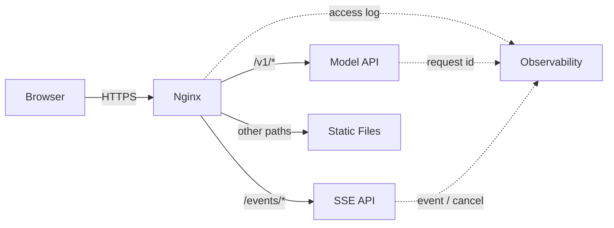

# Nginx、TLS、模型 API 与 SSE 流式入口

非流式接口三秒返回，改成 SSE 后却等到一分钟才一次性出现全文。应用日志显示每个 Token 都按时产生，这时应先检查代理是否缓冲响应，而不是继续优化模型。反向代理位于客户端和应用之间，它能终止 TLS、选择 upstream、改写 Header、限制请求，也能无意中改变流式语义。

普通 API、SSE 与静态站入口可以放进同一请求模型。每条配置都要对应生效机制和失败证据，变更先通过检查，再在不中断进程的情况下加载。

## 入口承担什么责任



TLS 证书和私钥属于入口安全边界；路由决定请求交给哪个 upstream；代理 Header 保存原始主机、协议和客户端信息；访问日志记录入口状态、上游状态和耗时。鉴权可以在入口做粗粒度门禁，但业务权限和租户数据范围仍要由应用落实。

## SSE 与普通响应的差异

SSE 使用一个持续的 HTTP 响应发送文本事件。事件以字段和空行分隔，客户端逐段消费。连接建立后的 200 只表示流开始，最终结果还要靠完成事件、错误事件或连接终止表达。

代理缓冲适合聚合普通上游响应，却会推迟小块事件；压缩也可能积累数据后再输出。SSE 入口通常关闭响应缓冲和不必要的转换，并给读取超时留出覆盖最长允许生成时间的预算。应用还应发送心跳，避免中间设备把安静连接误判为空闲。

## 一份解释边界的配置

下面配置中的域名、证书路径、静态目录和 upstream 都是占位值。输入是 HTTPS 请求，目标是让普通 API 与 SSE 分别采用合适代理策略，同时保留请求关联字段。

```nginx
upstream model_api {
    server model-api:8000;
    keepalive 32;
}

server {
    listen 443 ssl http2;
    server_name ai.example.com;

    ssl_certificate     /etc/nginx/tls/fullchain.pem;
    ssl_certificate_key /etc/nginx/tls/privkey.pem;

    location /v1/ {
        proxy_pass http://model_api;
        proxy_http_version 1.1;
        proxy_set_header Host $host;
        proxy_set_header X-Forwarded-Proto $scheme;
        proxy_set_header X-Request-ID $request_id;
        proxy_connect_timeout 3s;
        proxy_read_timeout 90s;
    }

    location /events/ {
        proxy_pass http://model_api;
        proxy_http_version 1.1;
        proxy_set_header Host $host;
        proxy_set_header X-Request-ID $request_id;
        proxy_buffering off;
        proxy_cache off;
        gzip off;
        proxy_read_timeout 15m;
    }

    location / {
        root /srv/site;
        try_files $uri $uri.html $uri/ =404;
    }
}
```

Nginx 解析配置时先匹配 `server`，再选择 `location`。普通 `/v1/` 请求使用连接与读取超时；`/events/` 关闭缓冲、缓存和压缩，让上游写出的事件更快到达客户端。`X-Request-ID` 用于把入口日志与应用 Trace 关联。静态站的 `try_files` 按存在顺序查找文件，并在都不存在时返回真实 404，避免所有未知路径都伪装成首页成功。

`proxy_read_timeout` 表示两次上游读取之间允许的安静时间，不等于整个请求绝对 Deadline。即使代理允许 15 分钟，应用和业务仍要设置更短的最大生成时间、Token 上限和取消规则，防止失去客户端后继续消耗模型资源。

## 怎样区分生成慢和代理缓冲

同时观察三条时间线：模型服务写出事件的时间、Nginx 收到和发送字节的时间、浏览器收到事件的时间。如果上游持续写而客户端最后一次性收到，检查缓冲、压缩和中间 CDN；如果上游本身迟迟没有首事件，继续看排队、Prefill 和模型调度。

客户端断开后，Nginx 会关闭上游连接，但应用是否捕获取消、Serving 是否停止 Decode 仍需单独验证。把“连接没了”当作“计算已停止”会导致隐藏成本。

## TLS、Header 与安全边界

证书要覆盖访问域名并包含完整信任链，私钥文件只允许入口进程读取。来自公网的 `X-Forwarded-*` Header 不能无条件信任，应由可信代理覆盖，应用再基于已知代理链解释真实协议和地址。

模型 API 还应限制 Body 大小、并发和请求速率，但限制发生在哪一层要有统一错误结构。入口拒绝与应用拒绝都要留下请求 ID、主体和规则版本，且日志不能包含 API Key、完整 Prompt 或文档原文。

## 热加载不是跳过验证

安全变更顺序是：生成候选配置、静态检查、在旁路入口验证普通与流式请求、保留旧配置，然后执行热加载。热加载让新 Worker 使用新配置并让旧 Worker 排空连接，不代表错误配置可以自动回滚。

验收至少覆盖首页、真实 404、普通 API、SSE 首事件、长连接心跳、客户端取消、上游不可用和证书链。只有入口与应用日志能用同一请求 ID 对上，才算建立了可诊断的流式边界。
