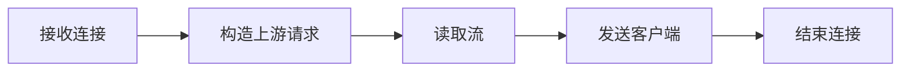

# Nginx、TLS、模型 API 与 SSE 流式入口

聊天接口返回状态是 200，服务端日志每 100 毫秒生成一个 Token，浏览器却十秒后一次性看到整段答案。这个现象常被误判为模型流式能力失效，其实 Token 已经离开模型，只是被应用服务器或 Nginx 缓冲。理解入口时必须同时看客户端到 Nginx、Nginx 到上游这两条连接。

## 安装 Nginx 并确认热加载前的配置

Nginx 的官方安装入口在[下载页](https://nginx.org/en/download.html)。本地实验可用 Homebrew 安装，Linux 服务器按发行版的官方包源执行；教程中的 `nginx -t` 是任何 reload 前的最低检查。

<figure class="doc-shot">
  
  <figcaption>先确认版本和编译模块，再检查 SSE 所需的超时、缓冲和 Header。不要用浏览器一次性看到文本来推断代理已经逐事件转发。</figcaption>
</figure>

```bash
brew install nginx
nginx -v
nginx -t
```

命令成功只证明本机二进制和配置语法可用；SSE 还必须用 `curl -N` 对照上游事件时间戳、响应头和连接关闭原因。


## 一个 Token 在入口处会经过哪些缓冲区



先看完整路径，再进入局部配置。这样即使组件名字变化，也能知道失败发生在交接之前还是之后。

### 接收连接：Nginx listener

完成 TCP/TLS，按 server_name、路径和方法匹配 location。

这里不靠猜测，优先读取 access log、证书、命中的 location。

### 构造上游请求：Proxy module

选择 upstream，设置 Host、Authorization 与转发头。

决定下一步前需要看到 upstream_addr、request_id、连接错误。

### 读取流：上游与 Nginx

上游写出 SSE 事件，框架与代理缓冲策略决定何时继续发送。

这一动作的可观察结果是 事件时间戳、响应头、proxy_buffering。处理动作应晚于取证，否则重启或重试可能覆盖最早的失败现场。

### 发送客户端：Nginx 与浏览器

保持连接并在空闲超时前持续发送字节。

可以从这些位置确认结果：`curl -N` 到达时间、客户端取消。若完全没有证据，先判断请求是否到达本阶段；若记录冲突，则对齐 request_id、实例和时间窗口。

### 结束连接：应用与代理

发送 `[DONE]` 或业务终态，关闭上游并记录完整耗时。

这里不靠猜测，优先读取 finish_reason、499、504、usage。

## 反向代理为什么不只是转发地址

这里先暂停操作，把容易混用的概念拆开。定义的价值在于划清责任，而不是增加名词数量。

| 概念 | 在这条链路中的含义 |
| --- | --- |
| TLS Termination | 客户端 TLS 在代理结束，代理校验证书与解密 HTTP；代理到源站是否再次使用 TLS 是另一项独立策略。 |
| Proxy Buffering | 代理先读取上游响应再成块发送给客户端，可提高普通响应效率，却可能推迟 SSE 事件可见时间。 |
| SSE | 服务器以 `text/event-stream` 长时间发送 `data:` 事件的单向 HTTP 流。每个事件用空行结束，连接关闭不是唯一终态。 |
| Hot Reload | 在配置语法和依赖检查通过后，让新 worker 接收新连接，旧 worker 完成已有连接；它不保证业务配置一定正确。 |

::: tip 判断原则
不要从产品名推断能力。把可观察输入、持久状态、失败终态和下游交接点写出来。
:::

## 连接保持不等于事件已送达

| 表面现象 | 实际可能发生的事 | 下一步证据 |
| --- | --- | --- |
| Token 最后一次性出现 | 常见于应用、压缩或代理缓冲，不一定是模型批量生成 | 用 `curl -N` 对比直连上游和代理入口的到达时间 |
| 499 | Nginx 记录客户端先关闭连接，可能是用户取消、浏览器超时或中间网络断开 | 确认取消是否传到上游并释放生成 |
| 502 | 上游拒绝、协议不匹配、提前关闭或返回无效响应 | 对齐 error log、upstream_addr 和源站退出日志 |
| 504 | 等待连接或上游响应超过代理预算 | 区分 connect、read 和业务 deadline |

::: warning 先保留现场
如果先重启、扩容或删除对象，最早失败可能被覆盖。先确认对象身份、版本和时间线，再决定处理动作。
:::

## 把普通 API 与 SSE 的策略明确分开

下面是解释性 Nginx 片段，域名、证书、上游名称和超时必须按环境替换。输入是 `/v1/chat/completions` 的流式请求，输出应是不被代理聚合的事件流。

```nginx
map $http_x_request_id $request_trace_id {
  default $http_x_request_id;
  ""      $request_id;
}
location = /v1/chat/completions {
  proxy_pass http://ai_backend;
  proxy_http_version 1.1;
  proxy_set_header Host $host;
  proxy_set_header X-Request-ID $request_trace_id;
  proxy_set_header X-Forwarded-For $proxy_add_x_forwarded_for;
  proxy_buffering off;
  proxy_read_timeout 120s;
}
# 应先执行：nginx -t；通过后再 reload
```

`proxy_buffering off` 只关闭 Nginx 这一层，应用框架、压缩中间件和客户端仍可能缓冲。`proxy_read_timeout` 是两次上游读取之间的等待，不等于整个回答最多 120 秒；若模型长时间没有事件，可发送业务允许的心跳注释。`Authorization` 默认会转发，但显式白名单更便于审计敏感头。


## 把结论限制在证据范围内

禁用缓冲会增加长连接数量、内存和慢客户端影响，不能对所有静态资源和普通 JSON 一刀切。TLS 私钥只属于入口进程，日志不得记录 Authorization、完整 Prompt 或响应正文。修改配置前先 `nginx -t`，热加载失败时旧 worker 可能仍服务，不能仅凭命令返回判断新配置已生效。

到这里，一条请求已经能稳定进入 AI Backend。下一阶段从 Python Runtime 开始，解释异步函数、线程、多进程和阻塞调用为什么会直接改变并发与取消行为。
