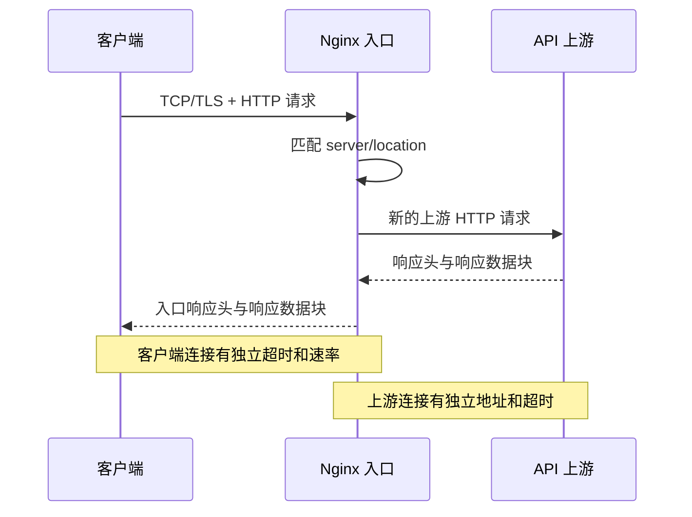

# Nginx 是什么？反向代理怎样转发普通 API 与 SSE

浏览器可以直接访问一个 FastAPI 进程，但正式服务通常会在应用前再放一层入口。这个入口接收公网连接、选择证书、限制请求大小，再把符合规则的请求交给内部 API。应用只监听内网端口，也不需要每个 Worker 各自管理 TLS 私钥。

Nginx 经常承担这个入口。它既能提供静态文件，也能作为 HTTP 反向代理。对 AI 服务来说，普通 JSON 接口和逐 Token 流式接口会经过同一代理，却不该沿用完全相同的缓冲与超时配置。理解差别之前，要先知道 Nginx 是什么、它怎样匹配请求，以及一条连接的状态分别由谁持有。

::: info Nginx 的准确含义

Nginx 是事件驱动的网络服务器和代理软件。它可以监听 TCP 端口、解析 HTTP 请求、按配置选择处理规则，并把请求交给文件系统、上游 HTTP 服务或其他协议模块。

Nginx 不理解大模型怎样生成 Token。它看到的是 HTTP 请求头、响应头和字节流，因此代理策略要根据 HTTP 与 SSE 语义设置。

:::

## Nginx 是怎样运行的，master 与 worker 各做什么

Nginx 启动后通常有一个 master 进程和多个 worker 进程。master 读取配置、绑定需要的监听端口、管理 worker，并处理重新加载和停止信号。worker 接受客户端连接，解析协议并执行请求处理。它们使用事件循环同时等待大量 socket，不为每条空闲连接创建一条线程。

事件驱动不代表所有工作都不会阻塞。读取慢磁盘、执行同步脚本或连接迟迟不响应的上游，仍会消耗资源并影响吞吐。Nginx 擅长转发和静态内容，不应该在配置里承担复杂业务逻辑。鉴权可以做协议层校验或调用专门服务，最终权限与计费状态仍应由有一致数据来源的应用处理。

worker 数量、连接上限和文件描述符共同决定可维持的连接规模。SSE 请求可能保持几分钟，同样的每秒请求量会占用更多并发连接。只调大 `worker_connections` 而不检查系统 `nofile`、上游连接池和内存，配置会在另一层触顶。

master 以高权限绑定 80 或 443 后，worker 可以降到普通用户。私钥文件必须允许需要的进程读取，又不能对其他用户开放。容器中 Nginx 仍遵循 PID 1 与信号规则，镜像入口脚本、master 进程和 worker 的关系要从实际进程树确认。

下面几条只读命令用于确认当前二进制、编译模块、配置文件和进程。它们先出现，是因为后面的指令是否可用取决于安装版本和模块。

```bash
nginx -v
nginx -V
nginx -T
ps -o pid,ppid,user,cmd -C nginx
ss -ltnp | grep -E ':(80|443)\b'
```

`nginx -T` 会把完整配置写到输出，其中可能包含内部域名和路径，不能直接贴到公开工单。`ss` 能证明本机有进程监听端口，不证明 DNS 已指向这台机器，也不证明外部防火墙允许连接。进程、监听和公网请求仍需分层验证。

Nginx 的职责可以用一个边界判断：它适合接收连接、匹配主机和路径、把字节交给上游，再按协议返回；它不应该替应用决定用户能读取哪条知识、一次请求扣多少余额。与应用 Service 的区别是，Nginx 处理连接和协议，应用处理业务状态。把业务判断写进大量 rewrite 规则会让配置难以测试，reload 后的实际行为也难从应用日志恢复。配置管理应记录版本、校验命令和生效时间。
## 正向代理与反向代理有什么区别

代理代表一方与另一方通信。正向代理代表客户端访问外部服务器，客户端明确知道代理地址，目标服务器看到的连接来源通常是代理。公司出口代理、开发机的 SOCKS 代理属于这一类。它解决客户端怎样出去以及出口怎样控制的问题。

反向代理代表一个或多个服务端接收客户端请求。浏览器访问 `api.example.com`，DNS 指向 Nginx，浏览器通常不知道后面是一个 FastAPI 进程、多个容器还是另一层网关。Nginx 根据 Host、路径或其他规则选择 upstream，把响应再送回客户端。

“反向”描述代理面向服务端的部署位置，不代表请求字节按相反顺序传输。客户端和 Nginx 建立一条 TCP/TLS/HTTP 连接，Nginx 与上游建立另一条连接。两条连接的地址、超时、协议版本和拥塞状态互相独立，代理会在两边之间复制请求与响应数据。

反向代理可以统一 TLS、压缩、访问日志、请求大小、连接限制与静态资源，也能把 `/api/` 和 `/assets/` 交给不同处理器。它不能自动让上游高可用。所有 upstream 都不可达时，代理只能返回 502 或 504；上游处理了请求却在响应前断开，是否能重试还涉及请求方法和副作用。

LLM Gateway 与 Nginx 也不是同一个概念。Nginx 擅长网络与 HTTP 转发，Gateway 还会理解 API Key、模型名、租户额度、路由策略和 Token 计费。小系统可能由一个进程同时承担部分能力，设计时仍要区分状态所有者，不能让 Nginx 访问日志成为余额账本。
## 一次代理请求经过哪些连接和处理阶段

客户端先根据 DNS 得到入口地址，与 Nginx 建立 TCP 连接；HTTPS 还会完成 TLS 握手。Nginx 解析 HTTP 请求，找到匹配的 `server` 与 `location`。若该 location 配置 `proxy_pass`，Nginx 选择 upstream 地址，建立或复用上游连接，发送新的 HTTP 请求并读取响应。

请求转发不是原始包的透明搬运。Nginx 会重新构造上游请求行与请求头，默认行为受模块和配置影响。`Host`、客户端地址、协议和请求 ID 需要显式传递。应用只看到 Nginx 的源 IP 时，不能用 socket 对端地址识别最终用户；盲目信任外部传入的 `X-Forwarded-For` 又会允许伪造。

响应回来后，Nginx 可以缓冲、压缩、改写头部或直接流向客户端。入口状态码不一定由上游生成。无法连接上游常返回 502，等待上游响应超时常返回 504，Nginx 自己拒绝过大请求则可能返回 413。排查时要同时看入口访问日志中的 `status` 与 `upstream_status`。

下面的时序图把两条连接和三个状态拥有者分开。虚线响应表示字节可以分批到达，不要求完整响应先放在上游内存中。



图中客户端断开后，上游请求是否立刻取消取决于代理与应用行为。AI 推理已经占用 GPU 时，单纯关闭浏览器不一定释放计算。应用和 Serving 需要支持取消传播，Nginx 日志则要记录客户端提前断开的证据，比如常见的 499 入口状态。
## server、location、upstream 与 proxy_pass 怎样配合

`http` 上下文包含 HTTP 级配置；`server` 通常按监听地址和 Host 区分虚拟主机；`location` 在某个 server 内匹配 URI；`upstream` 为一组后端定义名字和连接参数。`proxy_pass` 把匹配请求交给一个 URL 或 upstream 组。这些对象是配置结构，不是独立网络进程。

server 选择先考虑监听地址与端口，再结合 TLS SNI 和 HTTP Host。默认 server 可能接住未匹配域名，请求因此进入错误站点。公开入口应该明确默认行为，未知 Host 可以拒绝，不把内部管理页面作为兜底内容。

location 有精确、前缀和正则等匹配规则，优先级并非按文件从上到下简单选择。复杂正则容易让 `/v1/` 请求进入意外配置。路径少时用明确前缀更容易审查，修改后通过 `nginx -T` 看最终结构，并对关键路径实际发请求。

`proxy_pass` 是否带 URI 会影响路径替换。比如 `location /api/` 配合 `proxy_pass http://backend/`，上游可能收到去掉 `/api/` 前缀的路径；不带末尾斜杠时行为不同。路径改写出错通常表现为上游 404，而不是连接失败。访问日志同时记录原始 URI 与上游地址能更快定位。

upstream 可以列多个 server 并设置连接失败参数。负载均衡只在候选地址之间选连接目标，不知道哪个模型已经加载指定 Adapter，也不知道租户是否允许某模型。模型感知路由应由 Gateway 或平台控制面提供，Nginx 只接收其能可靠判断的信号。
## TLS 终止是什么，证书和上游加密分别由谁负责

TLS 终止表示客户端的 TLS 连接在 Nginx 结束。Nginx 向客户端提供证书、协商加密套件并解密 HTTP 数据，之后再按代理配置连接上游。上游若使用普通 `http://`，入口到上游这一段没有 TLS；使用 `https://` 时，Nginx 会与上游建立第二条独立 TLS 连接。

证书证明域名对应的服务身份，并让双方协商会话密钥。证书文件、私钥、完整中间证书链和系统时间都可能影响握手。证书存在不代表配置正确，域名不匹配、链不完整、私钥不对应和过期都会在 HTTP 请求出现前失败。上一章的 `openssl s_client` 可以检查入口实际提供的链。

TLS 终止集中管理证书，也让应用只处理 HTTP。它同时把 Nginx 变成明文边界，入口主机及其内存必须纳入信任范围。跨不可信网络、跨租户网络或合规要求端到端加密时，上游仍应使用 TLS，必要时再验证客户端证书形成 mTLS。

上游 HTTPS 需要配置 SNI 与证书验证。只写 `proxy_pass https://name` 不应被解释为已经严格验证上游身份，要核对 `proxy_ssl_server_name`、受信 CA 和 `proxy_ssl_verify` 等设置。内部自签名证书也需要受控 CA，关闭验证只适合有限诊断，不能长期留在正式配置。

证书更新可以通过配置测试后热加载。新 worker 使用新证书接收连接，旧 worker 处理完已有连接后退出。热加载降低中断，却不能修复错误证书；加载前要检查文件权限、域名、到期时间和 `nginx -t`，加载后从外部重新握手确认实际证书。
## 普通 HTTP API 为什么通常适合响应缓冲

普通 JSON API 往往在上游生成完整响应后返回。Nginx 的代理缓冲会先从上游读取响应，放入内存缓冲区，必要时写临时文件，再按客户端速度发送。上游因此可以较快释放连接，不必一直等待慢客户端读完所有数据。

缓冲还能让 Nginx 执行部分响应处理，并把快上游与慢客户端隔开。它不是通用缓存。缓冲只管理当前响应字节，代理缓存则会按键保存响应供后续请求复用。含用户数据、鉴权结果或非幂等语义的响应不能因为开启缓冲就自动安全缓存。

请求缓冲处理相反方向的数据。默认情况下，Nginx 可以先读完客户端请求体再发给上游。大文件上传会占用入口临时空间，却避免上游长期被慢上传连接占住。需要真正流式上传时可以关闭请求缓冲，但应用必须能处理客户端中断、大小限制和慢速攻击。

缓冲区大小没有统一最佳值。响应头过大可能触发 `upstream sent too big header`，大响应写临时文件会增加磁盘 I/O，完全关闭缓冲又会增加上游连接占用。先根据响应大小分布和客户端速度观察，再对具体 location 调整，不能把一套 SSE 配置复制给所有 API。

`proxy_read_timeout` 不是整个请求允许的总时长，它通常限制两次上游读取之间允许空闲多久。上游持续返回数据时，长请求可以超过这个数；上游长时间没有任何字节时会超时。模型思考阶段若没有心跳，超时应与业务 Deadline 和取消策略一起设计。
## SSE 是什么，事件流在 HTTP 中长什么样

Server-Sent Events，简称 SSE，是服务器通过一个长期 HTTP 响应持续向客户端发送文本事件的机制。浏览器原生 `EventSource` 使用它接收单向更新，OpenAI 风格流式接口也常用 `text/event-stream` 格式传送数据片段。客户端仍先发一个普通 HTTP 请求，区别在于响应不会立刻结束。

事件由 UTF-8 文本字段组成，常见字段有 `data`、`event`、`id` 和 `retry`，一条事件用空行结束。一个 `data:` 行不是一个 TCP 包，也不一定对应一个模型 Token。网络栈、HTTP 实现和代理可以合并或拆分字节，客户端必须按 SSE 行与空行解析，不能依赖每次 socket read 的边界。

SSE 是服务器到客户端的单向流。客户端要继续发新消息，需要另一个 HTTP 请求或换用 WebSocket。它适合 Token 输出、进度和状态通知，不适合需要双方在同一连接上频繁独立发消息的协议。断线重连也需要应用定义事件 ID、幂等和是否能从断点恢复。

下面是一段最小事件流。它出现是为了看清协议边界，实际 JSON 字段由 API 合同决定。

```text
event: message
id: 41
data: {"delta":"你好"}

event: message
id: 42
data: {"delta":"，世界"}

data: [DONE]

```

前两条事件各有类型、ID 与数据，最后一条用应用约定的 `[DONE]` 表示生成结束。空行是事件分隔符，缺少空行会让客户端继续等待。`[DONE]` 不是 SSE 标准字段，它属于具体 API 约定，另一套服务可以用普通结束事件或直接关闭响应体。

连接可能因代理超时、客户端网络切换、应用异常或正常完成而结束。客户端看到 EOF 只能知道连接关闭，不能单独判断答案完整。协议需要一个明确完成标记，服务端日志也要区分正常结束、上游错误和客户端取消。
## 代理缓冲为什么会让 Token 一次性出现

上游每生成一个事件就写出，不代表客户端会立刻收到。Nginx 开启响应缓冲时，可以继续收集多个小数据块，等缓冲区达到条件或响应结束再发送。浏览器看到长时间空白，最后整段文本一起出现，模型可能一直在正常生成，延迟发生在代理输出阶段。

对 SSE location 通常关闭 `proxy_buffering`，并让上游及时 flush 事件。上游还可以返回 `X-Accel-Buffering: no`，但是否尊重该头由 Nginx 配置决定。只改 Nginx 而应用把事件留在自己的语言运行时缓冲里，首个事件仍不会及时到达。

压缩也可能增加聚合。小事件经过 gzip 后未必每次都形成可发送块，SSE 路径通常关闭代理层 gzip，或实际验证首事件延迟。HTTP/2 与 HTTP/3 能承载长响应，但 SSE 消息边界仍在响应体文本中，不能把帧边界当事件边界。

关闭缓冲会让上游连接与客户端连接更紧密。慢客户端会让数据在 socket 和内存中等待，长连接数量也会增长。入口要限制每个租户的并发流，应用要支持取消，Serving 要在请求结束或断开后释放调度状态。流式体验换来的资源成本需要纳入容量规划。

心跳注释如 `: ping\n\n` 可以在没有业务 Token 时保持可观察流量，并避免某些空闲超时。心跳频率不能过高，也不能拿它掩盖没有业务 Deadline 的无限请求。客户端解析器应忽略注释行，指标则分别记录连接存活和真实 Token 到达。
## 连接超时、响应超时和业务 Deadline 为什么不能混用

代理请求至少涉及客户端到 Nginx、Nginx 到上游两段连接。`proxy_connect_timeout` 约束 Nginx 与 upstream 建立连接的等待时间。它触发时，上游应用通常还没收到 HTTP 请求，问题可能是地址错误、端口未监听、网络拒绝或连接队列拥塞。把这个值调到几分钟不会帮助模型加载，只会让入口更晚返回连接失败。

`proxy_send_timeout` 处理 Nginx 向上游写请求时两次写操作之间的等待，`proxy_read_timeout` 处理从上游读取时两次读操作之间的等待。它们通常是空闲超时，不是整个请求从开始到结束的墙钟上限。上游每隔一段时间发送字节，可以让一个流式请求持续很久；上游完全沉默则在 read timeout 后被代理终止。

客户端一侧也有等待边界。`client_header_timeout` 和 `client_body_timeout` 限制读取请求头与请求体的空闲，`send_timeout` 限制向客户端写响应的空闲。一个客户端下载极慢时，Nginx 可能仍在等待它接收数据，上游却已经生成完成。关闭 SSE 缓冲后，两边速度差更直接地反映为连接占用和内存压力。

业务 Deadline 由 API 语义决定，比如一次聊天最多允许 120 秒。它应该贯穿 Gateway、应用、队列与 Serving，并在到期时主动取消工作。只依赖 Nginx 300 秒 read timeout，会让后端在客户端需求早已过期后继续占 GPU。相反，入口 timeout 小于应用 Deadline，代理会先断开，应用若没收到取消仍会后台运行。

超时值应该形成可解释的层次。客户端总 Deadline 最小，入口预留返回错误的时间，应用再给 Serving 与清理留出内部预算。具体数字取决于模型和产品，不应从示例照抄。每一层日志记录开始时间、剩余 Deadline、结束原因与请求 ID，才能知道是谁先放弃。

::: tip 超时不是性能修复

把 60 秒改成 600 秒只改变等待多久。队列过长、上游没有 flush、模型 OOM 或客户端已断开的根因仍然存在。先定位等待发生在哪一段，再决定是调整边界还是修复处理能力。

:::
## 502、504 与 499 分别能证明到哪一步

502 Bad Gateway 表示 Nginx 没有从上游得到可接受的代理响应。常见原因包括连接被拒绝、上游握手失败、响应头无效或上游在响应中途关闭。它说明入口代理遇到了上游通信问题，不等于上游进程一定崩溃。某一个 upstream 失败后重试另一个地址，最终日志还可能包含一串上游状态。

504 Gateway Timeout 通常表示代理等待上游连接或响应超过配置时间。它能证明代理的等待边界触发，不能证明模型计算一定很慢。服务名解析到错误地址、连接池耗尽、请求卡在应用队列和模型确实生成过久，都可能最终表现为 504。需要用 upstream 地址、connect time、header time 和 response time 继续拆分。

499 是 Nginx 常用于访问日志的非标准状态，表示客户端在 Nginx 返回完整响应前关闭连接。浏览器取消请求、移动网络切换或调用方 Deadline 到期都可能产生它。499 不会自动告诉上游停止，后端是否感知取消要看连接传播和应用实现。入口 499 激增时，同时检查客户端超时、首 Token 延迟和后台未取消请求。

下面的表用于约束每个状态能支持的推论。它不替代日志，尤其不能只凭一条状态码修改全局 timeout。

| 入口证据 | 已知事实 | 还要检查的证据 |
| --- | --- | --- |
| 502 且 connect time 接近 0 | 目标地址很快拒绝或代理无法完成连接 | upstream 地址、监听端口、网络与 TLS 错误 |
| 504 且 connect time 达到上限 | 建立上游连接超时 | 网络路径、连接队列、Service Endpoint |
| 504 且已收到响应头 | 响应体读取期间出现过长空闲 | 应用 flush、SSE 心跳、模型与队列日志 |
| 499 | 客户端先关闭入口连接 | 客户端 Deadline、取消传播、后台资源释放 |
| 200 但首事件很晚 | 请求最终成功，流式体验仍异常 | 上游首事件时间、代理缓冲、客户端缓冲 |

表中最后一行说明状态码只描述结果类别，不能描述流式时序。AI 接口即使都是 200，也要单独观察连接耗时、响应头时间、首 Token 时间和完整生成时间。普通 APM 只记录请求结束时刻，会漏掉最影响用户感受的首事件等待。
## 静态文件与代理 API 为什么采用不同处理路径

Nginx 可以直接从文件系统返回 HTML、JavaScript、CSS 和图片。静态请求没有上游应用连接，Nginx 根据 `root` 或 `alias` 把 URI 映射到路径，读取文件并设置缓存头。它适合发布已经构建好的前端资源，不负责执行 Vite 开发服务器或在生产请求时编译页面。

`root` 会把完整 URI 追加到目录，`alias` 用指定目录替换匹配 location。两者混用容易产生错误路径，带用户输入的文件下载还要防止路径穿越。单页应用常用 `try_files $uri $uri/ /index.html` 回退前端路由，但 `/api/` 必须先有更明确的代理 location，不能把 API 404 悄悄变成 HTML 200。

带内容哈希的静态文件可以设置很长缓存时间，因为文件内容变化会产生新 URL；`index.html` 通常使用较短缓存，确保它能引用新资源。API 响应的缓存规则完全不同，尤其包含用户 Prompt、权限和计费状态时，默认不应共享缓存。路径看起来都在 HTTP 下，不表示缓存语义相同。

静态文件 404 由 Nginx 文件映射产生，代理 API 404 可能来自上游业务。访问日志加入 `$upstream_addr` 后，没有 upstream 地址的请求通常没有进入代理。这个字段能帮助确认处理器，却仍要注意内部重定向和 error_page 可能改变最终路径。
## 为普通 API 与 SSE 写两套明确配置

下面配置把普通 `/api/` 与流式 `/v1/chat/completions` 分开。证书路径、域名和 upstream 名是教学值，部署前要替换并验证。上游使用 Compose Service 名 `api:8000`，说明 Nginx 容器与 API 位于同一受控网络。

```nginx
upstream knowledge_api {
    server api:8000;
    keepalive 32;
}

server {
    listen 443 ssl;
    server_name api.example.test;

    ssl_certificate     /etc/nginx/tls/fullchain.pem;
    ssl_certificate_key /etc/nginx/tls/privkey.pem;

    client_max_body_size 20m;

    location /api/ {
        proxy_pass http://knowledge_api;
        proxy_http_version 1.1;
        proxy_set_header Host $host;
        proxy_set_header X-Forwarded-Proto $scheme;
        proxy_set_header X-Forwarded-For $proxy_add_x_forwarded_for;
        proxy_set_header X-Request-ID $request_id;
        proxy_connect_timeout 3s;
        proxy_read_timeout 60s;
        proxy_buffering on;
    }

    location = /v1/chat/completions {
        proxy_pass http://knowledge_api;
        proxy_http_version 1.1;
        proxy_set_header Host $host;
        proxy_set_header X-Forwarded-Proto $scheme;
        proxy_set_header X-Forwarded-For $proxy_add_x_forwarded_for;
        proxy_set_header X-Request-ID $request_id;
        proxy_set_header Connection "";
        proxy_connect_timeout 3s;
        proxy_read_timeout 300s;
        proxy_buffering off;
        gzip off;
    }
}
```

普通 API 保留响应缓冲，SSE 路径关闭缓冲并放宽上游读取空闲时间。`Connection ""` 清除客户端逐跳头，避免把不适合上游连接的值直接转发。实际应用若同时支持流式和非流式请求且共用同一路径，Nginx 不能仅凭路径区分，应用响应头或独立入口策略需要参与设计。

示例没有配置自动重试。POST 推理请求可能已经在上游开始消耗 GPU 或写入计费记录，代理盲目换另一个 upstream 会产生重复执行。只有请求语义、幂等键、上游状态和计费补偿都明确时，才能为特定失败设置重试。

访问日志还应增加上游字段，比如 `$request_id`、`$status`、`$upstream_status`、`$request_time`、`$upstream_response_time` 和 `$upstream_addr`。Prompt、Authorization 与完整响应不能直接写日志。请求 ID 要么由受信入口生成，要么先校验客户端值，避免攻击者伪造关联关系。
## 配置怎样测试、热加载并验证真实流式效果

修改文件后先做语法与引用检查。`nginx -t` 成功只证明 Nginx 能解析配置和打开必要文件，不证明上游可达、证书域名正确或 SSE 会及时到达。测试通过后再向 master 发送 reload，旧 worker 会在处理已有连接后退出，新 worker 使用新配置。

```bash
nginx -t
nginx -s reload
curl -fsS https://api.example.test/api/health
curl -N --no-buffer https://api.example.test/v1/chat/completions \
  -H 'Content-Type: application/json' \
  --data '{"model":"demo","stream":true,"messages":[{"role":"user","content":"你好"}]}'
```

`curl -N --no-buffer` 让客户端尽快打印收到的字节，便于观察事件是否逐条出现。它不能证明浏览器渲染代码正确，也不能量出模型内部各阶段。更严格的验证要记录响应头时间、首个 SSE 事件时间、结束标记时间和进程日志中的请求 ID。

假设健康接口 200，流式请求却等待一分钟后返回 504。入口访问日志中 `upstream_status=504` 且上游响应时间接近 60 秒，先检查生效 location 是否仍使用默认 `proxy_read_timeout`。若上游日志已经每秒写出事件而入口没有下发，检查缓冲与压缩；若上游也没有事件，问题在应用、队列或 Serving，继续调 Nginx 没有作用。

另一个故障是客户端收到部分事件后主动关闭。Nginx 访问日志可能记录 499，上游应用应收到取消或写入失败，并把取消传给推理服务。验证结果要包括 GPU 请求是否从调度队列移除、计费是否按实际完成量结算以及连接是否释放。只看到浏览器停止转圈，无法确认后台计算已经结束。

普通 API 的验证也要保留。SSE 配置通过后，再检查大 JSON 响应、错误状态、请求体上限、未知 Host 和上游不可达。入口与上游各有一条连接，任何结论都要说明证据属于哪一边。Nginx 能让网络入口统一可控，但模型请求的身份、状态和成本仍由后面的 Gateway、API 与 Serving 共同完成。

完成验证后还要保存生效配置摘要、证书身份、上游版本和回滚文件，避免下一次同类故障只能依赖已经变化的临时现场证据。
