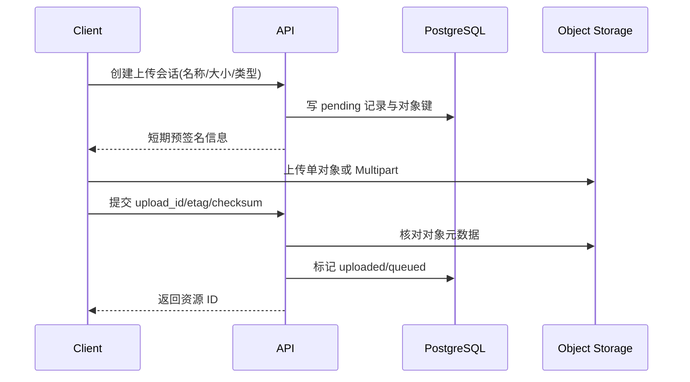

# 对象存储：模型、文档、Multipart 与生命周期

一个 8GB 文件上传到 99% 后网络断开，用户重新上传又产生第二份对象；数据库只记录了其中一份，另一份永久占用空间。大文件流程的难点不是 PUT 请求，而是上传会话、分段、校验、业务确认和清理之间没有统一状态。

对象存储通过 Bucket 与 Object Key 管理不可变字节流和元数据，适合原始文档、解析产物、模型权重、评测数据和大日志归档。数据库保存业务关系、对象键、校验和、版本与状态，两者各自拥有不同事务边界。

## 对象、文件和业务记录不是同一个概念

Object Key 是 Bucket 内的标识，不一定对应真实目录。前缀只是命名约定。对象内容通常作为整体替换，适合不可变版本；频繁局部更新的业务状态仍应留在数据库。

用户文件名可以作为显示元数据，但不应直接成为可信 Key。Key 应由服务端生成，包含租户、资源 ID、版本或随机 ID，并经过长度和字符限制。任何下载都要先检查业务权限，再生成短期访问能力。

## 一条安全上传链

客户端不接触永久 Access Key。API 先验证租户、文件类型、大小与配额，再创建待上传记录和受控 Key。上传完成后，客户端不能自己宣布成功；API 要从对象存储读取大小、ETag 或校验和，与会话期望值比对，最后在数据库改变状态。

## Multipart 怎样恢复大文件

Multipart 把对象拆成多个 Part，每个 Part 可以独立重试，完成时按编号组合。上传会话必须记录 Upload ID、目标 Key、预计大小、Part 范围和过期时间。缺失、重复或顺序错误的 Part 应在完成前被发现。

ETag 的含义可能随实现、加密和 Multipart 改变，不能在所有系统中都当作内容 MD5。若完整性要求明确，应使用服务支持的 Checksum 或在业务层保存 SHA-256，并在受控环境计算。校验通过证明字节一致，不证明文件安全或内容可解析。

## 预签名 URL 是临时能力

预签名 URL 把方法、Key、到期时间和签名绑定在一起。有效期应覆盖合理上传时间但尽量短，Key 必须由服务端限定，Content-Type 与大小限制要结合对象存储策略和上传后复核。

下载预签名也要在生成前检查当前权限，且缓存键包含租户与权限版本。URL 一旦签发，在有效期内通常可以被持有者使用，因此不要把它写入公开日志、分析系统或长期消息。

## 模型制品需要额外元数据

模型对象不仅有字节和文件名，还需要仓库、Revision、许可证、Config、Tokenizer、权重分片、格式、量化方式和校验和。一个 Deployment 应引用不可变制品版本，而不是在启动时跟随可变分支下载。

模型缓存可以从上游重建，但首次下载成本很高。生命周期策略应区分源制品、节点缓存和临时转换产物，避免清理源制品后只剩无法证明来源的缓存。

## 数据库与对象怎样对账

上传对象和写数据库无法组成一个普通本地事务。可能出现数据库 pending 但对象已存在、数据库 active 但对象缺失、对象存在但没有任何业务引用。解决方法是显式状态机与周期对账，而不是假设两步永远一起成功。

清理器只删除超过宽限期、没有激活版本或任务引用、且状态允许删除的对象。删除前再次检查引用，使用幂等操作并保留审计。版本化 Bucket 还要决定删除标记和历史版本的保留周期，否则“删除成功”不代表空间已经释放。

## 安全与可观测边界

外部文件要检查协议、大小、MIME、Magic、压缩比、恶意内容和解析资源上限。对象存储的服务端加密保护静态数据，TLS 保护传输，但租户授权仍由应用控制。Bucket 不应默认公开。

指标至少包括上传会话数、失败 Part、未完成 Multipart、对象字节、校验失败、孤立对象、下载拒绝和生命周期删除。日志记录资源 ID 与对象键的受控摘要，不记录签名 URL 和 Secret。

最终状态机应清楚区分 pending、uploading、uploaded、scanning、ready、failed 与 deleted。每次转换写明谁触发、核对什么证据、失败能否重试和何时清理，才能让对象存储成为可恢复的数据层。
