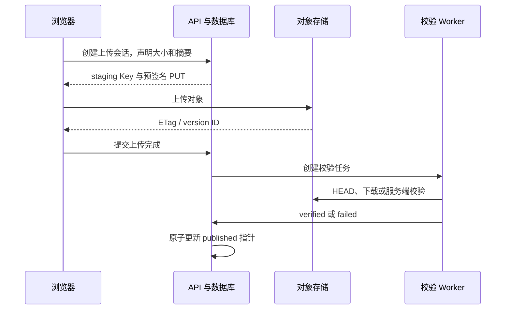

# 对象存储是什么？模型和文档怎样上传、校验、发布与清理

文档原文件、模型权重和索引快照往往比数据库行大得多。把几十 GB 模型塞进 PostgreSQL，会让备份、复制和查询都变重；把文件只写某个容器目录，容器重建或任务迁移到另一台机器后又找不到。系统需要一个按稳定名称保存大对象，并允许多个服务通过网络访问的存储。

对象存储解决这类问题。它把数据作为 Object 放在 Bucket 中，通过 Object Key 寻址，并保存大小、类型、版本和自定义元数据。它不是挂载目录的另一种名字，也不会替业务判断某个文件能否成为当前模型。上传、校验、登记、发布和清理要用数据库状态与对象身份连接起来。

::: info 对象存储的准确含义

对象存储是通过 API 管理独立对象的存储系统。每个对象通常由字节内容、对象 Key、系统元数据和可选用户元数据组成，并位于一个 Bucket 中。

对象通常按完整 Key 读取或覆盖，不提供普通文件系统那样的任意字节原地修改、目录 inode 和 POSIX 锁语义。S3 兼容 API 是常见接口，具体一致性、版本和校验能力仍要按实现核对。

:::

## 对象、Bucket 和 Object Key 分别是什么

Object 是存储中的一个字节序列以及与它关联的元数据。文档 PDF、Tokenizer JSON、模型 shard 和压缩归档都可以是对象。对象存储不理解里面是模型还是图片，业务系统要登记 media type、schema、模型版本和 checksum，并在下载后选择安全解析器。

Bucket 是对象的顶层命名与策略边界。权限、版本控制、生命周期、复制和默认加密常按 Bucket 配置。Bucket 不是数据库表，也不适合为每个用户创建一个；常见做法是按环境和数据类别划分，再由 Key 前缀和访问策略限制租户范围。

Object Key 是 Bucket 内的对象名字。`tenant-7/documents/doc-42/v3/source.pdf` 看起来像目录路径，通常只是一个字符串，斜杠帮助列表和前缀策略。没有目录 inode，创建这个 Key 不需要先创建每级目录。不同 Key 指向不同对象，大小写和编码要有统一规则。

Key 应稳定、不可猜测或仅由受控身份生成。直接使用用户原文件名可能包含路径分隔、控制字符和冲突。数据库生成文档与版本 ID，应用再构造 Key；原文件名作为经过清理的显示元数据保存，不参与权限判断。

对象身份不能只靠 Key。启用 Versioning 后，同一 Key 可以有多个 version ID；没有版本控制时覆盖会改变内容。ETag、checksum 和对象版本共同提供证据，数据库当前版本指针决定哪个对象对业务可见。

例如一个模型制品：数据库把 `model-a` 的 revision 42 指向一个 Manifest，Manifest 再列出六个权重 shard、Tokenizer 和 Config 的 Key、版本与摘要。Serving 下载时按这份清单读取，任何一个 shard 缺失或 checksum 不匹配都停在 verified 之前。这样“对象存在”和“模型可以发布”是两个可检查状态，管理员也能知道回滚时要恢复哪一组对象。

对象 Key 与数据库 ID 的组合还解决了权限边界。用户看得到文档标题，不代表可以猜出对象 Key；下载 URL 应由 API 按当前租户和版本生成，过期后失效。把 Bucket 设成公开只能解决读取方便，不能替应用执行文档级授权，也不能替上传内容完成病毒或格式检查。

## 对象存储与文件系统、块存储和数据库有什么区别

文件系统提供目录、文件、权限位、重命名和随机读写，由内核或网络文件协议呈现。应用可以打开文件描述符并修改中间字节。对象存储通过 HTTP API 按 Key 操作，适合大对象和水平扩展，通常不提供完整 POSIX 语义。把对象存储用 FUSE 挂载后也不能假定所有 rename、lock 和 mmap 行为与本地磁盘相同。

块存储提供固定大小块设备，操作系统在上面创建文件系统或数据库。虚拟机磁盘、数据库数据盘常使用块存储。它给单机或受控挂载低层读写能力，却不直接给应用 Bucket、Key、预签名 URL 和对象版本 API。

数据库适合结构化关系、事务和小到中等字段。对象存储适合不可变或整对象更新的大字节。数据库保存 object_key、version_id、sha256、size、state 和引用关系，对象存储保存正文。两边组合后，数据库事务不能自动包含对象 API，需要 staging 与补偿。

共享文件系统也能给多节点访问，适合需要 POSIX 目录或低延迟随机访问的工作负载。训练读取数百万小文件时，对象请求开销可能高，常先打包 shard、做本地缓存或使用并行文件系统。对象存储不是所有 AI 数据访问的唯一答案。

| 存储类型 | 主要寻址方式 | 擅长的工作 | 需要警惕的误用 |
| --- | --- | --- | --- |
| 对象存储 | Bucket + Key + 可选版本 | 大对象、API 访问、版本和生命周期 | 当成完全 POSIX 文件系统 |
| 文件系统 | 路径与 inode | 目录、随机写、文件锁 | 单节点目录当跨节点权威存储 |
| 块存储 | 块设备地址 | 数据库盘、虚拟机盘 | 让业务客户端直接管理块 |
| 关系数据库 | 表、主键与 SQL | 事务、关系、约束和查询 | 保存巨大模型权重与原文件 |

选择取决于访问模式和恢复目标。模型权重可以在对象存储做权威制品，Serving 启动时下载到本地 NVMe；数据库只保存制品 manifest 与发布状态。

## 一次 PUT 上传会经过哪些状态

客户端向 Bucket 与 Key 发送 PUT，请求包含内容长度、认证签名和可选 checksum。入口验证权限与签名，存储系统接收字节、计算或验证校验值、写入底层介质与元数据，再返回状态、ETag 和 version ID。返回成功语义由实现和复制配置决定。

网络在响应前断开时，客户端不知道对象是否已提交。重试同一不可变 Key 前先 HEAD 检查大小、版本与 checksum；若内容不匹配，使用新的 staging Key，不能无条件覆盖已发布对象。上传请求要有幂等身份。

浏览器直接上传常先由 API 创建 upload 记录和预签名 URL。对象传输绕过 API 进程，避免大文件占应用带宽。上传完成后客户端通知 API，API 或 Worker 用自己的受信凭证 HEAD 对象并校验，不能只相信浏览器说成功。

校验通过前对象处于 staging。它可以位于专门前缀或 Bucket，权限只给上传与校验服务。数据库状态从 created 到 uploading、uploaded、verified，再到 published。读取业务只看 published 指针，避免 Serving 下载半上传或未扫描文件。

下面的时序图展示直接上传。预签名 URL 授权的是有限对象操作，不把对象存储长期凭证交给浏览器。



图中上传成功与发布成功分开。浏览器拿到 200 后，对象只存在于 staging；Worker 校验 checksum、大小、格式和恶意内容，数据库短事务才让新版本可见。任何一步失败，旧 published 对象仍保持服务。

## 分段上传是什么，大文件为什么需要 Upload ID

Multipart Upload 把一个大对象拆成多个 Part 独立上传。服务端创建上传会话并返回 Upload ID，客户端为每个 part 编号上传，最后提交 part 列表完成对象。网络中断只需重传失败 part，多线程还能并行使用带宽。

Part 大小和数量有产品限制。Part 太小会产生大量请求与元数据，太大则失败重传成本高。并行数受客户端内存、网络、服务限流和磁盘读取影响，不是越多越快。模型 shard 已经是多个独立文件时，每个文件是否再分段也要按大小决定。

Complete 操作前，各 Part 可能已经占用存储却还不是可读取最终对象。客户端放弃会话后要 Abort，生命周期规则也可清理长期未完成上传。只删数据库 upload 记录不会自动删除服务端 orphan parts。

完成请求包含 part number 与对应 ETag 或校验信息，顺序错误会得到错误对象或完成失败。某些 S3 实现的 Multipart ETag 不是对象 MD5，不能把 ETag 当统一内容摘要。上传前由客户端计算 SHA-256，完成后用受支持 checksum 或下载验证。

并发上传要控制同一逻辑版本。两个客户端拿到同一 Key 的不同 Upload ID，最后完成者可能覆盖当前对象或产生两个版本。数据库上传会话保存 owner、Key、expected sha256 和状态，只有当前有效会话能进入发布。

## Checksum 是什么，ETag 为什么不能总当 MD5

Checksum 是从对象字节计算的摘要，用于发现传输或存储中的意外变化。SHA-256 是常见选择。客户端上传前计算期望值，存储 API 支持时随请求发送，服务端计算后不一致就拒绝；不支持时，可信 Worker 下载或流式读取再计算。

摘要相同给出很强的内容一致证据，但不证明文件安全、模型来源可信或许可证合规。攻击者能替换文件和数据库期望摘要时，checksum 也会一起被改。供应链还要签名、构建来源和访问控制，恶意文档仍要做解析隔离与扫描。

ETag 是对象 API 返回的实体标签，具体计算由实现决定。单段无加密上传在某些系统中可能看起来像 MD5，Multipart、服务端加密或代理后则可能完全不同。把 ETag 长度等于 32 当作 MD5 的代码会在配置变化后静默失效。

对象大小也是校验。浏览器声明 20 MB，HEAD 显示 200 MB，应拒绝并隔离。Content-Type 只是元数据，用户可以伪造；解析器应根据魔数、容器格式与允许列表识别。压缩包还要限制展开大小、文件数量和路径，防止 zip bomb 与路径穿越。

模型通常由多个文件组成，单对象 checksum 不足以描述整体版本。Manifest 列出每个文件的 Key、version ID、size、sha256 和用途，再对 Manifest 本身签名。Serving 先验证 Manifest，再并行下载并逐文件校验，全部通过才标记模型 ready。

## 预签名 URL 是什么，它授权了什么

预签名 URL 把指定 HTTP 方法、Bucket、Key、过期时间和部分请求条件签进 URL。持有者在过期前可以执行该操作，不需要知道长期 Secret。它适合浏览器直传、短时下载和跨服务交付对象。

URL 是 bearer capability，拿到的人通常就拥有对应权限。它可能进入浏览器历史、代理日志、聊天记录和 Referer，必须使用 HTTPS、短期限，并避免在公开日志打印完整查询串。前端只在需要时请求，不把长期 URL 存数据库当永久链接。

预签名 PUT 应绑定固定 Key、方法、期限和可验证 Header。若签名允许任意 Content-Length，攻击者可上传超大对象耗尽配额；可以在创建会话时登记 expected size，并在完成后 HEAD 拒绝不匹配。Post Policy 还能约束表单字段与大小范围，能力因实现而异。

预签名 GET 过期后，已建立的下载是否继续取决于服务和连接。需要撤销时，仅等待过期可能太慢，可以撤销数据库授权、删除对象版本或更换 Key；已经泄露且仍有效的 URL 很难单独撤回。高敏对象可经鉴权下载代理换取更强实时控制，代价是应用带宽。

生成 URL 的服务必须先校验租户和对象状态。用户提供任意 Key，API 直接签名，会成为跨租户文件读取。Key 从有权限的数据库资源解析，不从请求原样采用；审计记录主体、对象版本、用途和期限，不记录完整签名 URL。

## 版本控制与不可变 Key 怎样支持发布和回滚

Bucket Versioning 让同一 Key 的多次写入产生 version ID。读取不指定版本通常得到当前版本，删除可能创建 delete marker。它能保留历史字节，增加误覆盖恢复能力，也会持续占用存储，需要生命周期和权限治理。

不可变 Key 把版本写进名字，如 `models/model-a/revision-42/...`，发布指针单独保存。这种方式即使没有 Bucket Versioning，也不会覆盖旧制品。内容地址 Key 还可以包含 sha256，重复内容复用，但可读发布名仍需数据库映射。

发布不是把大量对象逐个改名。对象存储 rename 常实现为 copy 加 delete，大模型会产生昂贵复制和中间状态。更稳的流程是先把所有文件上传到不可变版本前缀，验证 Manifest，再在数据库短事务把 current_revision 从 41 改为 42。

回滚只切 current 指针到仍保留且已验证的 revision 41，Serving 新实例按旧 Manifest 加载。已经加载 revision 42 的实例何时退出由部署流量控制。对象版本存在不保证与旧应用兼容，发布记录还要关联代码、Tokenizer 和配置版本。

版本控制也不能替代备份。攻击者或错误生命周期策略可能删除所有版本，Bucket 本身也可能故障。关键模型和原文按恢复目标做跨故障域复制或离线备份，并演练从 Manifest 恢复完整制品。

## 权限、加密和网络边界怎样保护对象

对象存储身份可以是用户、服务账号或工作负载身份。API 只生成特定前缀预签名，校验 Worker 可读 staging，Serving 只读 published 模型，清理任务只删满足策略的版本。不要让所有容器共享 root access key。

Bucket Policy 与 IAM Policy 按 Action、Resource 和 Condition 授权。Key 前缀可以作为资源范围，但 tenant 身份必须由受信服务构造。ListBucket 权限也会泄露对象名，即使没有 GetObject；模型名、用户 ID 和文档标题不应直接暴露在 Key 中。

传输用 TLS，客户端验证证书与主机名。静态加密可以由服务端管理密钥或接 KMS。服务端加密保护底层介质与备份，不阻止已授权服务读取明文；客户端加密能缩小存储信任，但会增加密钥分发、范围读取和校验设计。

密钥轮换与对象重加密要区分。KMS 包装数据密钥时，轮换主密钥不一定需要重写所有对象，具体取决于实现。删除密钥可能让对象永久不可恢复，生命周期清理不能独立于密钥保留策略。

生产对象存储不直接暴露管理 API 给公网。数据 API 也按入口、网络策略和速率限制保护。审计日志记录 Put、Get、Delete、签名生成和策略修改，日志中不保存签名查询参数与完整敏感 Key。

## 一致性、复制和可用性该怎样理解

对象 API 的一致性取决于产品和版本。现代 S3 对单 Key 的写后读有明确强一致语义，其他 S3 兼容实现和跨区域复制仍需核对。应用不能沿用“对象存储一定最终一致”或“一定强一致”的通用说法，而要记录目标系统合同。

即使单对象写后读强一致，多个对象加数据库指针仍不是原子事务。Manifest 与全部 shard 上传完成后，数据库才发布；读取方只按已发布 Manifest 取对象。中途缺少一个 shard，校验失败而不激活，避免依赖跨对象瞬时一致。

跨区域复制常异步。主区域返回上传成功时，灾备区域可能还没复制完成。立刻切灾备会缺最新对象。发布状态可以记录 replication_ready，RPO 决定是否等待；小型系统也要知道副本并非同步备份。

高可用由多个磁盘或节点提供，删除操作也会按系统传播。纠删码和副本保护硬件故障，不保护逻辑错误。监控要看容量、错误率、首字节延迟、复制 backlog 和 heal 状态，不能只 ping endpoint。

客户端重试 PUT 时要使用同一 staging 会话和内容摘要。GET 失败可重试其他 endpoint，仍须验证对象版本。DELETE 超时结果不确定，先 HEAD 指定版本确认，再决定重试，不生成错误引用计数。

## MinIO 与 S3 兼容分别是什么意思

Amazon S3 是云对象存储服务，也定义了广泛使用的 API 行为。MinIO 是可以自建的对象存储软件，提供 S3 兼容接口。应用使用 S3 SDK 连接 MinIO，能复用 Bucket、Key、Multipart 和预签名等概念，但“兼容”不保证每个边缘功能、Header、IAM 语法和运维能力完全相同。

Endpoint 是最先出现的差异。云 S3 SDK 常按区域和 Bucket 生成主机名，自建 MinIO 可能使用 `https://storage.example.test` 加 path-style。TLS 证书要覆盖实际主机，代理还要允许大请求与流式上传。只在本机 `http://127.0.0.1:9000` 成功，不证明经公网代理也能上传大文件。

区域、Signature Version、虚拟主机风格、对象锁、校验算法和通知事件都要按服务端版本验证。SDK 默认启用某项新 checksum 时，旧兼容实现可能拒绝请求；关闭功能前先确认是兼容问题，不要把完整性校验永久移除。客户端与服务端版本要进入依赖清单。

MinIO 可以用单机单盘启动开发环境，这种拓扑没有节点冗余。正式纠删码部署对磁盘、节点、故障域和容量有明确要求，不能把 Compose 中一个容器加一个卷描述成高可用对象存储。磁盘替换、扩容、升级和恢复都要按官方目标版本演练。

S3 兼容只覆盖数据 API，不负责云厂商 KMS、身份联合、跨区域复制与审计产品的等价能力。自建环境要分别配置证书、身份、备份、监控和容量。选型时比较的是完整运行责任，不只是 PUT/GET 能否调用。

## 模型 Manifest、本地缓存和 Serving 就绪怎样配合

一个开源模型版本通常包含配置、Tokenizer、多个权重 shard 和生成参数。数据库可以记录 revision 与 Manifest 对象，Manifest 列出全部文件。Serving 不根据前缀 List 猜文件集合，因为列表中可能有临时文件、旧 shard 或并发上传结果。

Serving 启动时先取得已发布 Manifest，验证签名和 schema，再检查本地缓存。缓存项按 revision 与 checksum 命名，存在且摘要匹配就复用；缺失文件从对象存储下载到临时路径，校验后原子重命名到缓存路径。直接写最终文件名会让崩溃留下看似完整的半文件。

多个进程同时下载同一模型会冲击带宽和磁盘。节点级下载器可以用受控锁或内容地址去重，其他 Serving 等待缓存就绪。锁失效后仍以 checksum 和原子文件操作保证结果，不能只看到目录存在就跳过验证。

本地缓存不是权威副本，可以按引用和磁盘水位清理。正在运行的实例持有租约或打开文件，候选与回滚 revision 也要保留。清理前从当前部署状态建立引用，删除明确无引用内容；节点重新调度后仍能从对象存储重建。

Readiness 在全部必需文件校验、模型加载和最小推理检查后才成功。对象下载完成只是 loaded 的前置阶段。下载失败显示 object_error，checksum 不同显示 artifact_invalid，显存 OOM 显示 runtime_error，不能统一成“模型启动失败”。

## 请求次数、带宽和存储量怎样形成成本与容量

对象存储成本通常由存储字节、请求次数、数据传出、复制和早删费用组成，自建系统则转化为磁盘、网络、节点和运维。一个 100 GB 模型有十个 Serving 节点冷启动，会产生约 1 TB 读取流量。发布时同时重建所有节点，入口网络可能先被打满。

小对象数量也会增加成本。百万个几 KB 切片逐个 GET，请求开销和连接调度可能超过有效数据传输。训练数据常打包成较大 shard 并配索引，RAG 切片正文可以放数据库或批量对象，选择取决于更新和读取模式。不能只比较每 GB 单价。

容量需要包含当前、回滚、staging、未完成 Multipart、旧版本和复制。当前模型 500 GB，不代表 600 GB Bucket 足够；构建新版本时至少同时存在旧、新和临时文件。生命周期删除又是异步的，发布窗口要预留峰值。

观测至少包括各状态码、首字节与总耗时、请求速率、传输字节、Multipart 数量、容量水位、版本数量、复制 backlog 和校验失败。按 Bucket 与用途聚合，避免完整 Key 形成高基数和数据泄露。客户端还要记录 DNS、连接、TLS 与下载阶段。

SLO 要按用途区分。用户文档上传关注成功率和完成时间，模型冷启动关注大对象吞吐，在线回答引用小对象则关注首字节。一个平均 GET 延迟无法代表三者。对象存储性能正常时，本地缓存磁盘慢也会拖模型启动，Trace 要保留两层。

压测数据也要接近真实对象分布。只用一个 1 KB 文件循环 GET 会测到连接和元数据路径，用单个 100 GB 文件又看不到小对象请求压力。按文件大小分桶，分别测并发上传、范围读取、整对象下载和失败重试，并确认测试 Bucket 的生命周期会在结束后清理。测试账号不能拥有生产删除权限，生成的数据也不能混进正式引用统计。

## 生命周期规则与引用计数怎样清理旧对象

生命周期规则按前缀、标签、年龄或版本状态自动转换和删除对象。它适合清理未完成 Multipart、过期 staging、历史非当前版本和日志。规则执行由存储系统异步完成，不能当作某秒准时删除的业务事务。

业务引用必须先在数据库判断。一个模型 revision 可能仍被候选部署、回滚点或审计记录引用；文档原文件可能被多个解析版本共享。只按“30 天未访问”删除会破坏恢复。数据库维护制品与部署引用，清理任务生成候选清单并二次验证。

当前版本和一个已验证回滚版本是常见最低保留，法规和产品可能要求更多。删除前把 Key、version ID、size、checksum、引用和最后访问写审计。执行 Delete 后再 HEAD 确认状态，Versioning Bucket 还要知道是创建 delete marker 还是永久删除具体版本。

Staging 对象没有发布引用，仍需保留一段诊断窗口。上传会话失败、校验失败和用户取消分别记录原因。生命周期先 Abort 过期 Multipart，再删除孤立 staging；顺序相反可能留下不可见 Part 占空间。

对象清理与数据库记录删除不能假装一个事务。可以把制品标 deleting，Worker 删除指定对象版本，确认后标 deleted；失败保持 deleting 并重试。读取方不选择 deleting，人工恢复仍能看到计划和错误。

## 用 S3 兼容命令完成一次上传和校验

下面使用 AWS CLI 风格命令访问 S3 兼容 endpoint。示例对象是本地教学文件，凭证通过受控环境提供，不写进命令历史。实际运行前确认目标 Bucket 与 Key，避免覆盖真实对象。

```bash
sha256sum ./source.pdf

aws --endpoint-url http://127.0.0.1:9000 s3api put-object \
  --bucket documents \
  --key tenant-demo/doc-42/v3/staging/source.pdf \
  --body ./source.pdf \
  --metadata sha256=REPLACE_WITH_REAL_DIGEST

aws --endpoint-url http://127.0.0.1:9000 s3api head-object \
  --bucket documents \
  --key tenant-demo/doc-42/v3/staging/source.pdf
```

`sha256sum` 给出本地期望摘要，PUT 返回 ETag 与可能的 VersionId，HEAD 返回 ContentLength、Metadata 和存储属性。用户元数据中的摘要由客户端声明，不能替代服务端计算或可信下载复核。HTTP endpoint 只适合本机隔离环境，跨网络必须用 TLS。

完整验证还要下载到临时目录重新计算摘要，并检查文件类型。确认后写数据库 verified，再把 published revision 指向这个不可变 Key。对象本身不需要 copy 到另一个路径，避免大文件重复与非原子 rename。

一次失败推演从 PUT 响应丢失开始。客户端带同一 upload_id 重试前先 HEAD，若 Key、大小和 checksum 都符合，就把原上传视为成功；若对象不存在，重新上传；若内容冲突，冻结会话并使用新 staging Key，不能覆盖未知内容。

发布后 Serving 下载模型时某一 shard checksum 不匹配，实例保持 not ready，流量继续指向旧版本。制品状态标记 suspect，审计对照 Manifest、对象 version ID 和复制状态。重新上传要产生新 revision，不能在已经发布的 revision 下静默替换字节。

清理验证最后执行。先查数据库引用为零，再删除明确 staging 版本，确认 Multipart 已 Abort、Bucket 容量下降且 published 与 rollback 对象仍可 HEAD。上传、校验、发布和清理分别有状态，任何一步都不能用“对象存在”替代。最终还要从一个全新临时目录下载当前与回滚制品，按 Manifest 逐项验证，确认恢复流程不依赖节点旧缓存。

## 机制复核：对象存储是什么？模型和文档怎样上传、校验、发布与清理
基础设施文章最终要回答资源从哪里来、由谁调度、失败如何回收。把模型、GPU、网络、队列、制品和数据的生命周期画成一条链，分别记录容量单位、版本身份、健康信号和所有权。单一利用率或一次成功启动不能证明系统可用。

落地验证分成离线配置检查、隔离环境运行和候选发布回归。至少覆盖资源不足、进程重启、重复任务、网络抖动和旧版本并存，并保留命令输出、指标时间窗和回滚点。生产环境只运行已构建产物，构建和压力实验放在独立环境。

性能数字需要说明硬件、输入规模、并发模型和测量口径。观察到长尾或成本异常时，先定位排队、计算、传输、存储和重试分别占用的时间，再决定扩容、限流、批处理或降级。
