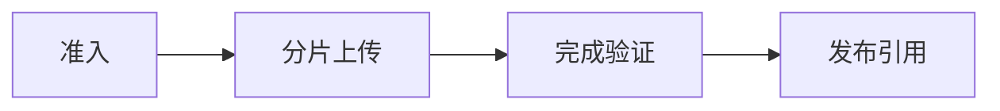

# 对象存储：模型、文档、Multipart 与生命周期

一个 12 GB 模型上传到 98% 时网络断开，重试后 bucket 里出现多个残留 multipart upload；另一个用户拿到旧的预签名 URL，仍能下载已撤回文档。对象存储不是“无限大的文件夹”，它有自己的对象身份、版本、校验、授权和生命周期。

## 安装 MinIO 并检查健康端点

MinIO 的安装入口在[官方 Linux 文档](https://min.io/docs/minio/linux/index.html)。本地排障可以先用隔离容器启动单节点实例，生产环境应固定发布版本、挂载持久盘并按官方升级说明执行。

<figure class="doc-shot">
  
  <figcaption>官方页面把 Server、Client 和 SDK 分开列出。教程需要的是服务端时，不要把客户端安装成功误当成对象服务已经可用。</figcaption>
</figure>

```bash
docker run --name minio-dev \
  -p 9000:9000 -p 9001:9001 \
  -e MINIO_ROOT_USER=minioadmin \
  -e MINIO_ROOT_PASSWORD=change-me-now \
  -v "$PWD/.minio-dev:/data" \
  quay.io/minio/minio:latest server /data --console-address ":9001"

curl -fsS http://127.0.0.1:9000/minio/health/live
```

健康端点成功只证明进程和 API 监听，不能证明 Bucket、策略、磁盘空间或 multipart 清理规则正确。后面的上传、完成、撤回和生命周期检查要继续执行。


## Object 为什么不等于普通文件

| 概念 | 在这条链路中的含义 |
| --- | --- |
| Bucket | 对象命名与策略的顶层边界，通常承载区域、版本、生命周期和访问策略。它不是操作系统目录。 |
| Object Key | bucket 内的完整字符串标识；斜杠只是常见前缀约定，不产生真实目录或继承权限。 |
| ETag/Checksum | 用于识别传输内容的元数据，但 multipart ETag 不一定是整个对象的 MD5，校验策略必须明确。 |
| Presigned URL | 在有限时间内授权特定对象操作的签名 URL。它是临时能力，不应成为永久公开地址。 |

## 排障时最容易走错的岔路

| 表面现象 | 实际可能发生的事 | 下一步证据 |
| --- | --- | --- |
| ETag 一致 | multipart ETag 可能由各 part 组合而来，不是整个对象 MD5 | 使用服务支持的 checksum 或独立 sha256 |
| 对象存在 | 可能仍在 staging、扫描失败或属于旧版本 | 以数据库发布记录决定可见性 |
| URL 已过期 | CDN、代理或已下载副本仍可能存在 | 为敏感撤回设计短 TTL、版本和缓存失效 |
| 开启版本控制 | 旧版本仍占空间且可能含敏感数据 | 配置保留、法务删除和生命周期策略 |

::: warning 不要用重启代替诊断
恢复服务和解释故障是两个目标。紧急止损后仍要回到原始日志、指标与状态转换，避免同类问题重复出现。
:::

## 一次大模型上传怎样成为可发布制品



### 准入：API/Policy

校验租户、大小、类型和配额，生成不可猜测的 staging key。

这一动作的可观察结果是 upload_id、tenant_id、expected_digest。处理动作应晚于取证，否则重启或重试可能覆盖最早的失败现场。

### 分片上传：Client/Object Storage

并行上传 part，失败后按 upload_id 续传或主动 abort。

可以从这些位置确认结果：part 列表、校验和、未完成 upload。若完全没有证据，先判断请求是否到达本阶段；若记录冲突，则对齐 request_id、实例和时间窗口。

### 完成验证：Worker

合并对象并验证长度、摘要、扫描结果和模型清单。

这里不靠猜测，优先读取 content_length、sha256、scan status。

### 发布引用：Database

事务中把业务记录指向不可变 object version，再允许下载。

决定下一步前需要看到 object_version、publish_status、审计记录。

## 预签名上传为何还要在服务端完成确认

下面是 AWS CLI/MinIO 兼容命令的语义示例，endpoint、凭证和 bucket 均需替换。它展示只读检查和清理未完成上传的入口，不包含真实 Secret。

```bash
aws --endpoint-url "$S3_ENDPOINT" s3api head-object \
  --bucket ai-artifacts --key "staging/tenant_demo/model.bin"
aws --endpoint-url "$S3_ENDPOINT" s3api list-multipart-uploads \
  --bucket ai-artifacts
aws --endpoint-url "$S3_ENDPOINT" s3api get-object-attributes \
  --bucket ai-artifacts --key "models/qwen/revision/model.bin" \
  --object-attributes ObjectSize,Checksum
```

客户端上传成功只说明对象存储接受了字节。服务端仍要用 upload_id 关联业务记录，读取对象长度与 checksum，完成病毒/格式检查后才把状态从 staging 改为 published。删除业务行而不处理对象会泄漏存储，先删对象又可能破坏仍在引用的版本，因此要有可重试的清理任务。


## 最后回到适用范围

MinIO 提供 S3 兼容接口，但版本、纠删码、锁定和一致性能力要按实际部署核对。数据库不要保存大文件正文，对象存储也不要承担复杂业务查询。Secret 通过运行环境注入，预签名 URL 不进入公开日志。

AI Backend 的运行、状态和大对象边界已经齐备。下一阶段进入 LLM Serving：先定义模型服务真正拥有的生命周期和指标，再讨论具体引擎。
